# זיהוי מקבילית במערכת צירים

**שיטות להוכחת מקבילית:**

**שיטה א — שיפועים:** צלעות מקבילות שתיהן בעלות **אותו שיפוע**.

$$m_{AB} = m_{DC} \quad , \quad m_{AD} = m_{BC}$$

**שיטה ב — אמצעי אלכסונות:** באלכסונים חוצים זה את זה — נקודת האמצע של
$AC$
שווה לנקודת האמצע של
$BD$
.

$$\text{midpoint}(AC) = \text{midpoint}(BD)$$

---

## רמה 1: בניית ביטחון (תרגילים 1–8)

לכל תרגיל: בדוק האם
$ABCD$
היא מקבילית. נמק בעזרת שיפועים.

**1.**
$$A(0,\ 0),\quad B(4,\ 0),\quad C(5,\ 3),\quad D(1,\ 3)$$

---

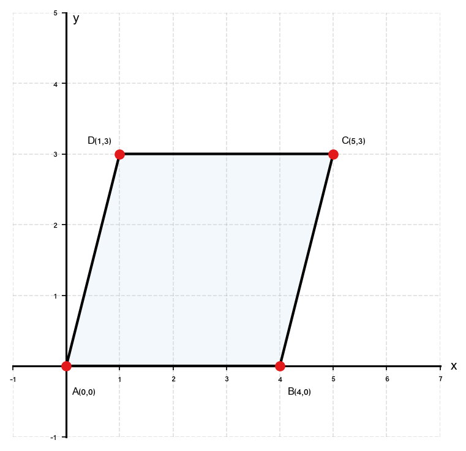
**2.**
$$A(1,\ 1),\quad B(5,\ 1),\quad C(6,\ 4),\quad D(2,\ 4)$$

---

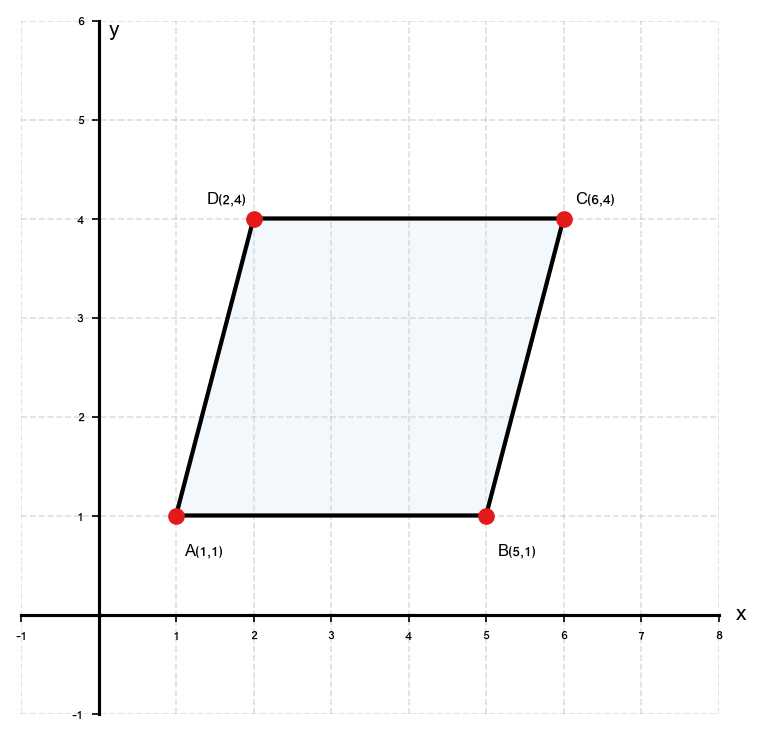
**3.**
$$A(0,\ 0),\quad B(3,\ 0),\quad C(4,\ 2),\quad D(2,\ 2)$$

---

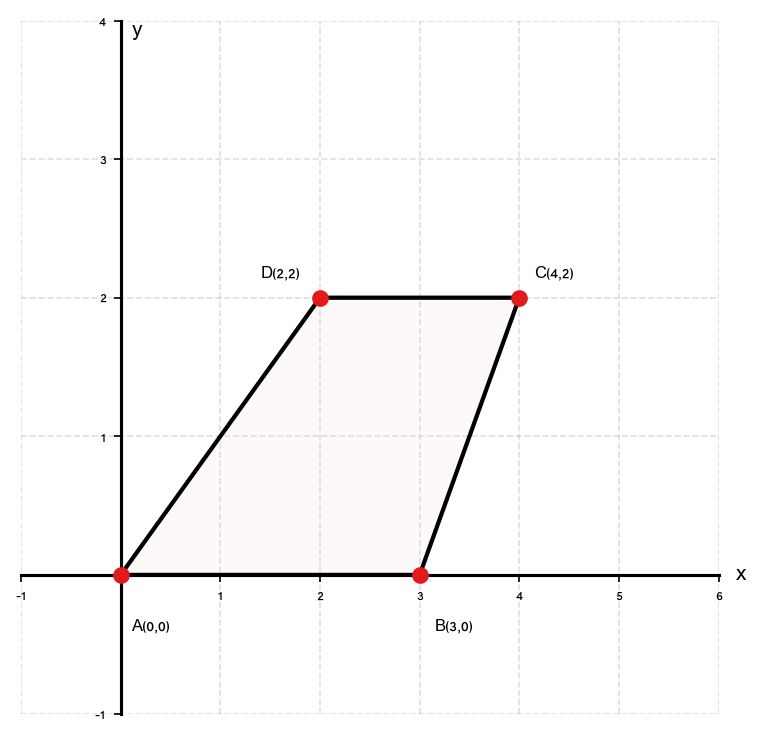
**4.**
$$A(2,\ 1),\quad B(6,\ 1),\quad C(8,\ 4),\quad D(4,\ 4)$$

---

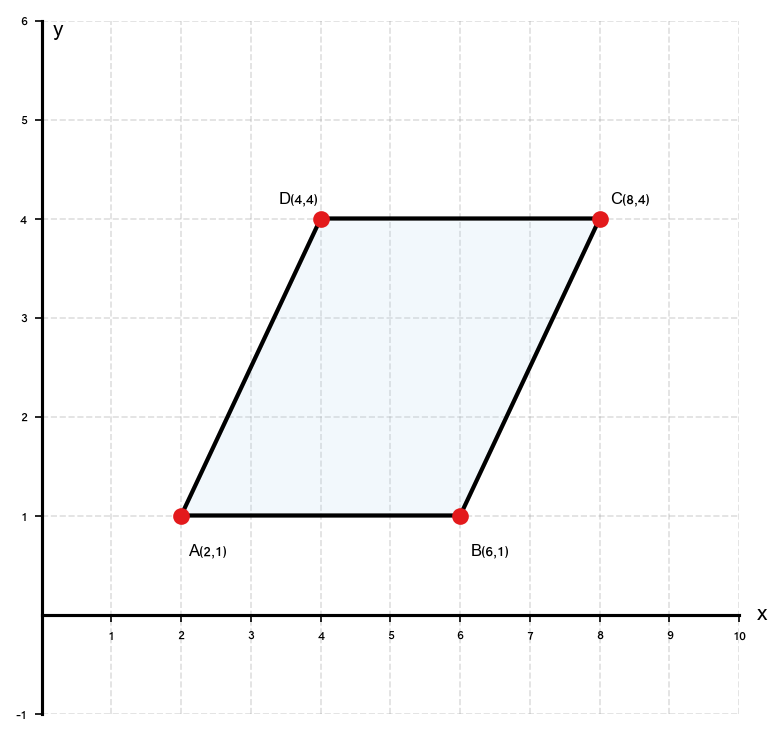
**5.** בדוק את המרובע הבא בעזרת **אמצעי אלכסונות**:
$$A(0,\ 2),\quad B(4,\ 0),\quad C(6,\ 4),\quad D(2,\ 6)$$

---

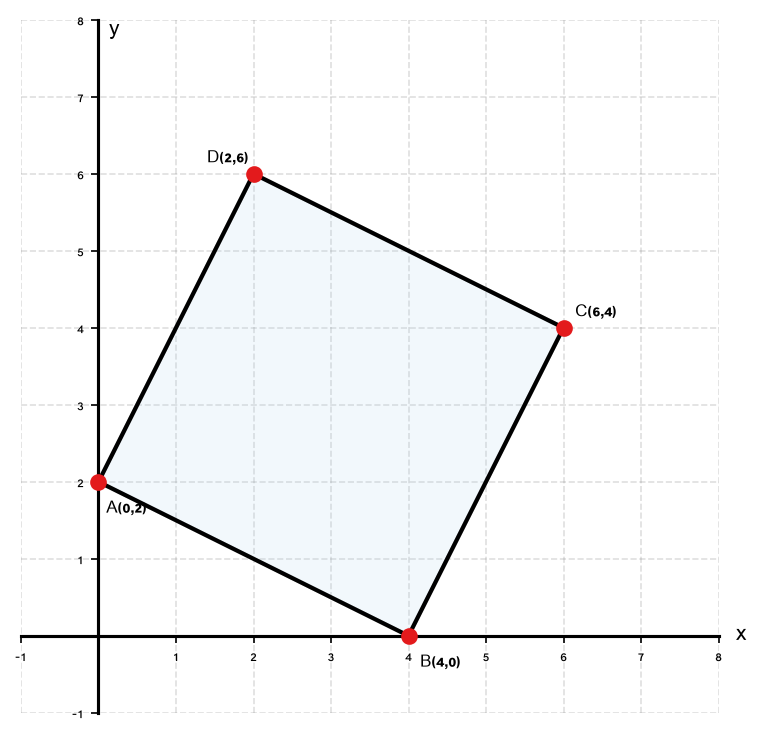
**6.**
$$A(1,\ 0),\quad B(5,\ 0),\quad C(7,\ 3),\quad D(3,\ 3)$$

---

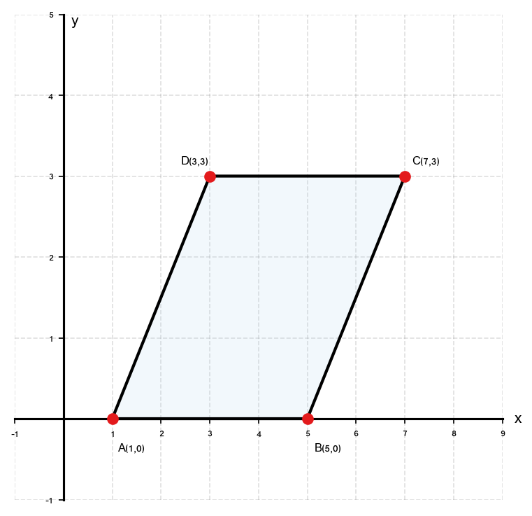
**7.**
$$A(0,\ 0),\quad B(5,\ 0),\quad C(6,\ 3),\quad D(2,\ 3)$$

---

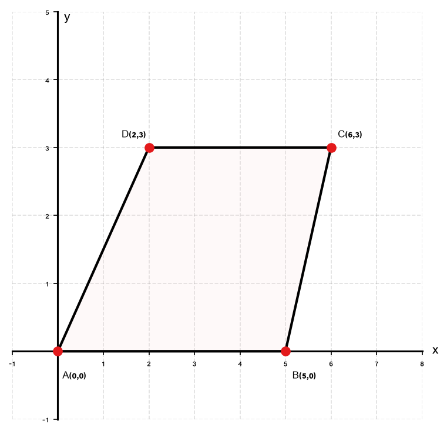
**8.**
$$A(-1,\ 1),\quad B(3,\ 1),\quad C(4,\ 4),\quad D(0,\ 4)$$

---

## רמה 2: תרגול שוטף ומשולב (תרגילים 9–16)

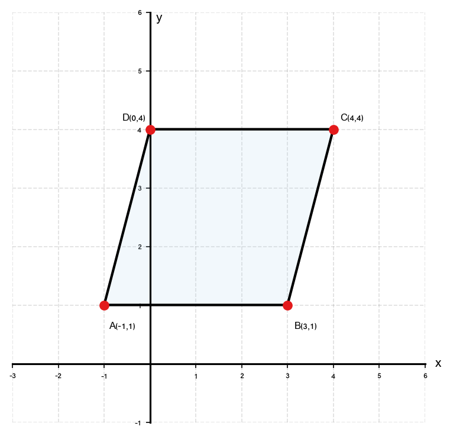
**9.** נתון:
$$A(0,\ 0),\quad B(4,\ 0),\quad D(2,\ 3)$$
מצא את הקודקוד
$C$
כך ש-
$ABCD$
תהיה מקבילית.

---

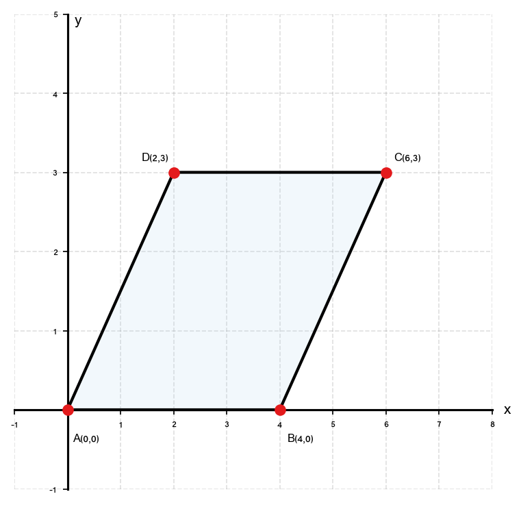
**10.** נתון:
$$A(1,\ 2),\quad B(5,\ 2),\quad D(0,\ 5)$$
מצא את הקודקוד
$C$
כך ש-
$ABCD$
תהיה מקבילית.

---

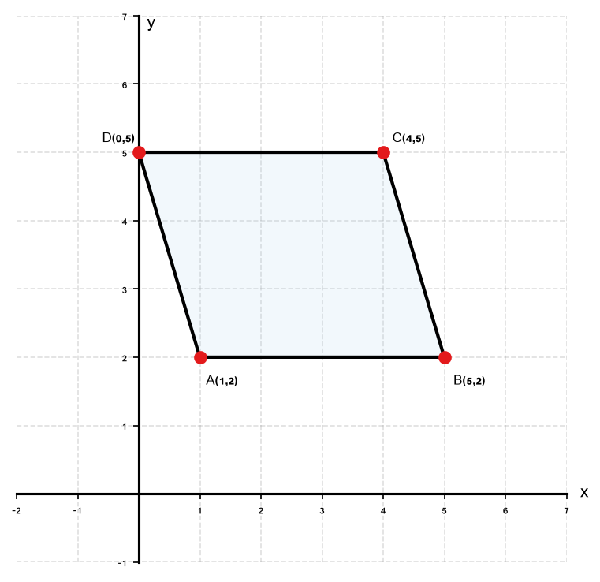
**11.** נתון:
$$A(-2,\ 1),\quad B(3,\ 1),\quad C(4,\ 4)$$
מצא את הקודקוד
$D$
כך ש-
$ABCD$
תהיה מקבילית.

---

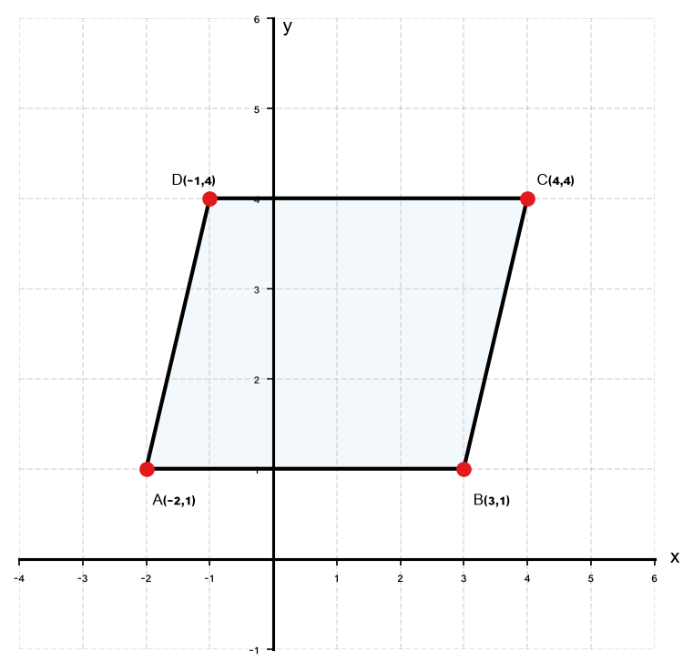
**12.** נתון:
$$A(0,\ 0),\quad B(6,\ 0),\quad D(2,\ 4)$$
מצא את הקודקוד
$C$
כך ש-
$ABCD$
תהיה מקבילית.

---

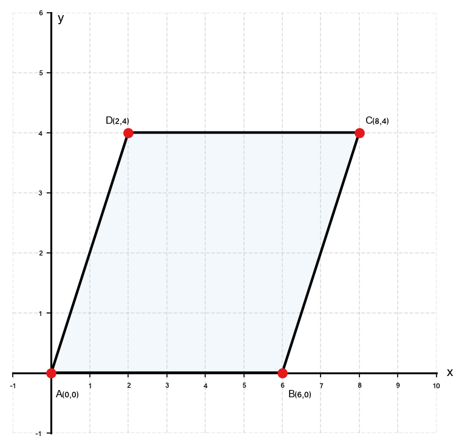
**13.** הוכח כי
$ABCD$
היא מקבילית:
$$A(1,\ 3),\quad B(4,\ 3),\quad C(6,\ 7),\quad D(3,\ 7)$$

---

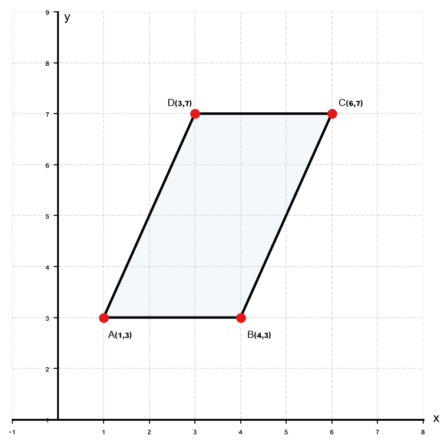
**14.** הוכח כי
$ABCD$
היא מקבילית:
$$A(2,\ 1),\quad B(5,\ -1),\quad C(7,\ 3),\quad D(4,\ 5)$$

---

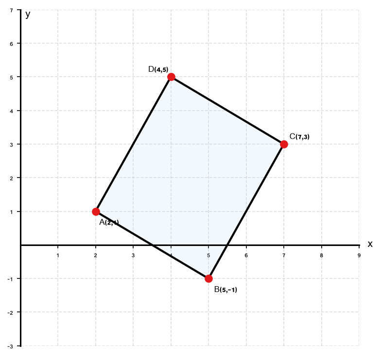
**15.** נתון המרובע:
$$A(0,\ 0),\quad B(a,\ 0),\quad C(6,\ 3),\quad D(2,\ 3)$$
מצא את הערך של
$a$
כך ש-
$ABCD$
תהיה מקבילית.

---

**16.** נתון המרובע:
$$A(-3,\ 1),\quad B(1,\ 1),\quad C(3,\ 5),\quad D(k,\ 5)$$
מצא את הערך של
$k$
כך ש-
$ABCD$
תהיה מקבילית.

---

## רמה 3: רמת בחינת מה"ט (תרגילים 17–20)

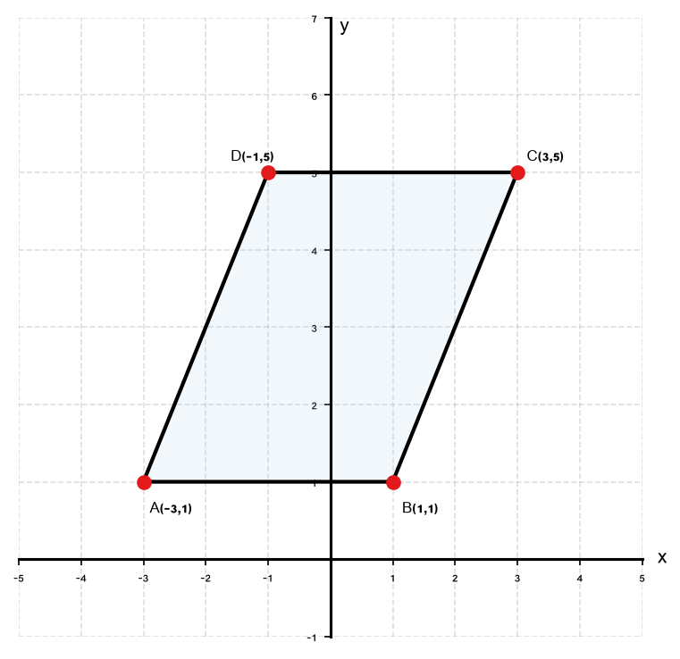
**17.** מלבן
$ABCD$
נתון עם:
$$A(2,\ 2),\quad B(2,\ 5),\quad C(6,\ 5)$$

א. מצא את הקודקוד
$D$
.

ב. מצא את נקודת האמצע
$M$
של האלכסון
$AC$
ואמת שהיא גם נקודת האמצע של
$BD$
.

ג. חשב את אורך האלכסון.

---

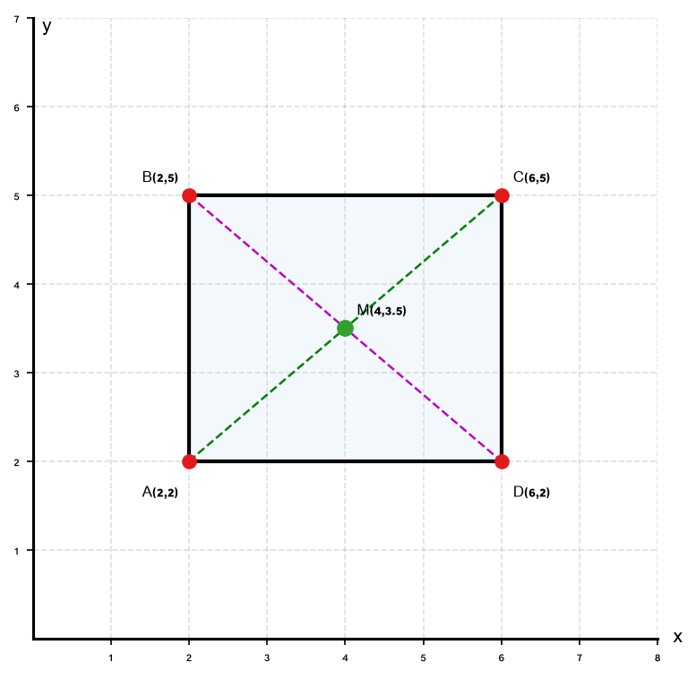
**18.** נתון מרובע עם קודקודים:
$$A(0,\ -1),\quad B(4,\ -1),\quad C(4,\ 2),\quad D(0,\ 2)$$

א. הוכח שהמרובע הוא מלבן (צלעות מקבילות ומאונכות).

ב. חשב את שטח המלבן.

ג. מצא את נקודת החיתוך של האלכסונים.

ד. חשב את אורך האלכסון.

---

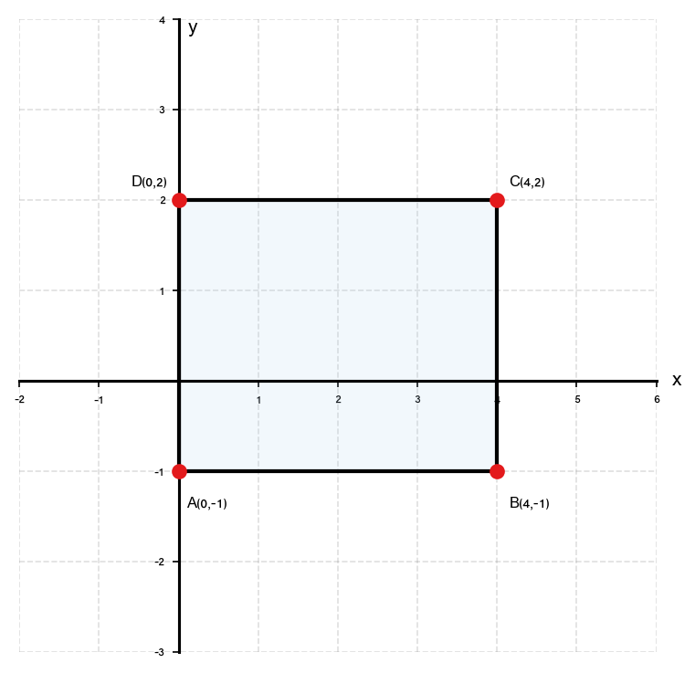
**19.** נתון מרובע עם קודקודים:
$$A(1,\ 2),\quad B(5,\ 2),\quad C(6,\ 5),\quad D(2,\ 5)$$

א. הוכח ש-
$ABCD$
היא מקבילית.

ב. בדוק האם
$ABCD$
היא מלבן. נמק.

ג. חשב את היקף
$ABCD$
.

---

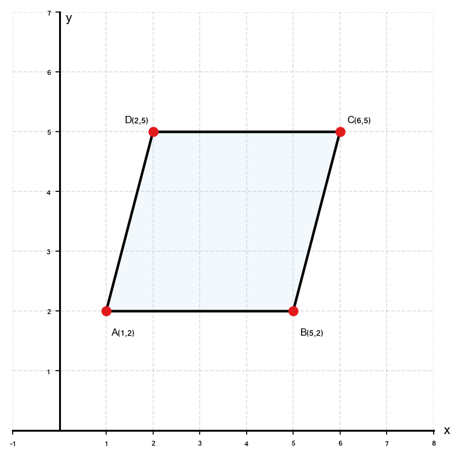
**20.** נתון מרובע עם קודקודים:
$$A(0,\ 0),\quad B(4,\ 1),\quad C(5,\ 4),\quad D(1,\ 3)$$

א. הוכח ש-
$ABCD$
היא מקבילית בעזרת וקטורי הצלעות.

ב. בדוק האם
$ABCD$
היא מעוין (כל הצלעות שוות). נמק.

ג. חשב את שטח המקבילית בעזרת הנוסחה:
$$A = |x_{AB} \cdot y_{AD} - y_{AB} \cdot x_{AD}|$$
כאשר
$(x_{AB},\ y_{AB})$
הוא וקטור
$\overrightarrow{AB}$
ו-
$(x_{AD},\ y_{AD})$
הוא וקטור
$\overrightarrow{AD}$
.

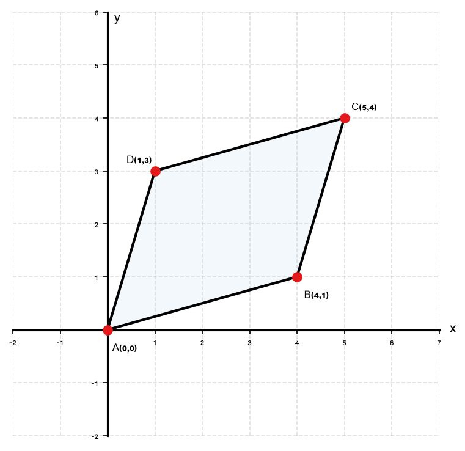

---

תשובות סופיות

1.
$m_{AB} = m_{DC} = 0$,
$m_{AD} = m_{BC} = 3$
מקבילית ✓

2.
$m_{AB} = m_{DC} = 0$,
$m_{AD} = m_{BC} = 3$
מקבילית ✓

3.
$m_{AB} = m_{DC} = 0$,
$m_{AD} = 1$,
$m_{BC} = 2$
לא מקבילית

4.
$m_{AB} = m_{DC} = 0$,
$m_{AD} = m_{BC} = \tfrac{3}{2}$
מקבילית ✓

5.
אמצע
$AC$:
$(3,\ 3)$
אמצע
$BD$:
$(3,\ 3)$
מקבילית ✓

6.
$m_{AB} = m_{DC} = 0$,
$m_{AD} = m_{BC} = 3$
מקבילית ✓

7.
$m_{AB} = m_{DC} = 0$,
$m_{AD} = \tfrac{3}{2}$,
$m_{BC} = 3$
לא מקבילית

8.
$m_{AB} = m_{DC} = 0$,
$m_{AD} = m_{BC} = 3$
מקבילית ✓

9. $C(6,\ 3)$

10. $C(4,\ 5)$

11. $D(-1,\ 4)$

12. $C(8,\ 4)$

13.
$m_{AB} = m_{DC} = 0$,
$m_{AD} = m_{BC} = 4$
מקבילית ✓

14.
$m_{AB} = -1$,
$m_{DC} = -1$,
$m_{AD} = 2$,
$m_{BC} = 2$
מקבילית ✓

15. $a = 4$

16. $k = -1$

17.
א.
$D(6,\ 2)$
ב.
$M(4,\ 3.5)$

אמצע
$BD = (4,\ 3.5)$
✓
ג.
$|AC| = 5$

18.
א.
$AB \parallel DC$
(אופקיים),
$BC \parallel AD$
(אנכיים), צלעות סמוכות מאונכות → מלבן
ב.
שטח
$= 12$
ג.
$(2,\ 0.5)$
ד.
$|AC| = 5$

19.
א.
$\overrightarrow{AB} = \overrightarrow{DC}$
→ מקבילית
ב.
מכפלת שיפועים
$3 \cdot \left(-\tfrac{1}{3}\right) \neq -1$
→ לא מלבן
ג.
היקף
$2(4 + \sqrt{10})$

20.
א.
$\overrightarrow{AB} = \overrightarrow{DC}$
→ מקבילית
ב.
$|AB| \neq |AD|$
→ לא מעוין
ג.
שטח
$11$

