# יישום גיאומטריה אנליטית בצורות הנדסיות

שאלות אלו משלבות מושגים מרובים: מרחקים, שיפועים, מקבילות, ניצבות, נקודות אמצע, ומשוואות ישרים — הכל בהקשר של צורות הנדסיות (משולשים, מלבנים, מקביליות).

---

## רמה 1: בניית ביטחון (תרגילים 1–8)

**1.** משולש עם קודקודים:
$$A(0,\ 0),\quad B(4,\ 0),\quad C(0,\ 3)$$

א. חשב את אורכי שלוש הצלעות.

ב. חשב את היקף המשולש.

ג. חשב את שטח המשולש.

---

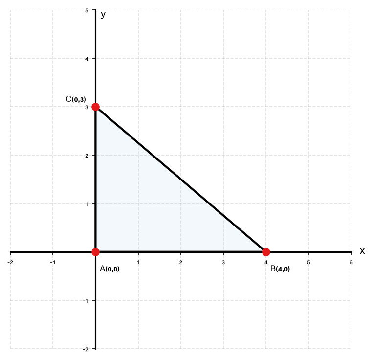
**2.** מלבן עם קודקודים:
$$A(1,\ 1),\quad B(5,\ 1),\quad C(5,\ 4),\quad D(1,\ 4)$$

א. חשב את שטח המלבן.

ב. חשב את אורך האלכסון.

---

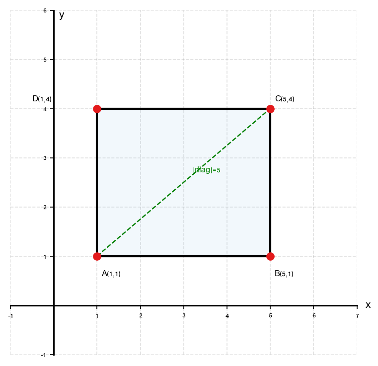
**3.** משולש עם קודקודים:
$$A(0,\ 0),\quad B(6,\ 0),\quad C(3,\ 4)$$

בדוק האם המשולש שווה-שוקיים על ידי חישוב אורכי הצלעות.

---

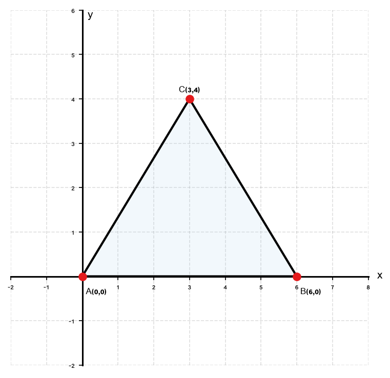
**4.** בדוק האם הנקודה
$$C(7,\ 11)$$
נמצאת על הישר העובר דרך:
$$A(1,\ 3) \quad \text{-} \quad B(4,\ 7)$$

---

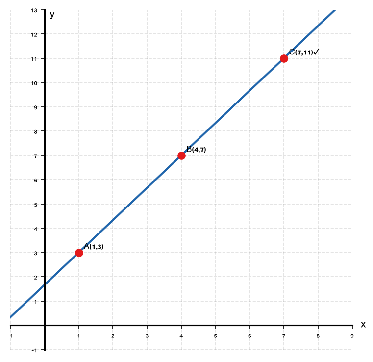
**5.** כתוב את משוואת הישר העובר דרך:
$$A(0,\ 0) \quad \text{-} \quad B(4,\ 3)$$

---

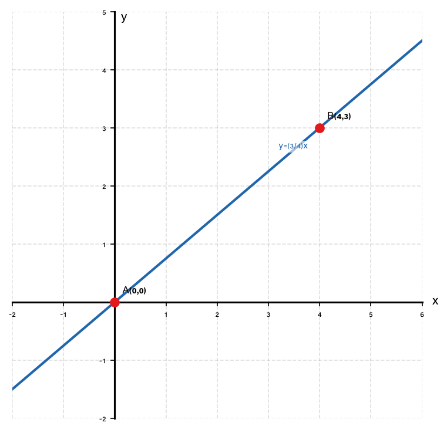
**6.** בדוק האם הישרים מאונכים זה לזה:
$$y = 2x + 1 \quad \text{-} \quad y = -\tfrac{1}{2}x + 6$$

---

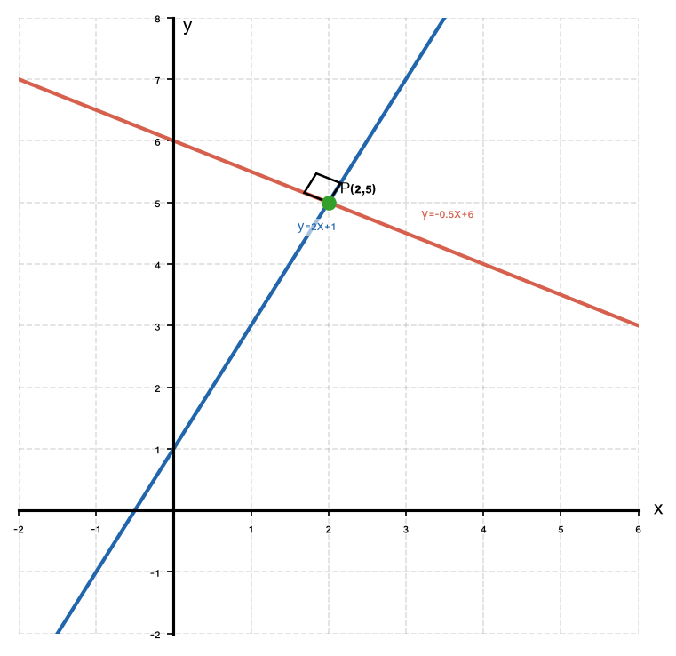
**7.** מצא את נקודת האמצע של הקטע שבין:
$$A(2,\ 4) \quad \text{-} \quad B(8,\ 10)$$
ובדוק האם היא שווה-מרחק מ-
$A$
ומ-
$B$
.

---

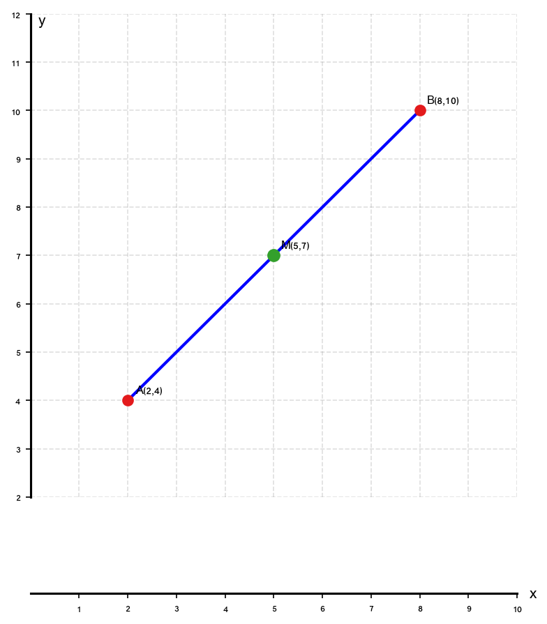
**8.** מצא את משוואת התיכון מ-
$A$
לצלע
$BC$
במשולש:
$$A(0,\ 0),\quad B(5,\ 0),\quad C(5,\ 5)$$

---

## רמה 2: תרגול שוטף ומשולב (תרגילים 9–16)

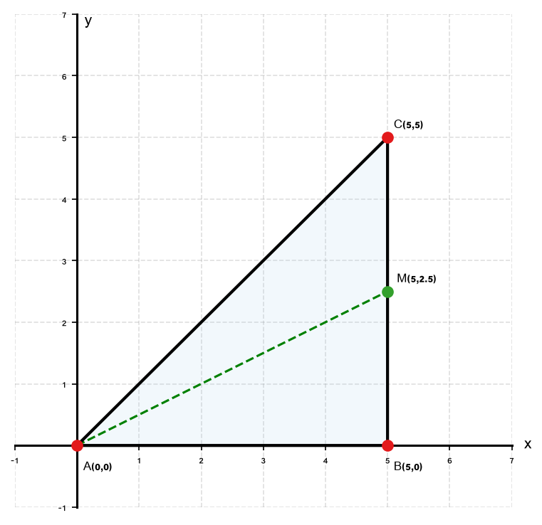
**9.** במשולש עם קודקודים:
$$A(-3,\ 0),\quad B(5,\ 0),\quad C(1,\ 4)$$

א. מצא את נקודת האמצע
$M$
של הצלע
$AB$
.

ב. חשב את אורך התיכון
$CM$
.

---

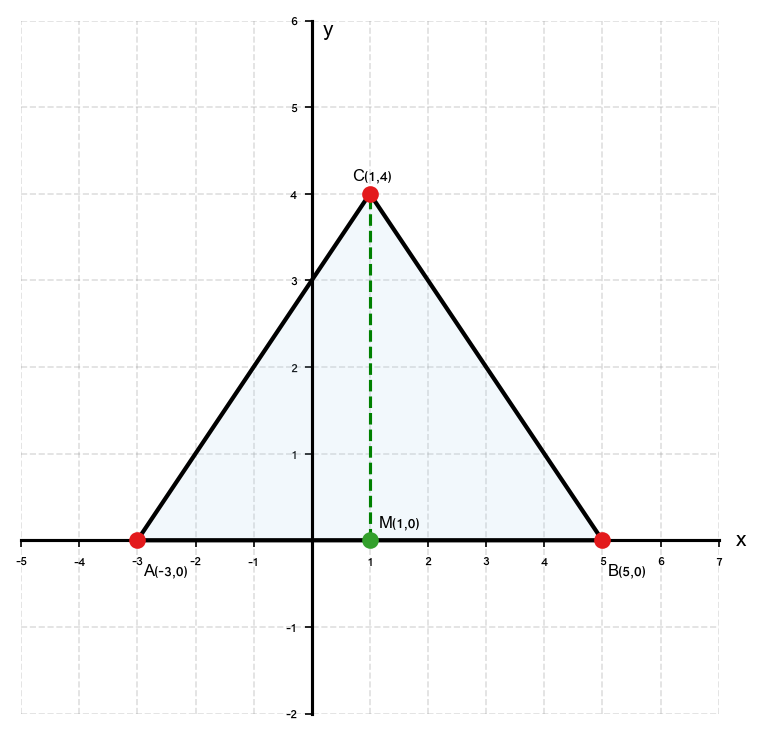
**10.** מלבן
$ABCD$
עם:
$$A(1,\ 2),\quad B(5,\ 2)$$
הצלע
$AD$
מאונכת ל-
$AB$
ואורכה
$3$
.

א. מצא את קודקודים
$D$
ו-
$C$
.

ב. בדוק: חשב את שיפוע
$AD$
ואמת שהוא מאונך ל-
$AB$
.

---

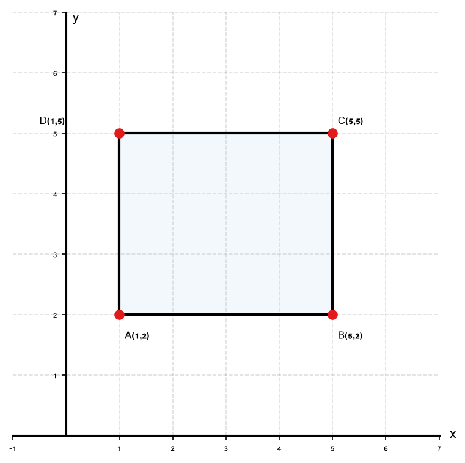
**11.** הוכח שמשולש עם קודקודים:
$$A(0,\ 0),\quad B(4,\ 0),\quad C(2,\ 2\sqrt{3})$$
הוא משולש שווה-צלעות.

---

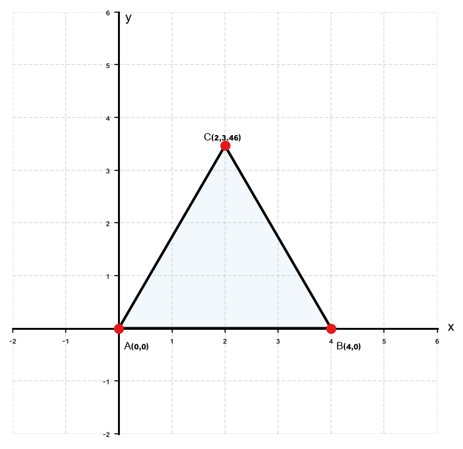
**12.** במשולש עם קודקודים:
$$A(2,\ 1),\quad B(6,\ 1),\quad C(4,\ 5)$$
מצא את משוואת הגובה מ-
$C$
לצלע
$AB$
.

---

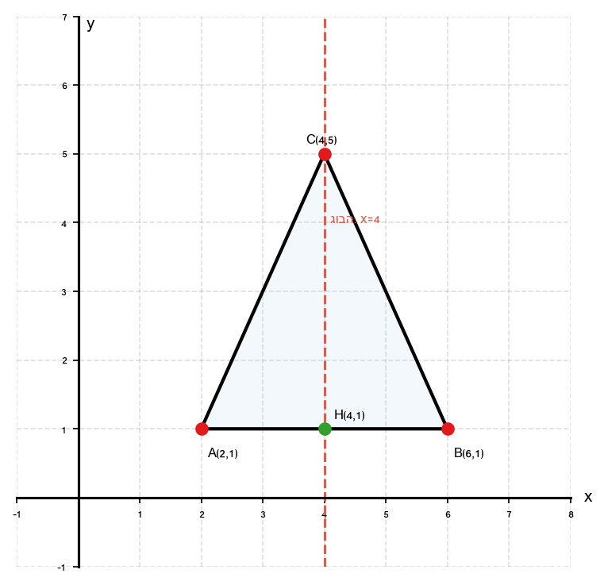
**13.** הנקודה
$D$
מחלקת את הקטע
$AB$
ביחס
$1:2$
(כלומר
$AD = \tfrac{1}{3} \cdot AB$
). נתון:
$$A(0,\ 0),\quad B(6,\ 3)$$
מצא את
$D$
.

---

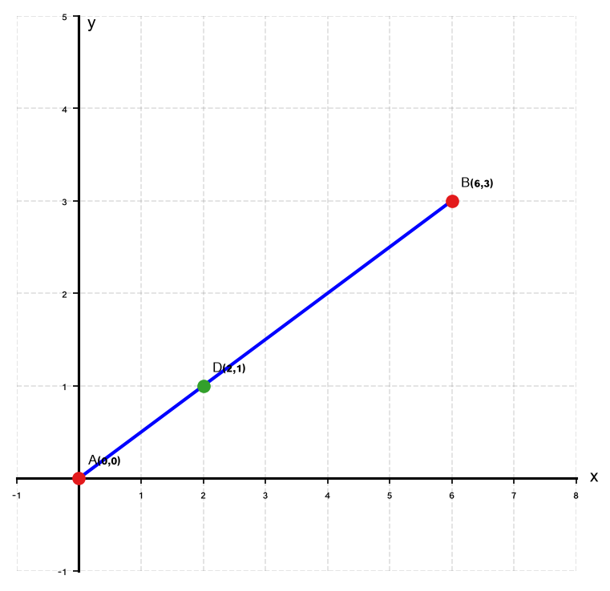
**14.** מקבילית
$ABCD$
עם קודקודים:
$$A(1,\ 3),\quad B(7,\ 3),\quad C(9,\ 7),\quad D(3,\ 7)$$
חשב את שטח המקבילית.

---

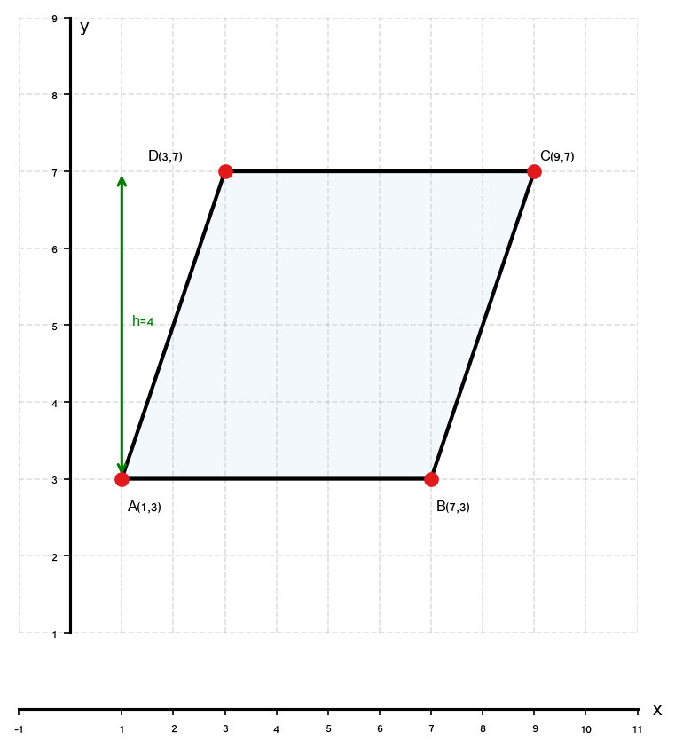
**15.** משולש שווה-שוקיים עם בסיס:
$$A(-4,\ 0) \quad \text{-} \quad B(4,\ 0)$$
הקודקוד
$C$
נמצא על ציר
$y$
בגובה
$h > 0$
.

מצא את
$h$
כך שאורך כל שוק הוא
$5$
.

---

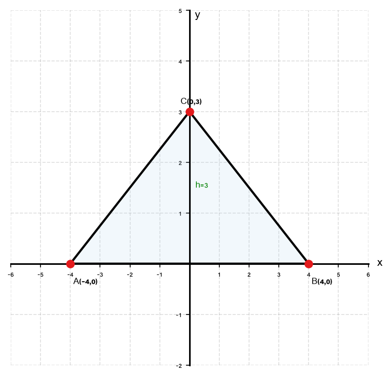
**16.** מצא את משוואת הישר העובר דרך:
$$P(2,\ 5)$$
ומאונך לישר:
$$y = 3x - 1$$

---

## רמה 3: רמת בחינת מה"ט (תרגילים 17–20)

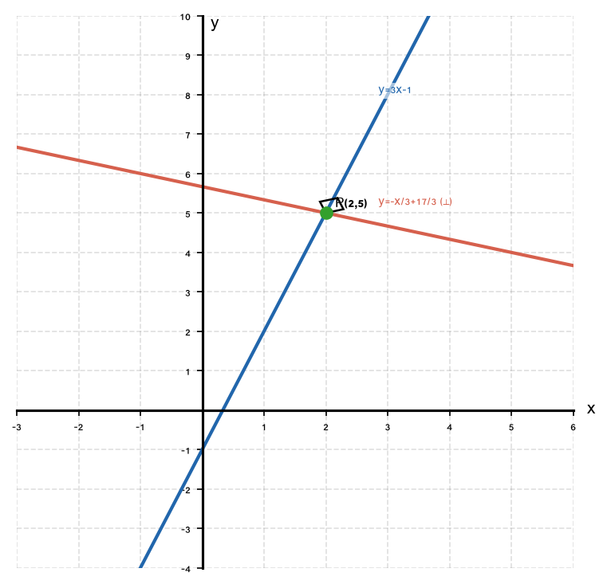
**17.** בתכנית בניין, קיר ראשון עוקב אחר המשוואה:
$$y = \tfrac{3}{4}x + 6$$
הקיר מתחיל בנקודה
$A$
על ציר
$x$
ומסתיים בנקודה
$B$
על ציר
$y$
.

קיר שני מתחיל ב-
$B$
, מאונך לקיר הראשון, ומסתיים בנקודה
$C$
על ציר
$x$
.

א. מצא את
$A$
ואת
$B$
.

ב. כתוב את משוואת הקיר השני ומצא את
$C$
.

ג. חשב: $|AB|$, $|BC|$.

ד. חשב את שטח משולש
$ABC$
.

---

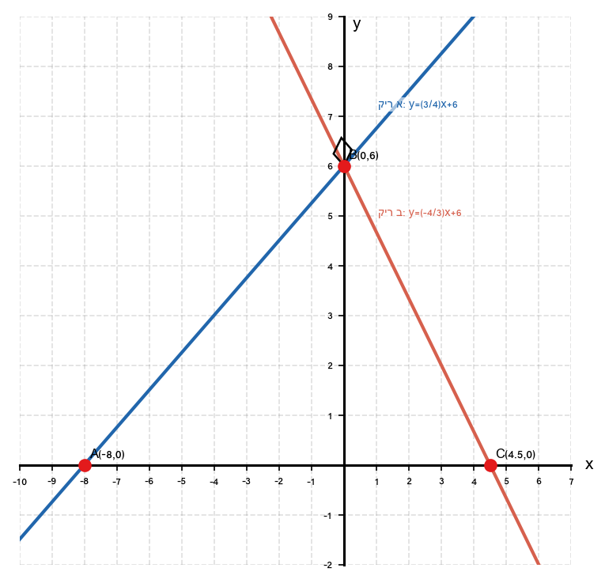
**18.** משולש ישר-זווית
$ACB$
נתון עם:
$$A(-5,\ 12),\quad C(7,\ 0)$$
הזווית הישרה נמצאת ב-
$C$
. הנקודה
$B$
נמצאת על הישר:
$$y = -2x + 2$$

א. חשב את שיפועי
$CA$
ו-
$CB$
, והוכח שהזווית ב-
$C$
אכן ישרה.

ב. מצא את הקודקוד
$B$
.

ג. חשב: $|CA|$, $|CB|$, ושטח המשולש.

---

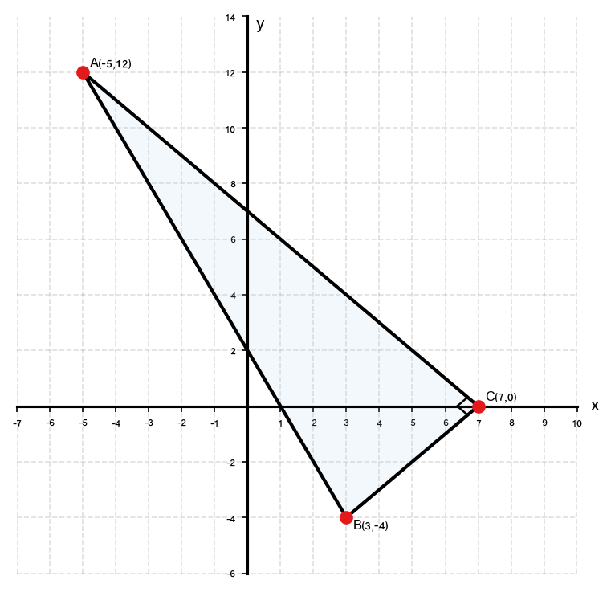
**19.** משולש
$ABC$
נתון עם קודקודים:
$$A(-7,\ -7),\quad B(2,\ 6),\quad C(17,\ 1)$$

א. מצא את נקודת האמצע
$M$
של הצלע
$AC$
.

ב. כתוב את משוואת התיכון מ-
$B$
ל-
$M$
.

ג. כתוב את משוואת הגובה מ-
$B$
לצלע
$AC$
.

ד. מה אתה מבחין לגבי התיכון והגובה? מה המסקנה לגבי המשולש? הוכח.

---

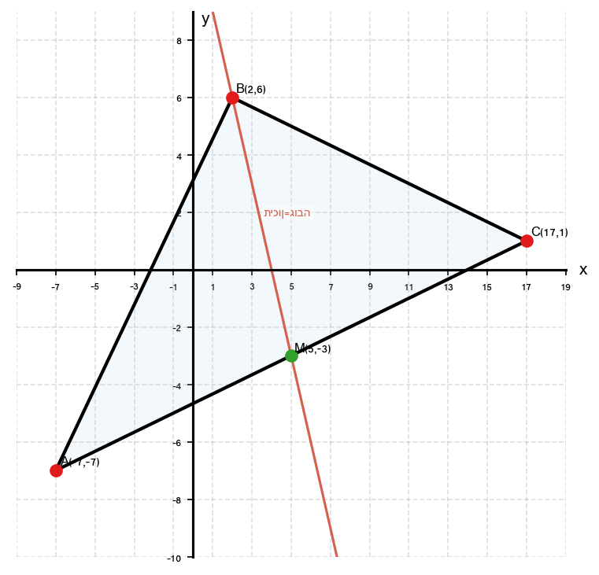
**20.** גינה משולשת עם קודקודים:
$$A(0,\ 4),\quad B(6,\ 0),\quad C(0,\ 0)$$

א. הוכח שהזווית ב-
$C$
היא זווית ישרה.

ב. כתוב את משוואת הצלע
$AB$
(היפוטנוזה).

ג. מצא את נקודת האמצע
$M$
של
$AB$
.

ד. הוכח שהתיכון לצלע
$AB$
שווה למחצית
$AB$
(תכונה של משולש ישר-זווית):
$$|CM| = \tfrac{1}{2}|AB|$$

ה. חשב את שטח הגינה.

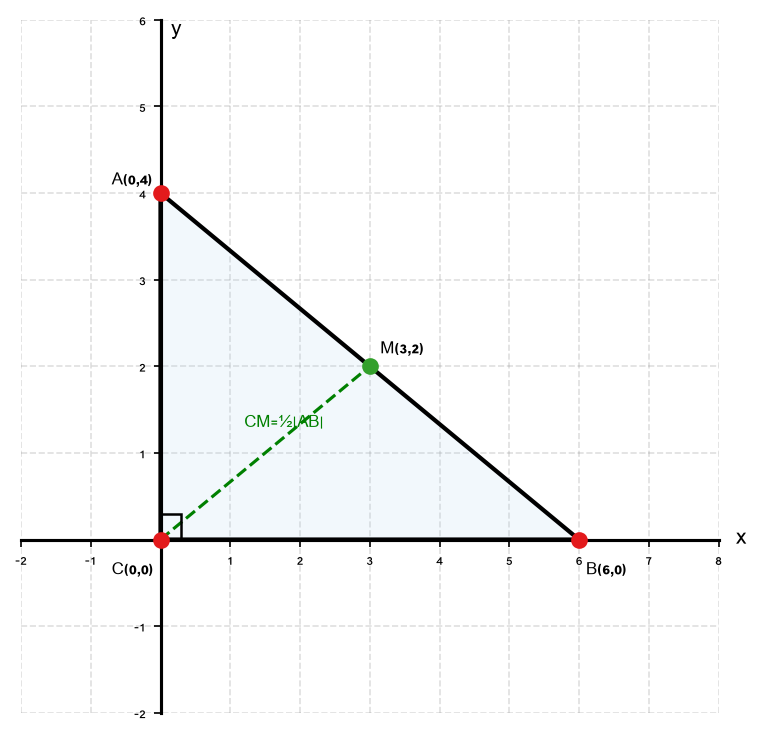

---

תשובות סופיות

1.
א.
$AB = 4$,
$AC = 3$,
$BC = 5$
ב.
היקף
$= 12$
ג.
שטח
$6$

2.
א.
שטח
$= 12$
ב.
אלכסון
$5$

3.
$AB = 6$,
$AC = BC = 5$
משולש שווה-שוקיים ✓

4.
$y = \tfrac{4}{3}x - \tfrac{1}{3}$
✓ — הנקודה על הישר

5. $y = \tfrac{3}{4}x$

6. מכפלת שיפועים:
$-1$
✓ — מאונכים

7.
$M(5,\ 7)$;
מרחקים שווים ✓

8. $y = \tfrac{1}{2}x$

9.
א.
$M(1,\ 0)$
ב.
$|CM| = 4$

10.
א.
$D(1,\ 5)$,
$C(5,\ 5)$
ב.
שיפוע
$AD$
לא מוגדר (אנכי) — מאונך ל-
$AB$
האופקי ✓

11.
כל הצלעות
$= 4$
→ שווה-צלעות ✓

12.
$AB$
אופקי → גובה מ-
$C$
הוא אנכי:
$x = 4$

13. $D(2,\ 1)$

14. $24$

15.
$h = 3$;
$C(0,\ 3)$

16. $y = -\tfrac{1}{3}x + \tfrac{17}{3}$

17.
א.
$A(-8,\ 0)$,
$B(0,\ 6)$
ב.
משוואת קיר שני:
$y = -\tfrac{4}{3}x + 6$;
$C(4.5,\ 0)$
ג.
$|AB| = 10$,
$|BC| = 7.5$
ד.
שטח
$37.5$

18.
א.
מכפלת שיפועים
$-1$
✓
ב.
$B(3,\ -4)$
ג.
$|CA| = 12\sqrt{2}$,
$|CB| = 4\sqrt{2}$,
שטח
$48$

19.
א.
$M(5,\ -3)$
ב.
משוואת תיכון:
$y = -3x + 12$
ג.
משוואת גובה:
$y = -3x + 12$
— **אותה משוואה!**
ד.
$|AB| = 5\sqrt{10}$
→ משולש **שווה-שוקיים**

20.
א.
$CA$
אנכי (
$x = 0$
),
$CB$
אופקי (
$y = 0$
) → מאונכים ✓
ב.
$y = -\tfrac{2}{3}x + 4$
ג.
$M(3,\ 2)$
ד.
$|CM| = \tfrac{1}{2}|AB|$
✓
ה.
שטח
$12$

