# זיהוי שני הפרמטרים — המספרים הקבועים המרכיבים כל פונקציה

---

## רמה 1: בניית ביטחון (תרגילים 1–8)

1. מצא את הפרמטרים
$$a$$
ו-
$$b$$
בפונקציה:
$$y = 3x + 7$$

2. מצא את הפרמטרים
$$a$$
ו-
$$b$$
בפונקציה:
$$y = -5x + 2$$

3. מצא את הפרמטרים
$$a$$
ו-
$$b$$
בפונקציה:
$$y = \frac{1}{2}x - 4$$

4. מצא את הפרמטרים
$$a$$
ו-
$$b$$
בפונקציה:
$$y = -x + 9$$

5. מצא את הפרמטרים
$$a$$
ו-
$$b$$
בפונקציה:
$$y = 6x$$

6. מצא את הפרמטרים
$$a$$
ו-
$$b$$
בפונקציה:
$$y = -8$$

7. מצא את הפרמטרים
$$a$$
ו-
$$b$$
בפונקציה:
$$y = \frac{2}{3}x + \frac{1}{3}$$

8. כתוב את הנוסחה הכללית לפונקציה לינארית והסבר במילים את תפקידו של כל פרמטר.

---

## רמה 2: תרגול שוטף ומשולב (תרגילים 9–16)

9. פונקציה מוגדרת על ידי:
"שיפועה הוא
$$-4$$
ונקודת החיתוך שלה עם ציר Y היא
$$(0,\,10)$$
."
כתוב את משוואת הפונקציה.

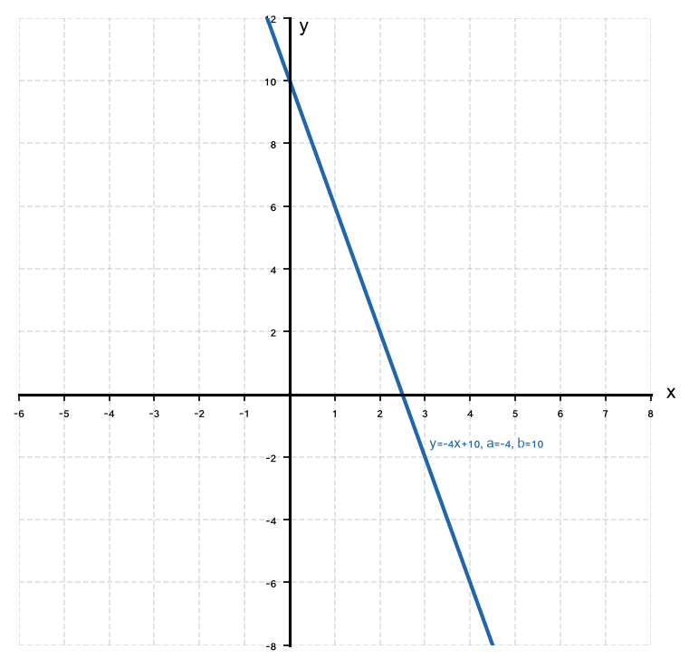
10. שתי פונקציות:
$$f(x) = 2x + 5$$
ו-
$$g(x) = 2x - 3$$
.
מה דומה בהן ומה שונה? כיצד זה בא לידי ביטוי בגרף?

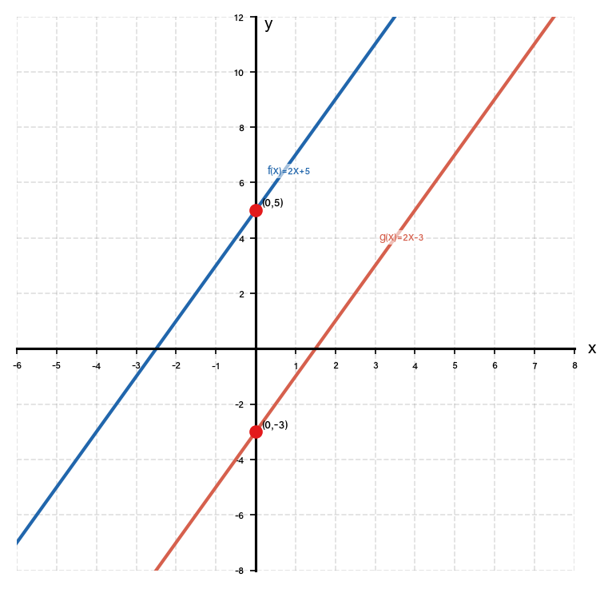
11. שתי פונקציות:
$$f(x) = 4x + 1$$
ו-
$$g(x) = -4x + 1$$
.
מה דומה בהן ומה שונה? כיצד זה בא לידי ביטוי בגרף?

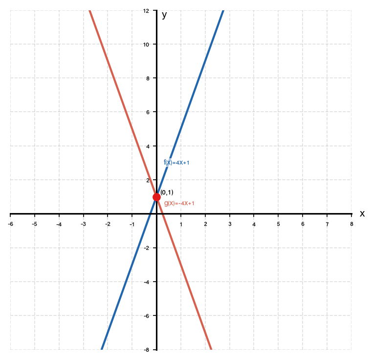
12. הפונקציה
$$y = ax + 3$$
עוברת דרך הנקודה
$$(2,\,11)$$
.
מצא את הפרמטר
$$a$$
.

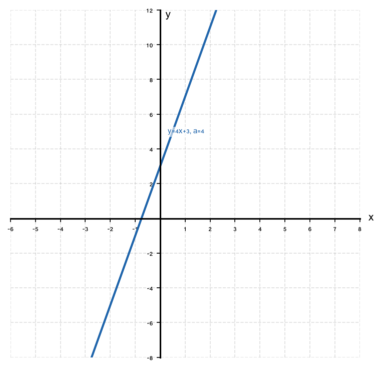
13. הפונקציה
$$y = -2x + b$$
עוברת דרך הנקודה
$$(-1,\,7)$$
.
מצא את הפרמטר
$$b$$
.

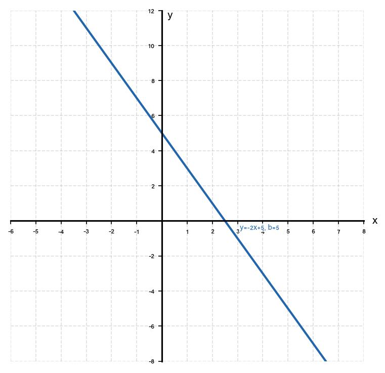
14. הפונקציה
$$y = ax + b$$
עוברת דרך הנקודות
$$(1,\,5)$$
ו-
$$(3,\,11)$$
.
מצא את
$$a$$
ואת
$$b$$
.

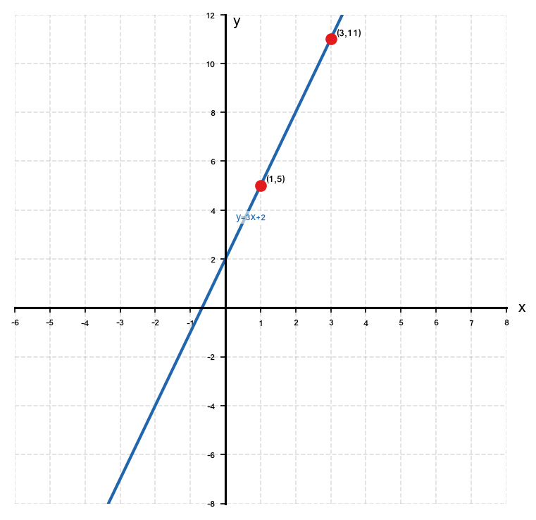
15. הפונקציה
$$y = ax + b$$
עוברת דרך הנקודות
$$(0,\,-3)$$
ו-
$$(4,\,5)$$
.
מצא את
$$a$$
ואת
$$b$$
.

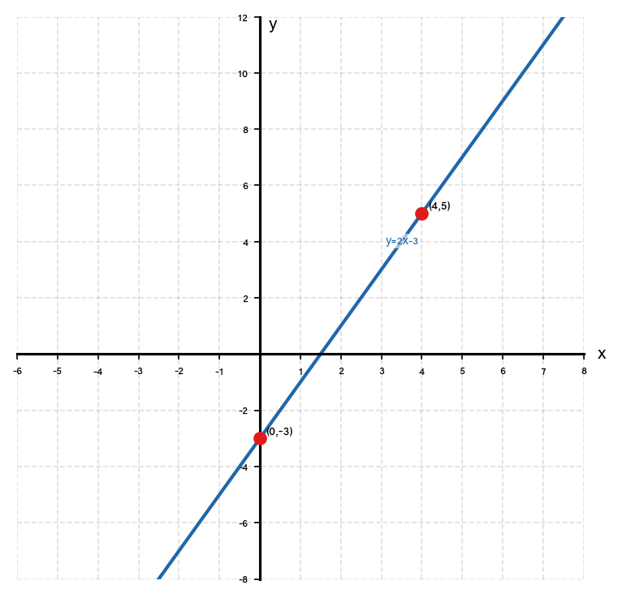
16. הנוסחה
$$y = 1.5x + 20$$
מתארת את עלות שירות כלשהו.
הסבר במילים מה מייצגים הפרמטרים
$$a = 1.5$$
ו-
$$b = 20$$
בהקשר המעשי.

---

## רמה 3: רמת בחינת מה"ט (תרגילים 17–20)

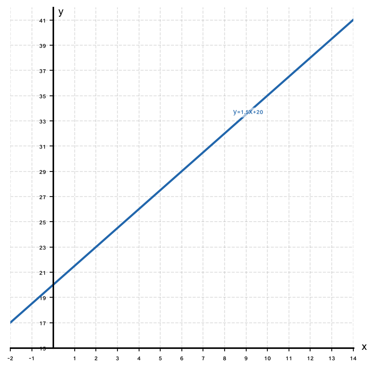
17. חברת גז מחייבת לקוחות לפי הנוסחה:
$$y = ax + b$$
כאשר
$$y$$
הוא סכום החשבון בש"ח ו-
$$x$$
הוא כמות הגז בליטרים.
לקוח א' צרך
$$50$$
ליטר ושילם
$$175$$
ש"ח.
לקוח ב' צרך
$$120$$
ליטר ושילם
$$350$$
ש"ח.

א. מצא את הפרמטרים
$$a$$
ו-
$$b$$
.

ב. מה מייצג כל פרמטר בהקשר המעשי?

ג. כמה ישלם לקוח שצרך
$$200$$
ליטר?

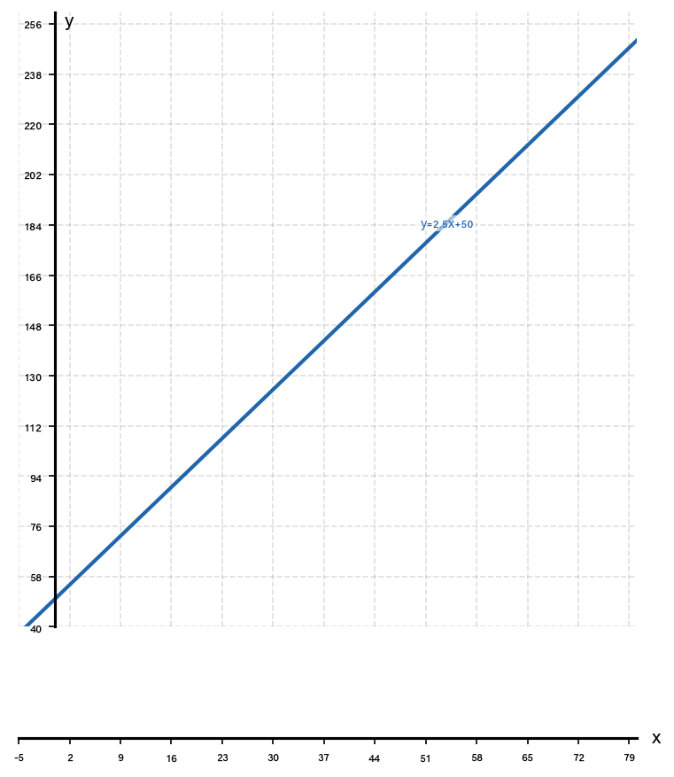
18. שני ספקים מציעים חומרי גלם לפי הפונקציות:
ספק א':
$$y = 8x + 60$$
ספק ב':
$$y = 10x + 20$$
כאשר
$$x$$
הוא מספר היחידות ו-
$$y$$
הוא המחיר הכולל.

א. מצא ועיין על הפרמטרים של כל ספק.

ב. עבור כמה יחידות המחיר זהה?

ג. אם צריך
$$30$$
יחידות — מי ספק יותר זול?

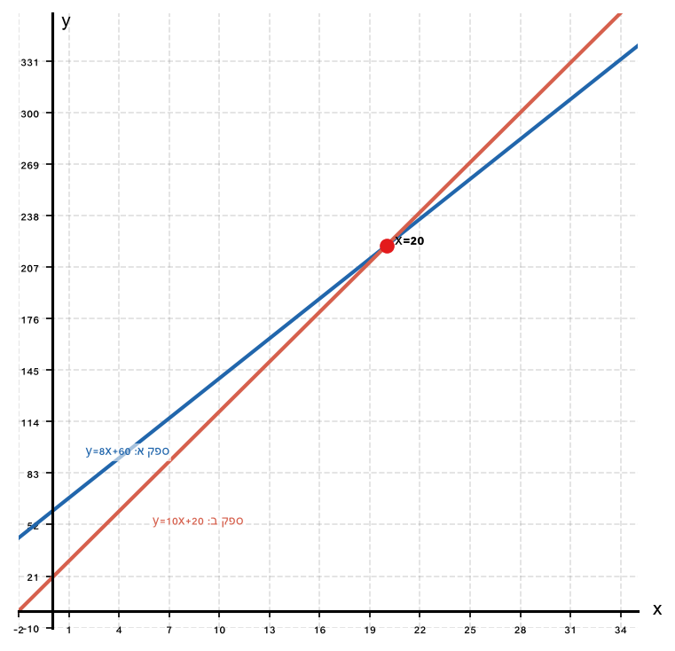
19. גרף הפונקציה
$$y = ax + b$$
חוצה את ציר ה-Y בנקודה
$$(0,\,-6)$$
ועובר דרך הנקודה
$$(4,\,2)$$
.

א. מצא את
$$a$$
ואת
$$b$$
.

ב. בדוק האם הנקודה
$$(-2,\,-10)$$
נמצאת על הגרף.

ג. מצא את הנקודה שבה הגרף חוצה את ציר ה-X.

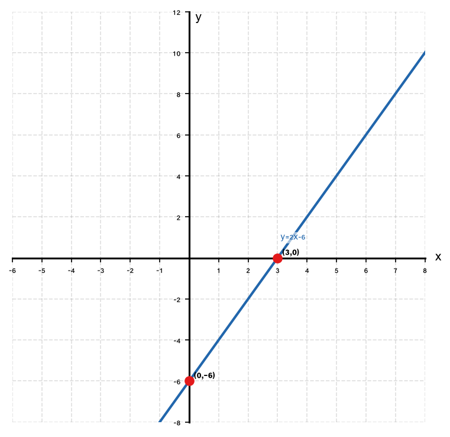
20. בניסוי מדעי נמדדו הנתונים הבאים: כאשר הטמפרטורה הייתה
$$10°$$
מעלות, לחץ הגז היה
$$130$$
יחידות. כאשר הטמפרטורה הייתה
$$30°$$
מעלות, הלחץ היה
$$170$$
יחידות.

א. בהנחה שהקשר לינארי, מצא את הפרמטרים
$$a$$
ו-
$$b$$
של הפונקציה
$$y = ax + b$$
המתארת את הלחץ כפונקציה של הטמפרטורה.

ב. מה הלחץ הצפוי בטמפרטורה של
$$50°$$
?

ג. מה מייצגים
$$a$$
ו-
$$b$$
בהקשר הפיזיקלי?

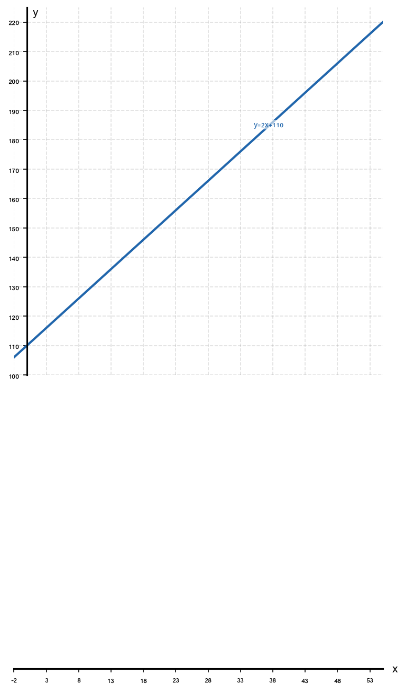

---

תשובות סופיות

1. $a = 3$, $b = 7$

2. $a = -5$, $b = 2$

3. $a = \dfrac{1}{2}$, $b = -4$

4. $a = -1$, $b = 9$

5. $a = 6$, $b = 0$

6. $a = 0$, $b = -8$

7. $a = \dfrac{2}{3}$, $b = \dfrac{1}{3}$

8. $y = ax + b$;
$a$
— שיפוע;
$b$
— חיתוך עם ציר
$Y$
ב-
$(0,b)$

9. $y = -4x + 10$

10. שיפוע זהה (
$a = 2$
); חיתוך שונה עם ציר
$Y$
—
$(0,5)$
לעומת
$(0,-3)$
; ישרים מקבילים.

11. שתי הפונקציות חוצות את ציר
$Y$
באותה נקודה
$(0,1)$
, אך שיפועיהן הפוכים בסימן — אחד עולה ואחד יורד בשיעור זהה.

12. $a = 4$

13. $b = 5$

14. $a = 3$, $b = 2$; $y = 3x + 2$

15. $a = 2$, $b = -3$; $y = 2x - 3$

16. $a = 1.5$
— מחיר ליחידה;
$b = 20$
— דמי קבוע / חיבור

17.
א.
$y = 2.5x + 50$
ב.
$50$
: תשלום קבוע (דמי חיבור/שירות).
ג.
$550$
ש"ח.

18.
א.
ספק א':
$a = 8$,
$b = 60$
; ספק ב':
$a = 10$,
$b = 20$
ב.
$x = 20$
יחידות.
ג.
$320$
ש"ח. ספק א' זול יותר ב-
$20$
ש"ח.

19.
א.
$a = 2$, $b = -6$; $y = 2x - 6$
ב.
כן — הנקודה על הגרף.
ג.
חיתוך עם ציר
$X$
:
$(3,0)$

20.
א.
$a = 2$, $b = 110$; $y = 2x + 110$
ב.
$210$
יחידות לחץ.
ג.
$110$
: לחץ בסיסי ב-
$0°$
(לחץ התחלתי).

