# תיאור גרפי ואלגברי של קו ישר וזיהוי נקודות שעליו

---

## רמה 1: בניית ביטחון (תרגילים 1–8)

1. נתון הישר
$$y = 2x + 1$$
.
מצא את ערך
$$y$$
עבור
$$x = 3$$
.

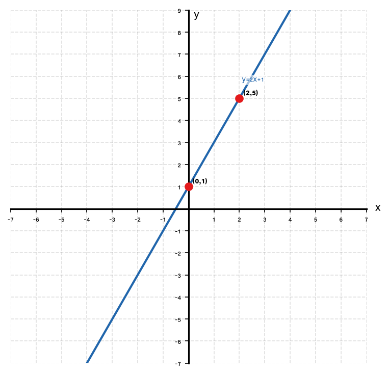

2. נתון הישר
$$y = -x + 5$$
.
מצא את ערך
$$y$$
עבור
$$x = 4$$
.

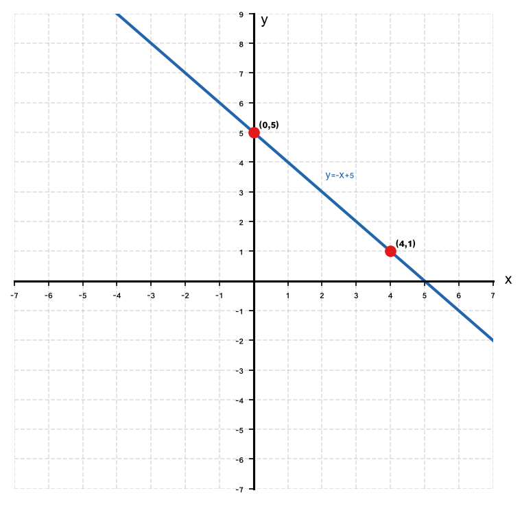

3. נתון הישר
$$y = 3x - 2$$
.
האם הנקודה
$$(2,\,4)$$
נמצאת על הישר? בדוק בהצבה.

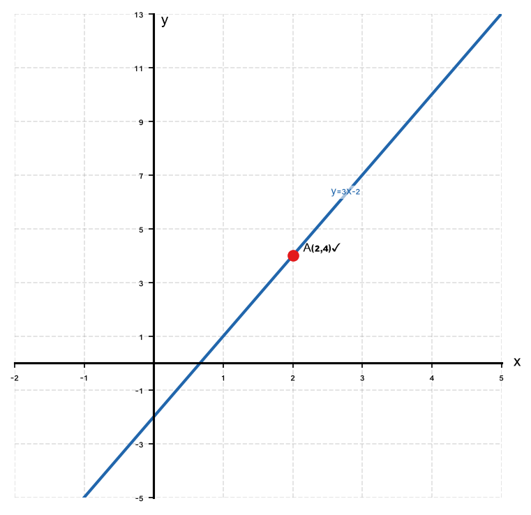

4. נתון הישר
$$y = -2x + 6$$
.
האם הנקודה
$$(3,\,0)$$
נמצאת על הישר? בדוק בהצבה.

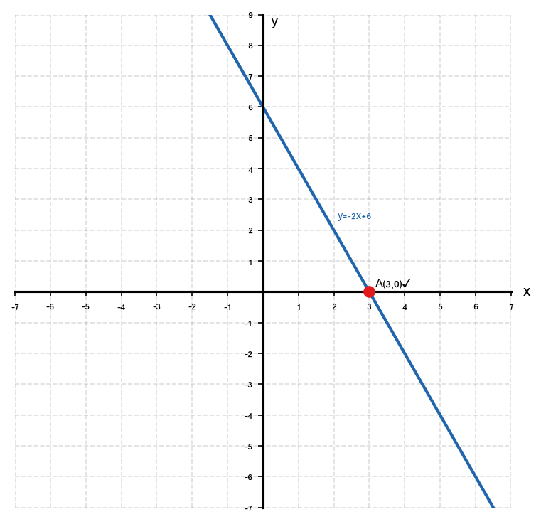

5. נתון הישר
$$y = 4x$$
.
האם הנקודה
$$(0,\,0)$$
נמצאת על הישר?

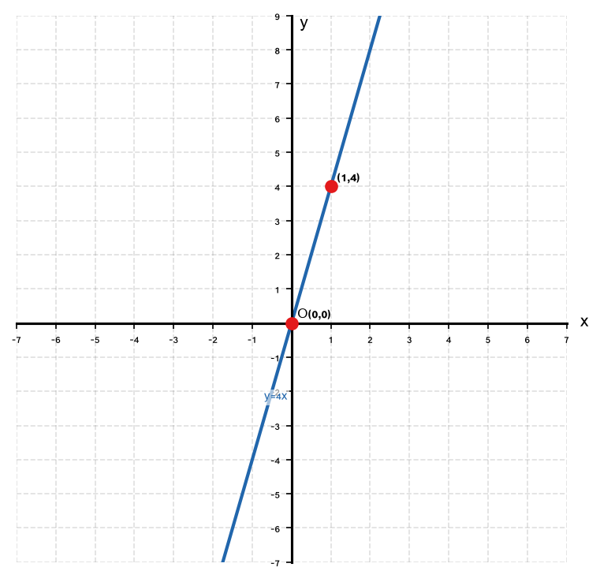

6. נתון הישר
$$y = x + 3$$
.
מצא את ערך
$$y$$
עבור
$$x = -2$$
.

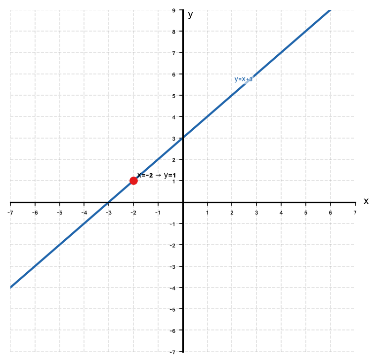

7. נתון הישר
$$y = 5x - 10$$
.
האם הנקודה
$$(2,\,0)$$
נמצאת על הישר? בדוק בהצבה.

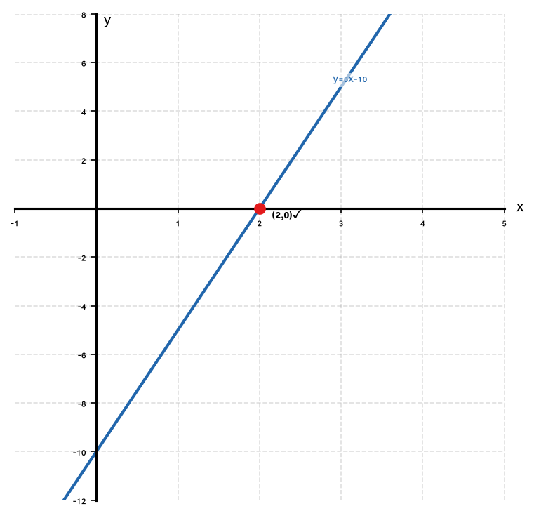

8. נתון הישר
$$y = \frac{1}{2}x + 4$$
.
מצא את ערך
$$y$$
עבור
$$x = 6$$
.

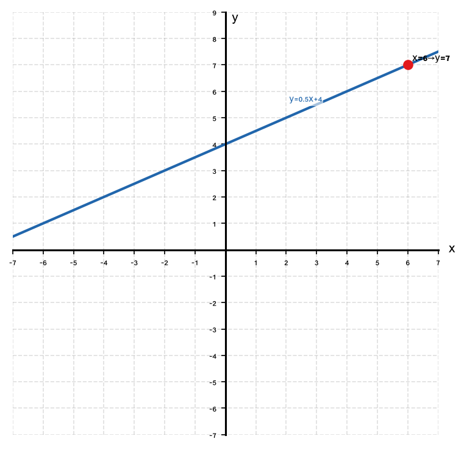

---

## רמה 2: תרגול שוטף ומשולב (תרגילים 9–16)

9. נתון הישר
$$y = -3x + 7$$
.
האם הנקודה
$$(-2,\,13)$$
נמצאת על הישר?

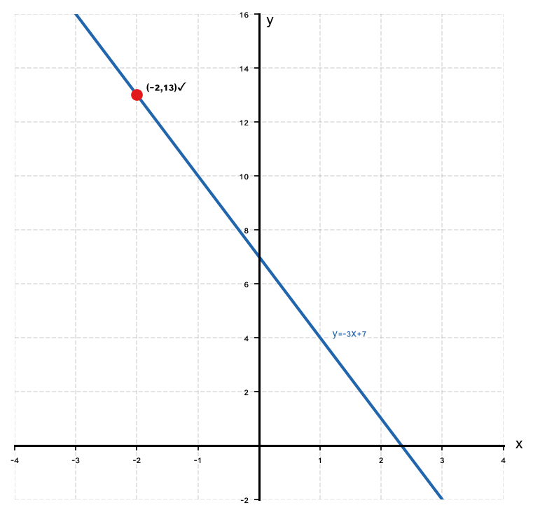

10. נתון הישר
$$y = \frac{2}{3}x - 1$$
.
מצא את ערך
$$y$$
עבור
$$x = -3$$
.

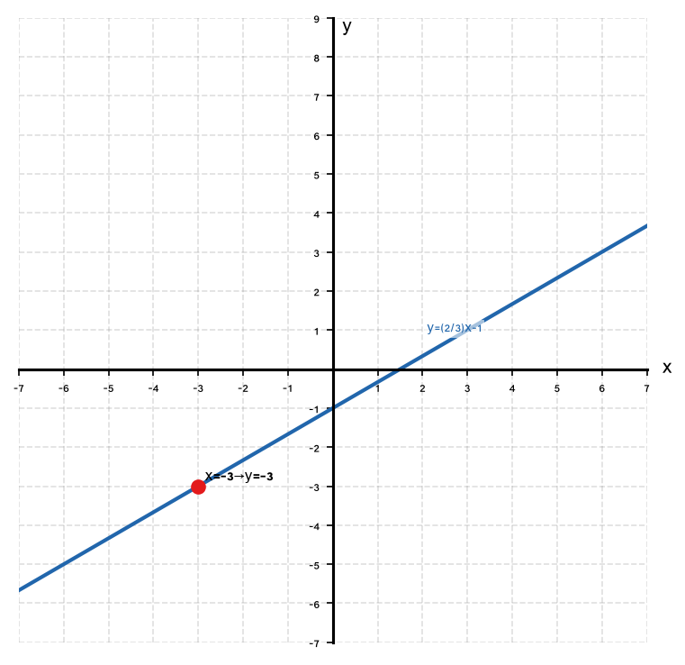

11. נתון הישר
$$y = 2x - 4$$
.
מצא את ערך
$$x$$
כך שהנקודה
$$(x,\,6)$$
תהיה על הישר.

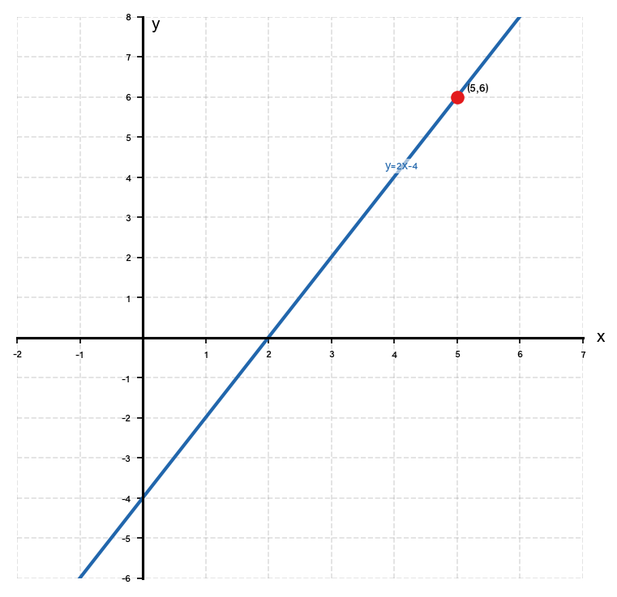

12. נתון הישר
$$y = -4x + 12$$
.
מצא את ערך
$$x$$
כך שהנקודה
$$(x,\,-8)$$
תהיה על הישר.

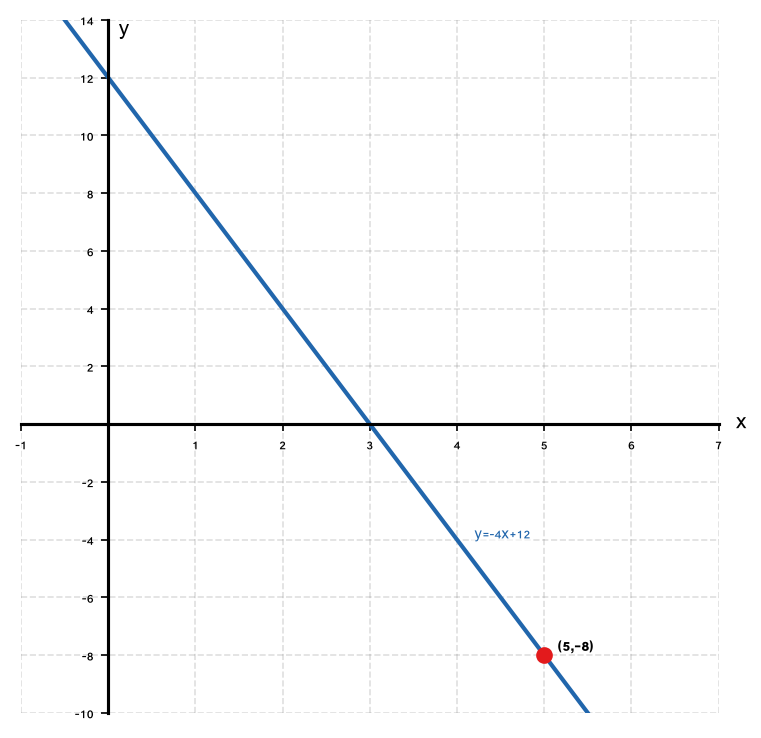

13. נתון הישר
$$y = \frac{1}{3}x + 2$$
.
האם הנקודה
$$(-6,\,0)$$
נמצאת על הישר?

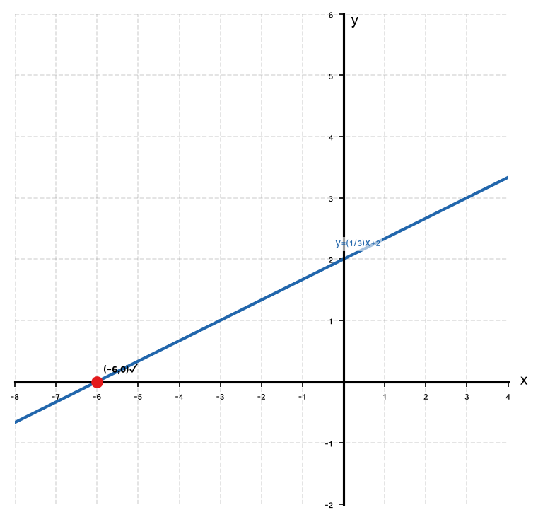

14. הנקודה
$$(k,\,5)$$
נמצאת על הישר
$$y = 3x - 1$$
.
מצא את
$$k$$
.

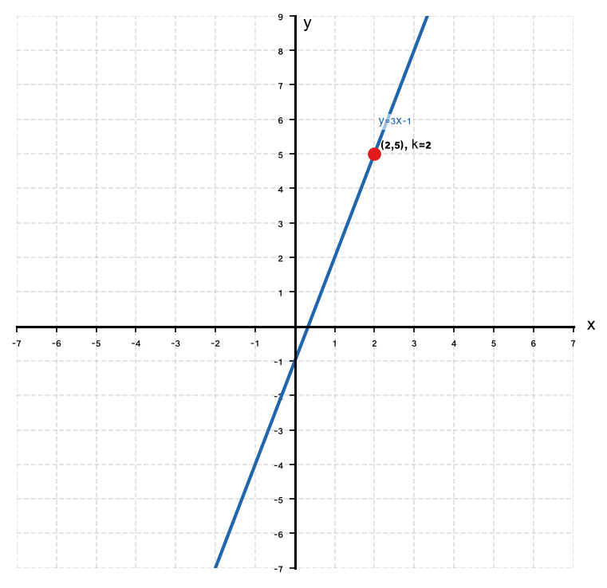

15. הנקודה
$$(4,\,m)$$
נמצאת על הישר
$$y = -\frac{1}{2}x + 3$$
.
מצא את
$$m$$
.

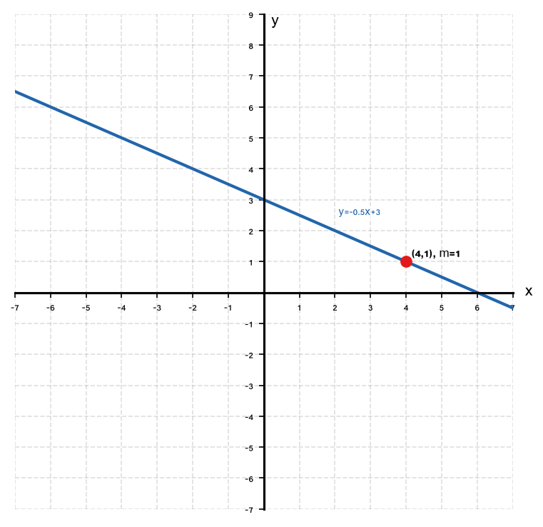

16. בדוק אילו מהנקודות הבאות נמצאות על הישר
$$y = 2x - 5$$
:

$$A(1,\,-3), \quad B(3,\,1), \quad C(-1,\,-7), \quad D(0,\,-4)$$

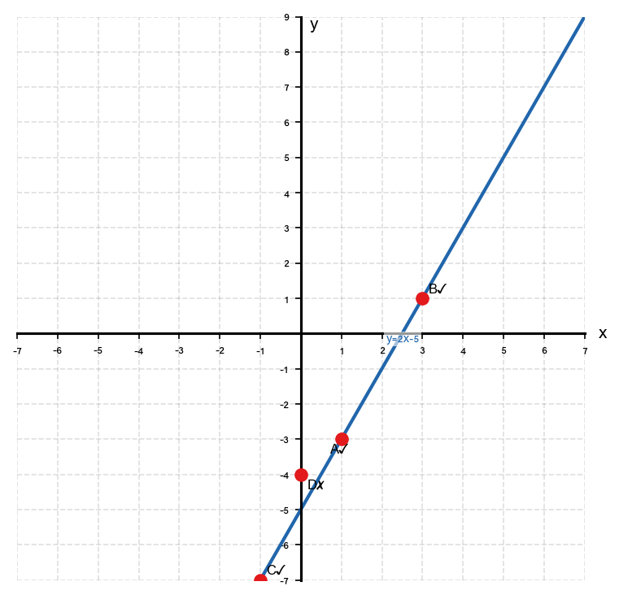

---

## רמה 3: רמת בחינת מה"ט (תרגילים 17–20)

17. ישר
$$\ell_1$$
עובר דרך הנקודות
$$A(1,\,3)$$
ו-
$$B(3,\,7)$$
.
ישר
$$\ell_2$$
עובר דרך הנקודות
$$C(0,\,5)$$
ו-
$$D(2,\,9)$$
.

א. מצא את משוואות שני הישרים.

ב. האם הישרים מקבילים, חופפים, או נחתכים?

ג. האם הנקודה
$$(5,\,11)$$
נמצאת על
$$\ell_1$$
?

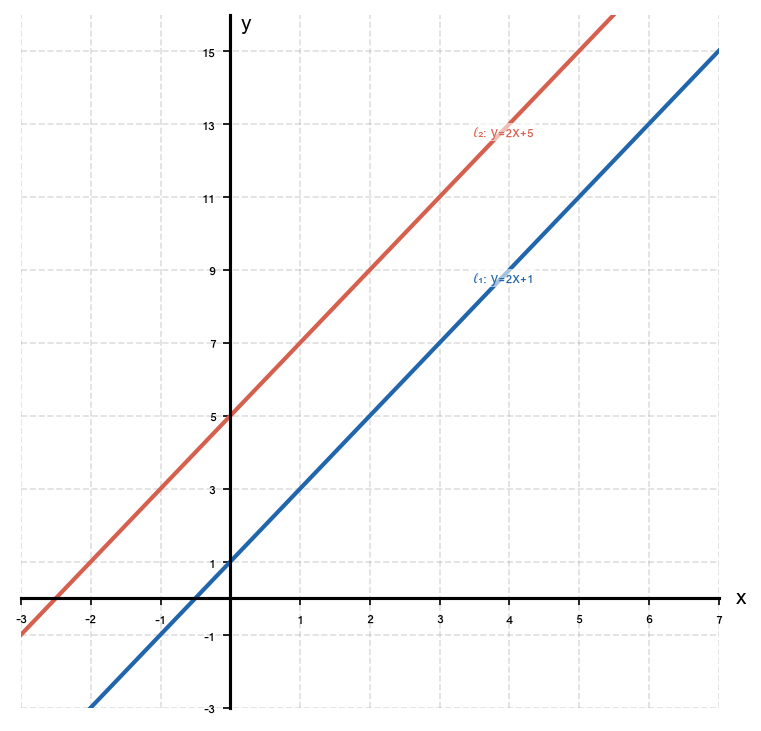

18. מהנדס מתאר מסלול צנרת בעזרת שני ישרים:
ישר א': עובר דרך
$$(0,\,4)$$
ו-
$$(3,\,10)$$
.
ישר ב': עובר דרך
$$(1,\,9)$$
ו-
$$(4,\,3)$$
.

א. כתוב את משוואת כל ישר.

ב. בדוק האם הנקודה
$$(2,\,7)$$
נמצאת על ישר א'.

ג. מצא את נקודת החיתוך של שני הישרים.

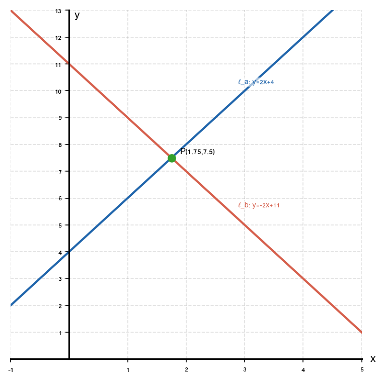

19. נתון הישר
$$y = 3x - 1$$
ונקודה
$$P(2,\,8)$$
שאינה על הישר.

א. הוכח שהנקודה אינה על הישר.

ב. מצא נקודה
$$Q$$
על הישר כך שקואורדינטת ה-X של
$$Q$$
שווה לזו של
$$P$$
.

ג. מהו המרחק האנכי בין
$$P$$
ל-
$$Q$$
?

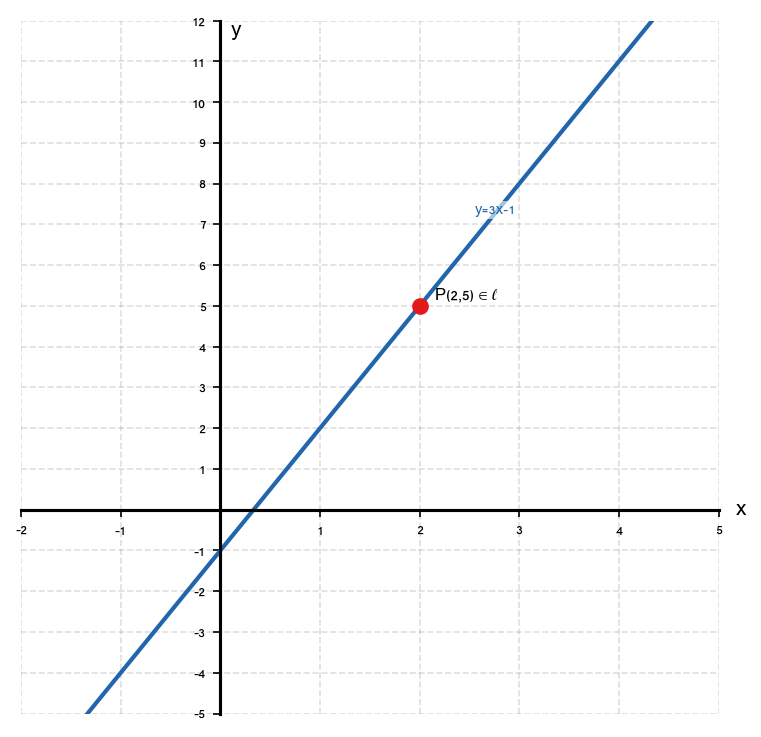

20. ישר
$$m$$
עובר דרך הנקודות
$$E(-2,\,7)$$
ו-
$$F(4,\,-5)$$
.

א. מצא את משוואת הישר
$$m$$
.

ב. האם הנקודה
$$(1,\,1)$$
על הישר?

ג. מצא את נקודת החיתוך של הישר עם ציר ה-Y.

ד. מצא את נקודת החיתוך של הישר עם ציר ה-X.

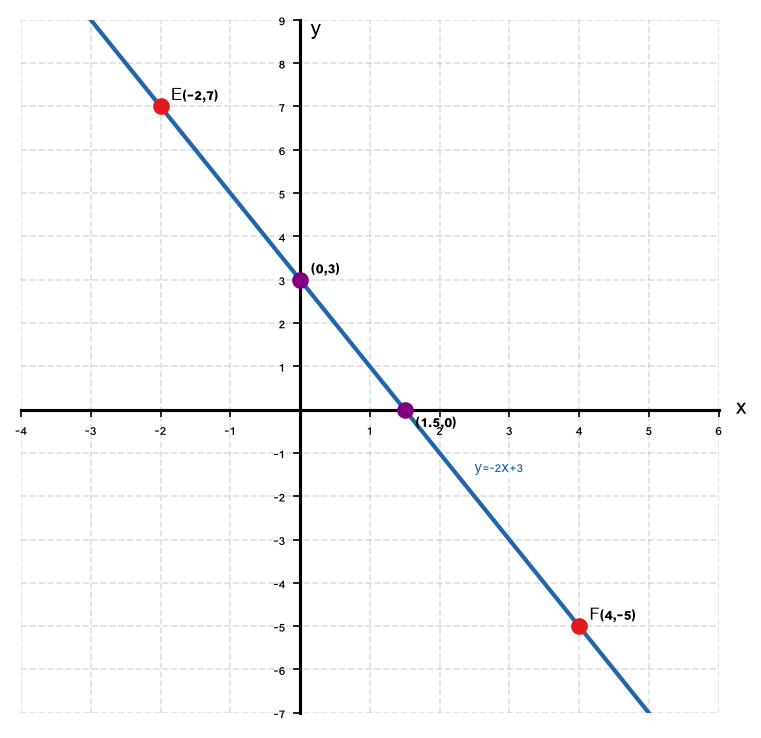

---

תשובות סופיות

1. $7$

2. $1$

3. כן — הנקודה
$(2,4)$
על הישר.

4. כן — הנקודה
$(3,0)$
על הישר.

5. כן — הנקודה
$(0,0)$
על הישר.

6. $1$

7. כן — הנקודה
$(2,0)$
על הישר.

8. $7$

9. כן — הנקודה על הישר.

10. $-3$

11. $5$

12. $5$

13. כן — הנקודה על הישר.

14. $2$

15. $m = 1$

16. הנקודות
$A$,
$B$,
$C$
על הישר;
$D(0,-4)$
אינה עליו

17.
א.
$\ell_1$: $y = 2x + 1$; $\ell_2$: $y = 2x + 5$
ב.
שיפועים שווים (
$2$
), אך
$b$
שונה — הישרים מקבילים.
ג.
כן — הנקודה
$(5,11)$
על
$\ell_1$

18.
א.
ישר א':
$y = 2x + 4$
; ישר ב':
$y = -2x + 11$
ב.
לא — הנקודה
$(2,7)$
אינה על ישר א'.
ג.
נקודת חיתוך:
$(1.75,\,7.5)$

19.
א.
$3 \cdot 2 - 1 = 5 \ne 8$
— הנקודה אינה על הישר.
ב.
$Q = (2,5)$
ג.
המרחק האנכי הוא
$3$

20.
א.
$y = -2x + 3$
ב.
כן — הנקודה
$(1,1)$
על הישר.
ג.
חיתוך עם ציר
$Y$
:
$(0,3)$
ד.
חיתוך עם ציר
$X$
:
$(1.5,\,0)$

