# שרטוט קו ישר בעזרת טבלת נתונים

---

## רמה 1: בניית ביטחון (תרגילים 1–8)

1. בנה טבלת ערכים לפונקציה
$$y = 2x + 1$$
עבור
$$x \in \{-2,\,-1,\,0,\,1,\,2\}$$
.

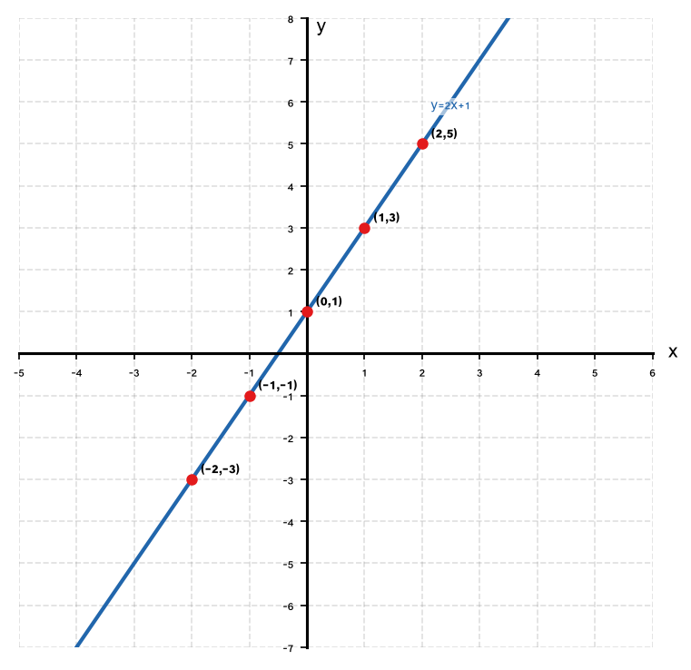
2. בנה טבלת ערכים לפונקציה
$$y = x - 3$$
עבור
$$x \in \{0,\,1,\,2,\,3,\,4\}$$
.

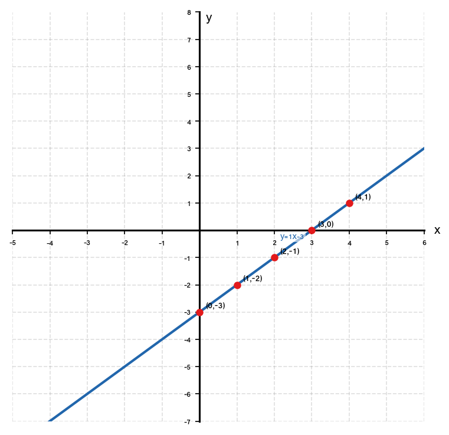
3. בנה טבלת ערכים לפונקציה
$$y = -x + 4$$
עבור
$$x \in \{-1,\,0,\,1,\,2,\,3\}$$
.

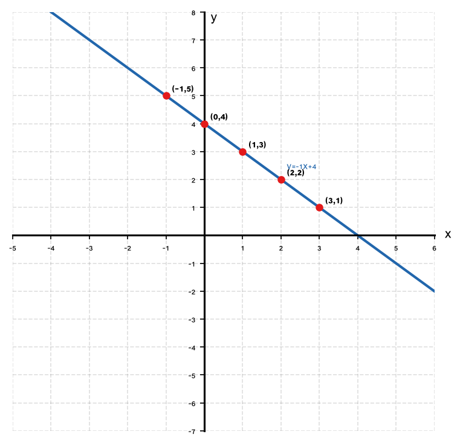
4. בנה טבלת ערכים לפונקציה
$$y = 3x$$
עבור
$$x \in \{-2,\,-1,\,0,\,1,\,2\}$$
.

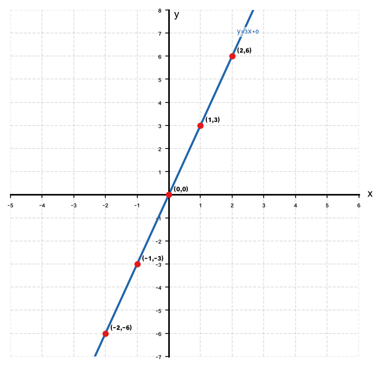
5. בנה טבלת ערכים לפונקציה
$$y = -2x + 5$$
עבור
$$x \in \{0,\,1,\,2,\,3,\,4\}$$
.

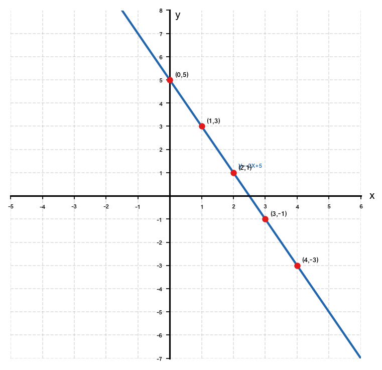
6. בנה טבלת ערכים לפונקציה
$$y = 4$$
(פונקציה קבועה) עבור
$$x \in \{-2,\,-1,\,0,\,1,\,2\}$$
.

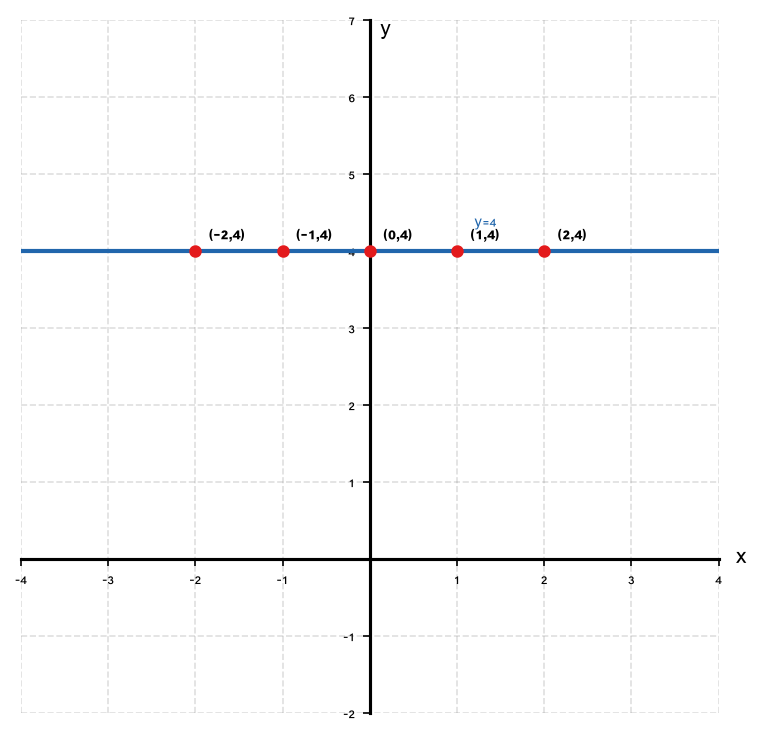
7. בנה טבלת ערכים לפונקציה
$$y = x + 1$$
עבור
$$x \in \{-3,\,-1,\,0,\,2,\,5\}$$
.

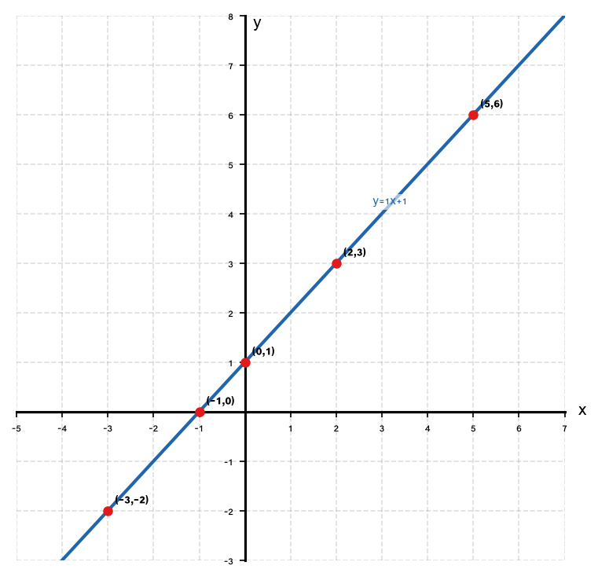
8. בנה טבלת ערכים לפונקציה
$$y = -3x + 6$$
עבור
$$x \in \{-1,\,0,\,1,\,2,\,3\}$$
.

---

## רמה 2: תרגול שוטף ומשולב (תרגילים 9–16)

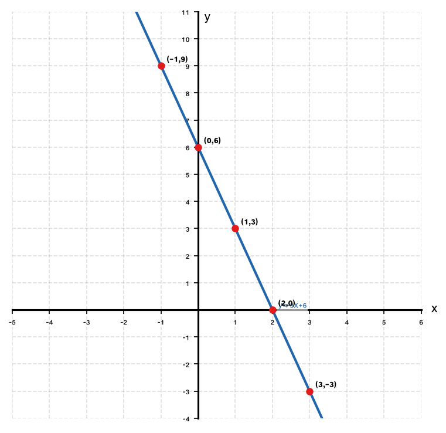
9. בנה טבלת ערכים לפונקציה
$$y = \frac{1}{2}x - 3$$
עבור
$$x \in \{-4,\,-2,\,0,\,2,\,4\}$$
.

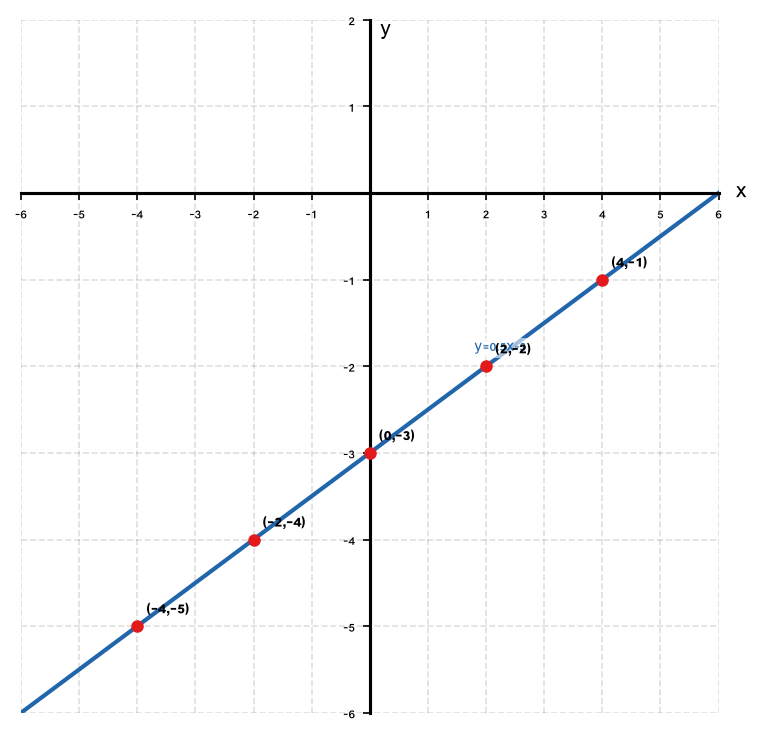
10. בנה טבלת ערכים לפונקציה
$$y = -\frac{2}{3}x + 2$$
עבור
$$x \in \{-3,\,0,\,3,\,6,\,9\}$$
.

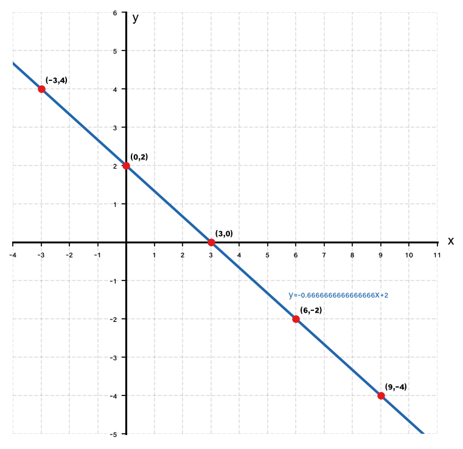
11. בנה טבלת ערכים לפונקציה
$$y = 1.5x - 4.5$$
עבור
$$x \in \{-2,\,0,\,1,\,3,\,5\}$$
.

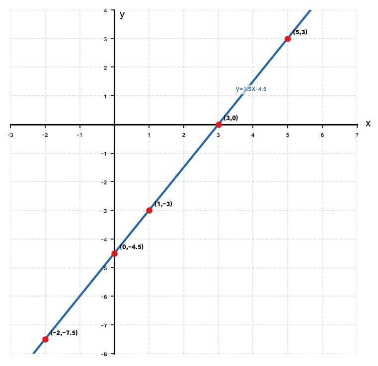
12. ישר נתון על ידי שני ביטויים שוות ערך:
$$y = 2x - 6$$
ו-
$$y - 2x + 6 = 0$$
.
בנה טבלת ערכים לפחות לשלוש נקודות שונות.

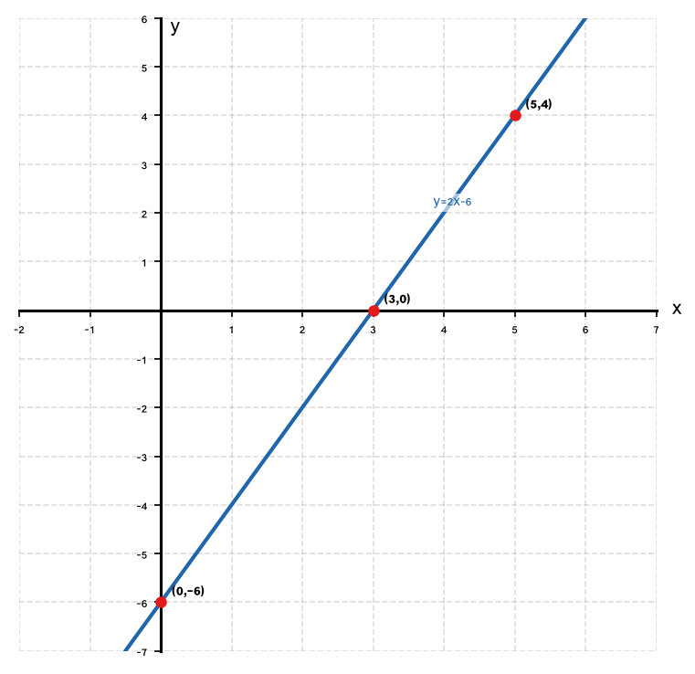
13. שתי פונקציות:
$$f(x) = 3x - 1$$
ו-
$$g(x) = -3x + 5$$
.
בנה טבלת ערכים לכל אחת עבור
$$x \in \{-1,\,0,\,1,\,2\}$$
, ומצא את
$$x$$
שבו
$$f(x) = g(x)$$
.

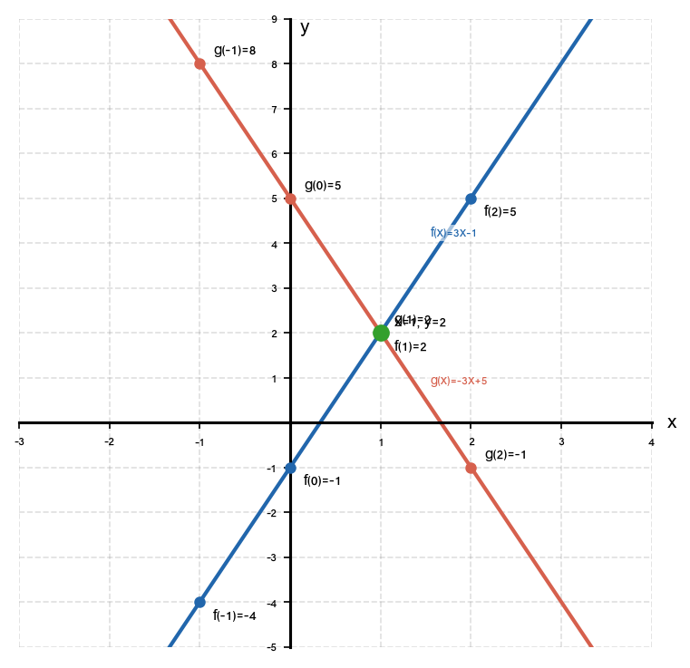
14. הפונקציה
$$y = -2x + k$$
עוברת דרך הנקודה
$$(3,\,-2)$$
.
מצא את
$$k$$
, ואז בנה טבלה עבור
$$x \in \{0,\,1,\,2,\,3,\,4\}$$
.

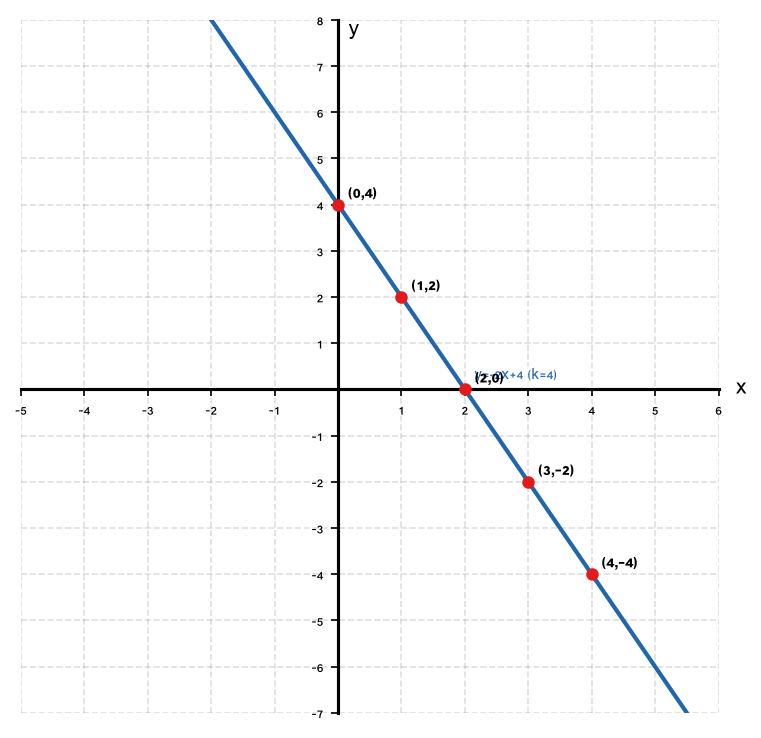
15. בנה טבלת ערכים לפונקציה
$$y = \frac{3}{4}x + 1$$
עבור
$$x \in \{-4,\,0,\,4,\,8\}$$
, והסבר כיצד תשרטט את הישר על סמך שתי נקודות בלבד.

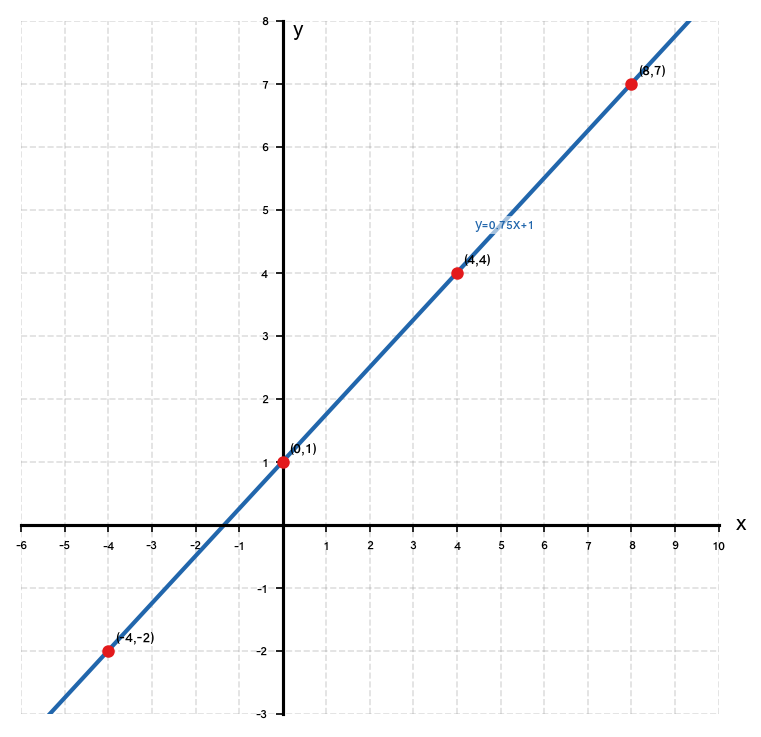
16. הפונקציה
$$y = ax - 2$$
עוברת דרך הנקודה
$$(4,\,6)$$
.
א. מצא את
$$a$$
.
ב. בנה טבלה עבור
$$x \in \{-2,\,0,\,2,\,4,\,6\}$$
.

---

## רמה 3: רמת בחינת מה"ט (תרגילים 17–20)

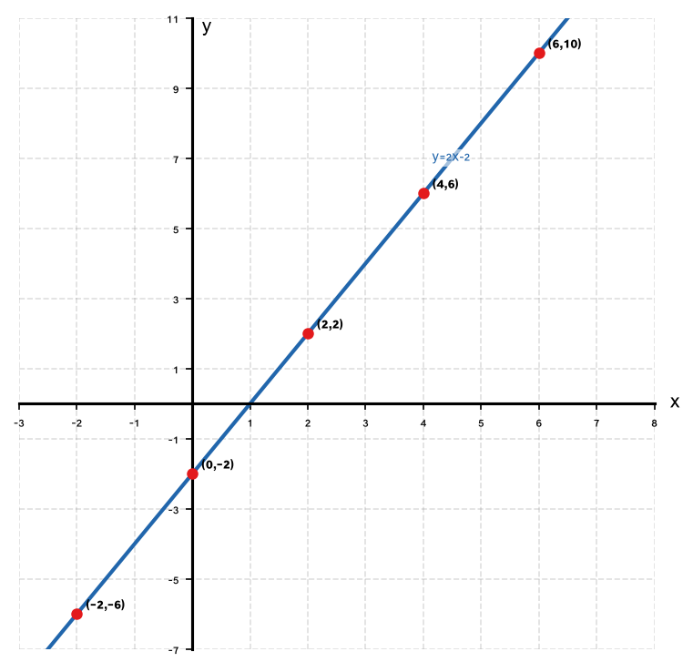
17. שני ישרים נתונים:
$$\ell_1:\; y = 2x - 4$$
ו-
$$\ell_2:\; y = -x + 5$$
.

א. בנה טבלת ערכים לכל ישר עבור
$$x \in \{0,\,1,\,2,\,3,\,4\}$$
.

ב. מצא את נקודת החיתוך של שני הישרים אלגברית.

ג. האם נקודת החיתוך מופיעה בטבלה שבנית?

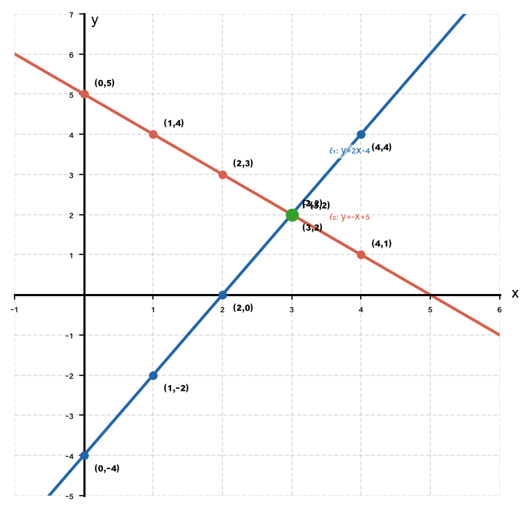
18. מהנדס מתכנן שלב חשמל. ישר ראשון מתאר מתח:
$$V = 3t + 6$$
(כאשר
$$t$$
הוא הזמן בשניות ו-
$$V$$
המתח בוולט).
ישר שני:
$$V = -t + 18$$
.

א. בנה טבלת ערכים לכל ישר עבור
$$t \in \{0,\,2,\,4,\,6,\,8\}$$
.

ב. מצא את הרגע שבו המתח שווה בשני המעגלים.

ג. מהו ערך המתח באותו רגע?

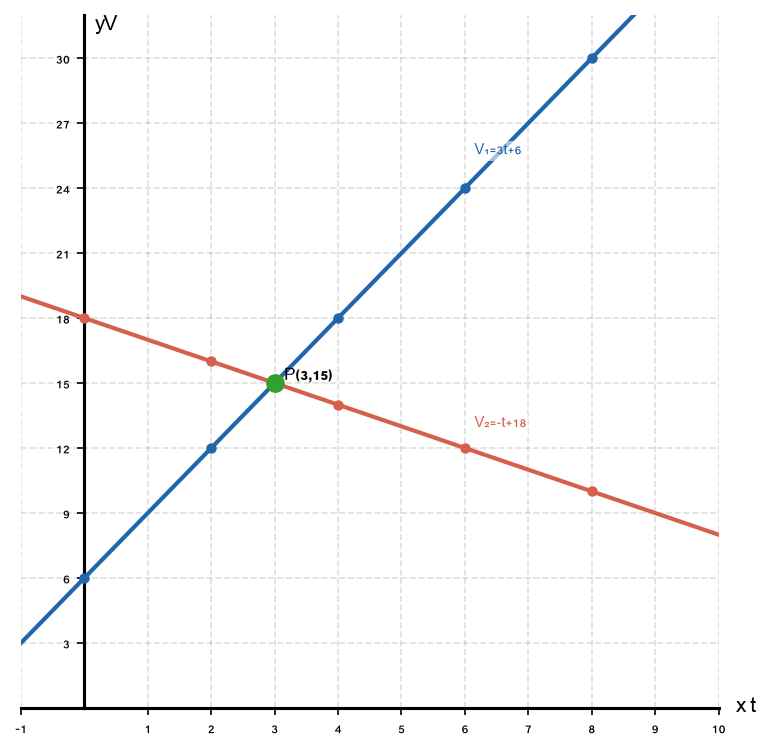
19. הישר
$$\ell$$
עובר דרך הנקודות
$$A(-2,\,1)$$
ו-
$$B(4,\,7)$$
.

א. מצא את משוואת הישר.

ב. בנה טבלת ערכים עבור
$$x \in \{-4,\,-2,\,0,\,2,\,4\}$$
.

ג. בדוק: האם הנקודה
$$(10,\,13)$$
נמצאת על הישר?

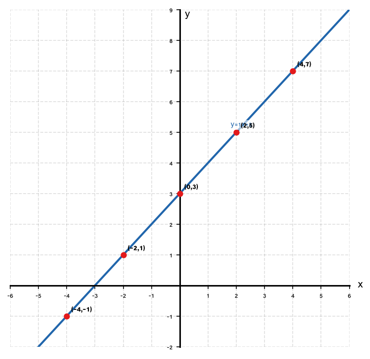
20. ישר
$$m$$
מוגדר על ידי: "שיפועו שלילי — פי שניים מהמספר החופשי — והוא עובר דרך
$$(6,\,-2)$$
."

א. הצב ומצא את
$$a$$
ואת
$$b$$
.

ב. כתוב את משוואת הישר ובנה טבלה עבור
$$x \in \{0,\,2,\,4,\,6,\,8\}$$
.

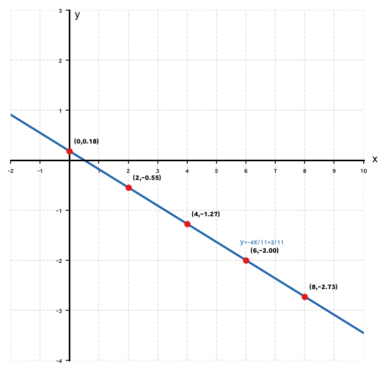

---

תשובות סופיות

1. |$x$|$-2$|$-1$|$0$|$1$|$2$| |------|------|------|-----|-----|-----| |$y$|$-3$|$-1$|$1$|$3$|$5$|
2. |$x$|$0$|$1$|$2$|$3$|$4$| |------|-----|-----|-----|-----|-----| |$y$|$-3$|$-2$|$-1$|$0$|$1$|
3. |$x$|$-1$|$0$|$1$|$2$|$3$| |------|------|-----|-----|-----|-----| |$y$|$5$|$4$|$3$|$2$|$1$|
4. |$x$|$-2$|$-1$|$0$|$1$|$2$| |------|------|------|-----|-----|-----| |$y$|$-6$|$-3$|$0$|$3$|$6$|
5. |$x$|$0$|$1$|$2$|$3$|$4$| |------|-----|-----|-----|-----|-----| |$y$|$5$|$3$|$1$|$-1$|$-3$|
6. |$x$|$-2$|$-1$|$0$|$1$|$2$| |------|------|------|-----|-----|-----| |$y$|$4$|$4$|$4$|$4$|$4$|
7. |$x$|$-3$|$-1$|$0$|$2$|$5$| |------|------|------|-----|-----|-----| |$y$|$-2$|$0$|$1$|$3$|$6$|
8. |$x$|$-1$|$0$|$1$|$2$|$3$| |------|------|-----|-----|-----|-----| |$y$|$9$|$6$|$3$|$0$|$-3$|
9. |$x$|$-4$|$-2$|$0$|$2$|$4$| |------|------|------|-----|-----|-----| |$y$|$-5$|$-4$|$-3$|$-2$|$-1$|
10. |$x$|$-3$|$0$|$3$|$6$|$9$| |------|------|-----|-----|-----|-----| |$y$|$4$|$2$|$0$|$-2$|$-4$|
11. |$x$|$-2$|$0$|$1$|$3$|$5$| |------|------|-----|-----|-----|-----| |$y$|$-7.5$|$-4.5$|$-3$|$0$|$3$|
12. משוואת הישר:
$y = 2x - 6$
טבלת ערכים לדוגמה:
$x = 0,\,1,\,2 \Rightarrow y = -6,\,-4,\,-2$
13. $x = 1$; בנקודה זו $f(1) = g(1) = 2$
14. $k = 4$; $y = -2x + 4$
טבלה עבור $x \in \{0,1,2,3,4\}$:
$y \in \{4,2,0,-2,-4\}$
15. טבלה: $(-4,\,-2)$, $(0,\,1)$, $(4,\,4)$ או $(8,\,7)$
שרטוט: שתי נקודות קובעות קו — מסמנים שתי נקודות מהטבלה ומחברים בקו ישר
16. א. $a = 2$
ב. עבור $y = 2x - 2$ ו-$x \in \{-2,0,2,4,6\}$ מתקבל $y \in \{-6,-2,2,6,10\}$
17. א. |$x$|$0$|$1$|$2$|$3$|$4$| |------|-----|-----|-----|-----|-----| |$\ell_1$:$y$|$-4$|$-2$|$0$|$2$|$4$| |$\ell_2$:$y$|$5$|$4$|$3$|$2$|$1$| ב. 2$. נקודת חיתוך:$(3,2)$ . ג. כן — ניתן לראות ששניהם שווים ל-$2$בעמודת$x=3$.
18. א. -t+18$|$18$|$16$|$14$|$12$|$10$ | ב. t=3$ שניות. ג. 15$ וולט.
19. א. x+3$ . ב. |$x$|$-4$|$-2$|$0$|$2$|$4$| |------|------|------|-----|-----|-----| |$y$|$-1$|$1$|$3$|$5$|$7$| ג. 13$✓ הנקודה$(10,13)$ על הישר.
20. א. -\dfrac{4}{11}$ . ב. $y=-\dfrac{4}{11}x+\dfrac{2}{11}$|$x$|$0$|$2$|$4$|$6$|$8$| |------|-----|-----|-----|-----|-----| |$y$|$\approx 0.18$|$\approx -0.55$|$\approx -1.27$|$-2$|$\approx -2.73$|

