# מציאת נקודות חיתוך של הישר עם הצירים

---

## רמה 1: בניית ביטחון (תרגילים 1–8)

1. מצא את נקודות החיתוך של הישר
$$y = 2x + 6$$
עם ציר X ועם ציר Y.

2. מצא את נקודות החיתוך של הישר
$$y = x - 4$$
עם ציר X ועם ציר Y.

3. מצא את נקודות החיתוך של הישר
$$y = -3x + 9$$
עם ציר X ועם ציר Y.

4. מצא את נקודות החיתוך של הישר
$$y = 4x - 8$$
עם ציר X ועם ציר Y.

5. מצא את נקודות החיתוך של הישר
$$y = -x + 5$$
עם ציר X ועם ציר Y.

6. מצא את נקודות החיתוך של הישר
$$y = 2x$$
עם ציר X ועם ציר Y.

7. מצא את נקודות החיתוך של הישר
$$y = -5x + 15$$
עם ציר X ועם ציר Y.

8. מצא את נקודות החיתוך של הישר
$$y = \frac{1}{2}x - 3$$
עם ציר X ועם ציר Y.

---

## רמה 2: תרגול שוטף ומשולב (תרגילים 9–16)

9. מצא את נקודות החיתוך עם הצירים:
$$3x + 2y - 12 = 0$$

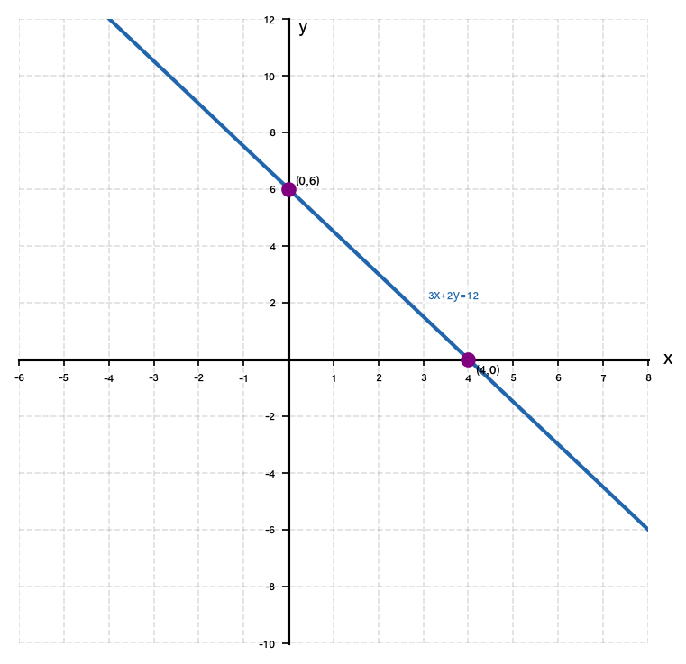

10. מצא את נקודות החיתוך עם הצירים:
$$-4x + y + 8 = 0$$

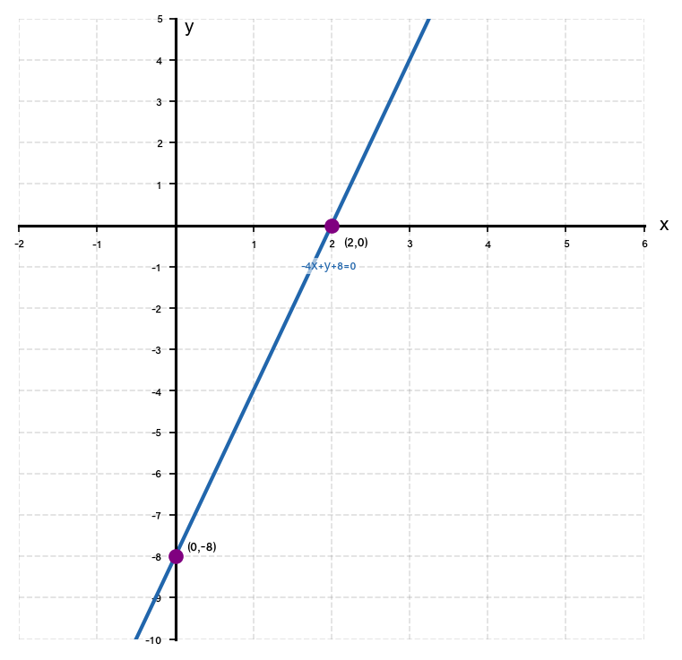

11. מצא את נקודות החיתוך עם הצירים:
$$2x - 3y + 6 = 0$$

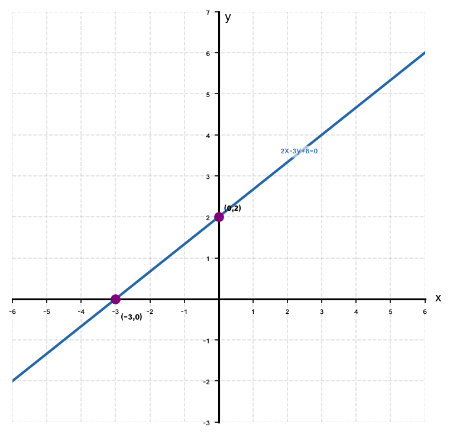

12. מצא את נקודות החיתוך עם הצירים:
$$5x + 4y - 20 = 0$$

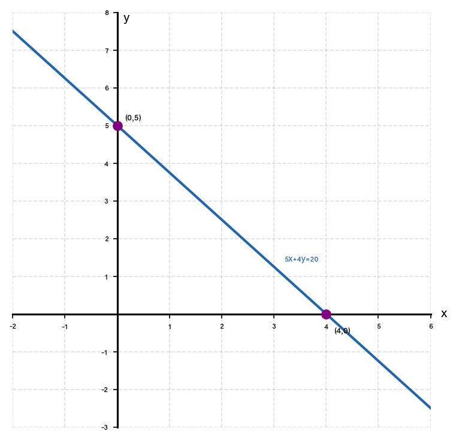

13. הישר
$$y = ax - 6$$
חוצה את ציר X בנקודה
$$(2,\,0)$$
.
מצא את
$$a$$
, ואז מצא את חיתוך הישר עם ציר Y.

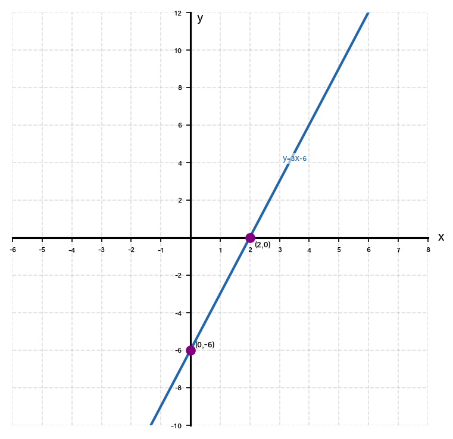

14. הישר
$$y = 3x + b$$
חוצה את ציר Y בנקודה
$$(0,\,-9)$$
.
מצא את
$$b$$
, ואז מצא את חיתוך הישר עם ציר X.

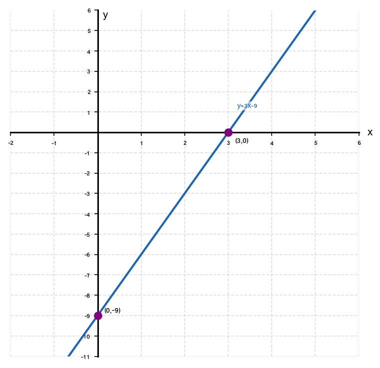

15. מצא את נקודות החיתוך עם הצירים עבור הישר:
$$y = -\frac{3}{4}x + 6$$

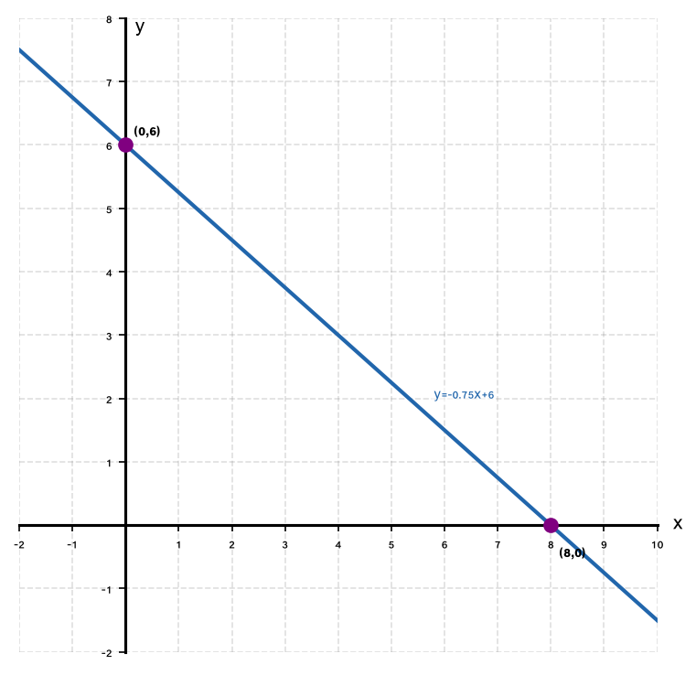

16. שני ישרים:
$$\ell_1:\; y = 2x - 6$$
ו-
$$\ell_2:\; y = -x + 6$$
.
א. מצא את חיתוכי כל ישר עם הצירים.
ב. האם יש להם נקודת חיתוך עם ציר Y שווה?

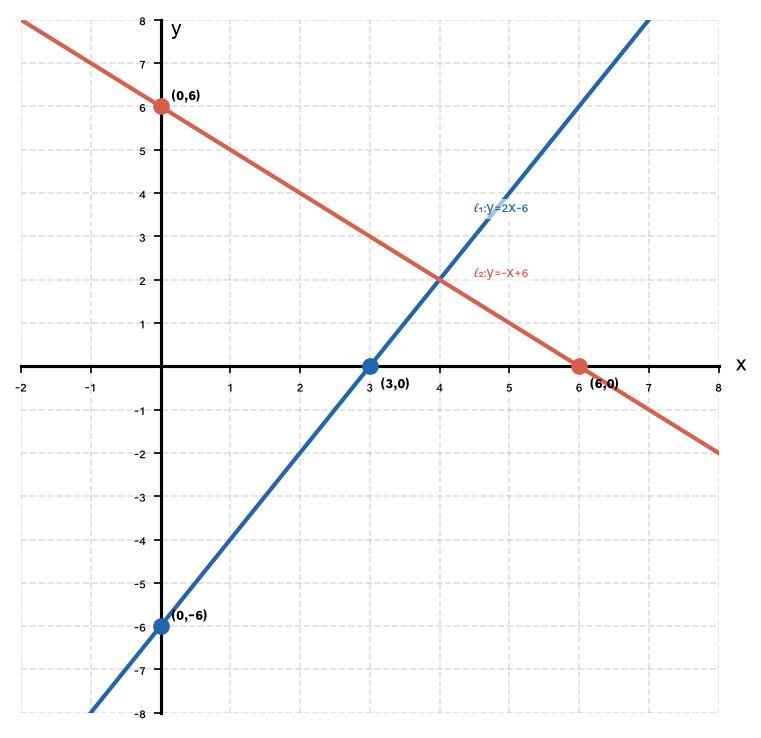

---

## רמה 3: רמת בחינת מה"ט (תרגילים 17–20)

17. קרן אור ראשונה נוסעת לאורך הישר
$$y = 2x + 8$$
.
קרן שנייה עוברת דרך הנקודות
$$(1,\,3)$$
ו-
$$(-2,\,9)$$
.

א. מצא את משוואת קרן האור השנייה.

ב. מצא את נקודת המפגש של שתי קרני האור.

ג. מצא את המרחק בין נקודת המפגש לחיתוך קרן האור הראשונה עם ציר ה-Y.

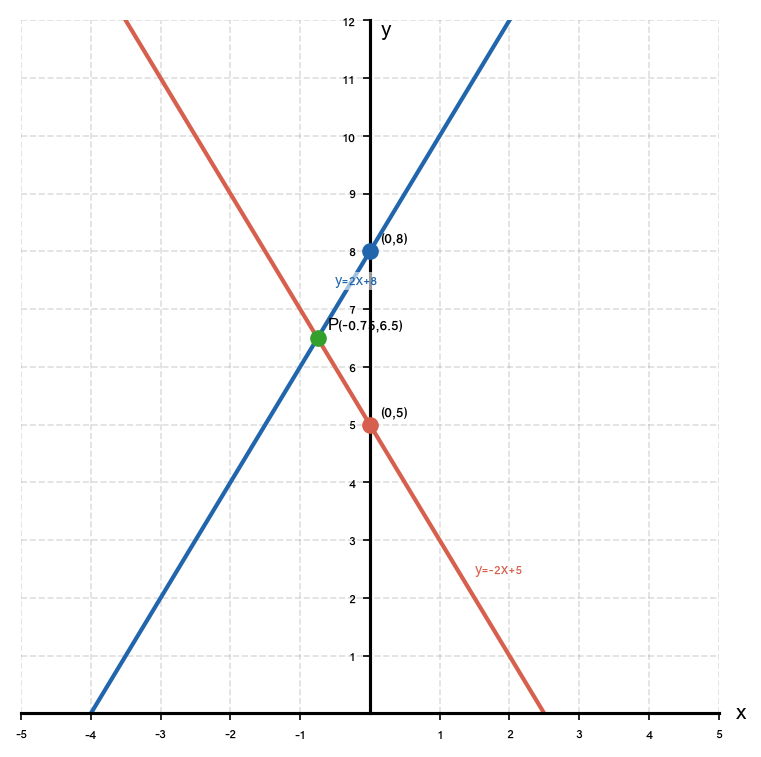

18. כביש ראשי עובר לאורך הישר
$$3x + y - 9 = 0$$
.
כביש משני עובר לאורך הישר
$$x - 2y + 4 = 0$$
.

א. מצא את חיתוך כל כביש עם ציר X ועם ציר Y.

ב. מצא את נקודת הצומת (חיתוך שני הכבישים).

ג. בדוק: האם הנקודה
$$(2,\,3)$$
נמצאת על אחד הכבישים?

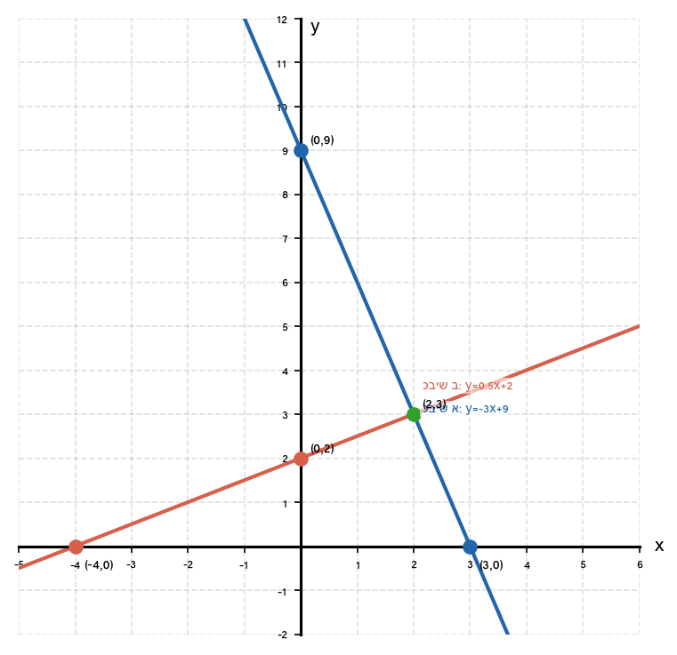

19. נתון מלבן
$$ABCD$$
כאשר:
$$A(0,\,3)$$
,
$$B(5,\,3)$$
,
$$C(5,\,-1)$$
,
$$D(0,\,-1)$$
.

א. כתוב את משוואות כל ארבע צלעות המלבן.

ב. מצא את חיתוך האלכסון
$$AC$$
עם ציר X ועם ציר Y.

ג. מצא את נקודת האמצע של האלכסון.

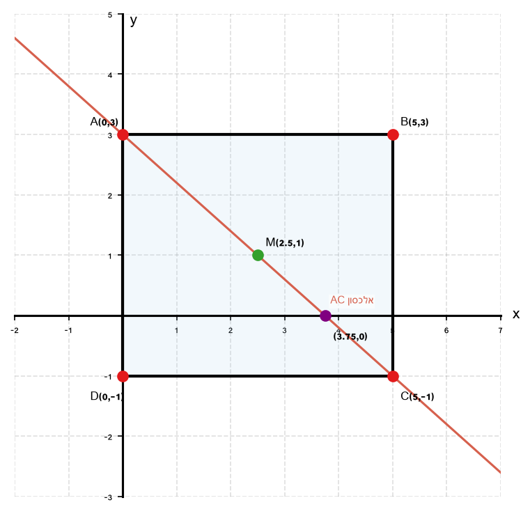

20. ישר
$$\ell$$
עובר דרך
$$A(1000,\,0)$$
ו-
$$B(0,\,500)$$
(בסדרי גודל של מטרים — בעיה תכנונית).

א. כתוב את משוואת הישר.

ב. בדוק האם הנקודה
$$(500,\,250)$$
נמצאת על הישר.

ג. מהו שיפוע הישר ומה משמעותו בהקשר המעשי?

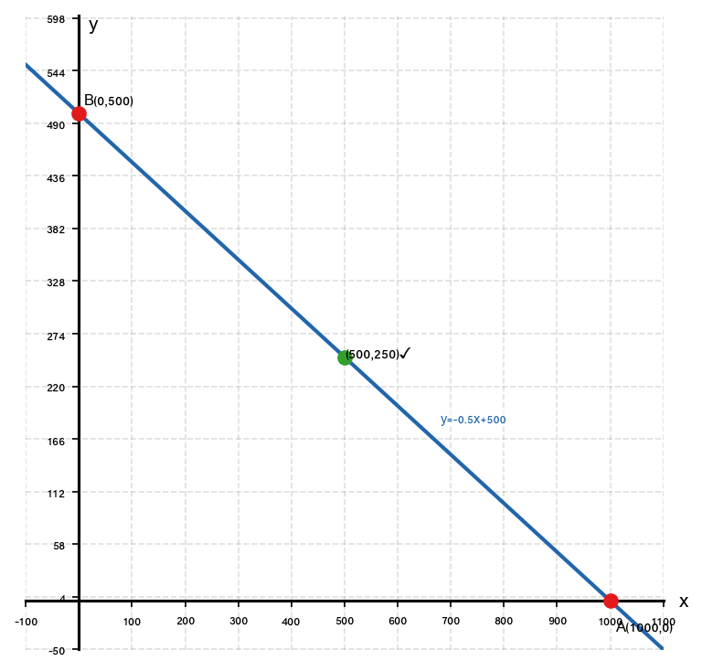

---

תשובות סופיות

1. ציר
$Y$
:
$(0,6)$
; ציר
$X$
:
$(-3,0)$

2. ציר
$Y$
:
$(0,-4)$
; ציר
$X$
:
$(4,0)$

3. ציר
$Y$
:
$(0,9)$
; ציר
$X$
:
$(3,0)$

4. ציר
$Y$
:
$(0,-8)$
; ציר
$X$
:
$(2,0)$

5. ציר
$Y$
:
$(0,5)$
; ציר
$X$
:
$(5,0)$

6. ציר
$X$
וציר
$Y$
שניהם נחתכים בנקודה
$(0,0)$
— הישר עובר דרך הראשית.

7. ציר
$Y$
:
$(0,15)$
; ציר
$X$
:
$(3,0)$

8. ציר
$Y$
:
$(0,-3)$
; ציר
$X$
:
$(6,0)$

9. ציר
$Y$
:
$(0,6)$
; ציר
$X$
:
$(4,0)$

10. ציר
$Y$
:
$(0,-8)$
; ציר
$X$
:
$(2,0)$

11. ציר
$X$
:
$(-3,0)$
; ציר
$Y$
:
$(0,2)$

12. ציר
$X$
:
$(4,0)$
; ציר
$Y$
:
$(0,5)$

13. $a = 3$
; ציר
$Y$
:
$(0,-6)$

14. $b = -9$
; ציר
$X$
:
$(3,0)$

15. ציר
$X$
:
$(8,0)$
; ציר
$Y$
:
$(0,6)$

16.
א.
$\ell_1$
: ציר
$X$
:
$(3,0)$
; ציר
$Y$
:
$(0,-6)$;
$\ell_2$
: ציר
$X$
:
$(6,0)$
; ציר
$Y$
:
$(0,6)$
ב.
חיתוכי ציר
$Y$
שונים (
$-6 \neq 6$
)

17.
א.
$y = -2x + 5$
ב.
נקודת מפגש:
$(-0.75,\,6.5)$
ג.
$\sqrt{2.8125} \approx 1.677$

18.
א.
כביש ראשי: ציר
$X$
:
$(3,0)$
; ציר
$Y$
:
$(0,9)$
; כביש משני: ציר
$X$
:
$(-4,0)$
; ציר
$Y$
:
$(0,2)$
ב.
נקודת צומת:
$(2,3)$
ג.
כן — הנקודה על הכביש הראשי.

19.
א.
$AB$: $y = 3$; $BC$: $x = 5$; $CD$: $y = -1$; $DA$: $x = 0$
ב.
אלכסון
$AC$
: ציר
$X$
:
$(3.75,0)$
; ציר
$Y$
:
$(0,3)$
ג.
$(2.5,1)$

20.
א.
$y = -0.5x + 500$
ב.
כן — הנקודה על הישר.
ג.
שיפוע
$-0.5$
: על כל מטר אופקי, המסלול יורד חצי מטר (ירידה קבועה).

