# יחידה 1.2 – "צוחקת" או "בוכה"? תפקידו של הפרמטר
$a$
בפונקציה הריבועית

---

## רמה 1: בניית ביטחון (8 תרגילים)

1. ציין עבור כל פונקציה האם הפרבולה פתוחה כלפי מעלה ("צוחקת") או כלפי מטה ("בוכה"):
א.
$y = 3x^2$
ב.
$y = -2x^2$
ג.
$y = x^2 + 5$
ד.
$y = -x^2 - 3$

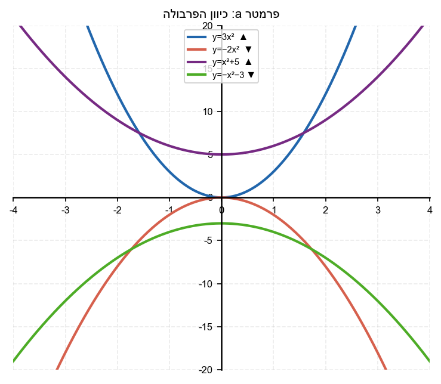

2. נתונה הפרבולה
$y = ax^2$.
אם
$a = 4$,
מהו ערך
$y$
כאשר
$x = 2$?
ואם
$a = -4$,
מהו ערך
$y$
כאשר
$x = 2$?

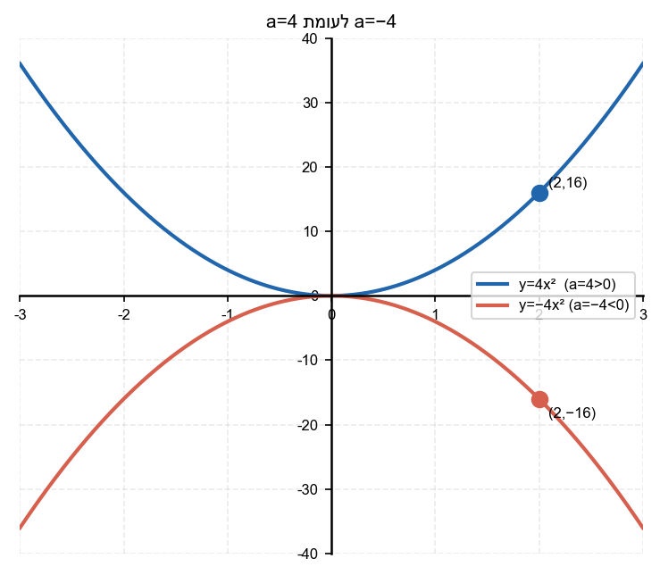

3. בנה טבלת ערכים לפרבולה
$y = 2x^2$
עבור
$x = -2, -1, 0, 1, 2$.

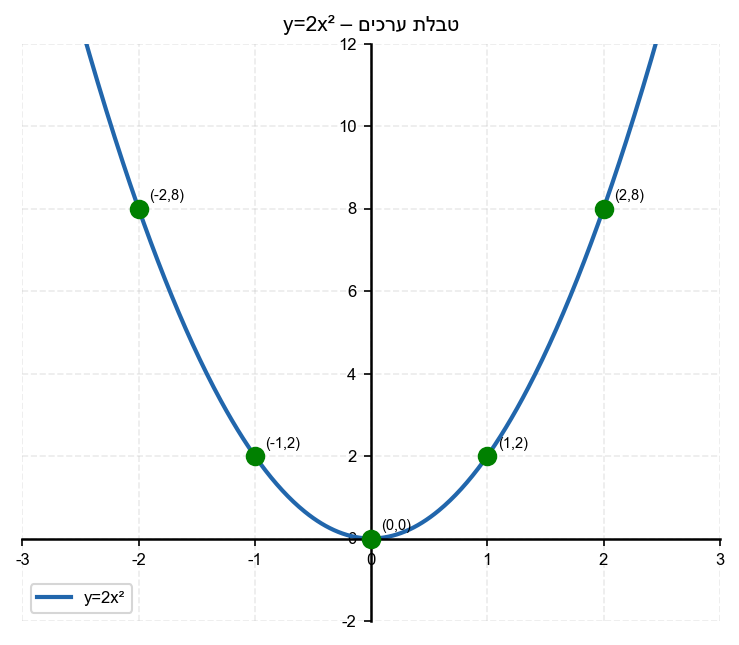

4. בנה טבלת ערכים לפרבולה
$y = -2x^2$
עבור
$x = -2, -1, 0, 1, 2$.

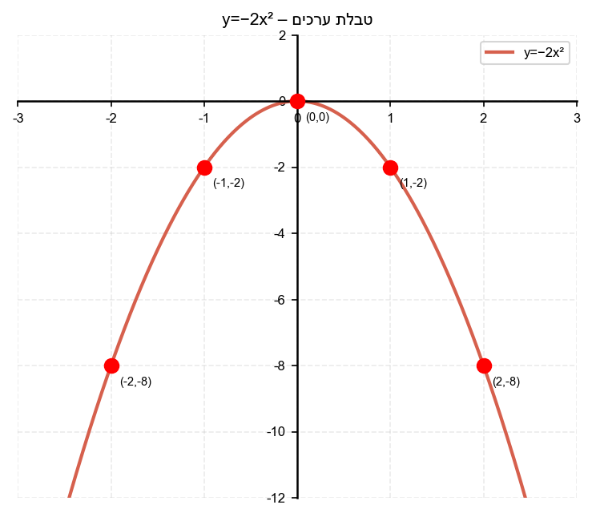

5. השווה בין הפרבולות:
$y = x^2$,
$y = 3x^2$,
$y = \frac{1}{2}x^2$.
איזו "צרה" יותר ואיזו "רחבה" יותר? (הצב
$x = 2$
בכל אחת וראה מי הכי גבוהה)

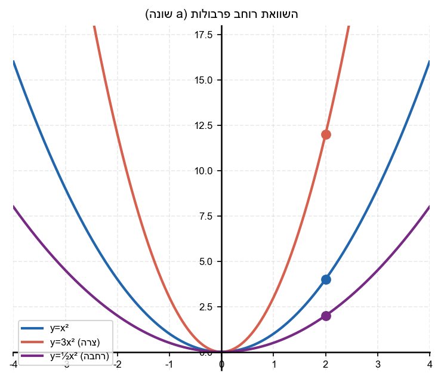

6. עבור הפרבולה
$y = -5x^2$:
א. מהו הסימן של הפרמטר
$a$
?
ב. האם יש לפרבולה ערך מינימום או מקסימום?
ג. מהו ערך המקסימום/מינימום?

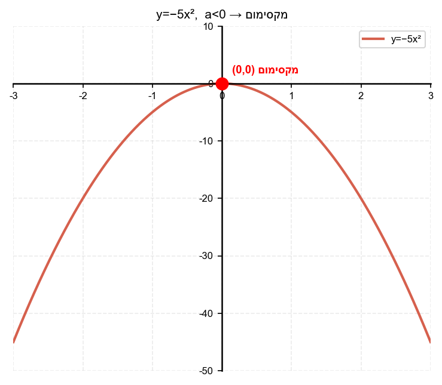

7. תאר במילים את ההבדל בין הפרבולה
$y = x^2$
לבין הפרבולה
$y = -x^2$.

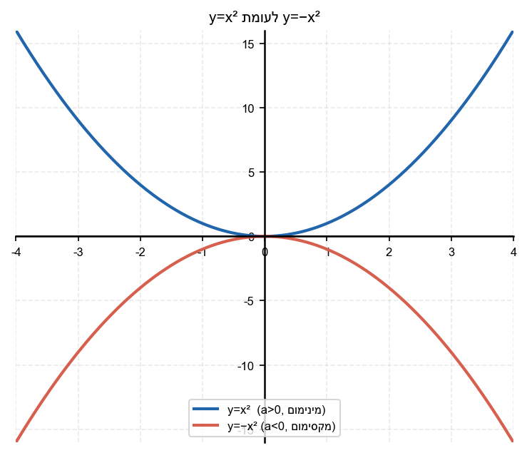

8. ציין את הפרמטר
$a$
בכל פרבולה:
א.
$y = 7x^2 - 3x + 1$
ב.
$y = -\frac{1}{3}x^2 + x$
ג.
$y = x^2$
ד.
$y = -(x^2 + 2x)$

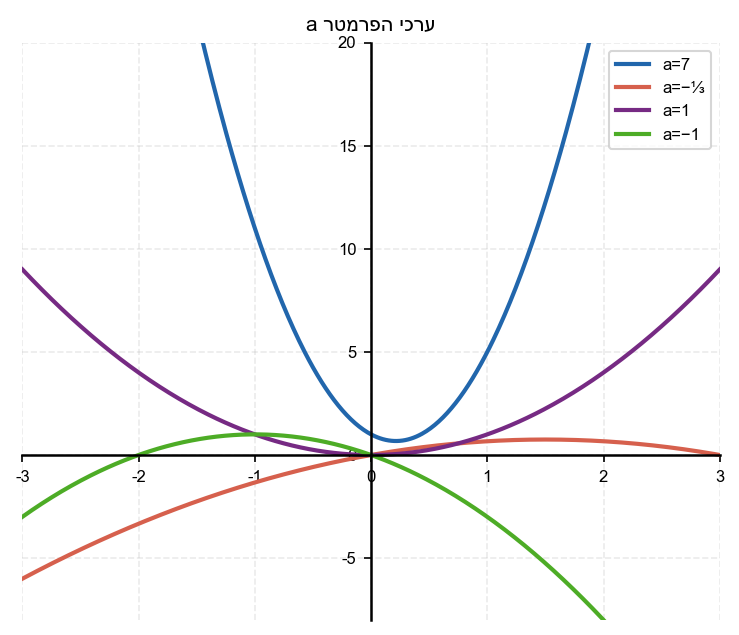

---

## רמה 2: תרגול שוטף ומשולב (8 תרגילים)

9. נתונות הפרבולות:
$y = 2x^2$,
$y = 5x^2$,
$y = \frac{1}{3}x^2$.
א. הצב
$x = 3$
בכל אחת ומצא את ערכי
$y$
.
ב. סדר את הפרבולות מהצרה ביותר לרחבה ביותר.

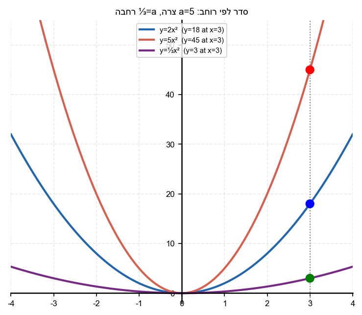

10. נתונות הפרבולות:
$y = -x^2$
ו-
$y = -3x^2$
.
א. מהו ערך
$y$
בכל פרבולה עבור
$x = 2$?
ב. איזו פרבולה "צרה" יותר?
ג. שתיהן פתוחות כלפי מטה – מדוע?

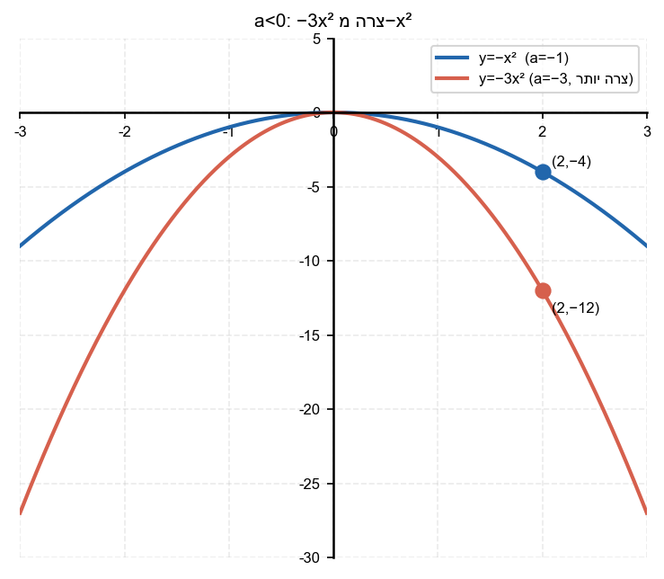

11. פרבולה מסוימת עוברת דרך הנקודה
$(2, 12)$
ויש לה קודקוד בראשית הצירים (כלומר צורתה
$y = ax^2$).
מצא את ערך
$a$
.

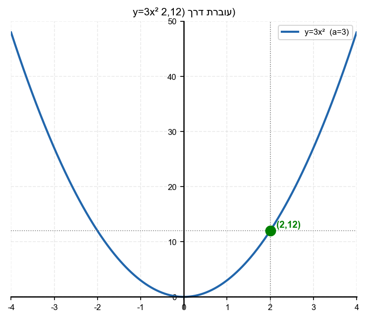

12. פרבולה מסוימת עוברת דרך הנקודה
$(-3, -27)$
ויש לה קודקוד בראשית הצירים.
מצא את ערך
$a$
וכתוב את משוואת הפרבולה.

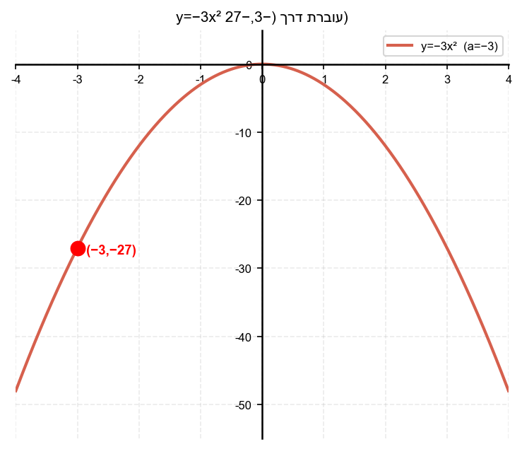

13. נתונות שתי פרבולות:
פרבולה
$A$
עם
$a = 2$
ופרבולה
$B$
עם
$a = -2$.
א. האם הן סימטריות זו לזו ביחס לציר
$x$
? הסבר.
ב. מה שווה סכום הערכים שלהן בכל נקודה
$x$
?

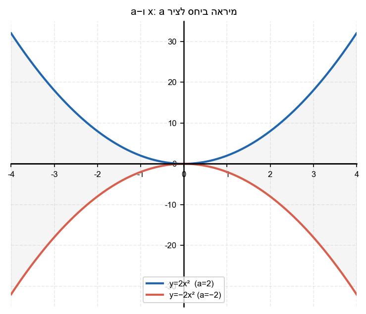

14. נתונה הפרבולה
$y = ax^2 - 3x + 1$
ידוע כי הפרבולה פתוחה כלפי מטה
ו-
$|a| > 1$
ציין שלוש אפשרויות שונות לערך
$a$
.

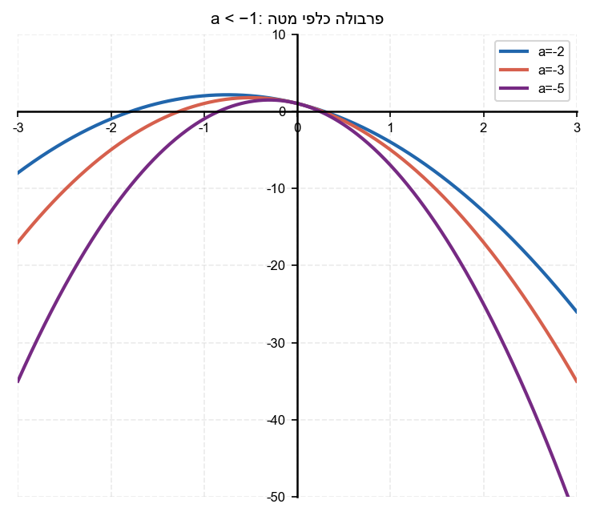

15. כדור מושלך כלפי מעלה ומסלולו מתואר על ידי הפרבולה
$y = -0.5x^2 + 4x$.
מהו הסימן של
$a$
ומה זה אומר על מסלול הכדור?

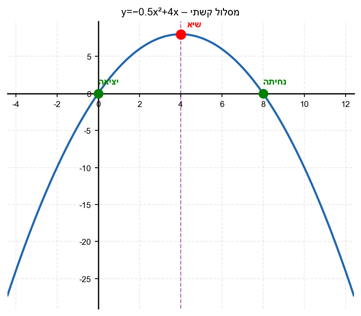

16. נתונות שתי פרבולות:
$y = 4x^2 - 1$
ו-
$y = \frac{1}{4}x^2 - 1$
.
א. מהו הפרמטר
$a$
בכל אחת?
ב. באיזו מהן הפרבולה צרה יותר?
ג. מהי נקודת החיתוך של שתיהן עם ציר
$y$
?

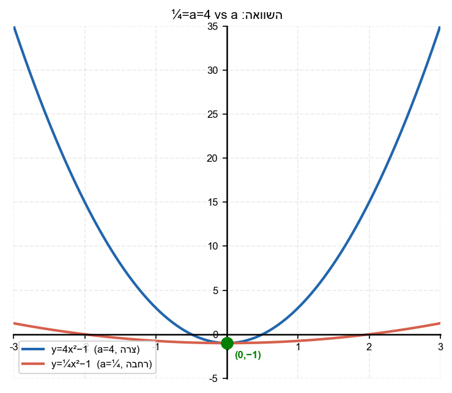

---

## רמה 3: רמת בחינת מה"ט (4 תרגילים)

17. מקור: רמת מה"ט

נתונה הפרבולה
$$y = ax^2$$
שעוברת דרך הנקודה
$(3, -18)$
.

א. מצא את ערך
$a$
.

ב. כתוב את משוואת הפרבולה המלאה.

ג. האם הפרבולה פתוחה כלפי מעלה או מטה? כיצד ניתן לדעת זאת מבלי לצייר?

ד. מצא את ערך
$y$
בנקודה שבה
$x = -5$.

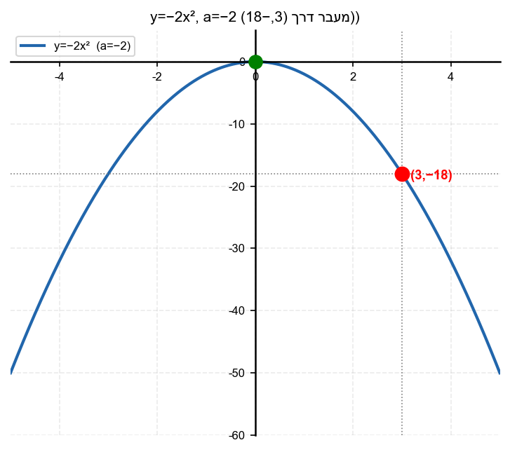

18. מקור: רמת מה"ט

לפניך שתי פרבולות:
$$y = 3x^2 - 5$$
$$y = -3x^2 + 5$$

א. מהו הפרמטר
$a$
בכל אחת מהפרבולות?

ב. בדוק: האם הפרבולות חותכות זו את זו? מצא את נקודות החיתוך (אם יש).

ג. עבור
$x = 1$,
איזו פרבולה נמצאת מעל ואיזו מתחת?

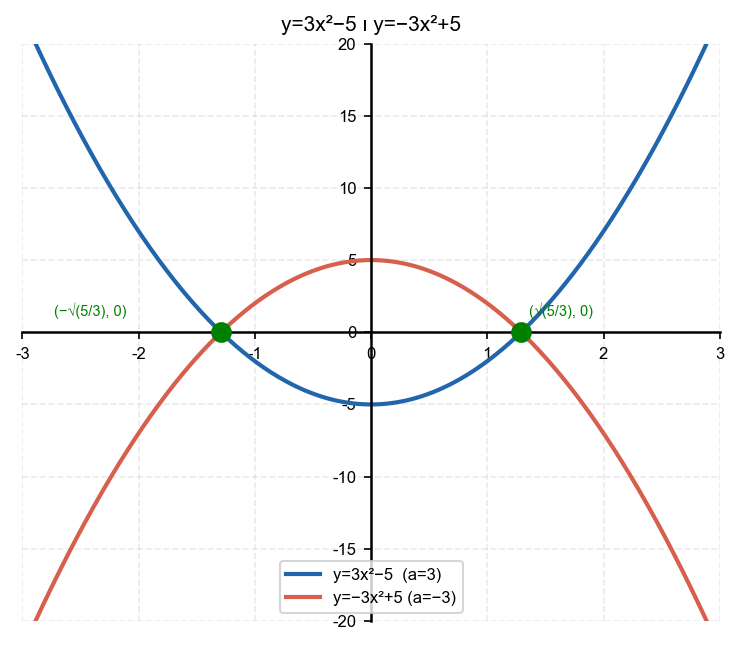

19. מקור: רמת מה"ט

נתון שפרבולה
$$y = ax^2 + 3$$
עוברת דרך הנקודה
$(2, 7)$
.

א. מצא את ערך
$a$
.

ב. מהו קודקוד הפרבולה?

ג. עבור אילו ערכי
$a$
הייתה הפרבולה פתוחה כלפי מטה? (השאלה כללית, לא לפי הנתון)

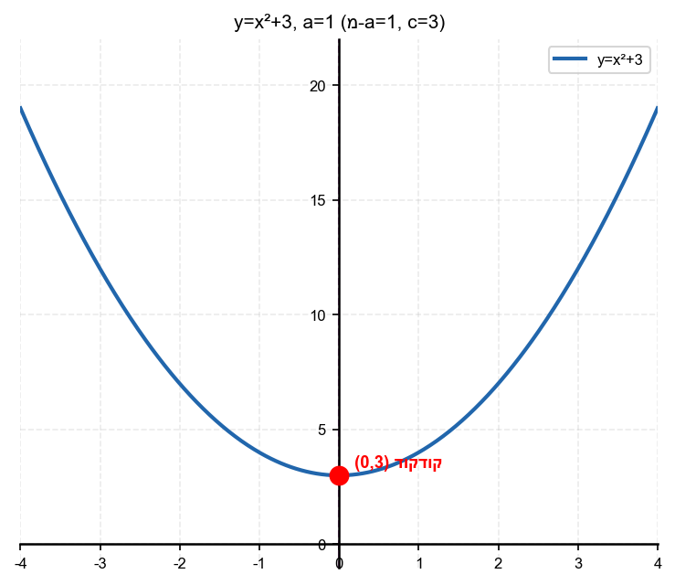

20. מקור: רמת מה"ט

הכדור של כובש נזרק כלפי מעלה. מסלולו מתואר על ידי:
$$y = -2x^2 + 8x$$
כאשר
$x$
הוא הזמן בשניות ו-
$y$
הוא הגובה במטרים.

א. מהו הפרמטר
$a$
? מה הוא מסמל במסלול הכדור?

ב. מצא את הגובה המקסימלי (השתמש בנוסחה
$x_{\text{vertex}} = -\frac{b}{2a}$
ואחר כך הצב).

ג. לאחר כמה שניות יחזור הכדור לגובה
$0$
?

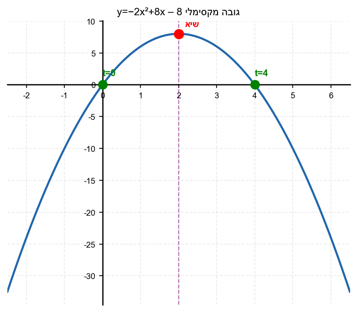

---

תשובות סופיות

1.
א.
כלפי מעלה (צוחקת,
$a=3>0$
);
ב.
כלפי מטה (בוכה,
$a=-2<0$
);
ג.
כלפי מעלה (
$a=1>0$
);
ד.
כלפי מטה (
$a=-1<0$
)

2.
עבור
$a=4$
:
$y=16$
;
עבור
$a=-4$
:
$y=-16$

3.
לדוגמה: ל־
$x$
ב־
$-2,-1,0,1,2$
מקבלים
$y$
:
$8,2,0,2,8$
ארגנו בטבלה.

4.
לפרבולה
$y=-2x^2$
: ל־
$-2$
מקבלים
$y=-8$
, ל־
$-1$
מקבלים
$-2$
, ל־
$0$
מקבלים
$0$
, ובאותו אופן ל־
$2$
מקבלים
$-8$
ארגון בטבלה.

5.
צרה ביותר:
$y=3x^2$
;
רחבה ביותר:
$y=\frac{1}{2}x^2$
;
אמצעית:
$y=x^2$

6.
א.
שלילי (
$a=-5$
);
ב.
ערך מקסימום;
ג.
המקסימום הוא
$y=0$
(בקודקוד הנמצא בראשית)

7.
$y=x^2$
פתוחה כלפי מעלה עם מינימום בקודקוד
$(0,0)$
;
$y=-x^2$
פתוחה כלפי מטה עם מקסימום בקודקוד
$(0,0)$
;
שתיהן סימטריות זו לזו ביחס לציר
$x$

8.
א.
$a=7$;
ב.
$a=-\frac{1}{3}$;
ג.
$a=1$;
ד.
$a=-1$
(כי
$y = -x^2 - 2x$)

9.
א.
$y=2x^2$:
$18$
;
$y=5x^2$:
$45$
;
$y=\frac{1}{3}x^2$:
$3$
ב.
$5x^2$,
$2x^2$,
$\frac{1}{3}x^2$

10.
א.
$y=-x^2$:
$-4$
;
$y=-3x^2$:
$-12$
ב.
$y=-3x^2$
צרה יותר (ערך מוחלט גדול יותר);
ג.
כי
$a<0$
בשתיהן

11.
$y=ax^2$
עובר דרך
$(2,12)$
כלומר
$12=a\cdot 4$
לכן
$a=3$
והמשוואה המבוקשת היא
$y=3x^2$

12.
$y=ax^2$
עובר דרך
$(-3,-27)$
לכן
$-27=9a$
ומכאן
$a=-3$
והמשוואה המבוקשת היא
$y=-3x^2$

13.
א.
כן: מתקיים
$a_B=-a_A$
כלומר הפרבולות מתקבלות זו מהזו בהשקפה ביחס לציר
$x$
;
ב.
בכל
$x$
מתקיים
$2x^2+(-2x^2)=0$

14.
למשל
$a$
יכול להיות
$-2$,
$-\frac{5}{2}$,
$-3$
כל עוד מתקיים
$a<-1$
(כי פרבולה פתוחה כלפי מטה)

15.
המקדם
$a=-0{,}5$
הוא שלילי, והפרבולה פתוחה כלפי מטה — כמו מסלול כדור הנזרק כלפי מעלה ואז מתחיל ליפול.

16.
א.
$a=4$
;
$a=\frac{1}{4}$
;
ב.
$y=4x^2$
צרה יותר;
ג.
שתיהן חותכות את ציר
$y$
בנקודה
$(0,-1)$

17.
א.
$a=-2$
;
ב.
$y=-2x^2$
;
ג.
כלפי מטה כי
$a=-2<0$
;
ד.
$-50$

18.
א.
$a=3$
;
$a=-3$
;
ב.
$x=\pm\sqrt{\frac{5}{3}}$
;
נקודות חיתוך:
$\left(\sqrt{\frac{5}{3}}, 0\right)$
ו-
$\left(-\sqrt{\frac{5}{3}}, 0\right)$
;
ג.
בעבור
$x=1$
:
$y=-3x^2+5=2$
(מעל);
$y=3x^2-5=-2$
(מתחת)

19.
א.
$a=1$
;
ב.
קודקוד:
$(0,3)$
(כי
$x_v=0$
ו-
$y_v=3$
);
ג.
כאשר
$a<0$

20.
א.
$a=-2$
— הפרמטר השלילי מסמל שהכדור עולה ואחר כך יורד (מסלול קשתי);
ב.
$8$
מטרים;
ג.
$4$
שניות; הכדור חוזר לגובה
$0$
לאחר
$4$
שניות

