# יחידה 2.2 – נקודות החיתוך עם ציר ה-
$x$
(שורשים) ונוסחת השורשים

---

## רמה 1: בניית ביטחון (8 תרגילים)

1. מצא את שורשי הפרבולה
$y = x^2 - 5x + 6$
על ידי פירוק לגורמים.

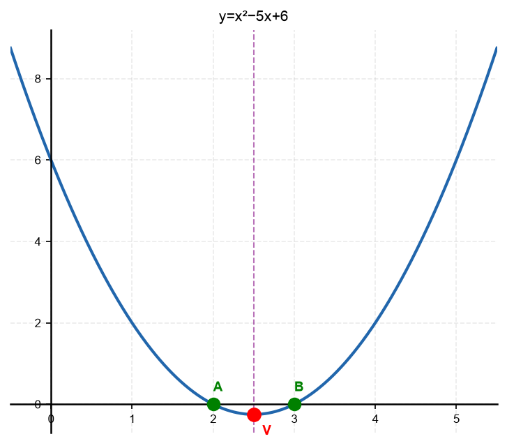

2. מצא את שורשי הפרבולה
$y = x^2 + x - 12$
על ידי פירוק לגורמים.

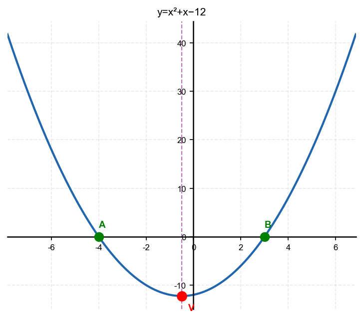

3. מצא את שורשי הפרבולה
$y = x^2 - 9$
(הפרש ריבועים).

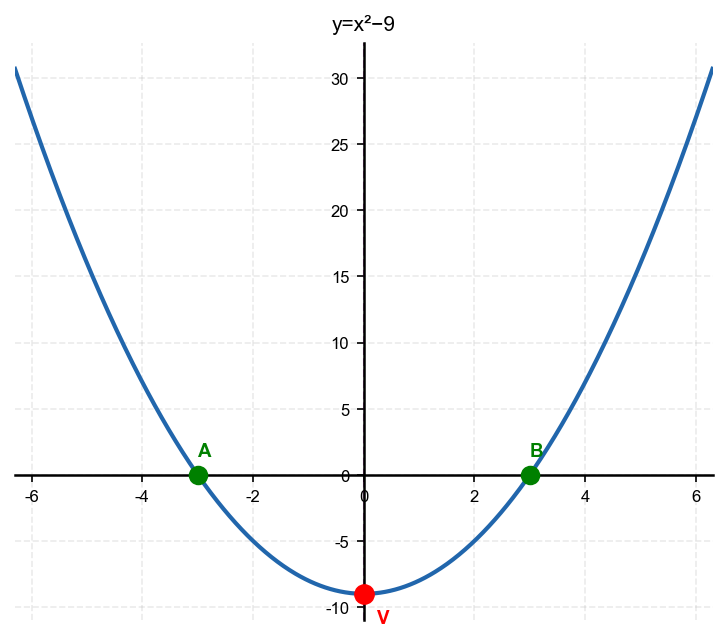

4. השתמש בנוסחת השורשים
$$x = \frac{-b \pm \sqrt{b^2 - 4ac}}{2a}$$
כדי למצא את שורשי הפרבולה
$y = x^2 - 7x + 10$.

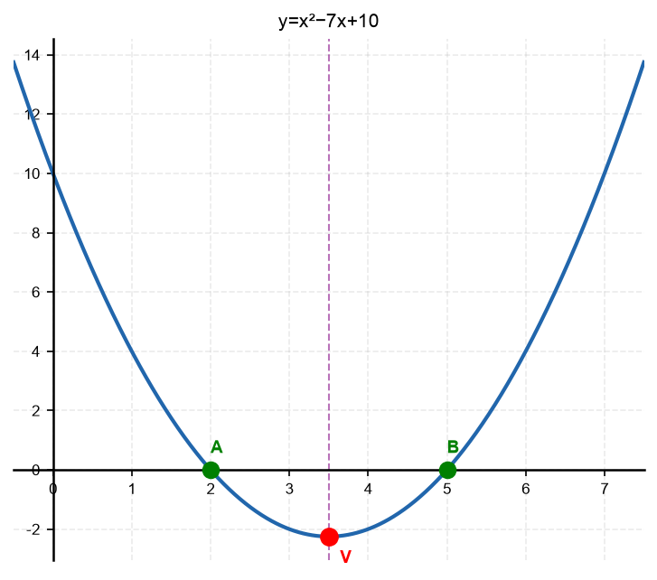

5. השתמש בנוסחת השורשים כדי למצא את שורשי הפרבולה
$y = 2x^2 - 5x + 2$.

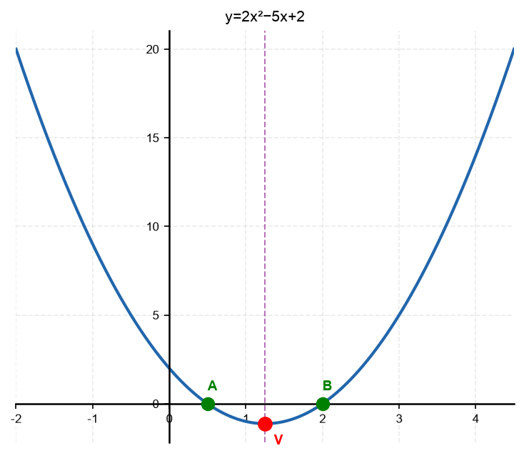

6. מצא את שורשי הפרבולה
$y = x^2 - 6x + 9$.
כמה שורשים יש? (שים לב שזו ריבוע מושלם)

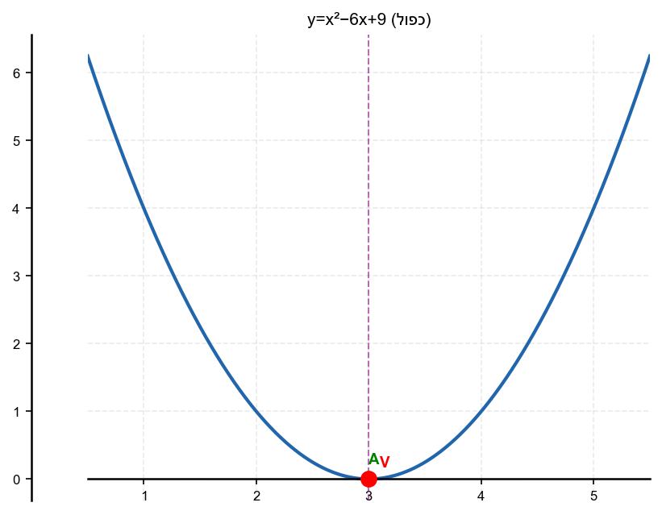

7. ציין את הנקודות שבהן הפרבולות הבאות חותכות את ציר
$x$
(אין צורך לחשב – הצב
$y = 0$
ופרק לגורמים):
א.
$y = x^2 - 4x$
ב.
$y = x(x + 5)$

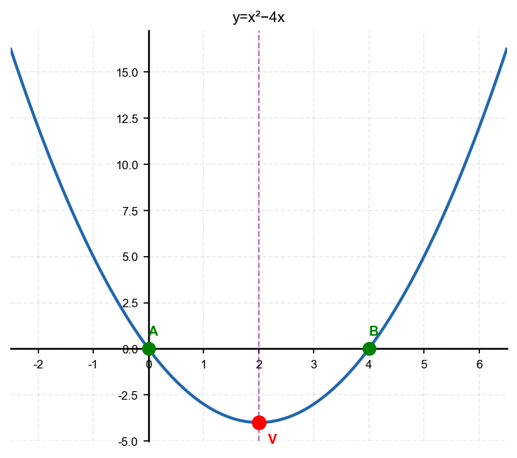

8. נתונה הפרבולה
$y = x^2 + 2x - 8$.
א. מצא את שורשי הפרבולה.
ב. ציין את נקודות החיתוך של הפרבולה עם ציר
$x$
.

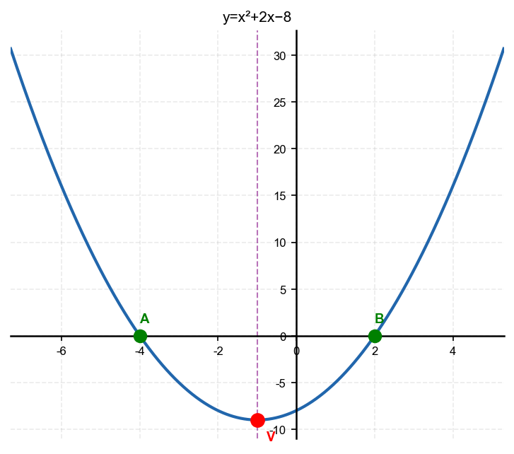

---

## רמה 2: תרגול שוטף ומשולב (8 תרגילים)

9. מצא את שורשי הפרבולה
$y = x^2 + x - 12$
ורשום את נקודות החיתוך עם ציר
$x$
ועם ציר
$y$
.

10. מצא את שורשי הפרבולה
$y = -x^2 + 8x - 11$
בעזרת נוסחת השורשים.
(פרמטרים:
$a = -1$
,
$b = 8$
,
$c = -11$
)

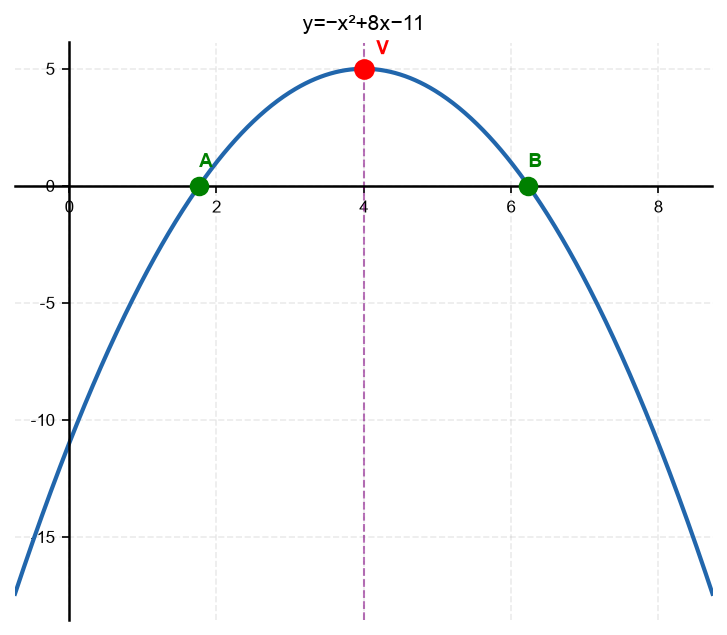

11. נתונה הפרבולה
$y = x^2 - 2x - 4$.
א. חשב את הדיסקרימיננטה
$\Delta = b^2 - 4ac$.
ב. מצא את שורשי הפרבולה.

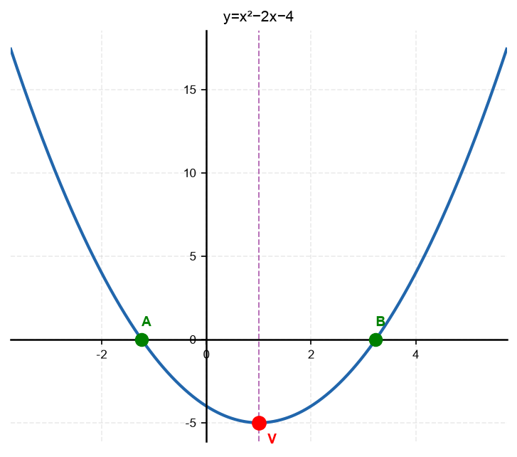

12. נתונה הפרבולה
$y = 5x - 12.5 - \frac{x^2}{2}$.
כתוב בצורה הסטנדרטית
$ax^2 + bx + c$
ומצא את השורשים.

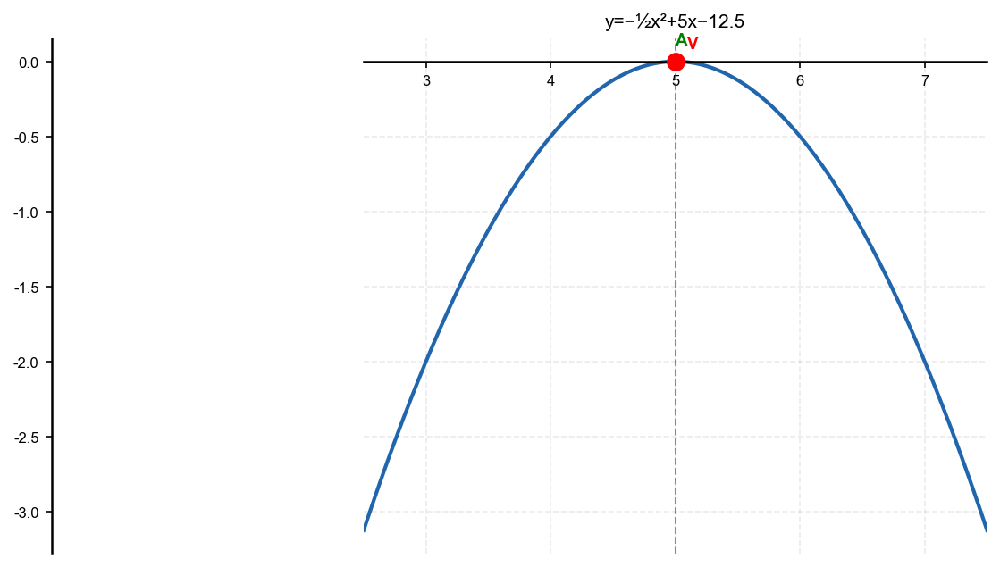

13. נתונה הפרבולה
$y = x^2 - 2x - 35$.
א. מצא את שורשי הפרבולה.
ב. מה המרחק בין שתי נקודות החיתוך עם ציר
$x$
?

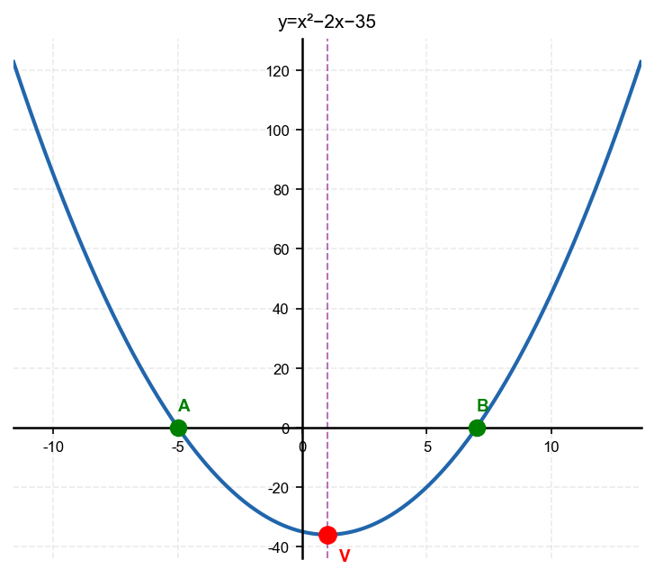

14. מצא את שורשי הפרבולה
$y = x^2 - 5x - 1$.
(השתמש בנוסחת השורשים, השאר בצורה מדויקת עם שורשים)

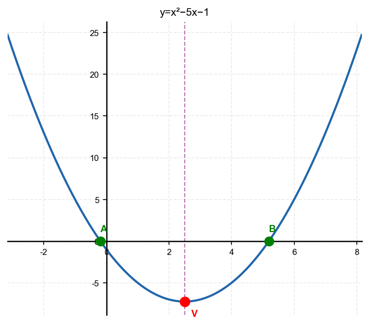

15. נתונה הפרבולה
$y = -x^2 + 4x$.
א. מצא את שורשי הפרבולה.
ב. ציין את נקודות החיתוך עם שני הצירים.
ג. מהו הקודקוד? (רמז:
$x_v = -\frac{b}{2a}$
)

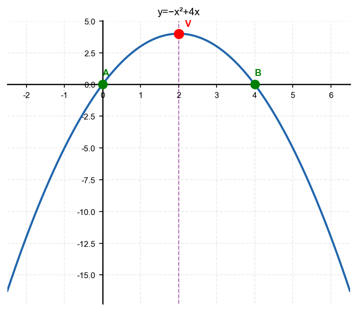

16. בעיה מחיי יומיום: כדור מושלך ומסלולו
$h = -t^2 + 6t$
(ב-
$h$
מטרים ו-
$t$
שניות).
א. מתי הכדור על הקרקע (גובה
$0$
)?
ב. מה הסימן של
$a$
ומה המשמעות?

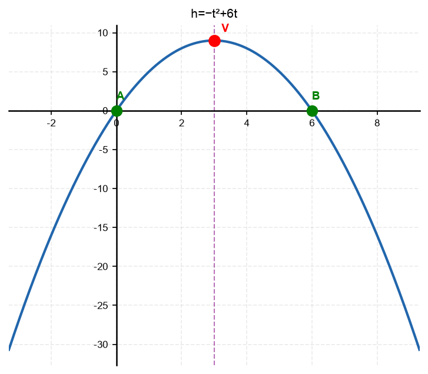

---

## רמה 3: רמת בחינת מה"ט (4 תרגילים)

17. מקור: מה"ט 2023

נתונה הפרבולה
$$y = x^2 - 2x - 4$$
ונתון הישר
$$y = x + 6$$

א. מצא את נקודות החיתוך של הפרבולה עם הישר (נקודות
$A$
ו-
$B$
).

ב. מצא את נקודת החיתוך של הפרבולה עם ציר
$x$
.

ג. מצא את נקודת החיתוך של הישר עם ציר
$x$
.

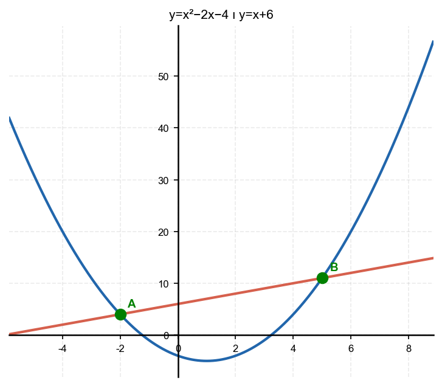

18. מקור: מה"ט 2024

נתונה הפרבולה
$$y = x^2 + x - 12$$

א. מצא את נקודות החיתוך עם ציר
$x$
.

ב. מצא את נקודות החיתוך עם ציר
$y$
.

ג. בממה עוסק תחום הפרבולה הנמצא מתחת לציר
$x$
?

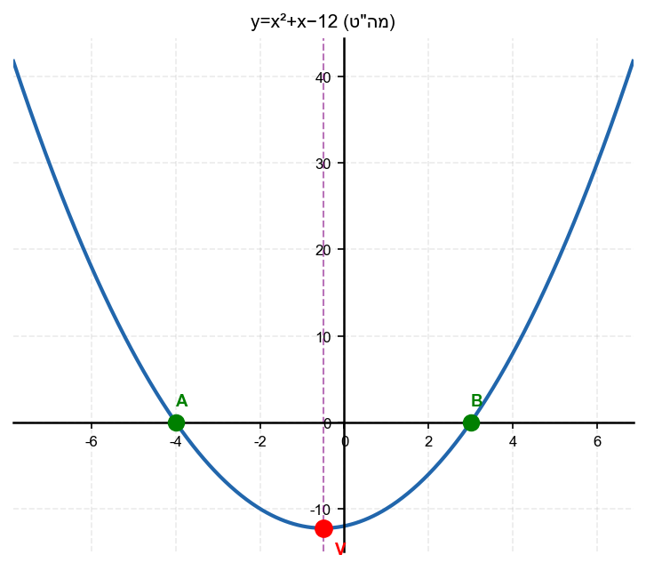

19. מקור: מה"ט 2024

נתונה הפרבולה
$$y = x^2 - 5x - 1$$
ונתון הישר
$$y = -3x + 7$$

שתי נקודות החיתוך הן
$A$
ו-
$B$
, והקודקוד הוא
$C$
.

א. מצא את נקודות
$A$
,
$B$
,
$C$
.

ב. מצא את נקודות החיתוך של הפרבולה עם ציר
$x$
.

ג. מצא את אורך מקטע
$AB$
.

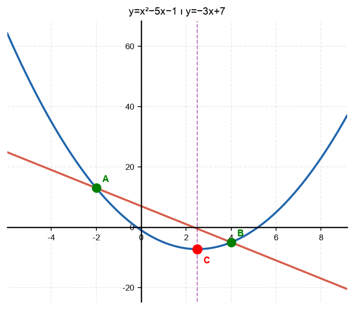

20. מקור: מה"ט 2025

נתונה הפרבולה
$$y = -x^2 + 8x - 9$$
ונתון הישר
$$y = x + 1$$

א. מצא את נקודות החיתוך
$A$
ו-
$B$
בין הפרבולה לישר.

ב. מצא את נקודות החיתוך של הפרבולה עם ציר
$x$
.

ג. מצא את הקודקוד
$C$
של הפרבולה.

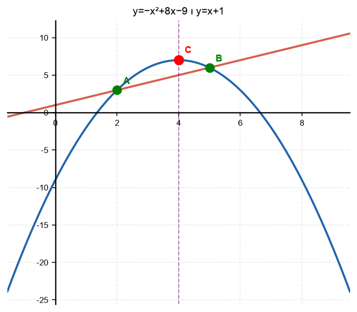

---

תשובות סופיות

1. $(x-2)(x-3) = 0$; שורשים:$x = 2$ו-$x = 3$; נקודות חיתוך:$(2,0)$ו-$(3,0)$
2. $(x+4)(x-3) = 0$; שורשים:$x = -4$ו-$x = 3$; נקודות חיתוך:$(-4,0)$ו-$(3,0)$
3. $(x-3)(x+3) = 0$; שורשים:$x = 3$ו-$x = -3$
4. $9$;$x = \frac{7 \pm 3}{2}$; שורשים:$x = 5$ו-$x = 2$
5. $9$;$x = \frac{5 \pm 3}{4}$; שורשים:$x = 2$ו-$x = \frac{1}{2}$
6. $0$; שורש יחיד:$x = 3$; נקודת חיתוך אחת:$(3,0)$
7. א. $4$; ב.$-5$
8. א. $2$; ב.$נקודות חיתוך עם ציר$x$:$(-4,0)$ו-$(2,0)$
9.

$x=4-\sqrt{5}\approx 1{,}76$

10.

$\Delta=20$

$x=\frac{-8\pm\sqrt{20}}{-2}=4\pm\sqrt{5}$

חיתוך ציר

$x$

:

$\left(4-\sqrt{5},0\right),\ \left(4+\sqrt{5},0\right)$

11.

א.

$\Delta=20$

ב.

$x=1\pm\sqrt{5}$

12.

$y=-\frac{x^2}{2}+5x-\frac{25}{2}$

,

שורש כפול

$x=5$

,

נקודת חיתוך

$(5,0)$

13.

א.

$x=-5$

,

$x=7$

ב.

מרחק

$12$

14.

$x=\frac{5\pm\sqrt{29}}{2}$

15. א. 4$; ב. $חיתוך ציר$x$:$(0,0)$ו-$(4,0)$; חיתוך ציר$y$:$(0,0)$; ג.$4$; קודקוד:$(2,4)$
16. א. 6$ שניות; ב. $a=-1<0$– הכדור עולה ואחר כך יורד
17. $(1+\sqrt{5},0)$ו-$(1-\sqrt{5},0)$; ג.$x=-6$; נקודת חיתוך:$(-6,0)$
18. א. $(-4,0)$ו-$(3,0)$; ב. $(0,-12)$; ג. 3$שבו הפרבולה מתחת לציר$x$ (שליליות)
19. א. -5$;$C(1,-5)$; ב. $\frac{5\pm\sqrt{29}}{2}$; ג.$6\sqrt{10}$
20. א. (x-2)(x-5)=0$;$A(2,3)$,$B(5,6)$; ב. $4\mp\sqrt{7}$; ג.$7$;$C(4,7)$

