# יחידה 2.3 – כמות הפתרונות של פרבולה וחישוב המרחק בין שתי נקודות החיתוך

---

## רמה 1: בניית ביטחון (8 תרגילים)

1. חשב את הדיסקרימיננטה
$\Delta = b^2 - 4ac$
וציין כמה נקודות חיתוך יש לפרבולה עם ציר
$x$
:
$y = x^2 - 4x + 3$

2. חשב את
$\Delta$
וציין כמה נקודות חיתוך יש עם ציר
$x$
:
$y = x^2 - 4x + 4$

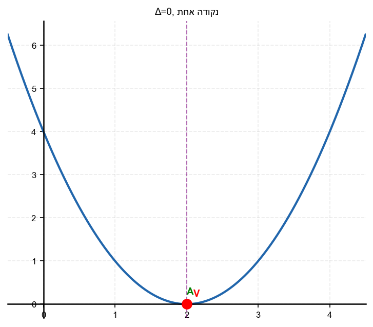

3. חשב את
$\Delta$
וציין כמה נקודות חיתוך יש עם ציר
$x$
:
$y = x^2 - 4x + 5$

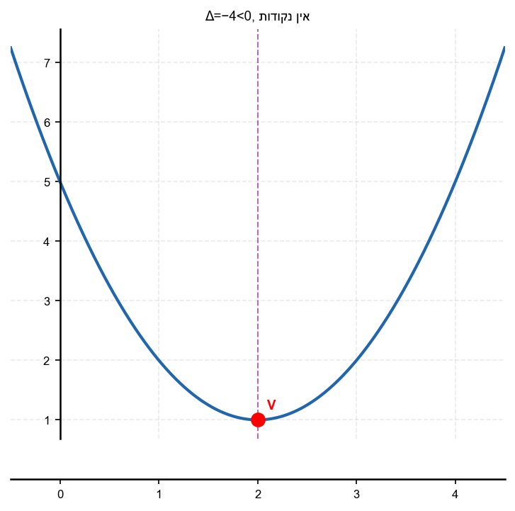

4. מלא את הטבלה:

| $\Delta$ | כמות נקודות חיתוך עם ציר $x$ |
|----------|-------------------------------|
| $\Delta > 0$ | ? |
| $\Delta = 0$ | ? |
| $\Delta < 0$ | ? |

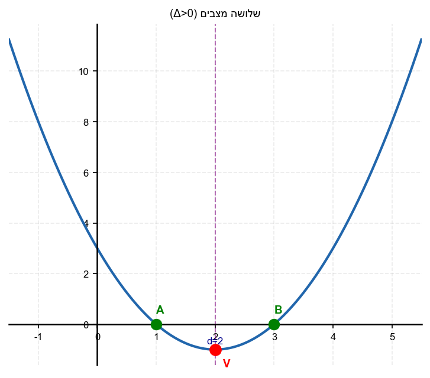

5. נתונה הפרבולה
$y = x^2 + 6x + 9$.
א. חשב את
$\Delta$
.
ב. כמה נקודות חיתוך עם ציר
$x$
יש לה?
ג. מהן הנקודות?

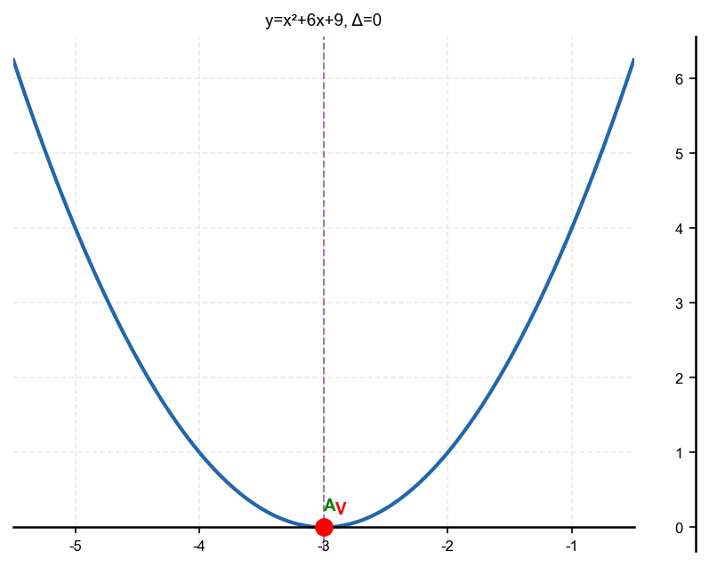

6. נתונה הפרבולה
$y = x^2 + x + 5$.
א. חשב את
$\Delta$
.
ב. האם הפרבולה חותכת את ציר
$x$
?

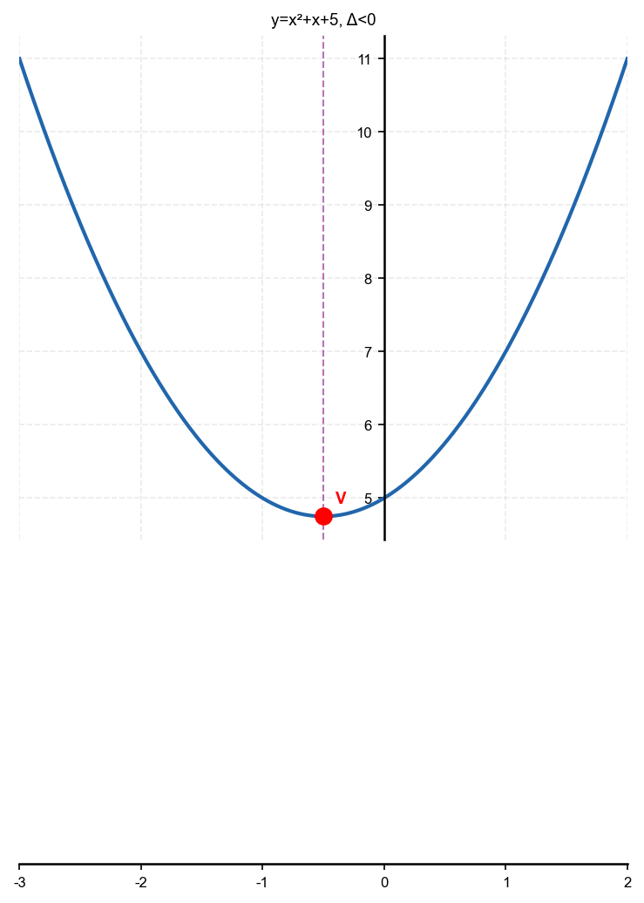

7. שתי פרבולות חותכות את ציר
$x$
בנקודות
$(-3, 0)$
ו-
$(5, 0)$
.
מהו המרחק בין נקודות החיתוך?

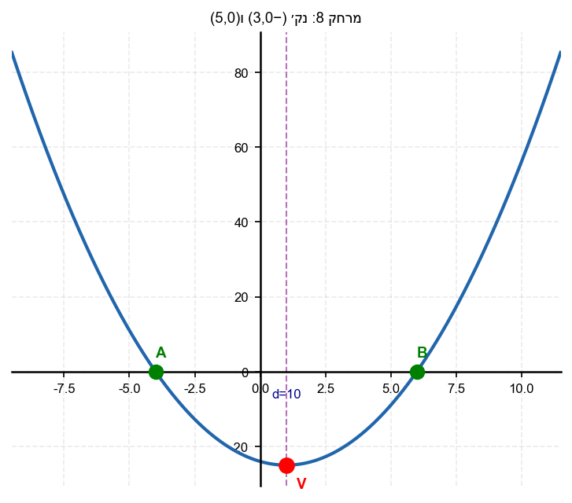

8. שתי נקודות חיתוך של פרבולה עם ציר
$x$
הן
$(x_1, 0)$
ו-
$(x_2, 0)$
.
אם
$x_1 = -2$
ו-
$x_2 = 8$
,
מהו המרחק ביניהן?

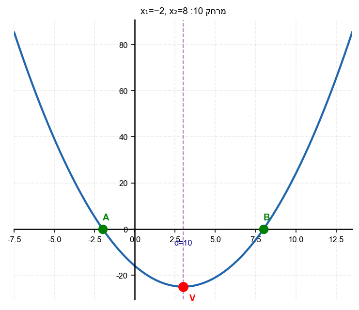

---

## רמה 2: תרגול שוטף ומשולב (8 תרגילים)

9. נתונה הפרבולה
$y = x^2 - 2x - 8$.
א. מצא את שורשי הפרבולה.
ב. מהו המרחק בין שתי נקודות החיתוך עם ציר
$x$
?

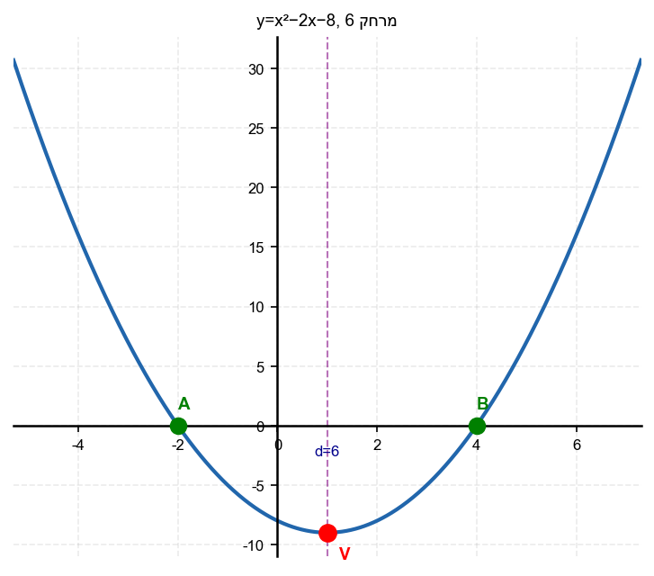

10. נתונה הפרבולה
$y = -x^2 + 6x - 4$.
א. חשב את
$\Delta$
.
ב. מצא את השורשים.
ג. מהו המרחק בין נקודות החיתוך?

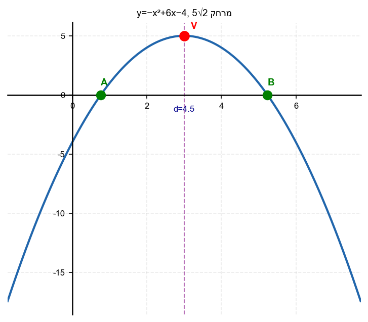

11. עבור אילו ערכי הפרמטר
$k$
תהיה לפרבולה
$y = x^2 + 4x + k$
שתי נקודות חיתוך עם ציר
$x$
?

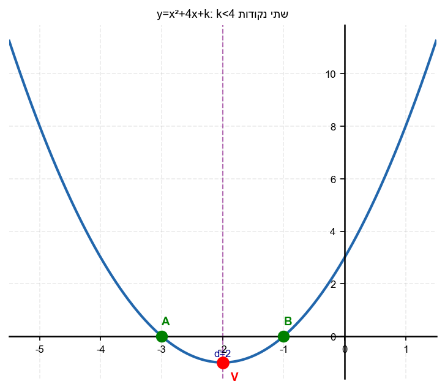

12. עבור אילו ערכי
$k$
תהיה לפרבולה
$y = x^2 - 6x + k$
נקודת חיתוך אחת בלבד עם ציר
$x$
?

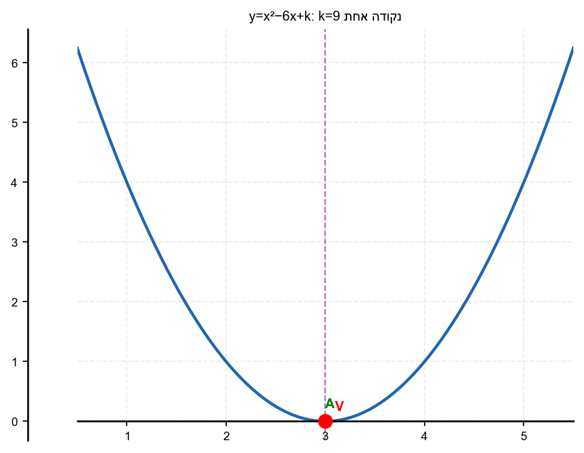

13. נתונה הפרבולה
$y = x^2 - 2x - 35$.
א. מצא את שורשי הפרבולה.
ב. מצא את המרחק בין שתי נקודות החיתוך.

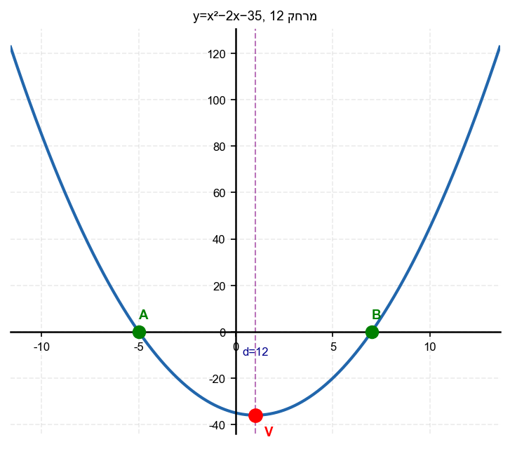

14. נתונה הפרבולה
$y = -x^2 + 11x - 24$.
א. חשב את
$\Delta$
וקבע כמה שורשים יש.
ב. מצא את השורשים.
ג. מהו המרחק בין שתי נקודות החיתוך עם ציר
$x$
?

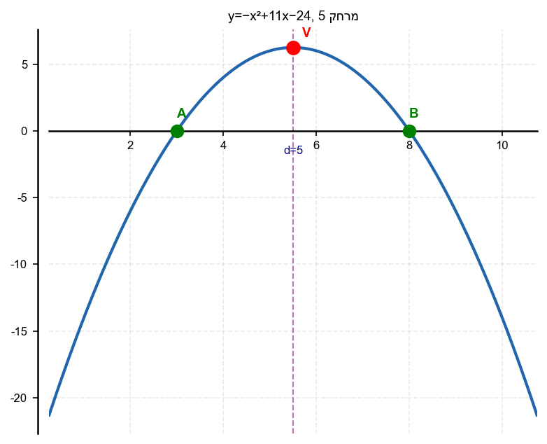

15. נתונה הפרבולה
$y = 2x^2 - 8x + 6$.
א. מצא את השורשים.
ב. מצא את נקודת החיתוך עם ציר
$y$
.
ג. מהו המרחק בין שתי נקודות החיתוך עם ציר
$x$
?

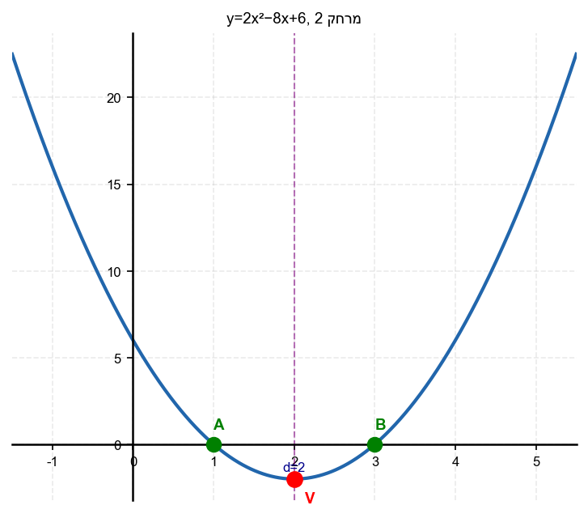

16. נתונות שתי פרבולות:
$y = x^2 - 6x + 5$
ו-
$y = -x^2 + 4x - 3$
.
א. מצא את שורשי כל פרבולה.
ב. מהו המרחק בין נקודות החיתוך של הפרבולה הראשונה עם ציר
$x$
?
ג. מהו המרחק בין נקודות החיתוך של הפרבולה השנייה עם ציר
$x$
?

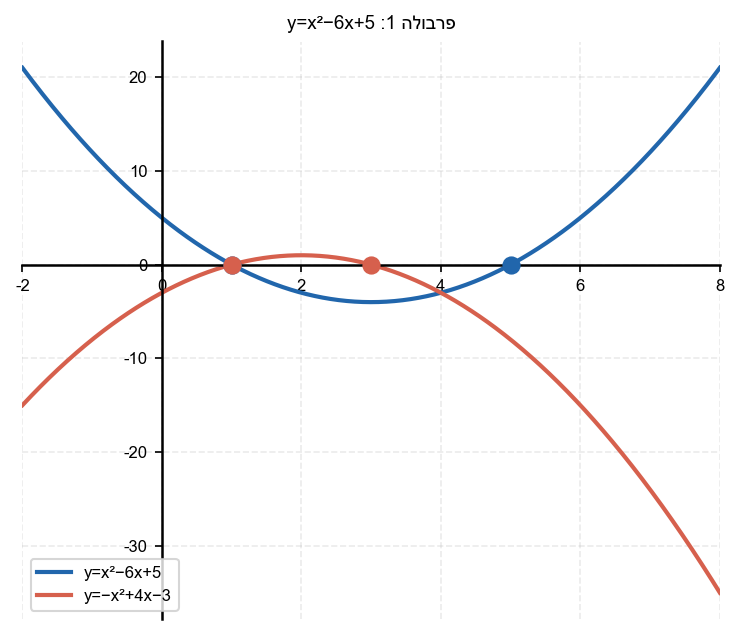

---

## רמה 3: רמת בחינת מה"ט (4 תרגילים)

17. מקור: מה"ט 2023

נתונה הפרבולה
$$y = x^2 - 2x - 4$$
ונתון הישר
$$y = x + 6$$

שתי נקודות החיתוך הן
$A$
ו-
$B$
, וקודקוד הפרבולה הוא
$C$
.

א. מצא את
$A$
,
$B$
,
$C$
.

ב. מצא את המרחק
$AB$
.

ג. נקודה
$D$
היא ההיטל של
$A$
על ציר
$x$
, ונקודה
$E$
היא נקודת האמצע של
$AB$
על ציר
$x$
.
מצא את שטח המשולש
$ADE$
.

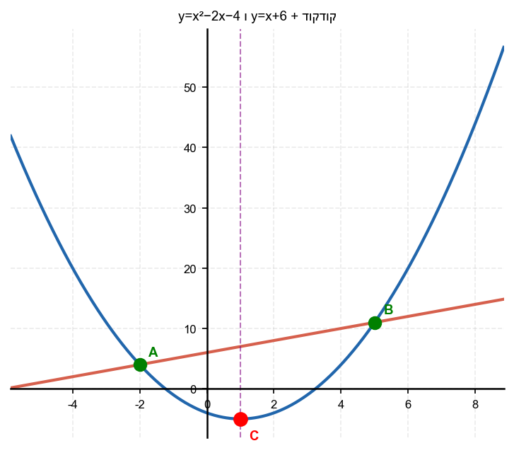

18. מקור: מה"ט 2024

נתונה הפרבולה
$$y = x^2 - 5x - 1$$
ונתון הישר
$$y = -3x + 7$$

שתי נקודות החיתוך הן
$A$
ו-
$B$
, וקודקוד הפרבולה הוא
$C$
.

א. מצא את
$A$
,
$B$
,
$C$
.

ב. נקודה
$D$
היא ההיטל האנכי של
$A$
על ציר
$x$
.
מצא את שטח המשולש
$ADE$
כאשר
$E$
היא נקודת האמצע של
$AB$
על ציר
$x$
.

ג. מהו המרחק בין שתי נקודות החיתוך של הפרבולה עם ציר
$x$
?

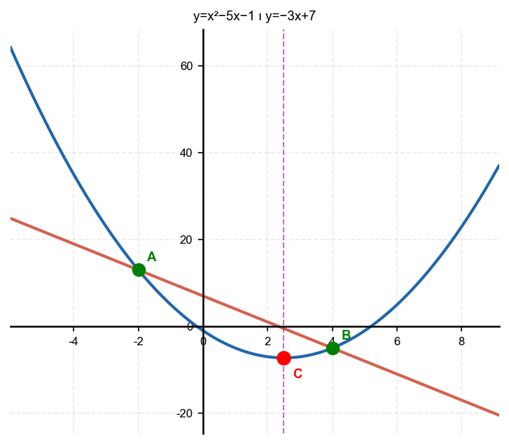

19. מקור: מה"ט 2023

נתונה הפרבולה
$$y = -x^2 + 8x - 11$$
ונתונה הפרבולה
$$y = (x-5)^2$$

א. מצא את נקודות החיתוך
$A$
ו-
$B$
של שתי הפרבולות.

ב. מהו המרחק בין שתי נקודות החיתוך?

ג. מהן נקודות החיתוך של הפרבולה הראשונה עם ציר
$x$
? ומהן של הפרבולה השנייה?

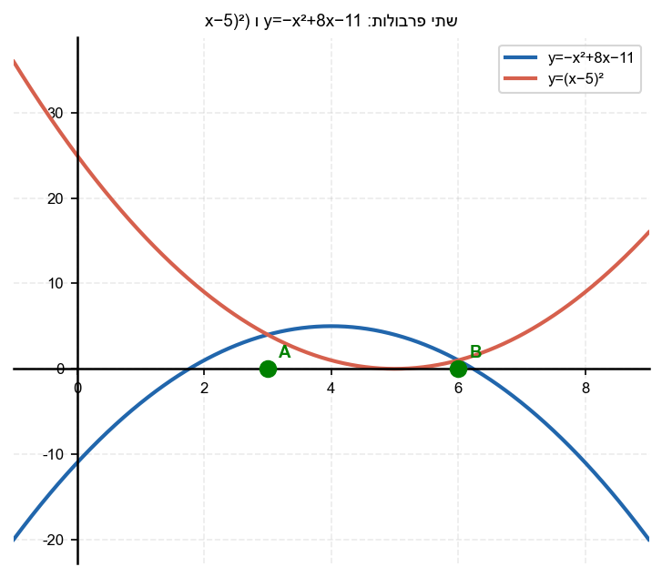

20. מקור: מה"ט 2025

נתונות שתי פרבולות:
$$y = x^2 - 6x + 13$$
$$y = -x^2 + 8x - 7$$

א. מצא את נקודות החיתוך של כל פרבולה עם ציר
$x$
.
(פרבולה 1 – חשב
$\Delta$
תחילה; פרבולה 2 – פרק לגורמים)

ב. מצא את נקודות החיתוך של שתי הפרבולות זו עם זו.

ג. מהו המרחק בין נקודות החיתוך שמצאת בסעיף ב?

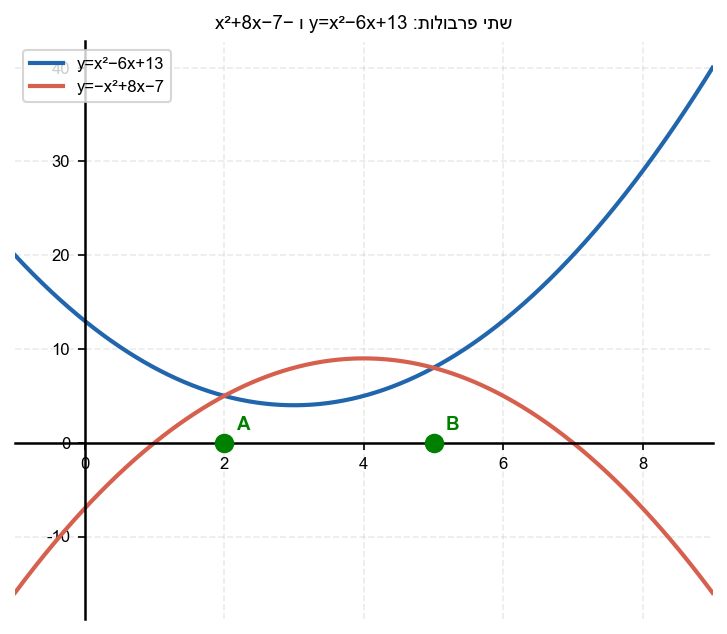

---

תשובות סופיות

1. 4 > 0$; שתי נקודות חיתוך
2. $0$; נקודת חיתוך אחת (פרבולה נוגעת בציר$x$)
3. $-4 < 0$; אין נקודות חיתוך עם ציר$x$
4. $\Delta > 0$: שתי נקודות חיתוך;$0$: נקודת חיתוך אחת;$\Delta < 0$: אין נקודות חיתוך
5. א. 0$; ב. $נקודת חיתוך אחת; ג.$x = -3$; נקודה:$(-3, 0)$
6. א. $-19 < 0$; ב.$לא, הפרבולה לא חותכת את ציר$x$
7. 8$ יחידות
8. 10$ יחידות
9. א. -2$ ; ב. 6$ יחידות
10. א. 20 > 0$ ; ב. 3-\sqrt{5} \approx 0.76$ ; ג. מרחק$2\sqrt{5}$יחידות
11. $k < 4$
12. $9$
13. א. -5$ ; ב. 12$ יחידות
14. א. 25 > 0$ ; שני שורשים; ב. 8$ ; ג. 5$ יחידות
15. א. 1$ ; ב. $(0, 6)$; ג. 2$ יחידות
16. א. 1$ ; ב. 4$ יחידות; ג. 2$ יחידות
17. א. -5$;$C(1,-5)$; ב. $7\sqrt{2}$; ג.$7$
18. א. -5$;$C(1,-5)$ ; ב. 19.5$ ; ג. \sqrt{29}$ יחידות
19. א. 4$✓;$B(6,1)$ ; ב. 3$ יחידות; ג. 5$ (נגיעה אחת)
20. א. (x-7)(x-1)=0$; נקודות$(1,0)$ו-$(7,0)$; ב. $(x-2)(x-5)=0$;$A(2,5)$ו-$B(5,8)$; ג.$3\sqrt{2}$

