# יחידה 3.1 – מציאת שיעור ה-
$x$
של הקודקוד וציר הסימטריה

---

## רמה 1: בניית ביטחון (8 תרגילים)

1. מצא את שיעור
$x$
של קודקוד הפרבולה
$y = x^2 - 4x + 1$
בעזרת הנוסחה
$x_v = -\frac{b}{2a}$.

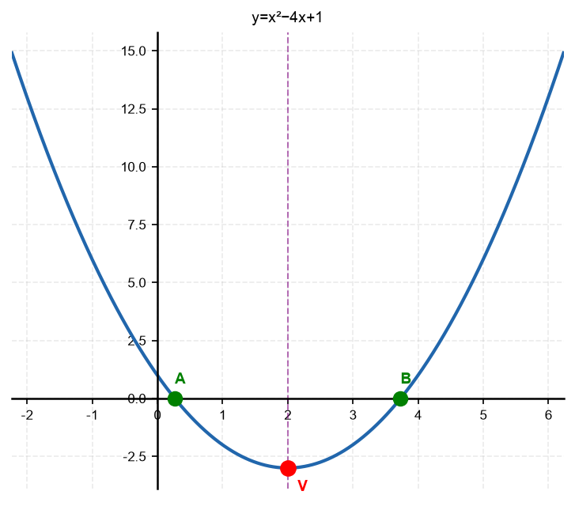

2. מצא את שיעור
$x$
של קודקוד הפרבולה
$y = x^2 + 6x + 5$.

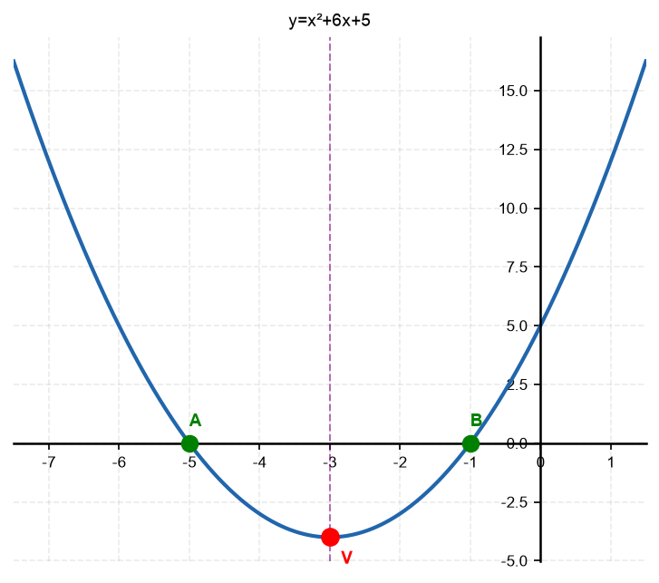

3. מצא את שיעור
$x$
של קודקוד הפרבולה
$y = -x^2 + 8x - 3$.

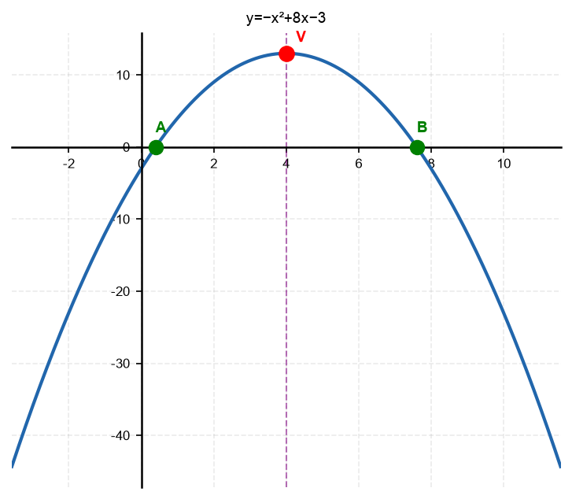

4. מצא את ציר הסימטריה של הפרבולות הבאות:
א.
$y = 2x^2 - 12x + 7$
ב.
$y = -3x^2 + 6x + 1$
ג.
$y = x^2 + 5$

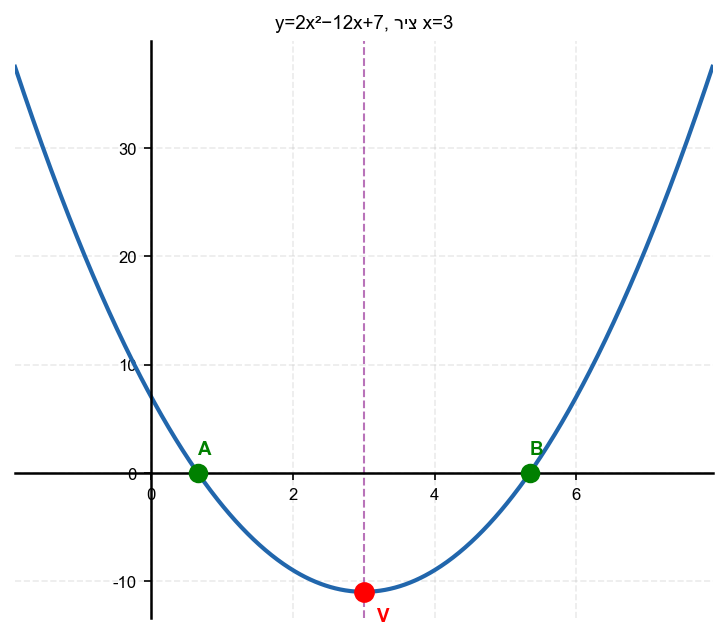

5. נתונה הפרבולה
$y = x^2 + x - 12$.
א. מצא את שיעור
$x$
של הקודקוד.
ב. כתוב את משוואת ציר הסימטריה.

6. נתונה הפרבולה
$y = -x^2 + 2x + 8$.
מצא את שיעור
$x$
של הקודקוד.

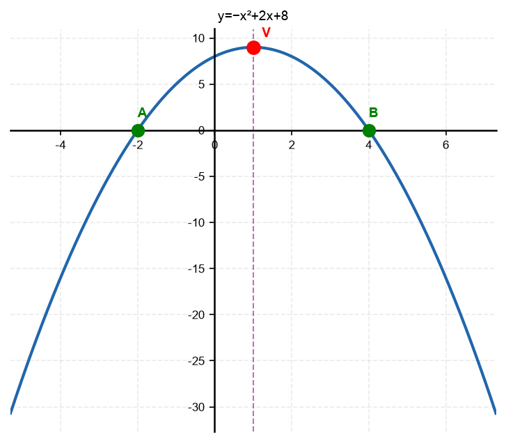

7. ציין את ציר הסימטריה של הפרבולה
$y = 4x^2 - 16x + 3$.

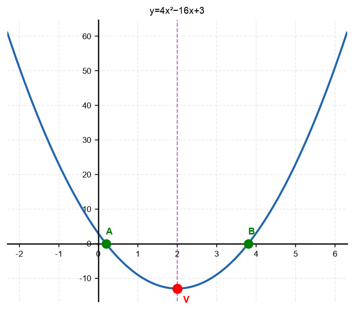

8. נתונה הפרבולה
$y = x^2 - 2x - 35$.
מצא את שיעור
$x$
של הקודקוד ואת ציר הסימטריה.

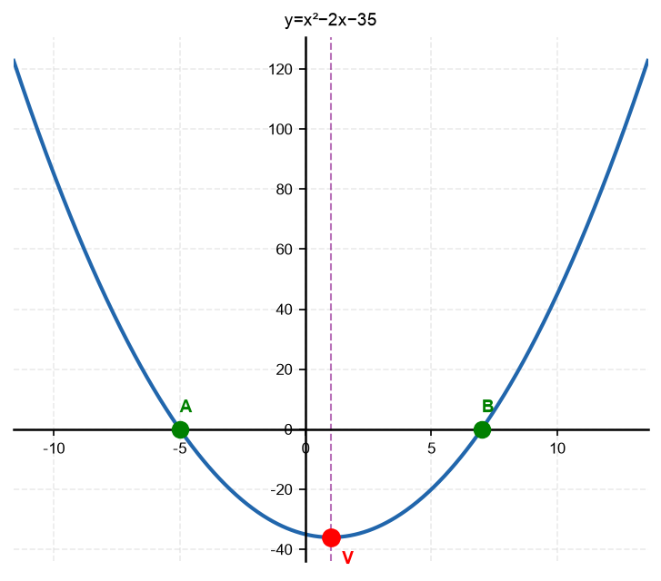

---

## רמה 2: תרגול שוטף ומשולב (8 תרגילים)

9. נתונה הפרבולה
$y = 2x^2 - 8x + 3$.
א. מצא את ציר הסימטריה.
ב. האם הנקודה
$(3, 3)$
על הפרבולה? (הצב ובדוק)
ג. מהי הנקודה הסימטרית לנקודה
$(1, ?)$
ביחס לציר הסימטריה?

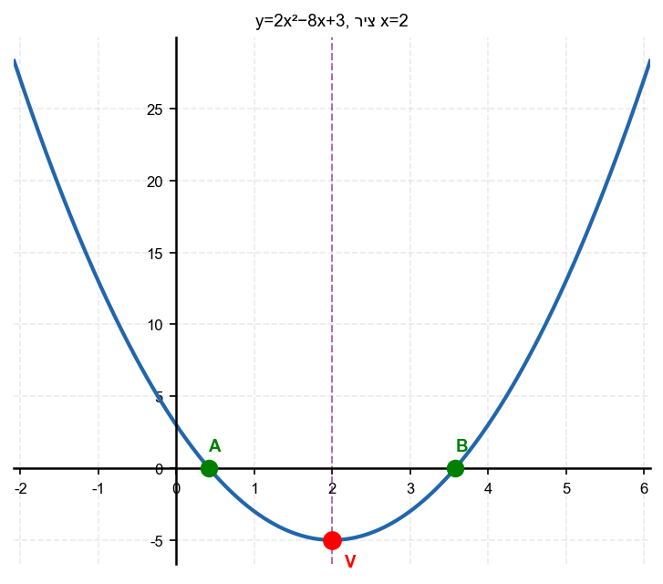

10. נתונה הפרבולה
$y = -x^2 + 6x - 4$.
א. מצא את שיעור
$x$
של הקודקוד.
ב. מהי הנקודה הסימטרית לנקודה
$(0, -4)$
ביחס לציר הסימטריה?

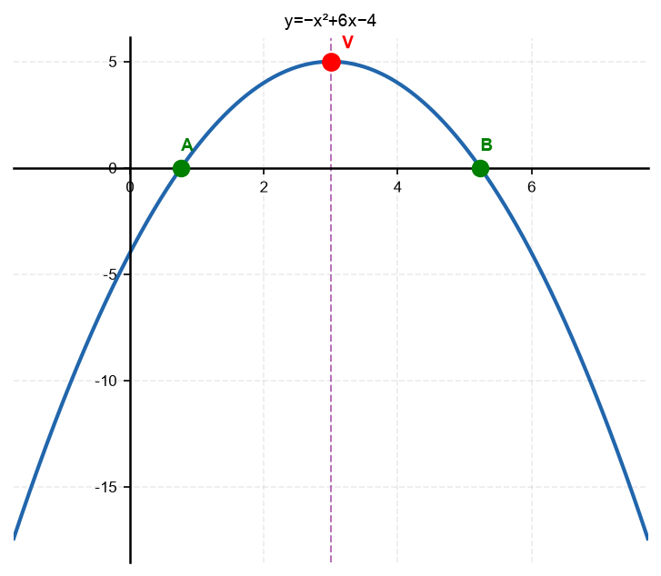

11. נתונה הפרבולה
$y = x^2 + bx + c$.
ידוע שציר הסימטריה הוא
$x = -3$.
מצא את ערך
$b$
.

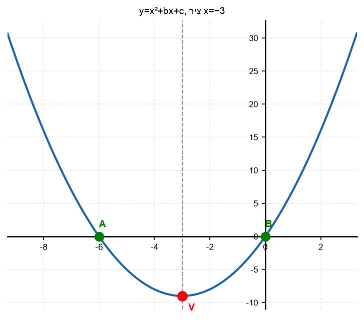

12. שתי נקודות החיתוך של הפרבולה עם ציר
$x$
הן
$(1, 0)$
ו-
$(7, 0)$
.
מצא את ציר הסימטריה ואת שיעור
$x$
של הקודקוד (ללא שימוש בנוסחה – מה נקודת האמצע?).

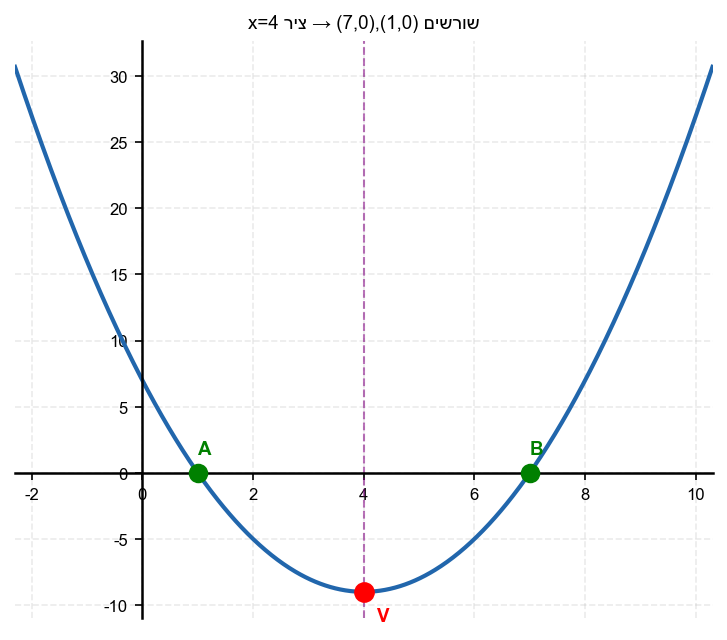

13. שתי נקודות החיתוך של הפרבולה עם ציר
$x$
הן
$(-3, 0)$
ו-
$(5, 0)$
.
מצא את ציר הסימטריה.

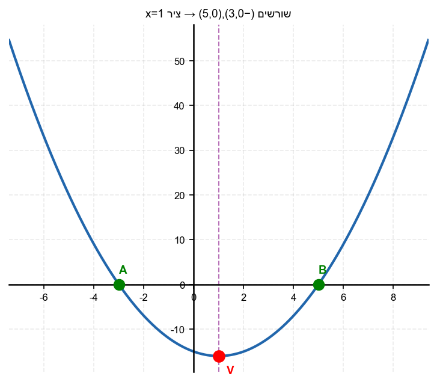

14. נתונה הפרבולה
$y = x^2 - 2x - 4$.
א. מצא את ציר הסימטריה.
ב. מצא את שתי נקודות החיתוך עם ציר
$x$
(בעזרת הנוסחה).
ג. בדוק: האם ציר הסימטריה נמצא באמצע בין שתי נקודות החיתוך?

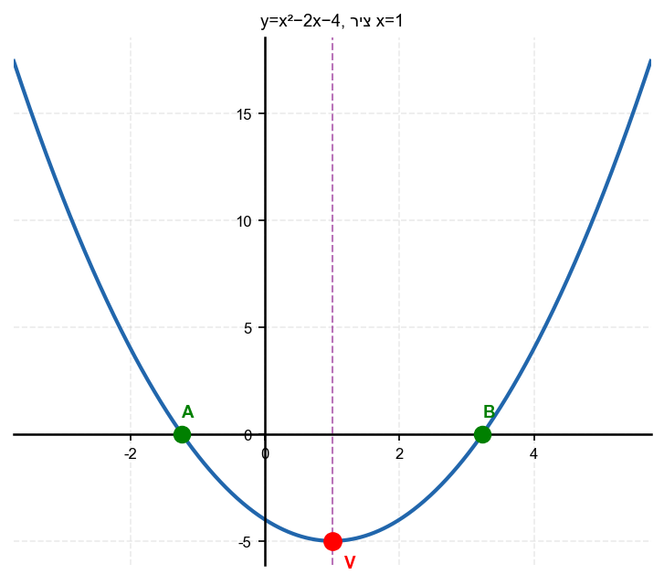

15. נתונה הפרבולה
$y = ax^2 + bx + c$.
ידוע שהפרבולה סימטרית ביחס לישר
$x = 2$,
ושהיא עוברת דרך הנקודה
$(0, 5)$
.
כתוב אפשרות אחת למשוואה.

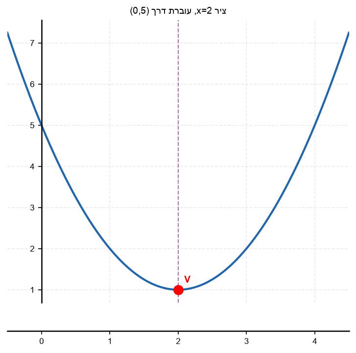

16. נתונה הפרבולה
$y = x^2 + 4x - 12$.
א. מצא את ציר הסימטריה.
ב. מצא את שורשי הפרבולה.
ג. בדוק: האם ציר הסימטריה נמצא בדיוק באמצע בין השורשים?

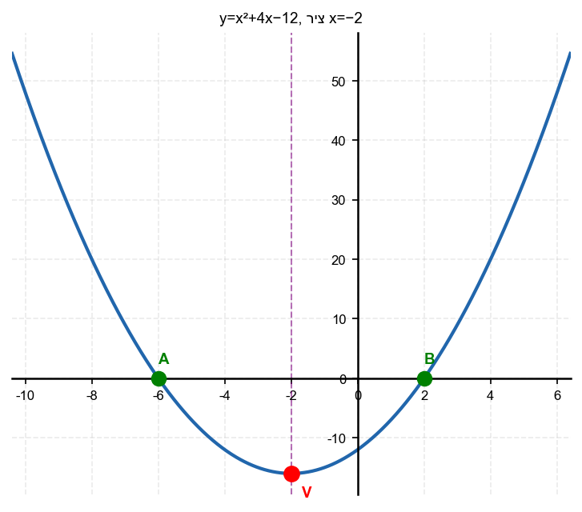

---

## רמה 3: רמת בחינת מה"ט (4 תרגילים)

17. מקור: מה"ט 2024

נתונה הפרבולה
$$y = x^2 + x - 12$$

א. מצא את ציר הסימטריה.

ב. מצא את הקודקוד.

ג. ציין את תחום הירידה ואת תחום העלייה של הפרבולה.

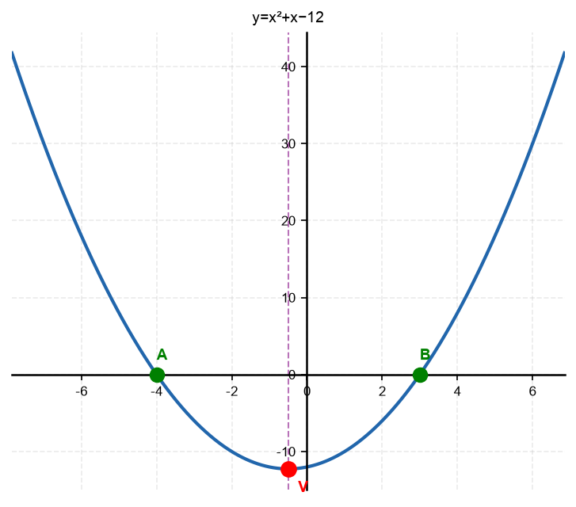

18. מקור: מה"ט 2023

נתונה הפרבולה
$$y = x^2 - 2x - 4$$
ונתון הישר
$$y = x + 6$$

שתי נקודות החיתוך הן
$A$
ו-
$B$
.

א. מצא את
$A$
ו-
$B$
.

ב. מצא את קודקוד הפרבולה
$C$
, כולל ציר הסימטריה.

ג. האם
$C$
מתחת לציר
$x$
או מעליו?

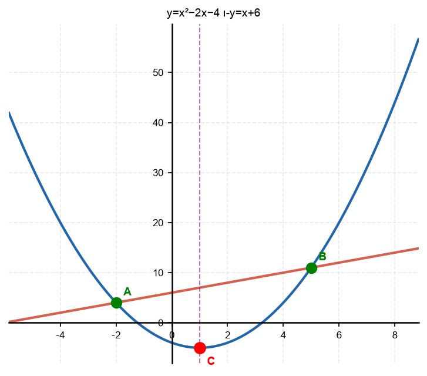

19. מקור: מה"ט 2024

נתונה הפרבולה
$$y = -x^2 + 4x$$

א. מצא את ציר הסימטריה.

ב. מצא את הקודקוד.

ג. מצא את השורשים ובדוק שציר הסימטריה הוא נקודת האמצע ביניהם.

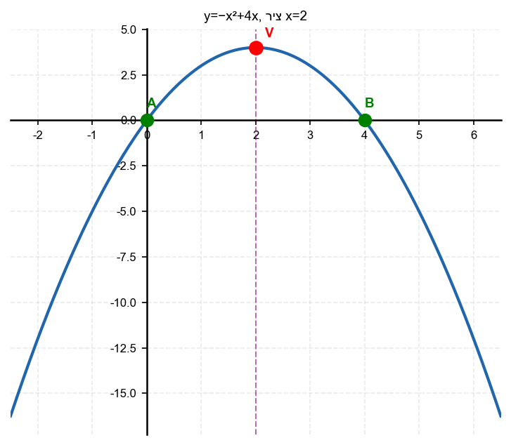

20. מקור: מה"ט 2025

נתונות שתי פרבולות:
$$y = x^2 - 6x + 13$$
$$y = -x^2 + 8x - 7$$

א. מצא את ציר הסימטריה וקודקוד של כל פרבולה.

ב. האם הקודקודים נמצאים מעל או מתחת לציר
$x$
?

ג. מצא את נקודות החיתוך של שתי הפרבולות ואת נקודת האמצע ביניהן.

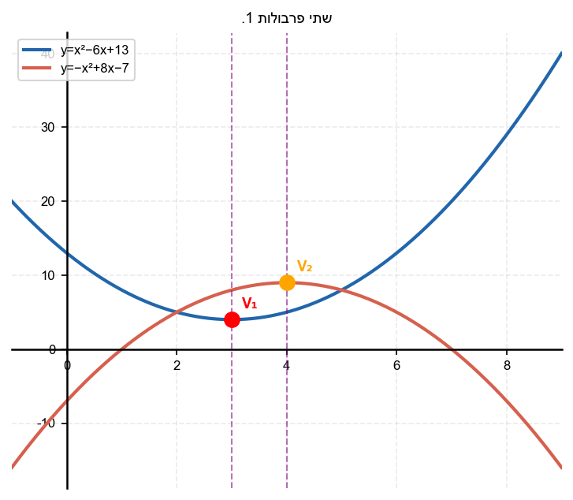

---

תשובות סופיות

1. $2$
2. $-3$
3. $4$
4. א. 3$ ; ב. 1$ ; ג. 0$(ציר$y$ )
5. א. $x_v = -\frac{1}{2}$; ב.$ציר סימטריה:$x = -\frac{1}{2}$
6.

$x_v=1$

7.

$y=4x^2-16x+3$

מתקיים

$x_v=\frac{16}{8}=2$

וציר הסימטריה:

$x=2$

8.

$y=x^2-2x-35$

מתקיים

$x_v=\frac{2}{2}=1$

וציר הסימטריה:

$x=1$

9. א. 2$; ב. $-3 \neq 3$; לא על הפרבולה; ג.$-3$; הנקודה הסימטרית:$(3,-3)$
10. א. $3$; ב.$נקודה$(0,-4)$מרוחקת$3$יחידות משמאל לציר$x=3$; הנקודה הסימטרית:$(6,-4)$
11. $6$
12. $4$
13. $1$
14. א. $x_v = 1$; ב. 1 \pm \sqrt{5}$ ; ג. 1$ ✓
15. לדוגמה:$y = x^2 - 4x + 5$(כי ציר סימטריה$x=2$:$2$✓;$y(0)=5$✓)
16. א. $x_v = -2$; ב. 2$ ; ג. -2$ ✓
17. א. x_v = -\frac{1}{2}$; ב. $-\frac{49}{4}$; קודקוד:$\left(-\frac{1}{2}, -\frac{49}{4}\right)$; ג.$תחום ירידה:$x < -\frac{1}{2}$; תחום עלייה:$x > -\frac{1}{2}$
18. א. (x-5)(x+2)=0$;$A(-2,4)$,$B(5,11)$; ב. $-5$;$C(1,-5)$; ג.$C$מתחת לציר$x$כי$y_v = -5 < 0$
19. א. 2$ ; ב. 4$; קודקוד$(2,4)$ ; ג. 2$ ✓
20. א. 9$; קודקוד$(4,9)$; ב. $9>0$– מעל; ג.$(x-2)(x-5)=0$;$A(2,5)$,$B(5,8)$; נקודת האמצע:$\left(\frac{7}{2}, \frac{13}{2}\right)$

