# יחידה 3.2 – מציאת שיעור ה-
$y$
של הקודקוד, מינימום ומקסימום

---

## רמה 1: בניית ביטחון (8 תרגילים)

1. מצא את קודקוד הפרבולה
$y = x^2 - 6x + 5$.
(שלב 1: מצא
$x_v = -\frac{b}{2a}$
; שלב 2: הצב ב-
$y$
)

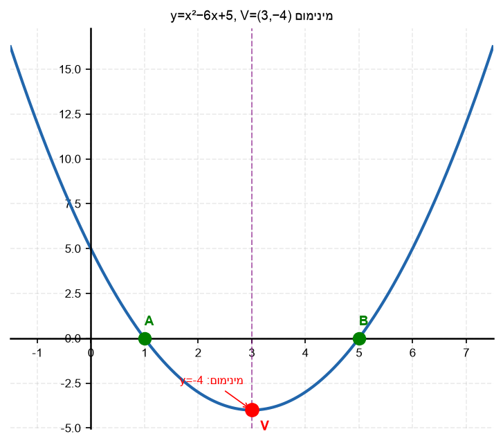

2. מצא את קודקוד הפרבולה
$y = x^2 + 4x - 3$.

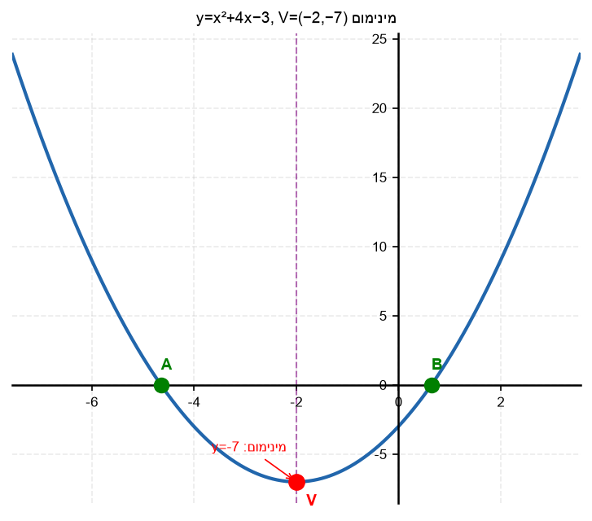

3. מצא את קודקוד הפרבולה
$y = -x^2 + 2x + 3$.

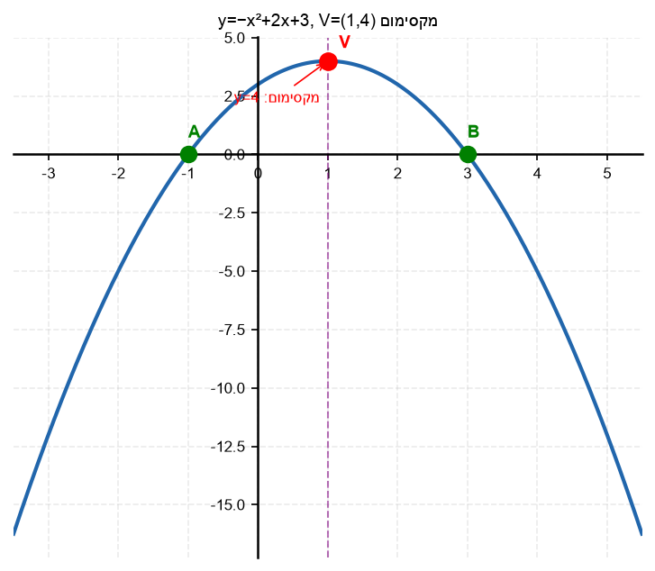

4. מצא את הקודקוד וציין האם מדובר במינימום או מקסימום:
א.
$y = 2x^2 - 4x + 1$
ב.
$y = -x^2 + 6x - 5$

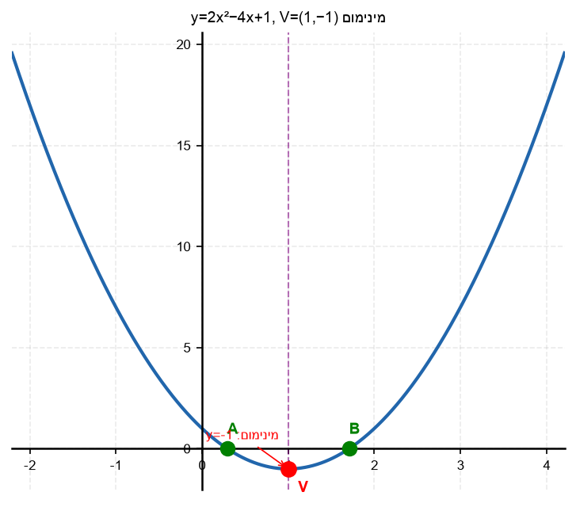

5. נתונה הפרבולה
$y = x^2 - 4x + 5$.
א. מצא את קודקוד הפרבולה.
ב. האם הקודקוד הוא נקודת מינימום או מקסימום?
ג. מהו הערך המינימלי של
$y$
?

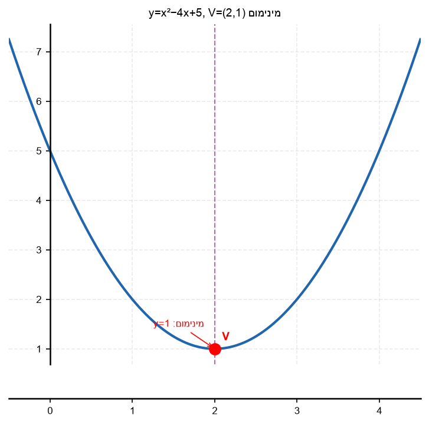

6. נתונה הפרבולה
$y = -x^2 + 4x$.
א. מצא את קודקוד הפרבולה.
ב. מהו הערך המקסימלי של
$y$
?

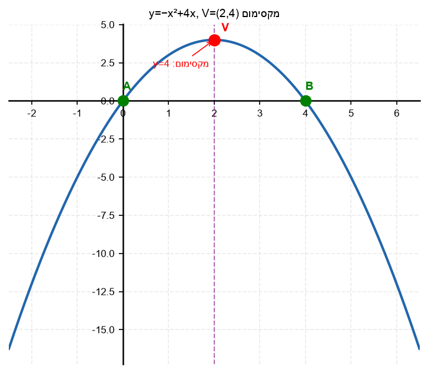

7. הפרבולה
$y = ax^2 + bx + c$
ידוע שהפרמטר
$a > 0$
.
האם לפרבולה נקודת מינימום או מקסימום?

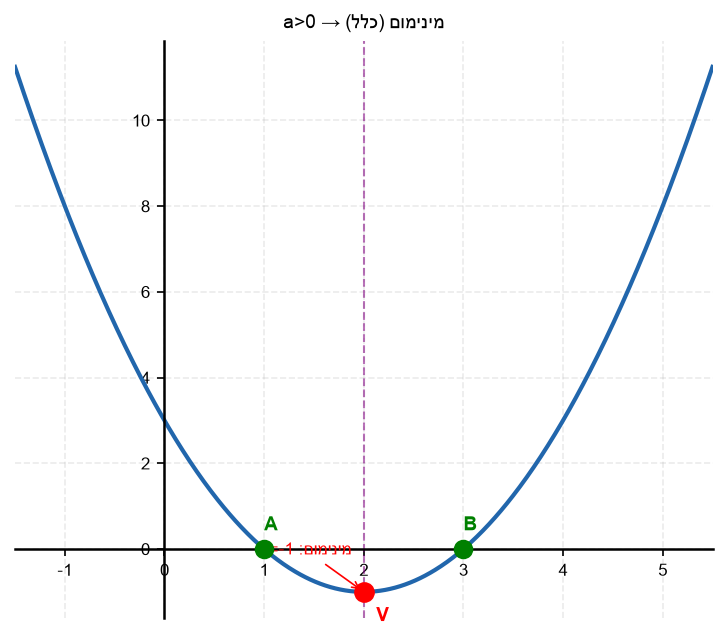

8. נתונה הפרבולה
$y = x^2 - 2x - 35$.
מצא את קודקוד הפרבולה.

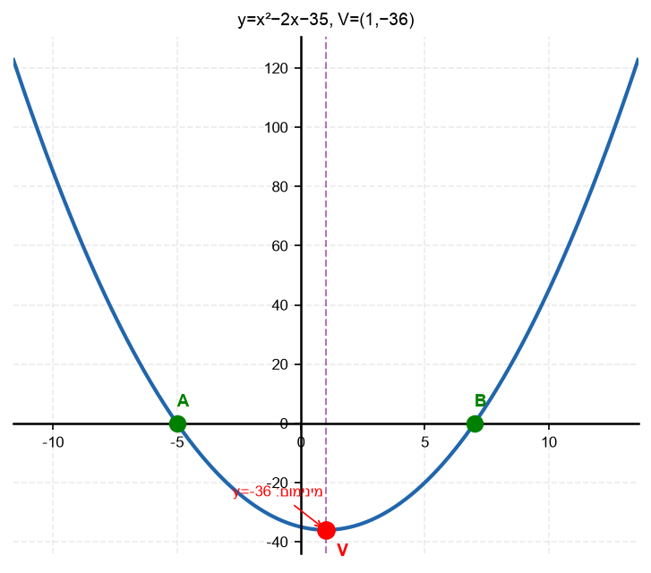

---

## רמה 2: תרגול שוטף ומשולב (8 תרגילים)

9. נתונה הפרבולה
$y = 2x^2 - 12x + 10$.
א. מצא את הקודקוד.
ב. מהו ערך
$y$
המינימלי?
ג. האם יש ערכי
$x$
שעבורם
$y < -8$
?

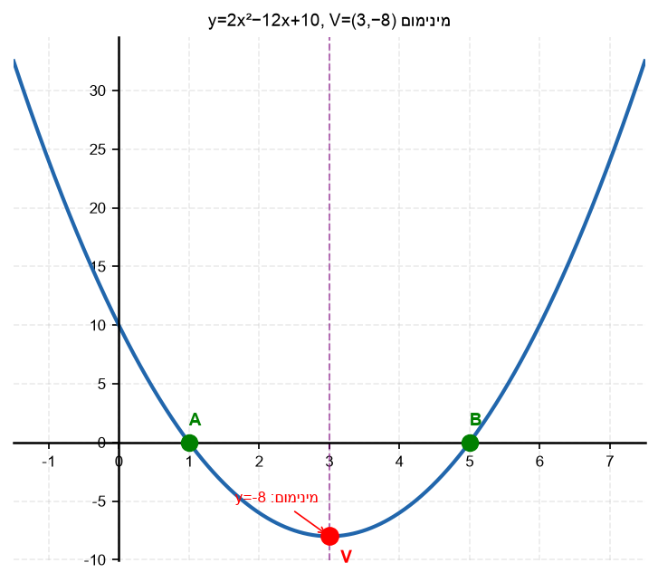

10. נתונה הפרבולה
$y = -2x^2 + 8x - 3$.
א. מצא את הקודקוד.
ב. מהו הערך המקסימלי של
$y$
?
ג. כמה נקודות חיתוך יש לפרבולה עם ציר
$x$
? (השתמש ב-
$\Delta$
)

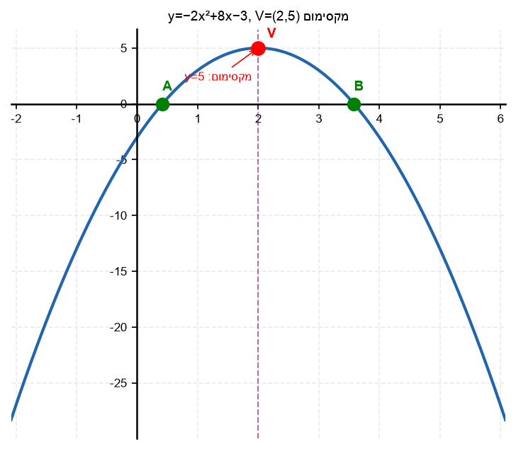

11. שיפוץ אולם: הרווח מביצוע
$x$
שיפוצים ביום מתואר על ידי
$P(x) = -x^2 + 10x - 16$.
א. מצא את הרווח המקסימלי.
ב. כמה שיפוצים ביום ממקסמים את הרווח?

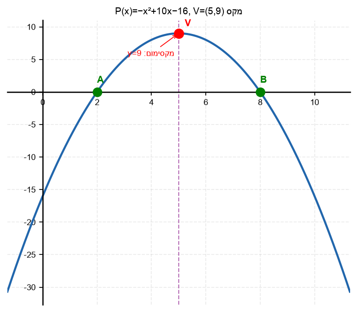

12. נתונה הפרבולה
$y = x^2 - 2x - 4$.
א. מצא את הקודקוד.
ב. מצא את נקודות החיתוך עם ציר
$x$
(בעזרת נוסחת השורשים).
ג. ציין את הערך המינימלי של הפונקציה.

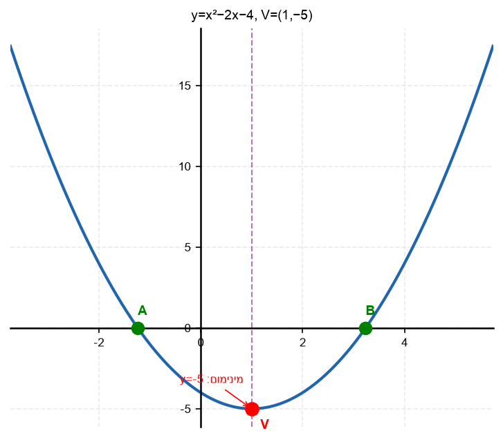

13. נתונה הפרבולה
$y = -x^2 + 3x + 4$.
א. מצא את הקודקוד.
ב. מצא את נקודות החיתוך עם ציר
$x$
.
ג. מהי הנקודה הגבוהה ביותר שהפרבולה מגיעה אליה?

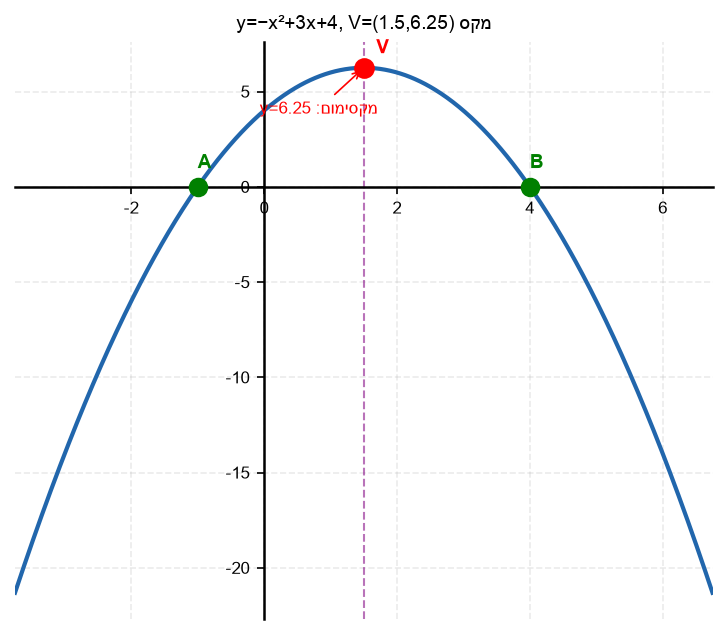

14. נתונה הפרבולה
$y = x^2 + bx + 5$.
ידוע שהקודקוד נמצא ב-
$x = -3$
.
א. מצא את
$b$
.
ב. מצא את
$y$
-קודקוד.
ג. כתוב את משוואת הפרבולה המלאה.

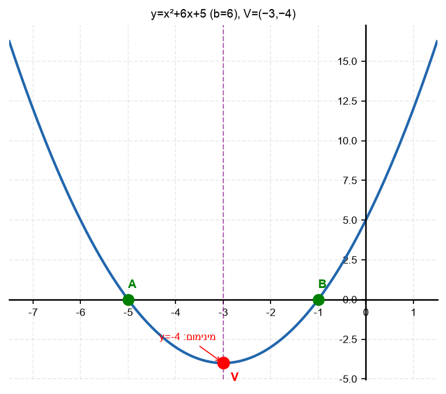

15. נתונה הפרבולה
$y = (2x-3)(-4x+2)$.
א. פתח וכתוב בצורה הסטנדרטית.
ב. מצא את קודקוד הפרבולה.
ג. מהו הערך המקסימלי של הפרבולה?

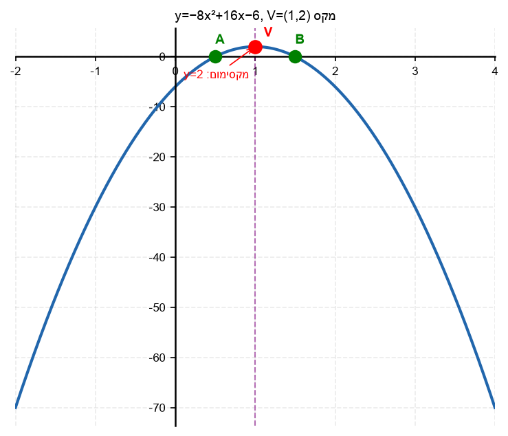

16. נתונה הפרבולה
$y = x^2 - 6x + 13$.
א. מצא את הקודקוד.
ב. האם הפרבולה חותכת את ציר
$x$
? (חשב
$\Delta$
)
ג. מהו הערך המינימלי של
$y$
? האם ייתכן ש-
$y$
יהיה שלילי?

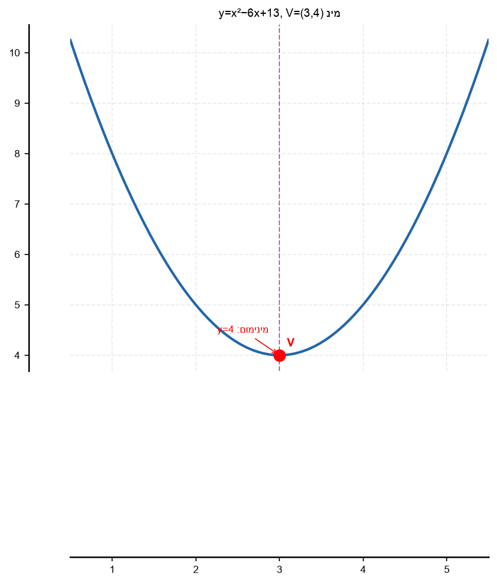

---

## רמה 3: רמת בחינת מה"ט (4 תרגילים)

17. מקור: מה"ט 2024

נתונה הפרבולה
$$f(x) = -x^2 + 4x$$

א. מצא את קודקוד הפרבולה.

ב. מצא את נקודות החיתוך עם ציר
$x$
ועם ציר
$y$
.

ג. מהו הערך המקסימלי של
$f(x)$
? עבור אילו ערכי
$x$
מתקיים
$f(x) = 3$?

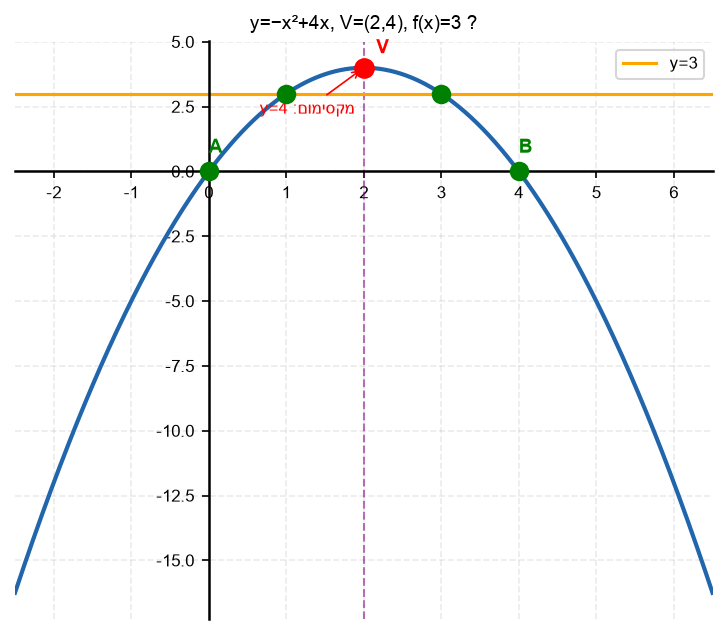

18. מקור: מה"ט 2024

נתונה הפרבולה
$$y = x^2 - 2 - x$$

א. כתוב בצורה הסטנדרטית.

ב. מצא את קודקוד הפרבולה.

ג. ציין את תחומי הגדלה וקטינה, ומצא את הערך המינימלי.

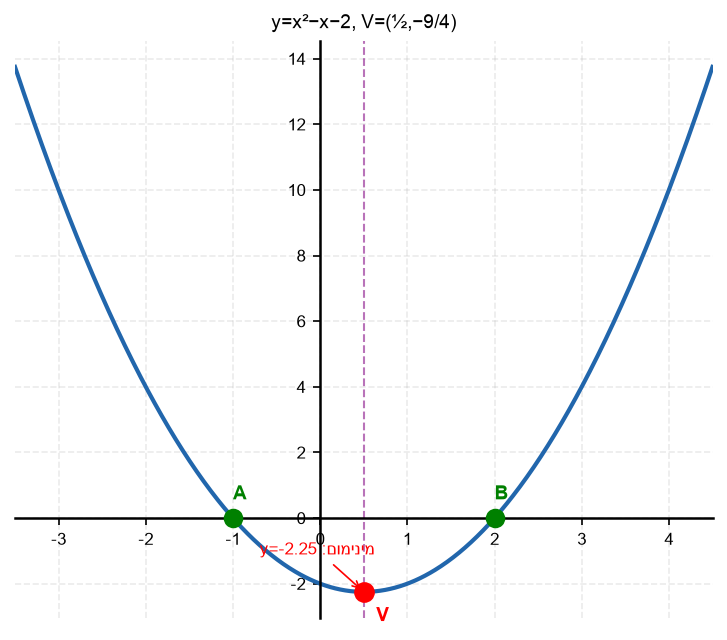

19. מקור: מה"ט 2023

נתונה הפרבולה
$$y = x^2 - 4x + 5$$

נקודה
$A$
היא חיתוך הפרבולה עם ציר
$y$
.
הקטע
$AB$
ניצב לציר
$x$
(ולכן
$B$
הוא הנקודה הסימטרית ל-
$A$
ביחס לציר הסימטריה).
קודקוד הפרבולה הוא
$C$
.

א. מצא את קואורדינטות
$A$
,
$B$
ו-
$C$
.

ב. מצא את שטח המשולש
$ABC$
.

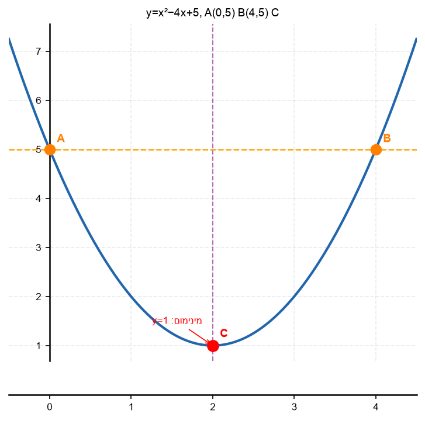

20. מקור: מה"ט 2024

נתונה הפרבולה
$$y = (2x-3)(-4x+2)$$

א. פתח לצורה סטנדרטית.

ב. מצא את הקודקוד.

ג. מצא את נקודות החיתוך עם ציר
$x$
.

ד. האם הפונקציה
$g(x) = f(x) + 2$
תחתוך את ציר
$x$
? אם כן, כמה פעמים?

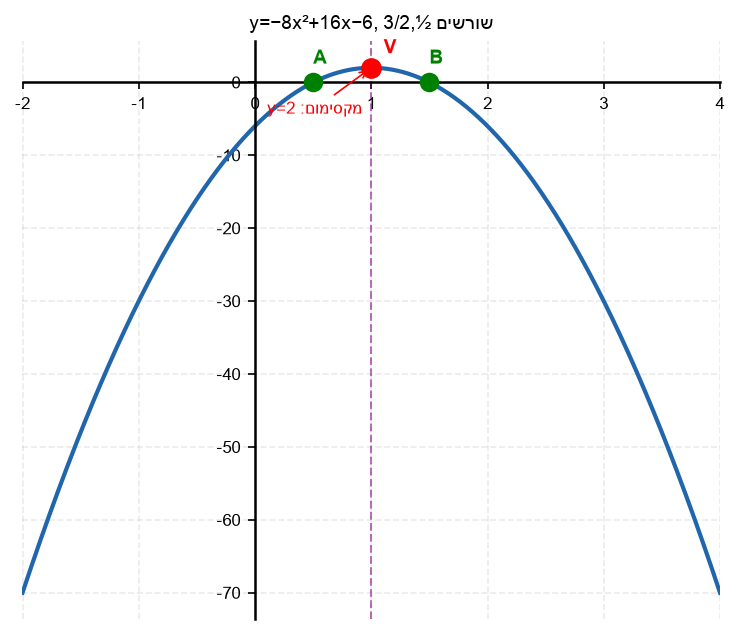

---

תשובות סופיות

1. $x_v = 3$
$-4$
קודקוד:
$(3,-4)$

2. $x_v = -2$
$-7$
קודקוד:
$(-2,-7)$

3. $x_v = 1$
$4$
קודקוד:
$(1,4)$

4.
א.
מינימום
$a=2>0$
ב.
מקסימום
$a=-1<0$

5.
א.
$1$
קודקוד
$(2,1)$
ב.
מינימום
$a=1>0$
ג.
ערך מינימלי:
$y=1$

6.
א.
$4$
קודקוד
$(2,4)$
ב.
ערך מקסימלי:
$y=4$

7. נקודת מינימום
כי
$a>0$
פרבולה פתוחה כלפי מעלה

8. $x_v=1$
$-36$
קודקוד
$(1,-36)$

9.
א.
$-8$
קודקוד
$(3,-8)$
ב.
$y_{\min}=-8$
ג.
לא –
$-8$
הוא הערך המינימלי, לא ניתן לרדת מתחתיו

10.
א.
$5$
קודקוד
$(2,5)$
ב.
ערך מקסימלי:
$y=5$
ג.
$\Delta=40>0$
שתי נקודות חיתוך

11.
א.
$9$
רווח מקסימלי
$9$
יחידות
ב.
$5$
שיפוצים ביום

12.
א.
$-5$
קודקוד
$(1,-5)$
ב.
$1\pm\sqrt{5}$
ג.
ערך מינימלי:
$y=-5$

13.
א.
$\frac{25}{4}$
קודקוד
$\left(\frac{3}{2},\frac{25}{4}\right)$
ב.
$(x-4)(x+1)=0$
נקודות
$(-1,0)$
ו-
$(4,0)$
ג.
הנקודה הגבוהה ביותר היא הקודקוד:
$\left(\frac{3}{2},\frac{25}{4}\right)$
גובה
$6.25$

14.
א.
$b=6$
ב.
$-4$
ג.
$y=x^2+6x+5$

15.
א.
$y=-8x^2+16x-6$
ב.
$2$
קודקוד
$(1,2)$
ג.
ערך מקסימלי:
$y=2$
כי
$a=-8<0$

16.
א.
$4$
קודקוד
$(3,4)$
ב.
$\Delta=-16<0$
אין חיתוך עם ציר
$x$
ג.
ערך מינימלי:
$y=4>0$
לא ייתכן
$y<0$
כי המינימום הוא
$4$

17.
א.
$4$
קודקוד
$(2,4)$
ב.
חיתוך ציר
$x$:
$(0,0)$
ו-
$(4,0)$
חיתוך ציר
$y$:
$(0,0)$
ג.
ערך מקסימלי:
$4$
$f(x)=3$
עבור
$x=1$
או
$x=3$

18.
א.
$y=x^2-x-2$
ב.
$-\frac{9}{4}$
קודקוד
$\left(\frac{1}{2},-\frac{9}{4}\right)$
ג.
קטינה:
$x<\frac{1}{2}$
גדלה:
$x>\frac{1}{2}$
ערך מינימלי:
$-\frac{9}{4}$

19.
א.
$A(0,5)$
$B(4,5)$
$C(2,1)$
ב.
$8$

20.
א.
$y=-8x^2+16x-6$
ב.
$2$
קודקוד
$(1,2)$
ג.
$x=\frac{1}{2}$
או
$x=\frac{3}{2}$
ד.
$g(x)=f(x)+2$
הקודקוד יעלה ל-
$(1,4)$
$\Delta_g=\Delta_f$
לא ישתנה (בגלל הזזה אנכית)
מאחר שהמקסימום של
$g$
הוא
$4$
ו-
$a<0$
הפרבולה פתוחה כלפי מטה וחותכת את ציר
$x$
בשתי נקודות

