# יחידה 3.3 – מציאת נקודה סימטרית לנקודה נתונה על הפרבולה

---

## רמה 1: בניית ביטחון (8 תרגילים)

1. ציר הסימטריה של פרבולה הוא
$x = 3$.
נקודה
$P$
נמצאת ב-
$x = 1$
.
מהו שיעור
$x$
של הנקודה הסימטרית ל-
$P$
?

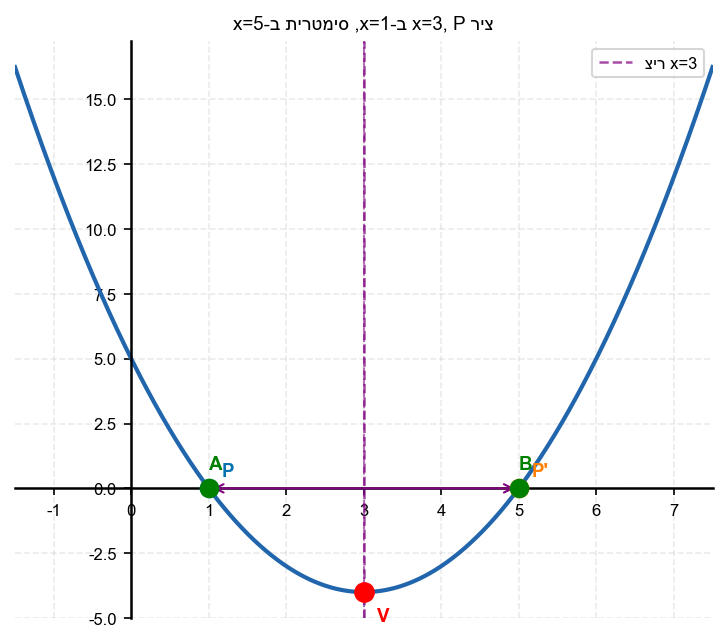

2. ציר הסימטריה של פרבולה הוא
$x = 5$.
נקודה
$P$
נמצאת ב-
$x = 2$
.
מהו שיעור
$x$
של הנקודה הסימטרית ל-
$P$
?

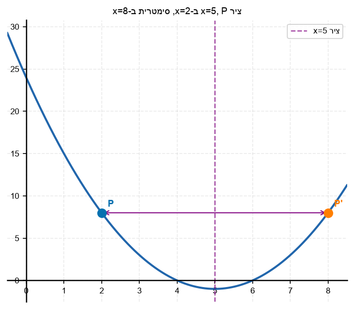

3. ציר הסימטריה של פרבולה הוא
$x = -1$.
נקודה
$P$
נמצאת ב-
$x = 4$
.
מהו שיעור
$x$
של הנקודה הסימטרית ל-
$P$
?

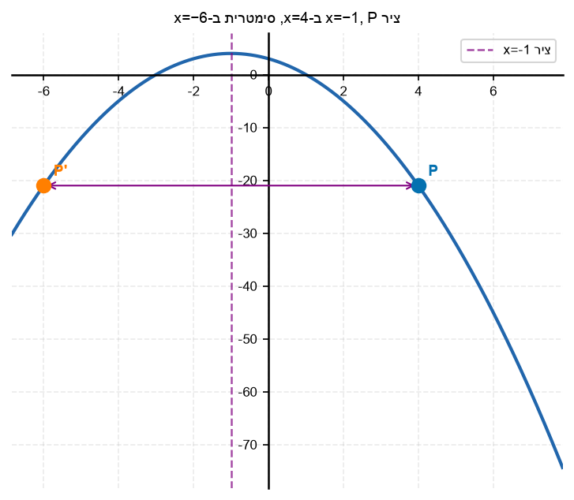

4. הסבר בקצרה: מדוע שתי נקודות הסימטריות על פרבולה תמיד יש להן את אותו שיעור
$y$
?

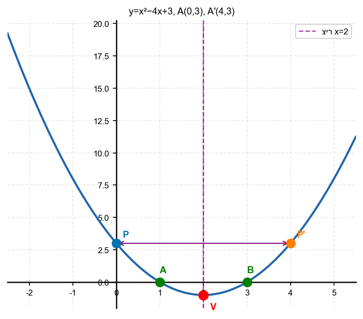

5. נתונה הפרבולה
$y = x^2 - 4x + 3$.
ציר הסימטריה הוא
$x = 2$.
נקודה
$A$
על הפרבולה נמצאת ב-
$x = 0$
.
א. מצא את קואורדינטות
$A$
.
ב. מהו שיעור
$x$
של הנקודה הסימטרית
$A'$
?
ג. בדוק: מהי
$y$
של
$A'$
?

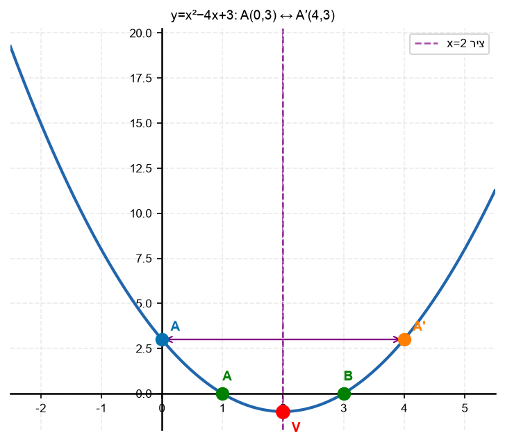

6. נתונה הפרבולה
$y = x^2 - 6x + 5$.
ציר הסימטריה הוא
$x = 3$.
מהי הנקודה הסימטרית לנקודה
$(1, 0)$
?

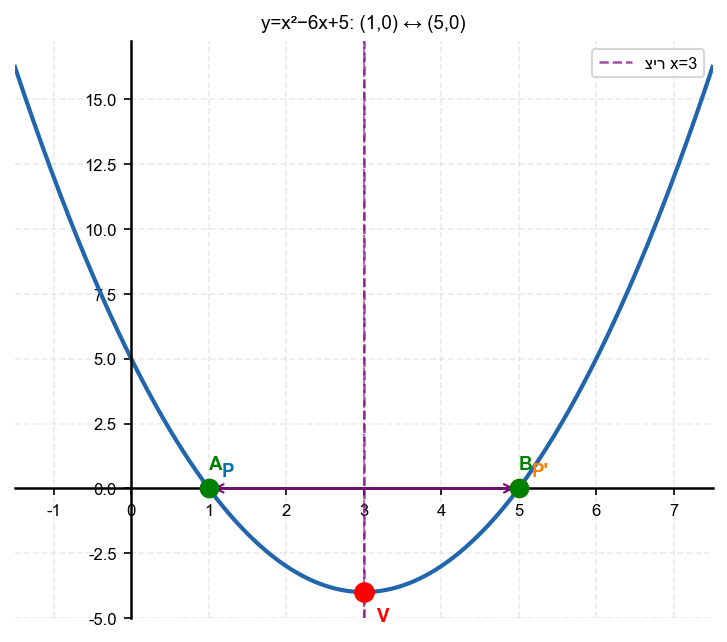

7. נתונה הפרבולה
$y = -x^2 + 2x + 8$.
ציר הסימטריה הוא
$x = 1$.
מהי הנקודה הסימטרית לנקודה
$(-1, 5)$
?

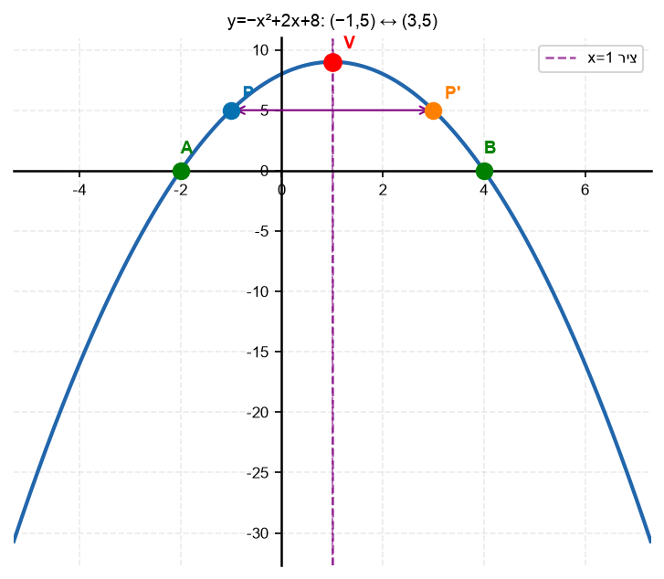

8. נתונה הפרבולה
$y = x^2 - 2x - 35$.
נקודה
$A(-5, 0)$
נמצאת על הפרבולה.
מהי הנקודה הסימטרית ל-
$A$
?

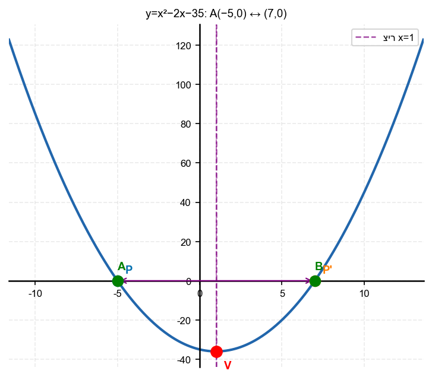

---

## רמה 2: תרגול שוטף ומשולב (8 תרגילים)

9. נתונה הפרבולה
$y = x^2 - 8x + 7$.
א. מצא את ציר הסימטריה.
ב. הנקודה
$(1, 0)$
על הפרבולה. מצא את הנקודה הסימטרית לה.
ג. בדוק שהנקודה הסימטרית נמצאת גם על הפרבולה.

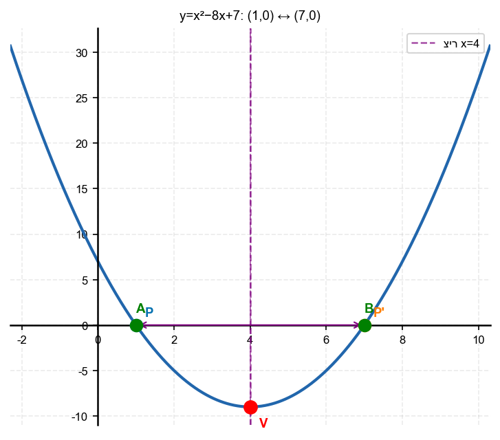

10. נתונה הפרבולה
$y = x^2 - 4x + 5$.
נקודה
$A(0, 5)$
נמצאת על הפרבולה.
א. מצא את ציר הסימטריה.
ב. מצא את הנקודה הסימטרית ל-
$A$
.
ג. מהי קטע
$AA'$
ומהו אורכו?

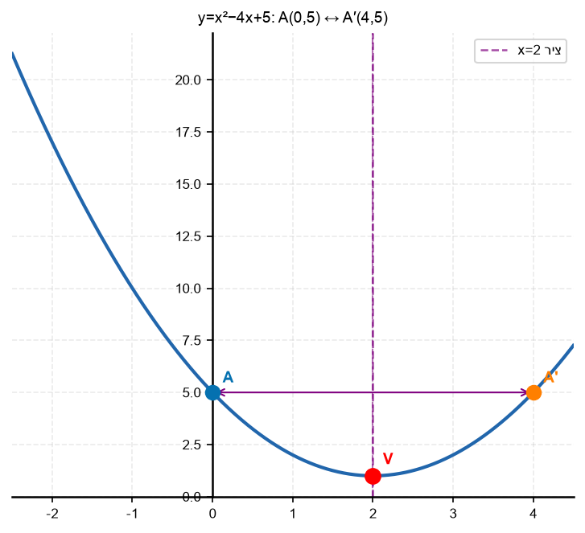

11. נתונה הפרבולה
$y = -x^2 + 6x - 5$.
א. מצא את ציר הסימטריה.
ב. הנקודה
$(1, 0)$
על הפרבולה. מהי הנקודה הסימטרית לה?
ג. ציין את שתי נקודות החיתוך עם ציר
$x$
ובדוק שהן סימטריות.

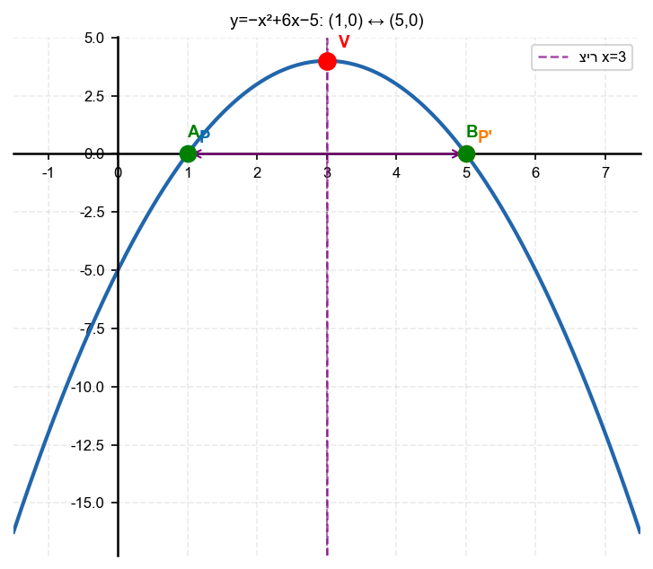

12. נתונה הפרבולה
$y = x^2 + 2x - 8$.
נקודה
$P(2, 0)$
נמצאת על הפרבולה.
מצא את הנקודה הסימטרית ל-
$P$
.

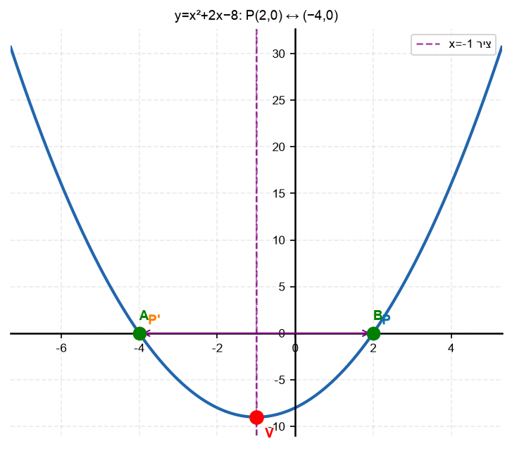

13. נתונה הפרבולה
$y = x^2 - 2x - 4$.
א. מצא את ציר הסימטריה.
ב. מצא את נקודת החיתוך עם ציר
$y$
.
ג. מהי הנקודה הסימטרית לנקודת החיתוך עם ציר
$y$
?

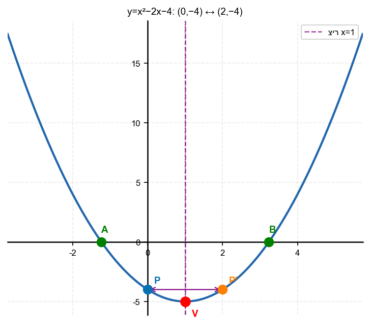

14. נתונה הפרבולה
$y = 2x^2 - 8x + 3$.
נקודה
$B(0, 3)$
נמצאת על הפרבולה.
א. מצא את ציר הסימטריה.
ב. מצא את הנקודה הסימטרית ל-
$B$
ואמת שהיא על הפרבולה.

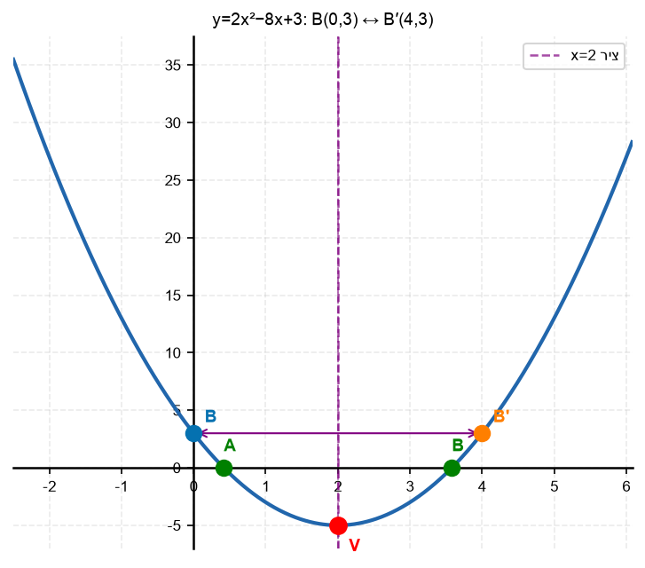

15. שתי נקודות
$A$
ו-
$B$
על הפרבולה
$y = x^2 - 6x + 8$
הן סימטריות ביחס לציר הסימטריה.
ידוע ש-
$A = (1, 3)$
.
א. מצא את ציר הסימטריה.
ב. מצא את
$B$
.

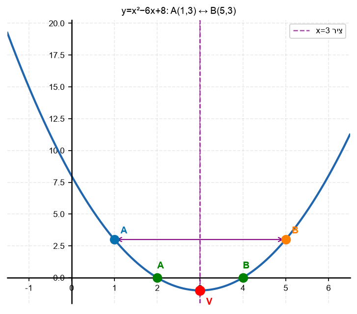

16. נתונה הפרבולה
$y = -x^2 + 8x - 7$.
א. מצא את ציר הסימטריה וקודקוד הפרבולה.
ב. נקודה
$C(1, 0)$
על הפרבולה. מצא את הנקודה הסימטרית ל-
$C$
.
ג. בדוק שהנקודה שמצאת אכן על הפרבולה.

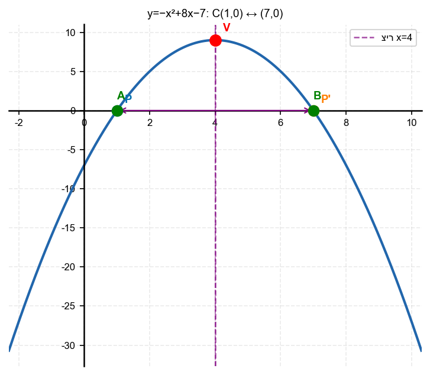

---

## רמה 3: רמת בחינת מה"ט (4 תרגילים)

17. מקור: מה"ט 2023

נתונה הפרבולה
$$y = x^2 - 4x + 5$$

נקודה
$A$
היא חיתוך הפרבולה עם ציר
$y$
.
הקטע
$AB$
ניצב לציר
$x$
(ולכן
$B$
הוא הנקודה הסימטרית ל-
$A$
ביחס לציר הסימטריה).
קודקוד הפרבולה הוא
$C$
.

א. מצא את קואורדינטות
$A$
,
$B$
,
$C$
.

ב. מצא את שטח המשולש
$ABC$
.

ג. האם
$C$
נמצא על הקטע
$AB$
? הסבר.

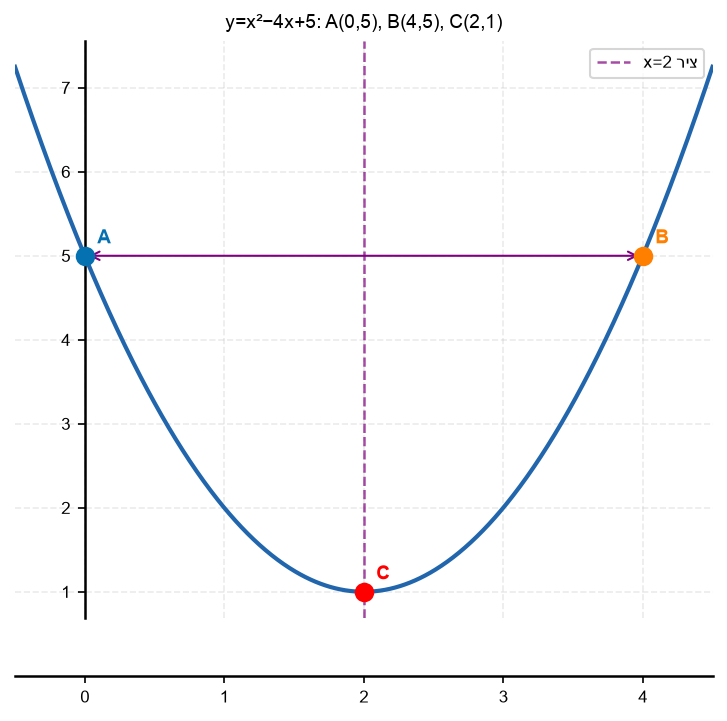

18. מקור: מה"ט 2025

נתונה הפרבולה
$$y = x^2$$
ונתון הישר
$$y = 3x + 4$$

שתי נקודות החיתוך הן
$A$
ו-
$B$
.
קודקוד הפרבולה הוא
$D$
.
נקודה
$C$
היא הנקודה הסימטרית ל-
$B$
ביחס לציר
$y$
.

א. מצא את
$A$
ו-
$B$
.

ב. מצא את
$C$
(הנקודה הסימטרית ל-
$B$
ביחס לציר
$y$
).

ג. מצא את שטח המשולש
$BCD$
.

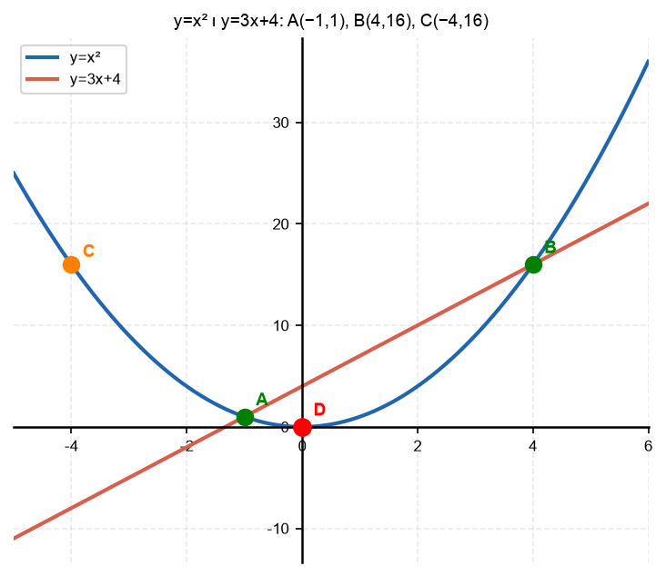

19. מקור: מה"ט 2024

נתונה הפרבולה
$$y = x^2 - 5x - 1$$

נקודה
$A$
על הפרבולה היא חיתוך הישר
$y = -3x + 7$
עם הפרבולה.
ציר
$x$
חותך את הפרבולה בשתי נקודות.
נקודה
$D$
היא ההיטל האנכי של
$A$
על ציר
$x$
.
נקודה הסימטרית של
$A$
ביחס לציר הסימטריה היא
$A'$
.

א. מצא את נקודות
$A$
,
$B$
(חיתוכי הפרבולה עם הישר).

ב. מצא את ציר הסימטריה ואת
$A'$
(הנקודה הסימטרית ל-
$A$
).

ג. האם
$A'$
על הפרבולה? בדוק.

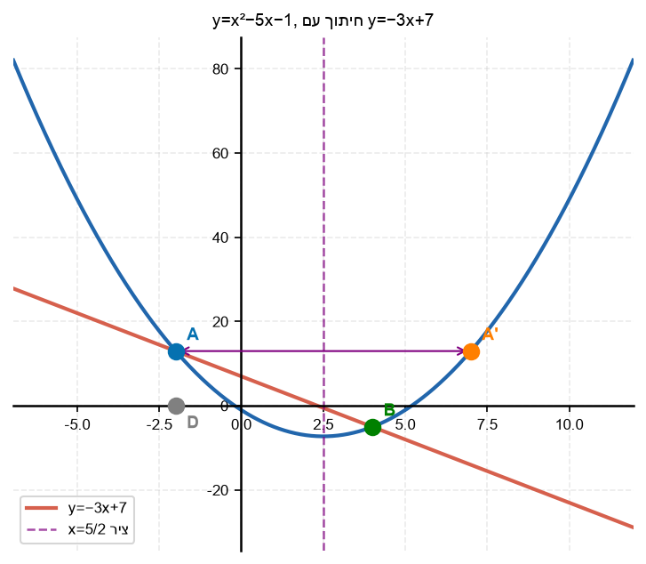

20. מקור: מה"ט 2025

נתונה הפרבולה
$$y = -x^2 + 2x + 8$$

חותכת את ציר
$x$
בנקודות
$A$
ו-
$D$
.
חותכת את ציר
$y$
בנקודה
$B$
.
הקטע
$BC$
ניצב לציר
$x$
ו-
$C$
על הפרבולה.

א. מצא את
$A$
,
$B$
,
$D$
.

ב. מהי הנקודה
$C$
(הנקודה הסימטרית ל-
$B$
ביחס לציר הסימטריה)?

ג. מצא את שטח הטרפז
$ABCD$
(אם יש).

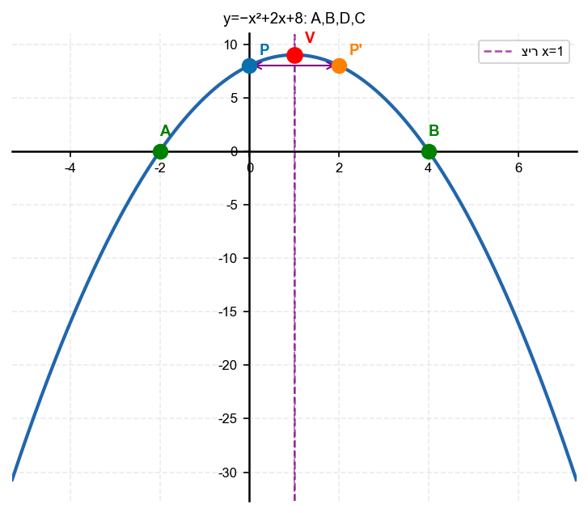

---

תשובות סופיות

1. $5$
2. $8$
3. $-6$
4. שתי הנקודות נמצאות באותו מרחק מציר הסימטריה, ומכיוון שהפרבולה סימטרית, הן מגיעות לאותה גובה$y$
5. א. $A(0, 3)$
ב. $x = 4$
ג. $y = 3$ — הנקודה הסימטרית היא $(4, 3)$
6. $(5, 0)$
7. $(3, 5)$
8. $(7, 0)$
9. א. $x_v=4$; ב. $(1,0)$מרוחקת$3$מציר; נקודה סימטרית:$(7,0)$; ג. 0$ ✓
10. א. $x_v=2$; ב. $A(0,5)$מרוחקת$2$מציר; נקודה סימטרית$A'(4,5)$; ג. קטע אופקי$AA'$, אורך$4$יחידות
11. א. $x_v=3$; ב. $(1,0)$מרוחקת$2$מציר; נקודה סימטרית$(5,0)$; ג. 0$ ✓
12. $(-4, 0)$
13. א. $x_v=1$; ב. $(0,-4)$; ג. מרחק מציר:$1$; נקודה סימטרית:$(2,-4)$;
14. א. $x_v=2$; ב. 3$ ✓
15. א. 3$ ; ב. 3$ ✓
16. א. 9$; קודקוד$(4,9)$ ; ב. $C(1,0)$מרוחקת$3$מציר; נקודה סימטרית$(7,0)$; ג. 0$ ✓
17. א. 1$;$C(2,1)$ ; ב. 8$ ; ג. 5$ )
18. א. $(x-4)(x+1)=0$;$A(-1,1)$,$B(4,16)$; ב.$C(-4,16)$(הסימטרית ל-$B$ביחס לציר$y$); ג.$64$
19. א. (x-4)(x+2)=0$;$A(-2,13)$,$B(4,-5)$ ; ב. (7,13)$ ; ג. 13$ ✓
20. א. $(x-4)(x+2)=0$;$A(-2,0)$,$D(4,0)$;$B(0,8)$; ב.$x_v=1$;$B(0,8)$מרוחקת$1$מציר;$C(2,8)$; ג.$32$

