# יחידה 4.2 – תחומי עלייה וירידה של הפונקציה הריבועית

---

## רמה 1: בניית ביטחון (8 תרגילים)

1. נתונה הפרבולה
$y = x^2 - 4x + 3$
(פתוחה כלפי מעלה, קודקוד ב-
$x = 2$
).
א. בממה תחום הפרבולה יורדת?
ב. בממה תחום הפרבולה עולה?

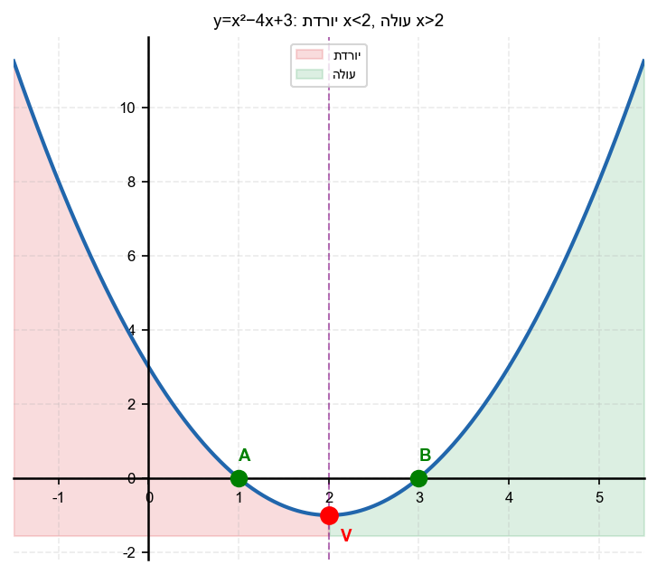

2. נתונה הפרבולה
$y = -x^2 + 6x - 5$
(פתוחה כלפי מטה, קודקוד ב-
$x = 3$
).
א. בממה תחום הפרבולה עולה?
ב. בממה תחום הפרבולה יורדת?

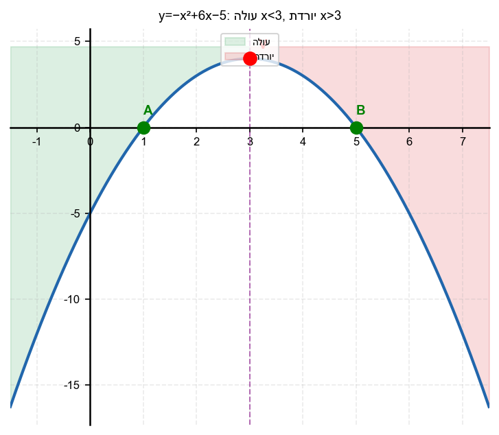

3. עבור הפרבולה
$y = x^2$
(קודקוד ב-
$x = 0$
):
א. מהו תחום העלייה?
ב. מהו תחום הירידה?

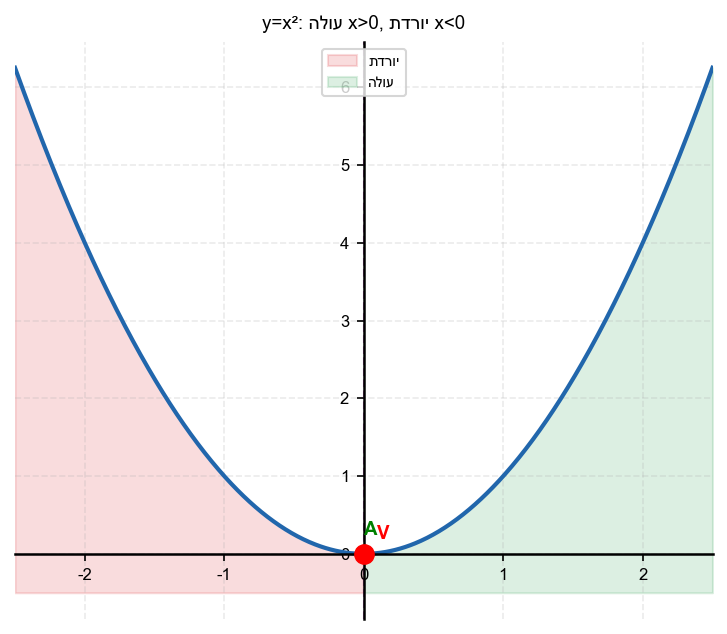

4. מצא את ציר הסימטריה ואת תחומי העלייה והירידה:
$y = x^2 - 10x + 21$

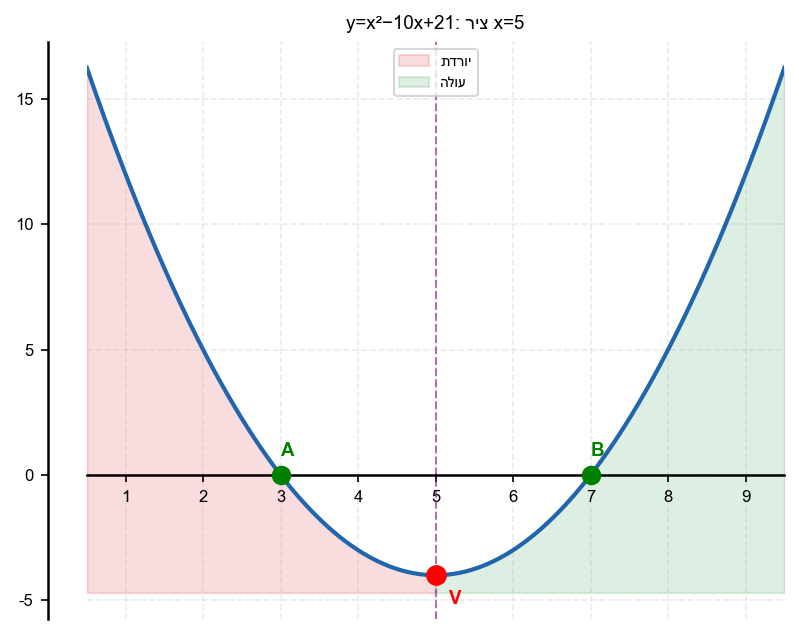

5. מצא את ציר הסימטריה ואת תחומי העלייה והירידה:
$y = -2x^2 + 8x - 1$

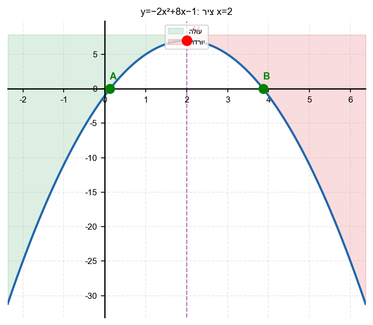

6. נתונה הפרבולה
$y = 3x^2 + 6x + 1$.
א. מצא את ציר הסימטריה.
ב. מהו תחום הירידה?
ג. מהו תחום העלייה?

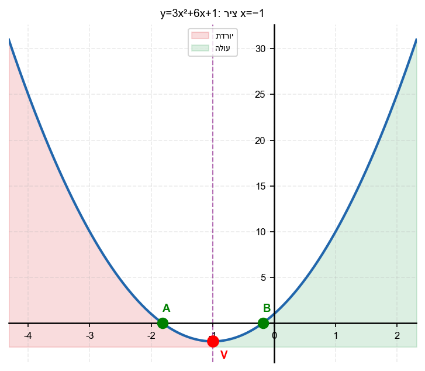

7. נתונה הפרבולה
$y = -x^2 - 4x + 5$.
א. מצא את קודקוד הפרבולה.
ב. מהו תחום העלייה?

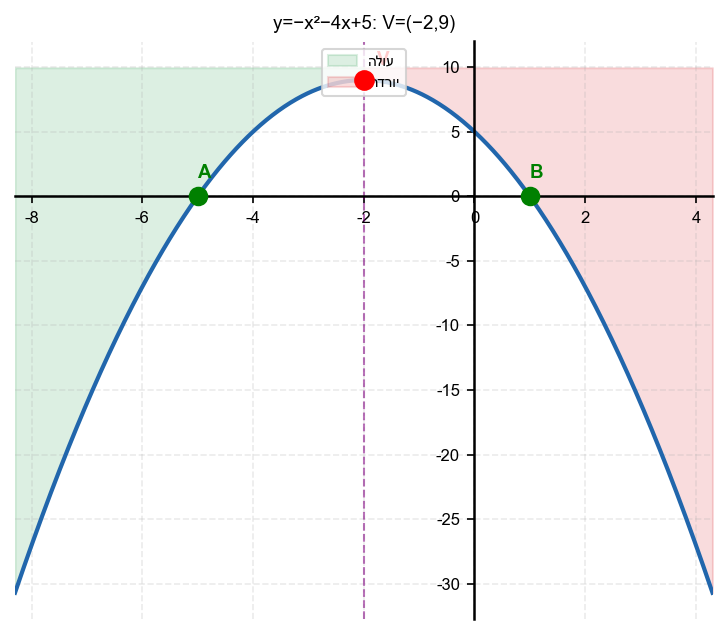

8. הסבר בקצרה: מדוע לפרבולה פתוחה כלפי מעלה יש תחום ירידה לפני הקודקוד ותחום עלייה אחריו?

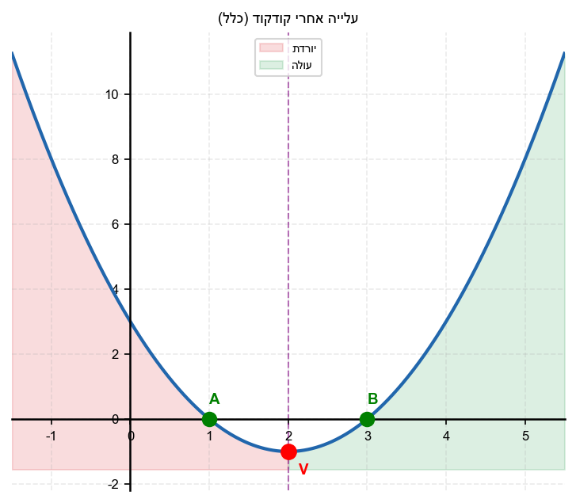

---

## רמה 2: תרגול שוטף ומשולב (8 תרגילים)

9. נתונה הפרבולה
$y = x^2 - 2x - 35$.
א. מצא את קודקוד הפרבולה.
ב. ציין את תחומי העלייה והירידה.
ג. ציין את תחומי החיוביות והשליליות.

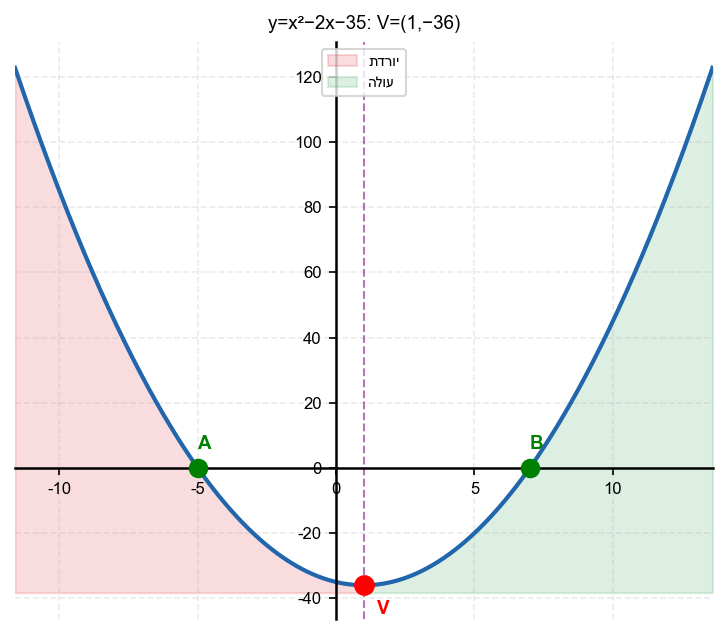

10. נתונה הפרבולה
$y = -x^2 + 3x + 4$.
א. מצא את קודקוד הפרבולה.
ב. ציין את תחומי העלייה והירידה.
ג. ציין את תחומי החיוביות והשליליות.

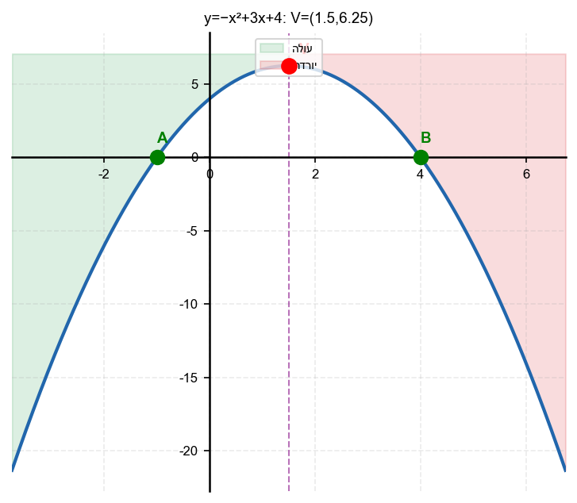

11. נתונה הפרבולה
$y = x^2 + x - 12$.
א. מצא את קודקוד הפרבולה.
ב. ציין ארבעה תחומים: עלייה, ירידה, חיוביות, שליליות.

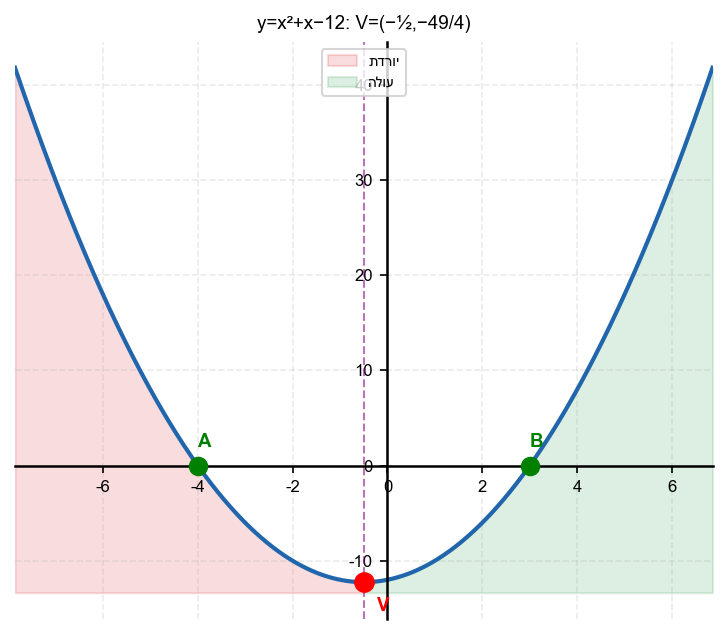

12. נתונה הפרבולה
$y = -x^2 + 4x$.
בנה "כרטיס מידע" שלם:
א. שורשים.
ב. קודקוד.
ג. תחום חיוביות.
ד. תחום עלייה.

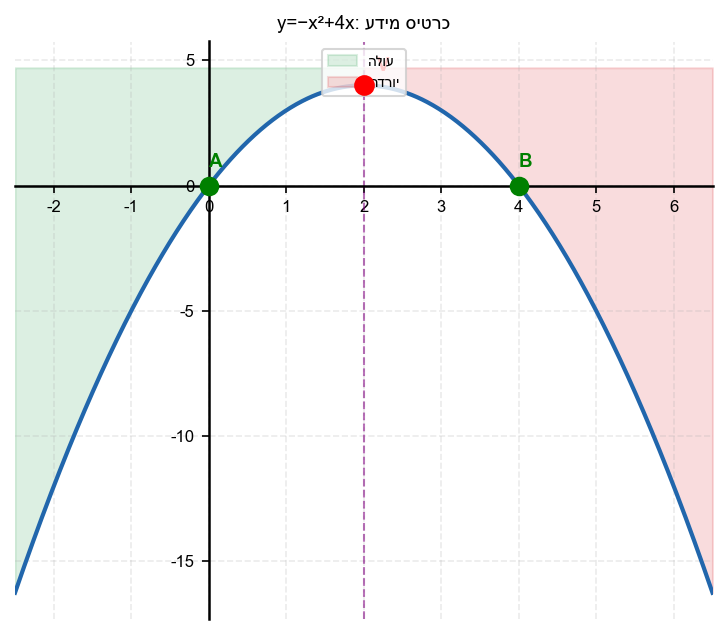

13. נתונה הפרבולה
$y = x^2 - 6x + 8$.
בנה "כרטיס מידע" שלם:
א. שורשים.
ב. קודקוד.
ג. תחום חיוביות.
ד. תחום עלייה.

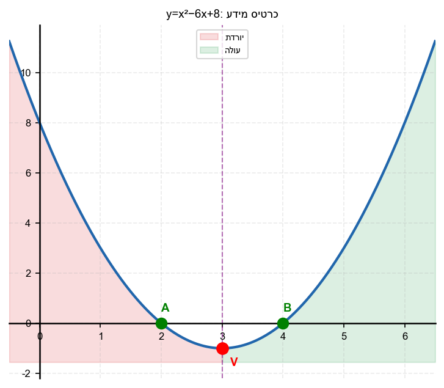

14. נתונה הפרבולה
$f(x) = -x^2 + 4x$.
ציין: עבור אילו ערכי
$x$
הפונקציה גם עולה וגם חיובית?

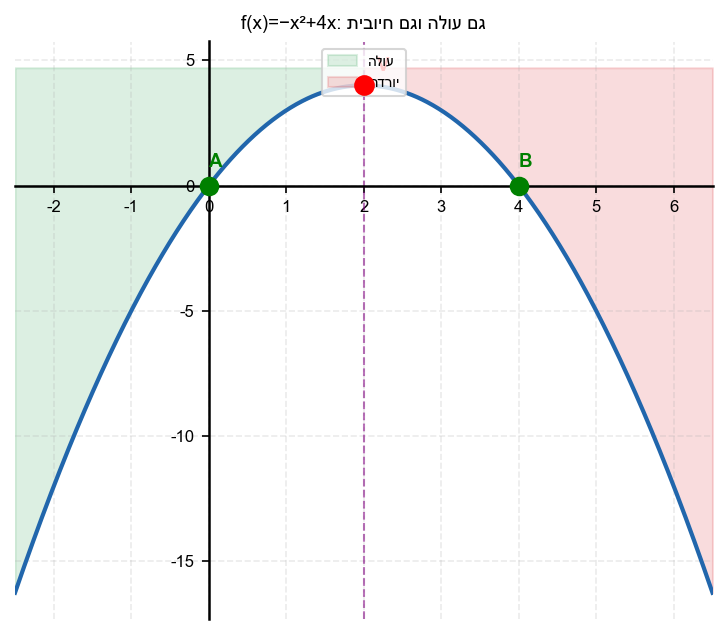

15. נתונה הפרבולה
$y = x^2 - 2x - 8$.
ציין: עבור אילו ערכי
$x$
הפונקציה גם יורדת וגם שלילית?

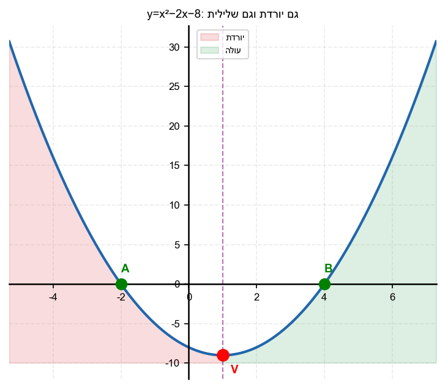

16. נתונות שתי פרבולות:
$y = x^2 - 6x + 5$
ו-
$y = -x^2 + 4x - 3$
.
השווה: מהם תחומי העלייה של כל אחת? האם ייתכן שתחומי העלייה של שתיהן יחפפו?

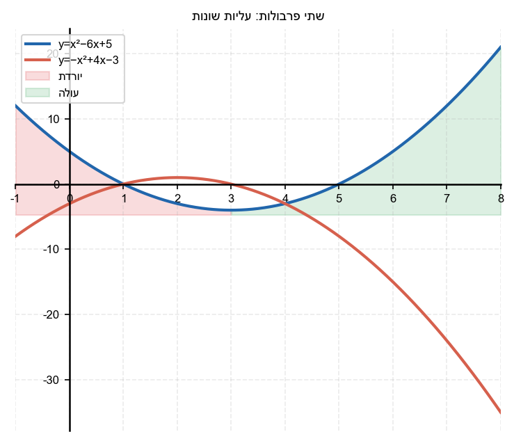

---

## רמה 3: רמת בחינת מה"ט (4 תרגילים)

17. מקור: מה"ט 2024

נתונה הפרבולה
$$y = x^2 + x - 12$$

א. מצא את קודקוד הפרבולה.

ב. עבור אילו ערכי
$x$
הפרבולה עולה?

ג. עבור אילו ערכי
$x$
הפרבולה גם עולה וגם שלילית?

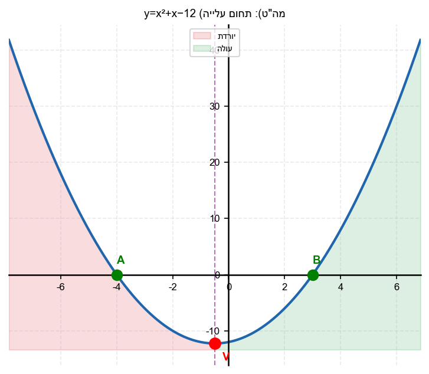

18. מקור: מה"ט 2024

נתונה הפרבולה
$$f(x) = -x^2 + 4x$$

א. מצא את הקודקוד.

ב. עבור אילו ערכי
$x$
הפונקציה עולה?

ג. עבור אילו ערכי
$x$
הפונקציה גם עולה וגם חיובית?

ד. מהי הנקודה שבה הפונקציה מגיעה לערכה המקסימלי?

19. מקור: מה"ט 2025

נתונות שתי פרבולות:
$$y = x^2 - 6x + 13$$
$$y = -x^2 + 8x - 7$$

א. מצא את קודקוד כל פרבולה.

ב. עבור אילו ערכי
$x$
הפרבולה הראשונה יורדת?
עבור אילו ערכי
$x$
הפרבולה השנייה יורדת?

ג. קבע: לאיזו פרבולה יש תחום עלייה רחב יותר לצד ימין של הקודקוד?

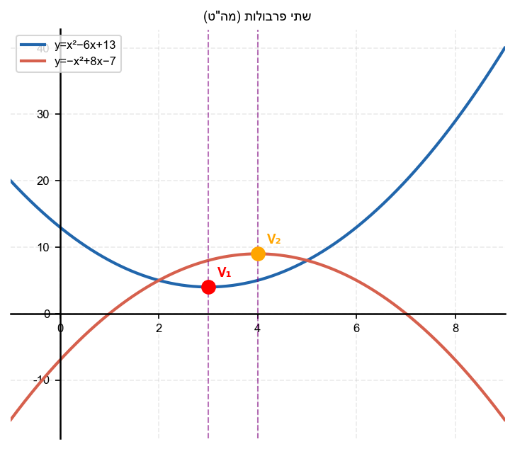

20. מקור: מה"ט 2024

נתונה הפרבולה
$$y = x^2 - 2 - x$$
(כתוב:
$y = x^2 - x - 2$
)

א. מצא את קודקוד הפרבולה.

ב. עבור
$-2 \leq x \leq 3$,
ציין בממה ערכי
$x$
הפרבולה עולה ובממה היא יורדת.

ג. ציין בממה ערכי
$x$
הפרבולה גם עולה וגם חיובית.

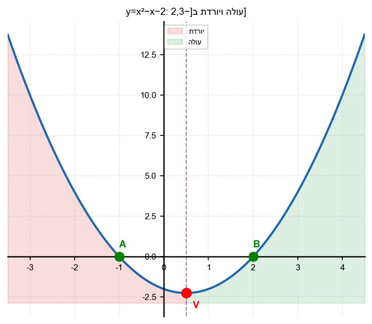

---

תשובות סופיות

1.
א.
יורדת
$x<2$
ב.
עולה
$x>2$

2.
א.
עולה
$x<3$
ב.
יורדת
$x>3$

3.
א.
עולה
$x>0$
ב.
ירידה
$x<0$

4.
ציר סימטריה:
$x=5$
ירידה:
$x<5$
עלייה:
$x>5$

5.
ציר סימטריה:
$x=2$
עלייה:
$x<2$
ירידה:
$x>2$

6.
א.
ציר סימטריה:
$x_v=-1$
ב.
ירידה:
$x<-1$
ג.
עלייה:
$x>-1$

7.
א.
קודקוד:
$(-2,9)$
ב.
עלייה:
$x<-2$
(פתוחה כלפי מטה)

8.
כי הפרבולה הפתוחה כלפי מעלה יורדת עד לנקודת המינימום (הקודקוד), ואחריה עולה; הקודקוד הוא נקודת המפנה

9.
א.
קודקוד:
$(1,-36)$
ב.
ירידה:
$x<1$
עלייה:
$x>1$
ג.
חיוביות:
$x<-5$
או
$x>7$
שליליות:
$-5<x<7$

10.
א.
קודקוד:
$\left(\frac{3}{2}, \frac{25}{4}\right)$
ב.
עלייה:
$x<\frac{3}{2}$
ירידה:
$x>\frac{3}{2}$
ג.
שורשים:
$(-1,0)$
ו
$(4,0)$
חיוביות:
$-1<x<4$
שליליות:
$x<-1$
או
$x>4$

11.
א.
קודקוד:
$\left(-\frac{1}{2},-\frac{49}{4}\right)$
ב.
ירידה:
$x<-\frac{1}{2}$
עלייה:
$x>-\frac{1}{2}$
חיוביות:
$x<-4$
או
$x>3$
שליליות:
$-4<x<3$

12.
א.
$x=0$
ו
$x=4$
ב.
קודקוד:
$(2,4)$
ג.
חיוביות:
$0<x<4$
ד.
עלייה:
$x<2$

13.
א.
שורשים:
$(2,0)$
ו
$(4,0)$
ב.
קודקוד:
$(3,-1)$
ג.
חיוביות:
$x<2$
או
$x>4$
ד.
עלייה:
$x>3$

14.
עלייה:
$0<x<2$
חיובית:
$0<x<4$
גם עולה וגם חיובית:
$0<x<2$

15.
ירידה:
$x<1$
שליליות:
$-2<x<4$
גם יורדת וגם שלילית:
$-2<x<1$

16.
פרבולה ראשונה:
עלייה:
$x>3$
פרבולה שנייה:
עלייה:
$x<2$
אין חפיפה – תחום עלייה שונה לחלוטין

17.
א.
$\left(-\frac{1}{2},-\frac{49}{4}\right)$
ב.
עלייה:
$x>-\frac{1}{2}$
ג.
גם עולה וגם שלילית:
; שלילית בין השורשים; גם עולה (
$x>-\frac{1}{2}$
) וגם שלילית (
$-4<x<3$
):
$-\frac{1}{2}<x<3$

18.
א.
$(2,4)$
ב.
עלייה:
$x<2$
(פרבולה כלפי מטה)
ג.
חיובית:
$0<x<4$
גם עולה וגם חיובית:
$0<x<2$
ד.
$(2,4)$

19.
א.
קודקוד פרבולה 1:
$(3,4)$
קודקוד פרבולה 2:
$(4,9)$
ב.
פרבולה 1 יורדת:
$x<3$
פרבולה 2 יורדת:
$x>4$
ג.
לפרבולה הראשונה תחום עלייה לצד ימין של הקודקוד:
$x>3$
לפרבולה השנייה אין תחום עלייה לצד ימין של הקודקוד:
$x>4$

20.
א.
$\left(\frac{1}{2},-\frac{9}{4}\right)$;
ב.
בתחום
$-2\leq x\leq 3$
יורדת:
$-2\leq x<\frac{1}{2}$
עולה:
$\frac{1}{2}<x\leq 3$;
ג.
גם עולה וגם חיובית:
$x>2$

