# יחידה 5.1 – חיתוך בין פרבולה לישר (מערכת משוואות)

---

## רמה 1: בניית ביטחון (8 תרגילים)

1. מצא את נקודות החיתוך של הפרבולה
$y = x^2$
עם הישר
$y = 4$.

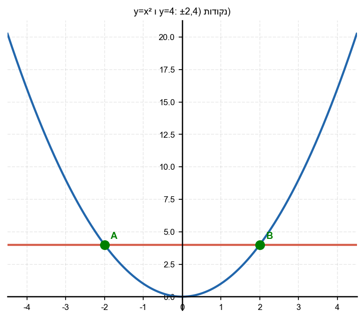

2. מצא את נקודות החיתוך של הפרבולה
$y = x^2$
עם הישר
$y = 2x$.

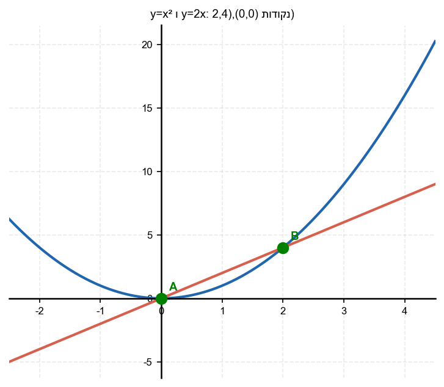

3. מצא את נקודות החיתוך של הפרבולה
$y = x^2 - 1$
עם הישר
$y = 3$.

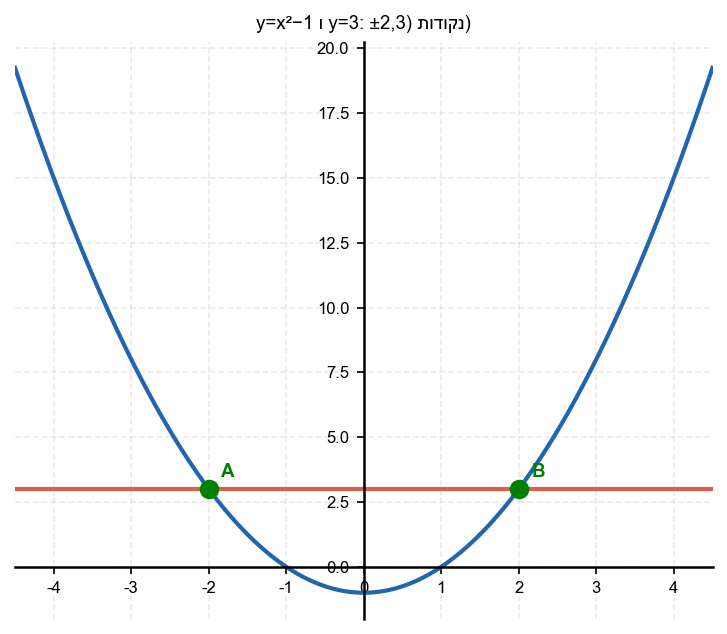

4. מצא את נקודות החיתוך של הפרבולה
$y = x^2 + 2x$
עם הישר
$y = 0$
(ציר
$x$
).

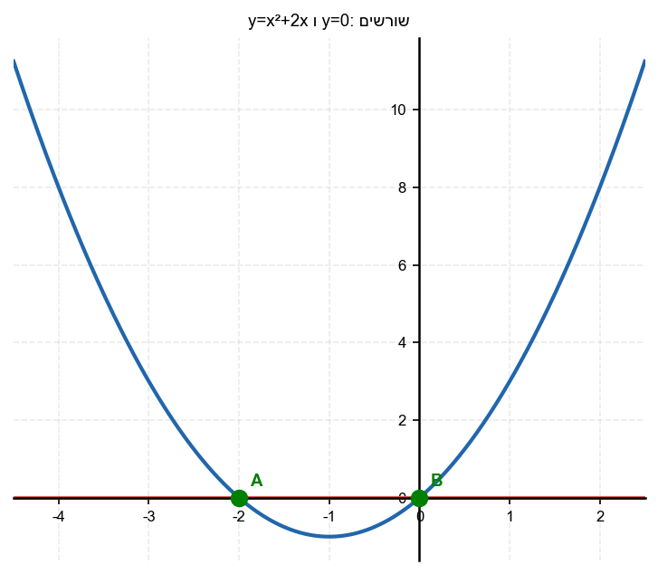

5. מצא את נקודות החיתוך של הפרבולה
$y = x^2 - 4$
עם הישר
$y = x + 2$.

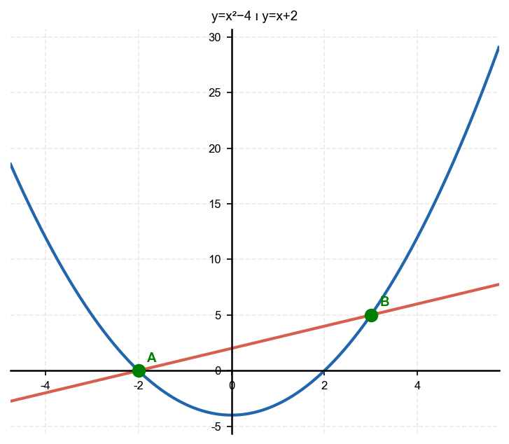

6. מצא את נקודות החיתוך של הפרבולה
$y = x^2$
עם הישר
$y = x + 6$.

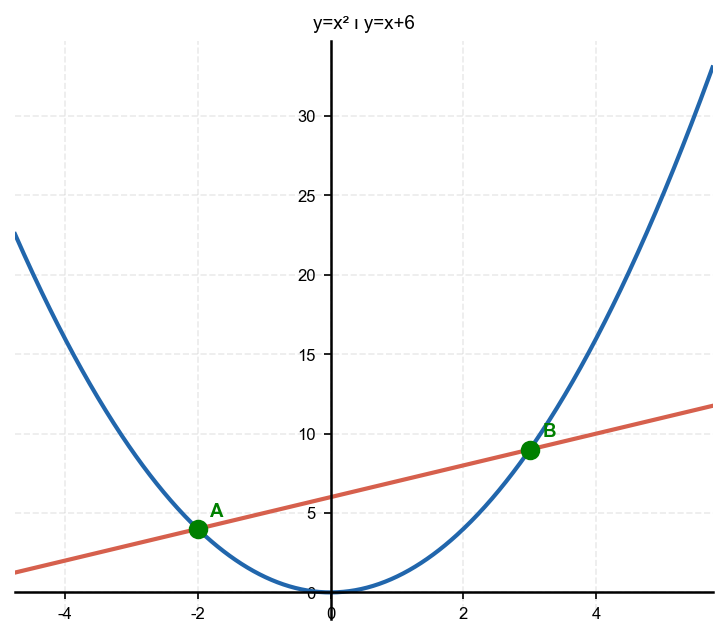

7. מצא את נקודות החיתוך של הפרבולה
$y = -x^2 + 4$
עם הישר
$y = -x + 2$.

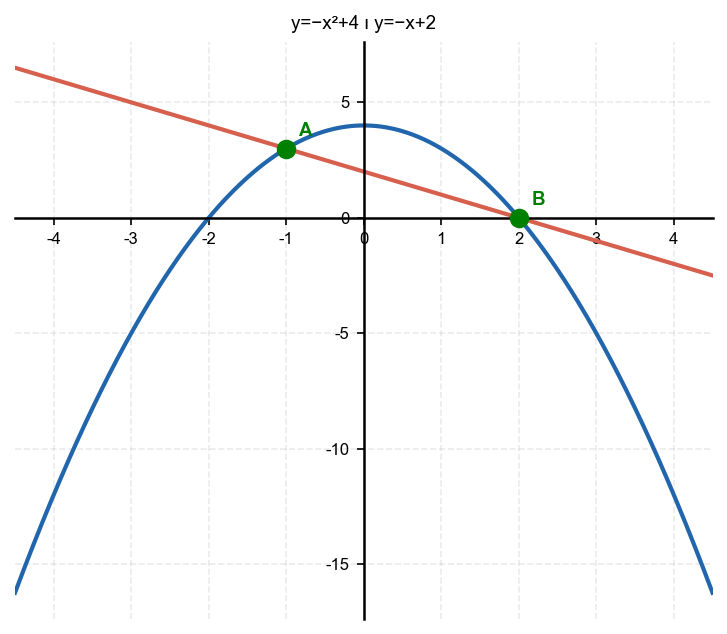

8. מצא את נקודות החיתוך של הפרבולה
$y = x^2 + 3$
עם הישר
$y = 4$.
כמה נקודות חיתוך יש?

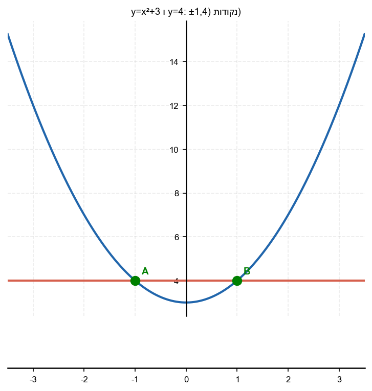

---

## רמה 2: תרגול שוטף ומשולב (8 תרגילים)

9. מצא את נקודות החיתוך של הפרבולה
$y = x^2 - 2x - 4$
עם הישר
$y = x + 6$.

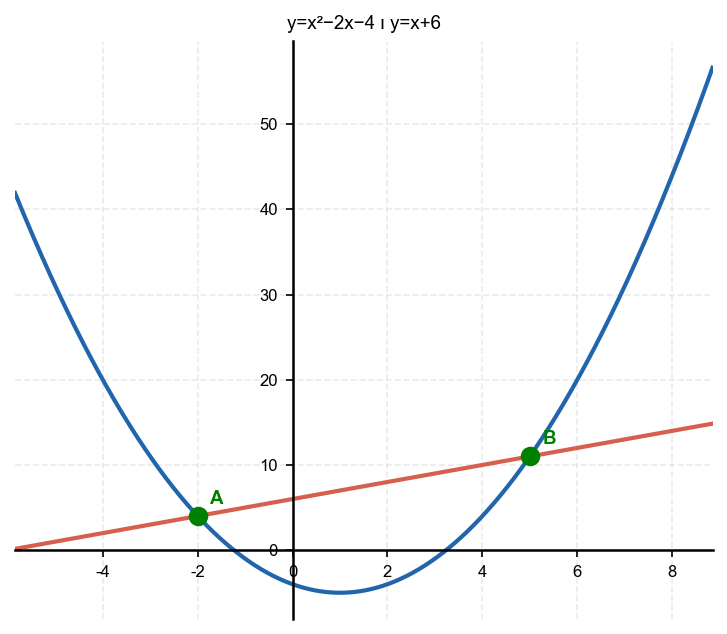

10. מצא את נקודות החיתוך של הפרבולה
$y = x^2 - 5x - 1$
עם הישר
$y = -3x + 7$.

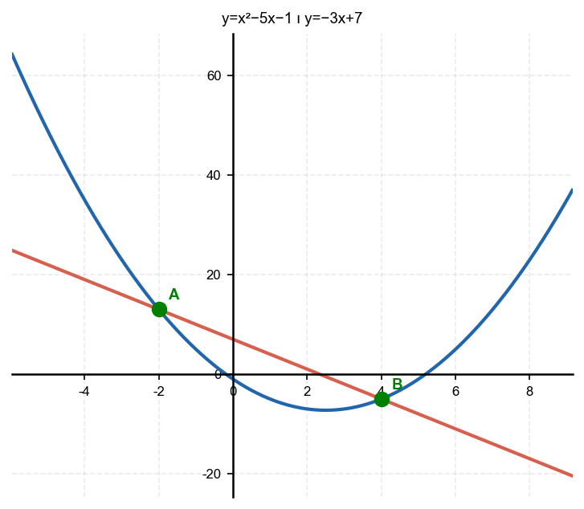

11. מצא את נקודות החיתוך של הפרבולה
$y = -x^2 + 8x - 9$
עם הישר
$y = x + 1$.

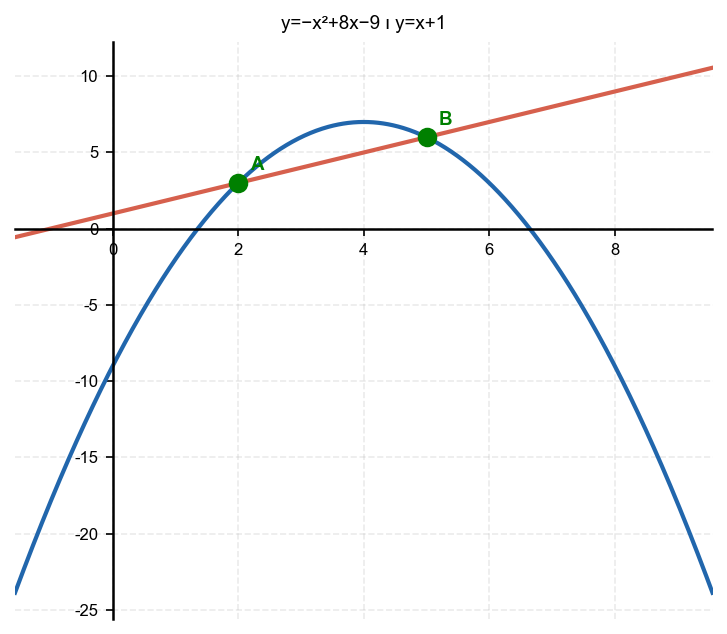

12. מצא את נקודות החיתוך של הפרבולה
$y = x^2$
עם הישר
$y = 3x + 4$.
ציין גם את הקודקוד (נקודה
$D$
).

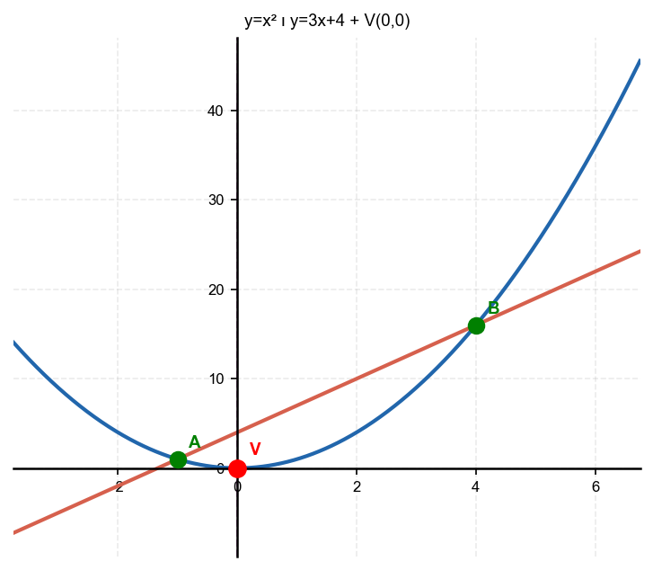

13. מצא את נקודות החיתוך של הפרבולה
$y = -x^2 + 6x - 4$
עם הישר
$y = -x^2 + 11x - 24$
(חיתוך בין שתי פרבולות).

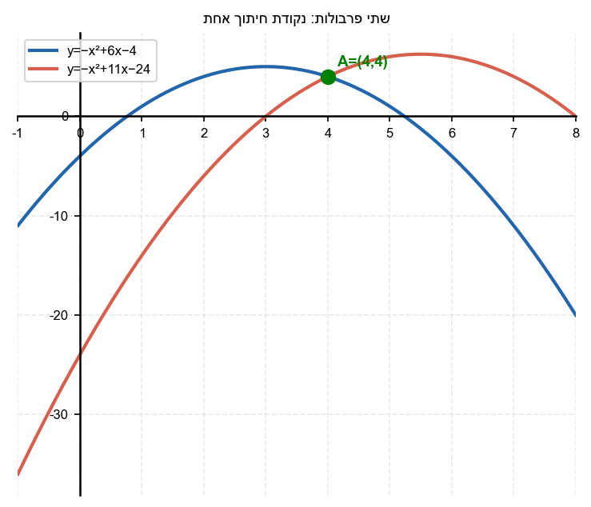

14. עבור אילו ערכי
$k$
הישר
$y = k$
יחתוך את הפרבולה
$y = x^2 - 4x + 3$
בשתי נקודות? בנקודה אחת? כלל לא?

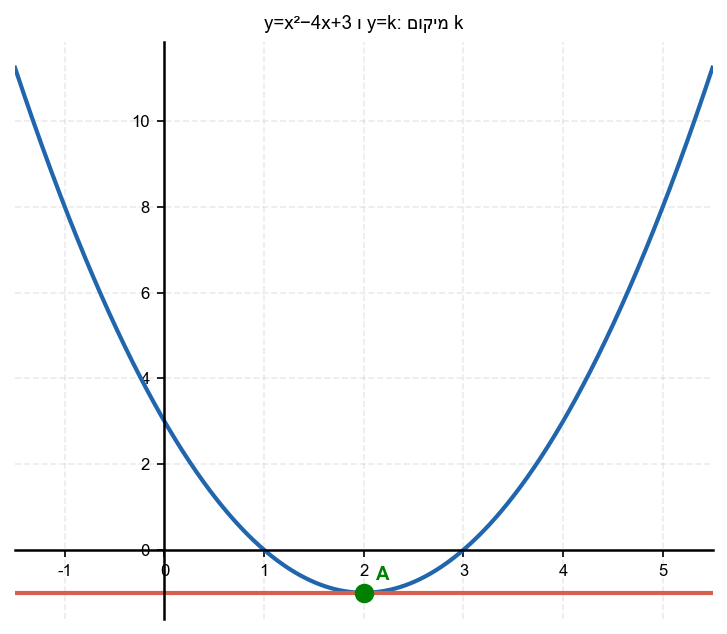

15. נתונה הפרבולה
$y = x^2 - 2x - 8$
והישר
$y = x - 2$.
א. מצא את נקודות החיתוך.
ב. מהו אורך הקטע המחבר את נקודות החיתוך?

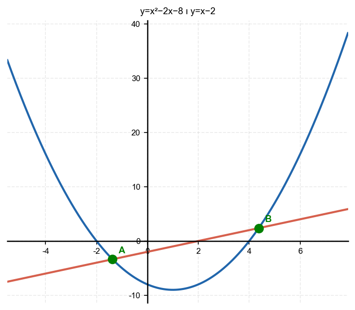

16. נתונה הפרבולה
$y = -x^2 + 2x + 8$
והישר
$y = x + 4$.
א. מצא את נקודות החיתוך.
ב. האם הישר נמצא מתחת לפרבולה, מעליה, או חותך אותה בין נקודות החיתוך?

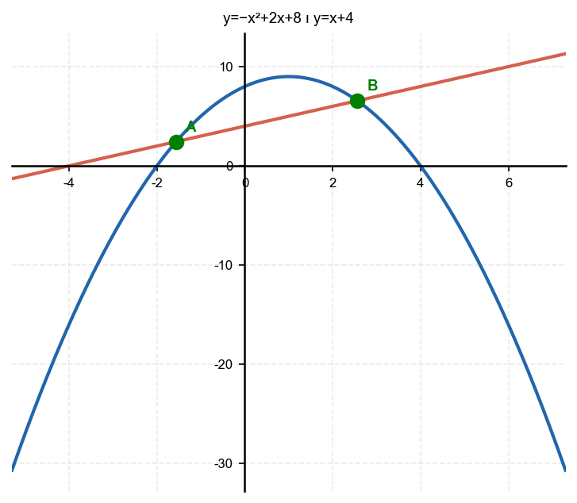

---

## רמה 3: רמת בחינת מה"ט (4 תרגילים)

17. מקור: מה"ט 2023

נתונה הפרבולה
$$y = x^2 - 2x - 4$$
ונתון הישר
$$y = x + 6$$

שתי נקודות החיתוך הן
$A$
ו-
$B$
. קודקוד הפרבולה הוא
$C$
.
נקודה
$D$
היא היטל
$A$
על ציר
$x$
.
נקודה
$E$
היא נקודת האמצע של
$AB$
על ציר
$x$
.

א. מצא את קואורדינטות
$A$
,
$B$
,
$C$
.

ב. מצא את שטח המשולש
$ADE$
.

ג. מצא את קואורדינטות נקודת החיתוך של הישר עם ציר
$x$
.

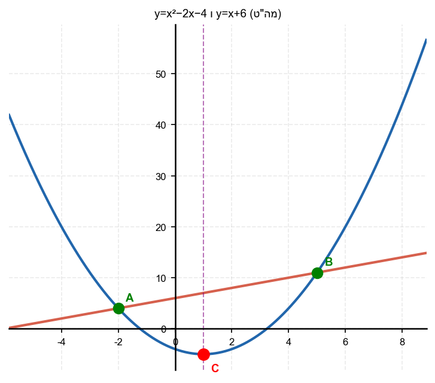

18. מקור: מה"ט 2025

נתונה הפרבולה
$$y = x^2$$
ונתון הישר
$$y = 3x + 4$$

שתי נקודות החיתוך הן
$A$
ו-
$B$
.
קודקוד הפרבולה הוא
$D$
(נמצא בראשית הצירים).
ההיטל האנכי של
$B$
על ציר
$x$
הוא
$C$
.

א. מצא את
$A$
ו-
$B$
.

ב. מצא את שטח המשולש
$BCD$
.

ג. מצא את אורך הקטע
$AB$
.

19. מקור: מה"ט 2024

נתונה הפרבולה
$$y = x^2 - 5x - 1$$
ונתון הישר
$$y = -3x + 7$$

שתי נקודות החיתוך הן
$A$
ו-
$B$
, וקודקוד הפרבולה הוא
$C$
.

א. מצא את
$A$
,
$B$
,
$C$
.

ב. מצא את שטח המשולש
$ABC$
.

ג. מצא את אורך הקטע
$AB$
.

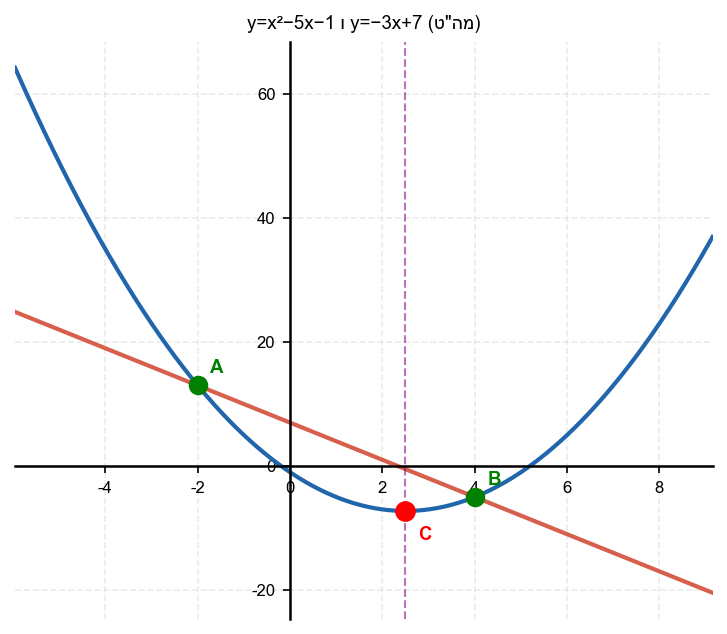

20. מקור: מה"ט 2025

נתונה הפרבולה
$$y = -x^2 + 8x - 9$$
ונתון הישר
$$y = x + 1$$

שתי נקודות החיתוך הן
$A$
ו-
$B$
, וקודקוד הפרבולה הוא
$C$
.

א. מצא את
$A$
,
$B$
,
$C$
.

ב. מצא את אורך הקטע
$AB$
.

ג. מצא את שטח המשולש
$ABC$
.

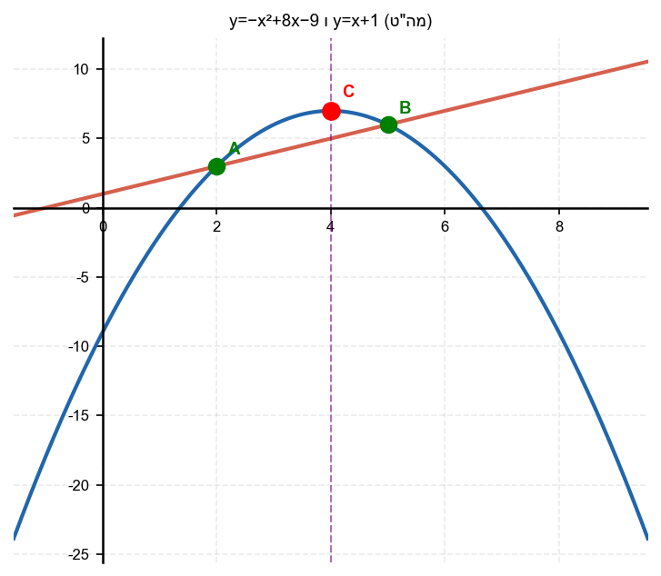

---

תשובות סופיות

1. $(-2,4)$ו-$(2,4)$
2. $(0,0)$ו-$(2,4)$
3. $(-2,3)$ו-$(2,3)$
4. $(0,0)$ו-$(-2,0)$
5. $(3,5)$ו-$(-2,0)$
6. $(3,9)$ו-$(-2,4)$
7. $(2,0)$ו-$(-1,3)$
8. $(-1,4)$ו-$(1,4)$
9. $A(-2,4)$ו-$B(5,11)$
10. $A(-2,13)$ו-$B(4,-5)$
11. $A(2,3)$ו-$B(5,6)$
12. $-1$כלל לא:$k<-1$
13. נקודת חיתוך יחידה: $(4, 4)$
14. שתי נקודות: $k > -1$; נקודה אחת (משיק): $k = -1$; אין חיתוך: $k < -1$
15. א. $x=\dfrac{3\pm\sqrt{33}}{2}$ ב. $\sqrt{66}$
16. א. $x=\dfrac{1\pm\sqrt{17}}{2}$ ב. הפרבולה מעל הישר בין נקודות החיתוך
17. א. $A(-2,4),\ B(5,11),\ C(1,-5)$ ב. $7$ ג. $(-6,0)$
18. א. $A(-1,1),\ B(4,16)$ ב. $32$ ג. $5\sqrt{10}$
19. א. $A(-2,13),\ B(4,-5),\ C\left(\dfrac{5}{2},-\dfrac{29}{4}\right)$ ב. $\dfrac{81}{4}$ ג. $6\sqrt{10}$
20. א. $A(2,3),\ B(5,6),\ C(4,7)$ ב. $3\sqrt{2}$ ג. $3$

