# יחידה 5.2 – הזזות בסיסיות של פרבולות (ימינה/שמאלה, למעלה/למטה)

---

## רמה 1: בניית ביטחון (8 תרגילים)

1. כתוב את משוואת הפרבולה
$y = x^2$
לאחר הזזה:
א.
$3$
יחידות למעלה
ב.
$5$
יחידות למטה

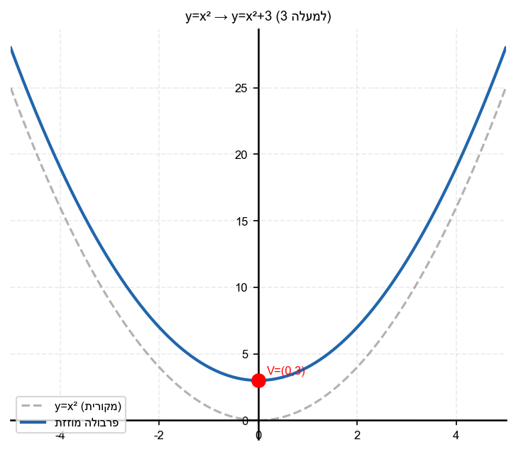

2. כתוב את משוואת הפרבולה
$y = x^2$
לאחר הזזה:
א.
$2$
יחידות ימינה
ב.
$4$
יחידות שמאלה

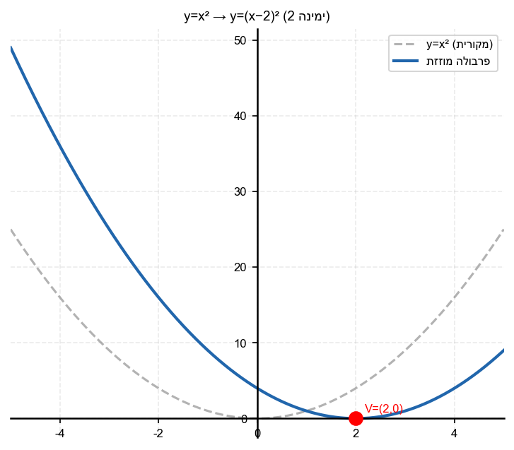

3. כתוב את משוואת הפרבולה
$y = x^2$
לאחר הזזה של
$3$
יחידות ימינה ו-
$4$
יחידות למעלה.

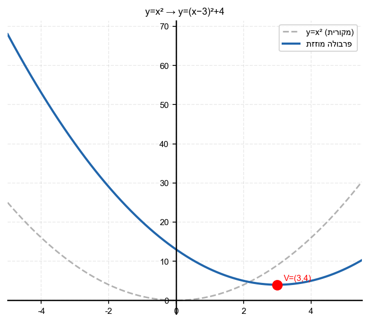

4. כתוב את משוואת הפרבולה
$y = x^2$
לאחר הזזה של
$1$
יחידה שמאלה ו-
$2$
יחידות למטה.

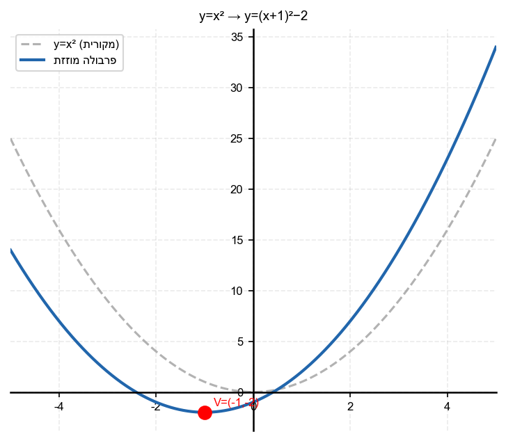

5. נתונה הפרבולה
$y = (x-3)^2 + 2$.
א. מהו קודקוד הפרבולה?
ב. כיצד הזזת את
$y = x^2$
כדי לקבל פרבולה זו?

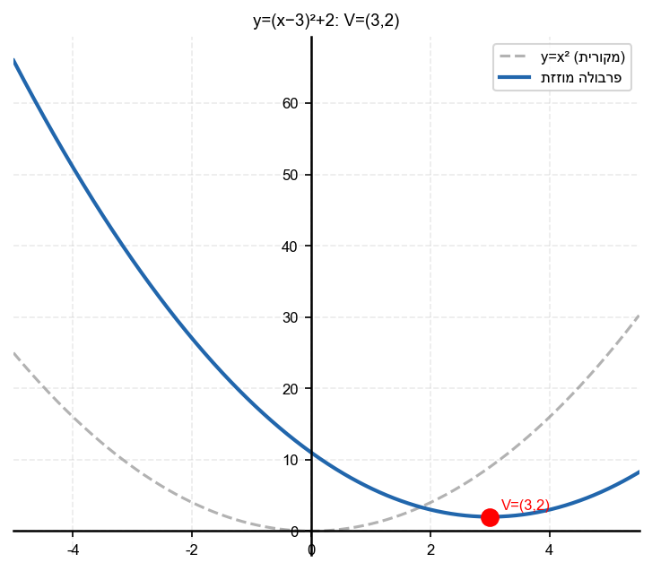

6. נתונה הפרבולה
$y = (x+2)^2 - 5$.
מהו קודקוד הפרבולה?

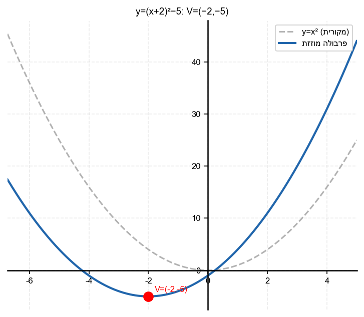

7. נתונה הפרבולה
$y = (x-1)^2$.
א. מהו קודקוד הפרבולה?
ב. מהי נקודת החיתוך עם ציר
$y$
?

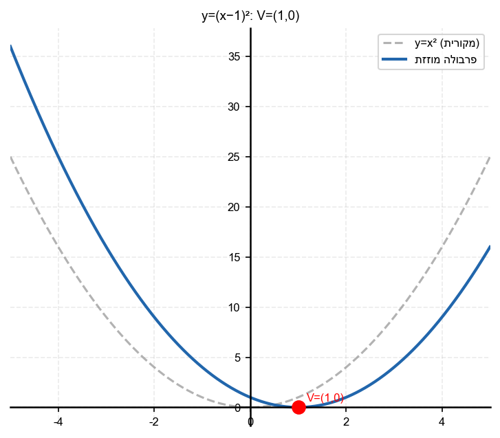

8. כתוב בצורת הזזה
$y = (x-h)^2 + k$:
$y = x^2 - 6x + 11$
(רמז: השלם לריבוע)

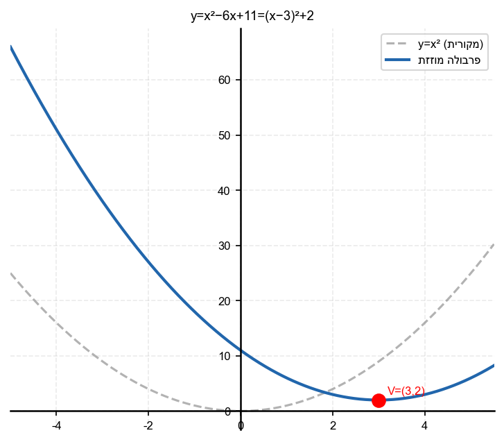

---

## רמה 2: תרגול שוטף ומשולב (8 תרגילים)

9. נתונה הפרבולה
$y = x^2$.
הזזנו אותה
$3$
יחידות ימינה ו-
$4$
יחידות למטה.
א. כתוב את משוואת הפרבולה החדשה בצורת הזזה.
ב. פתח לצורה הסטנדרטית.
ג. מהו הקודקוד?

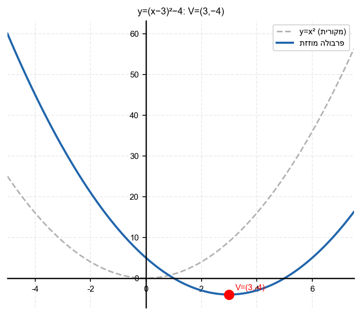

10. נתונה הפרבולה
$y = (x-5)^2$.
א. מהו קודקוד הפרבולה?
ב. מהי נקודת החיתוך עם ציר
$y$
?
ג. האם הפרבולה חותכת את ציר
$x$
? (כמה פעמים?)

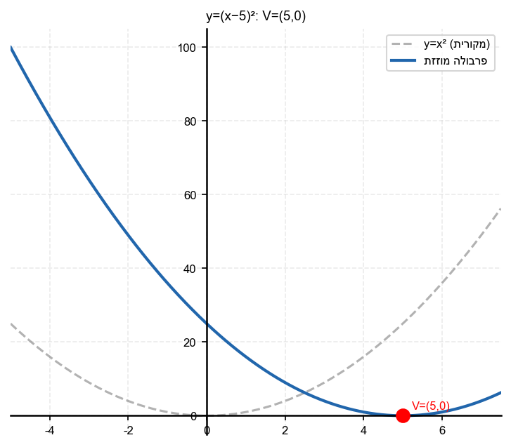

11. השלם לריבוע ומצא את הקודקוד:
$y = x^2 - 4x + 7$

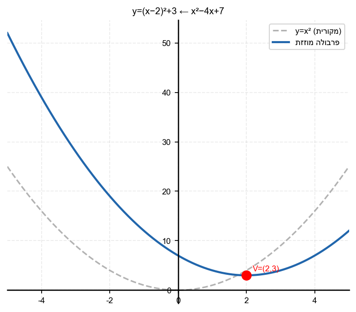

12. השלם לריבוע ומצא את הקודקוד:
$y = x^2 + 6x + 5$

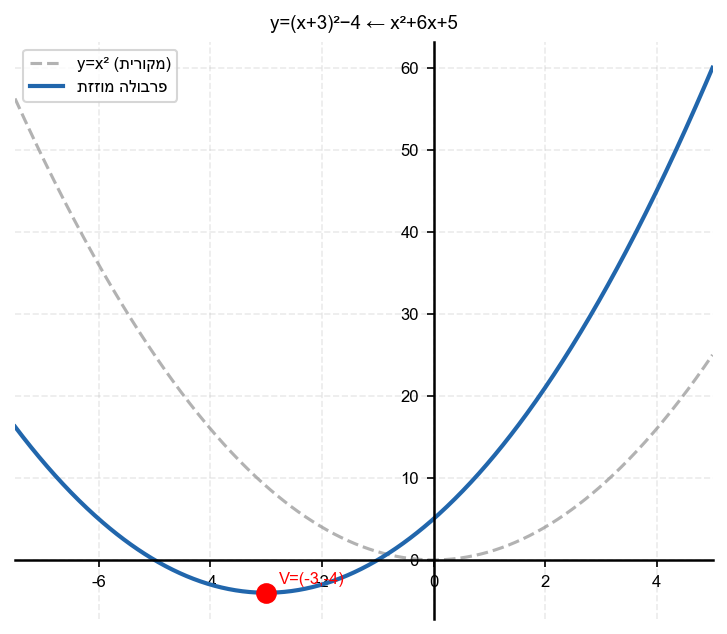

13. נתונה הפרבולה
$y = x^2$
הוזזה
$a$
יחידות ימינה ו-
$b$
יחידות למעלה.
ידוע שהקודקוד נמצא ב-
$(3, -2)$
.
כתוב את משוואת הפרבולה.

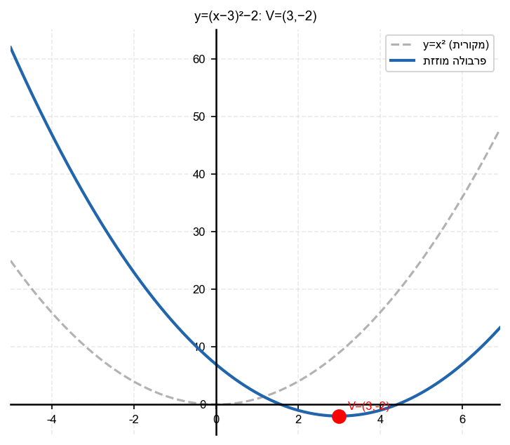

14. נתונה הפרבולה
$y = (x-5)^2$
ופרבולה שנייה
$y = -x^2 + 8x - 11$.
א. מצא את נקודות החיתוך של שתי הפרבולות.
ב. מהי הנקודה הגבוהה יותר מבין שתי נקודות החיתוך?

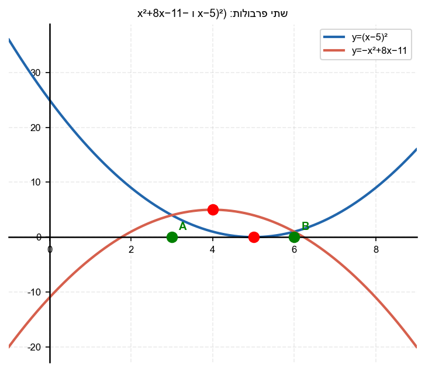

15. כתוב את משוואות הפרבולות הבאות בצורת הזזה
$y = a(x-h)^2 + k$
ומצא את הקודקוד:
א.
$y = x^2 - 8x + 12$
ב.
$y = -x^2 + 6x - 5$

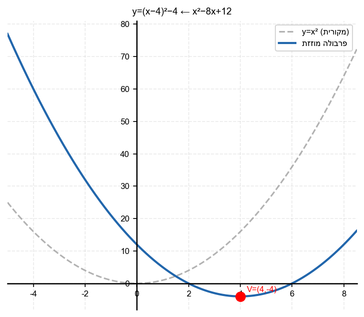

16. נתונות שתי פרבולות:
$y = x^2 - 6x + 13$
ו-
$y = -x^2 + 8x - 7$
.
א. כתוב כל אחת בצורת הזזה.
ב. מצא את הקודקוד של כל אחת.
ג. האם שתי הפרבולות חותכות זו את זו? (השוה את המשוואות)

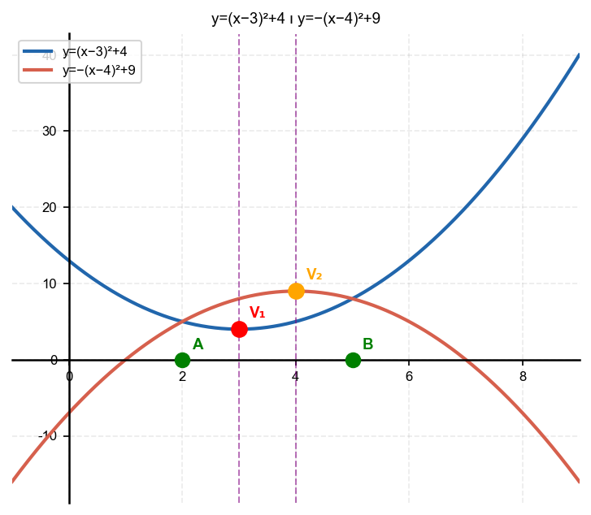

---

## רמה 3: רמת בחינת מה"ט (4 תרגילים)

17. מקור: מה"ט 2023

נתונה הפרבולה
$$y = x^2$$
הוזזה
$3$
יחידות ימינה ו-
$4$
יחידות למעלה.

א. כתוב את משוואת הפרבולה החדשה.

ב. מהו קודקוד הפרבולה החדשה?

ג. מצא את נקודת החיתוך של הפרבולה החדשה עם ציר
$y$
.

ד. מצא את נקודות החיתוך של הפרבולה החדשה עם ציר
$x$
(אם יש).

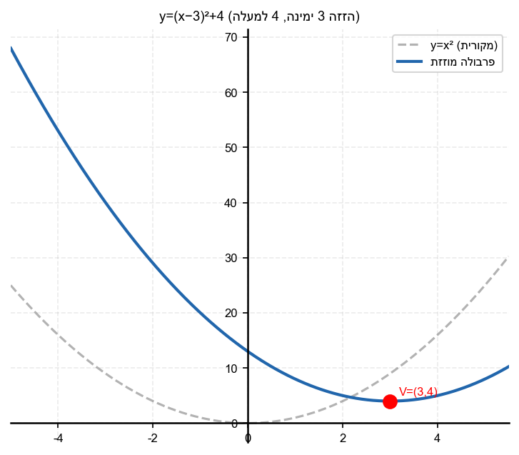

18. מקור: מה"ט 2024

נתונות שתי פרבולות:
$$y = -x^2 + 8x - 11$$
$$y = (x-5)^2$$

א. כתוב את הפרבולה הראשונה בצורת הזזה.

ב. כתוב את קודקוד כל פרבולה.

ג. מצא את נקודות החיתוך
$A$
ו-
$B$
של שתי הפרבולות.

ד. מצא את מרחק
$AB$
.

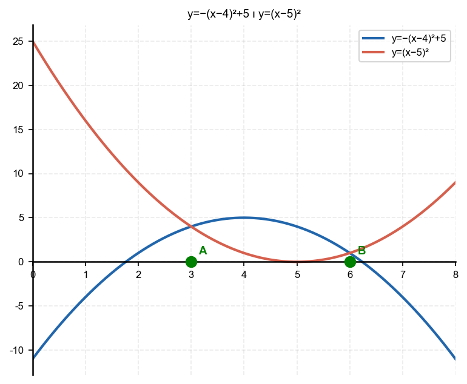

19. מקור: מה"ט 2025

נתונות שתי פרבולות:
$$y = x^2 - 6x + 13$$
$$y = -x^2 + 8x - 7$$

א. כתוב כל פרבולה בצורת הזזה ומצא את קודקודיהן.

ב. מצא את נקודות החיתוך של שתי הפרבולות.

ג. האם שתי הפרבולות חותכות את ציר
$x$
? (השתמש בדיסקרימיננטה)

ד. ציין את ציר הסימטריה של כל פרבולה.

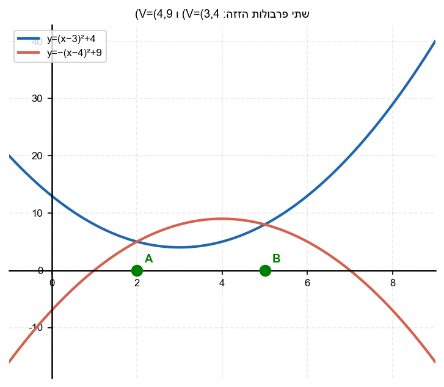

20. מקור: מה"ט 2024

נתונה הפרבולה
$$y = x^2$$
שהוזזה ימינה ב-
$5$
יחידות ונגיעה בנקודה
$(a, b)$
עם הישר
$$y = 3x + 4$$

א. כתוב את משוואת הפרבולה המוזזת.

ב. מצא את נקודות החיתוך של הפרבולה המוזזת עם הישר.

ג. מצא את קודקוד הפרבולה המוזזת.

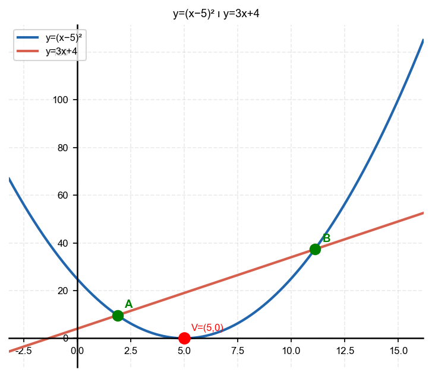

---

תשובות סופיות

1.
א.
$y = x^2 + 3$;
ב.
$y = x^2 - 5$

2.
א.
$y = (x-2)^2$;
ב.
$y = (x+4)^2$

3. $y = (x-3)^2 + 4$

4. $y = (x+1)^2 - 2$

5.
א.
קודקוד
$(3, 2)$;
ב.
הזזה
$3$
ימינה,
$2$
למעלה

6. קודקוד
$(-2, -5)$

7.
א.
קודקוד
$(1,0)$
ב.
$\left(0,1\right)$
נקודת החיתוך
$\left(0,1\right)$

8.
$y=x^2-6x+11=(x-3)^2+2$
קודקוד
$\left(3,2\right)$

9.
א.
$y=(x-3)^2-4$
ב.
$x^2-6x+5$
ג.
$(3,-4)$

10.
א.
$(5,\,0)$
ב.
$y(0)=25$
ו־
$(0,\,25)$
ג.
פעם אחת בציר
$x$
והחיתוך הוא
$\left(5,\,0\right)$

11.
$y=x^{2}-4x+7=(x-2)^{2}+3$
קודקוד
$\left(2,\,3\right)$

12.
$y=x^{2}+6x+5=(x+3)^{2}-4$
קודקוד
$\left(-3,\,-4\right)$

13. $y = (x-3)^2 - 2$

14.
א.
(x-3)(x-6)=$0$
;$A$(3,4)$,$B$(6,1)$ ;
ב.
$A$(3,4)$
גבוהה יותר

15.
א.
$y=(x-4)^2-4$
; קודקוד
$(4,-4)$;
ב.
$y=-(x-3)^2+4$
; קודקוד
$(3,4)$

16.
א.
$y=(x-3)^2+4$; $y=-(x-4)^2+9$;
ב.
$(3,4)$
ו-
$(4,9)$;
ג.
(x-2)(x-5)=0$
; כן, חותכות ב
$(2,5)$
ו-
$(5,8)$

17.
א.
y=(x-3)^2+$4$;
ב.
קודקוד
$(3,4)$;
ג.
$13$
; חיתוך ציר
$y$:$
$(0,13)$;
ד.
(x-3)^2=-4$
; אין פתרון ממשי; הפרבולה לא חותכת ציר
$x$

18.
א.
-(x-4)^2+$5$;
ב.
פרבולה ראשונה:
$(4,5)$
; פרבולה שנייה:
$(5,0)$;
ג.
(x-3)(x-6)=0$
;$A$(3,4)$,$B$(6,1)$;
ד.
$3\sqrt{2}$

19. $(2,5)$
ו-
$(5,8)$;
ג.
$\Delta_1=-16$
ולכן לא חותכת
$\Delta_2=36$
ולכן כן
$(1,0)$
ו-
$(7,0)$;
ד.
$x=3$
ו-
$x=4$

20.
א.
$y=(x-5)^2+\frac{85}{4}$;
ב.
$\left(\frac{13}{2},\frac{47}{2}\right)$;
ג.
$(5,\frac{85}{4})$

