# יחידה 5.3 – חישובי שטחים והיקפים של צורות הנדסיות הקשורות לפרבולה

---

## רמה 1: בניית ביטחון (8 תרגילים)

1. נתונות שתי נקודות:
$A(-3, 0)$
ו-
$B(5, 0)$
.
א. מהו אורך הקטע
$AB$
?
ב. אם נקודה
$C$
נמצאת בגובה
$y = 4$
ובדיוק מעל
$AB$
, מהו שטח המשולש
$ABC$
?

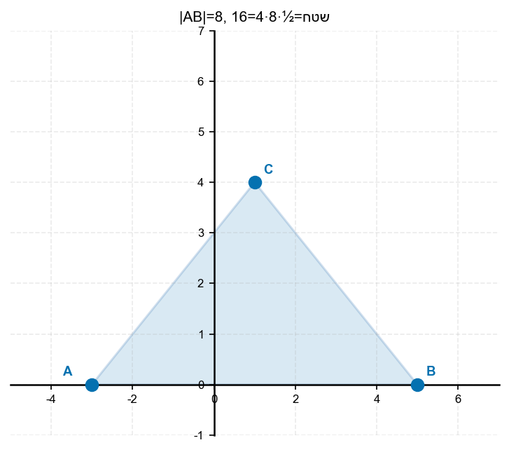

2. נתונות שלוש נקודות:
$A(0, 0)$
,
$B(6, 0)$
,
$C(3, 8)$
.
חשב את שטח המשולש
$ABC$
.

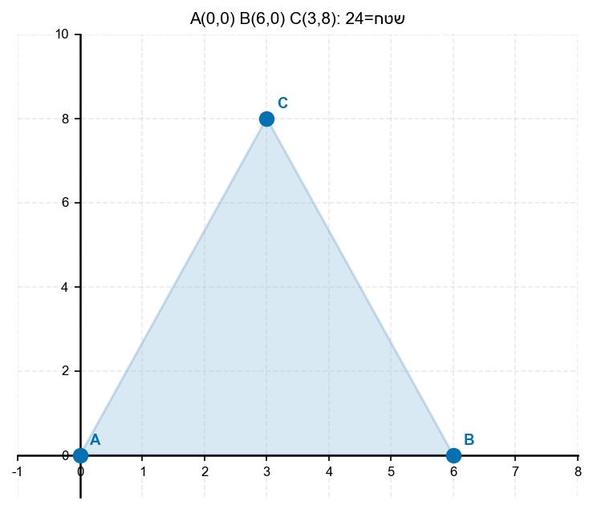

3. נתונות שלוש נקודות:
$A(-2, 0)$
,
$B(4, 0)$
,
$C(1, 5)$
.
חשב את שטח המשולש
$ABC$
.

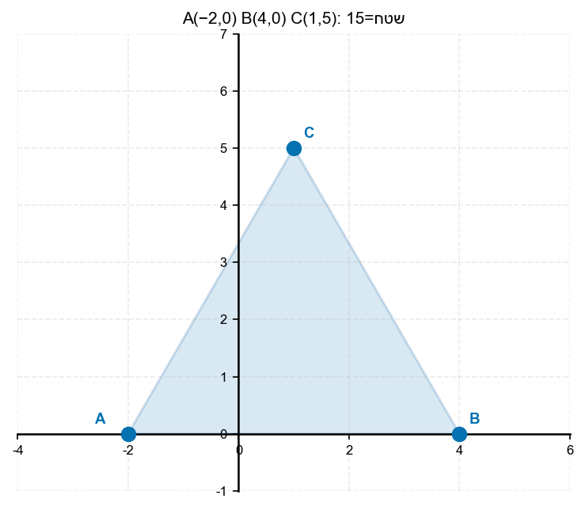

4. נתון טרפז
$ABCD$
שבסיסיו הם
$AB$
ו-
$CD$
, כאשר
$A(-3, 0)$, $B(5, 0)$, $C(3, 4)$, $D(-1, 4)$.
חשב את שטח הטרפז.
(נוסחה:
$S = \frac{(b_1 + b_2) \cdot h}{2}$
)

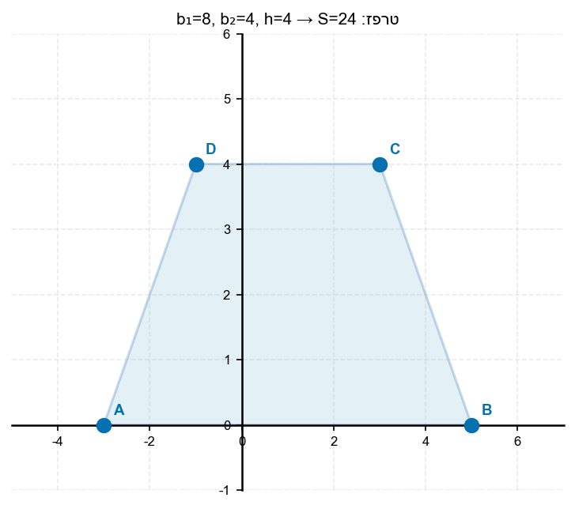

5. נתונות שתי נקודות:
$P(1, 3)$
ו-
$Q(7, 3)$
.
א. מהו אורך הקטע
$PQ$
?
ב. מה הגובה מ-
$P$
ו-
$Q$
לציר
$x$
?

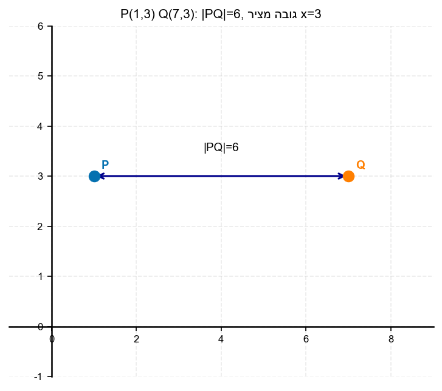

6. נתון ריבוע
$ABCD$
:
$A(0, 0)$, $B(4, 0)$, $C(4, 4)$, $D(0, 4)$.
חשב את שטח הריבוע ואת היקפו.

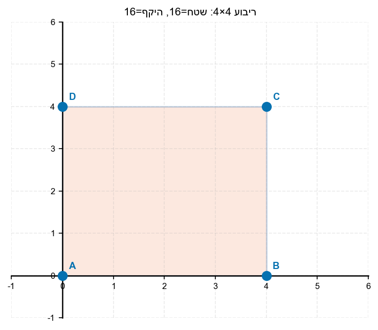

7. מהו שטח המשולש שצלעותיו הן: בסיס =
$8$
יחידות, גובה =
$6$
יחידות?

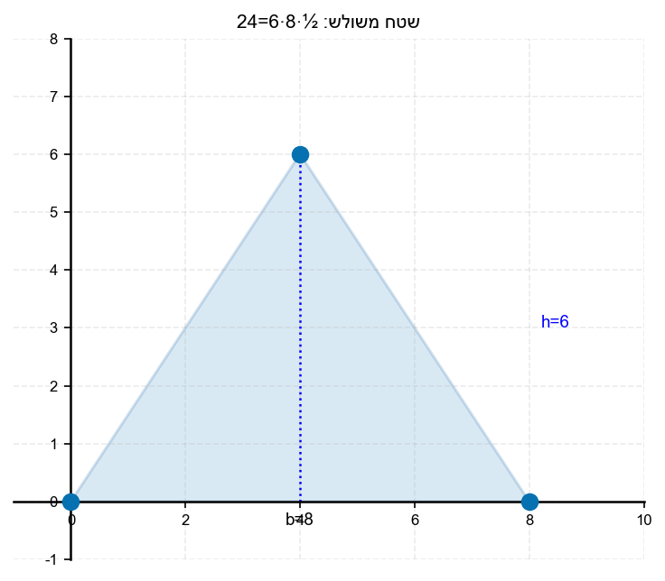

8. מהו שטח הטרפז שבסיסיו
$4$
ו-
$10$
יחידות וגובהו
$5$
יחידות?

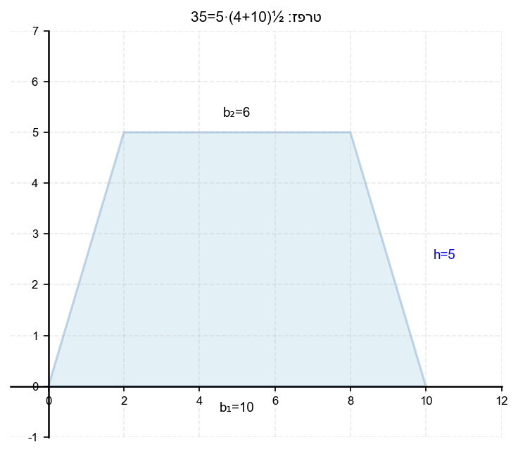

---

## רמה 2: תרגול שוטף ומשולב (8 תרגילים)

9. נתונה הפרבולה
$y = x^2 - 4$
החותכת את ציר
$x$
ב-
$A$
ו-
$B$
.
הקודקוד הוא
$C$
.
א. מצא את
$A$
,
$B$
,
$C$
.
ב. חשב את שטח המשולש
$ABC$
.

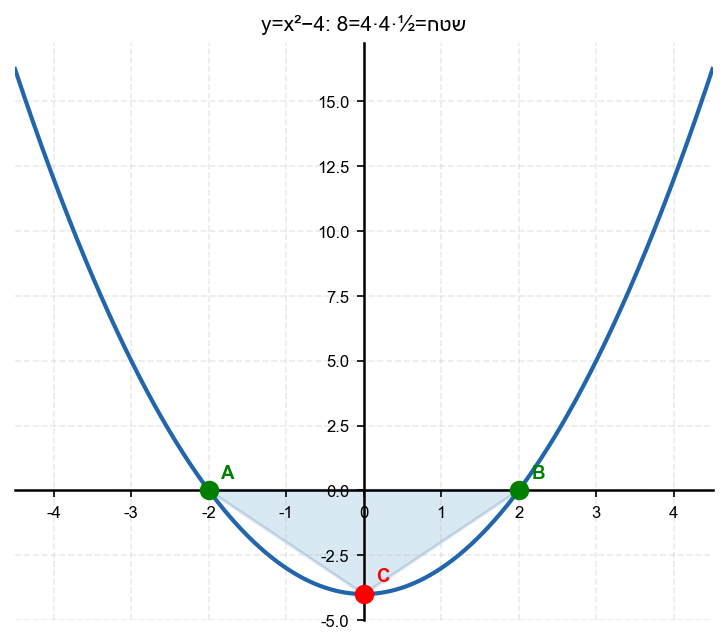

10. נתונה הפרבולה
$y = x^2 - 2x - 8$
החותכת את ציר
$x$
ב-
$A$
ו-
$B$
.
הקודקוד הוא
$C$
.
א. מצא את
$A$
,
$B$
,
$C$
.
ב. חשב את שטח המשולש
$ABC$
.

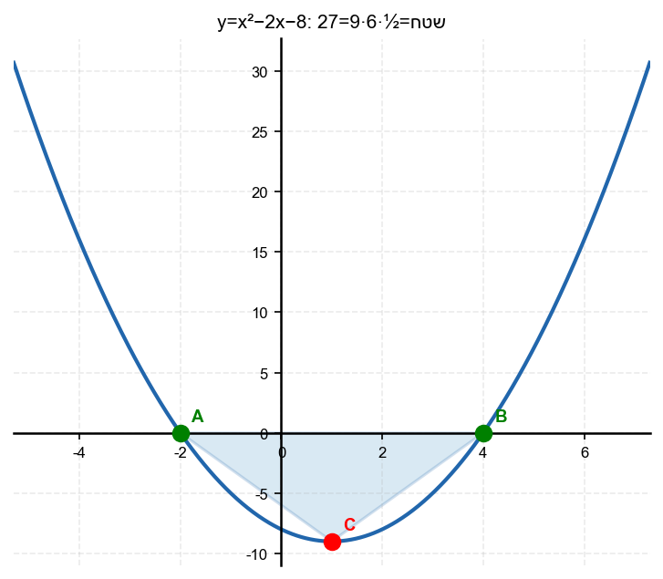

11. נתונה הפרבולה
$y = -x^2 + 2x + 8$.
הפרבולה חותכת את ציר
$x$
ב-
$A$
ו-
$D$
, ואת ציר
$y$
ב-
$B$
.
הקטע
$BC$
ניצב לציר
$x$
.
א. מצא את
$A$
,
$B$
,
$D$
ואת
$C$
(הנקודה הסימטרית ל-
$B$
).
ב. חשב את שטח הטרפז
$ABDC$
(בסיסים:
$AD$
ו-
$BC$
).

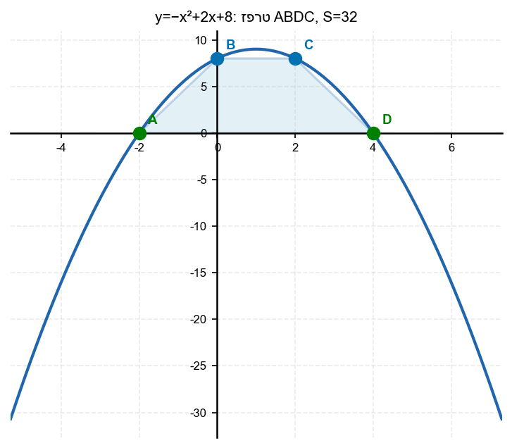

12. נתונה הפרבולה
$y = x^2 - 4x + 5$.
נקודה
$A$
על ציר
$y$
, ונקודה
$B$
הסימטרית ל-
$A$
.
הקודקוד הוא
$C$
.
א. מצא את
$A$
,
$B$
,
$C$
.
ב. חשב את שטח המשולש
$ABC$
.

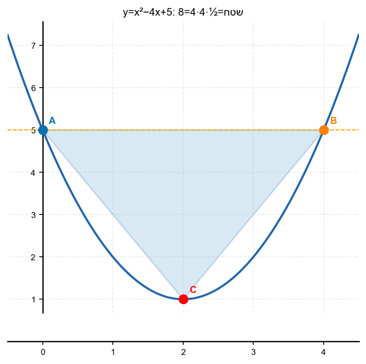

13. נתונה הפרבולה
$y = x^2 - 2x - 4$
ונתון הישר
$y = x + 6$.
שתי נקודות החיתוך הן
$A$
ו-
$B$
.
א. מצא את
$A$
ו-
$B$
.
ב. חשב את אורך הקטע
$AB$
.
ג. מצא את שטח המשולש
$ABC$
כאשר
$C$
הוא הקודקוד.

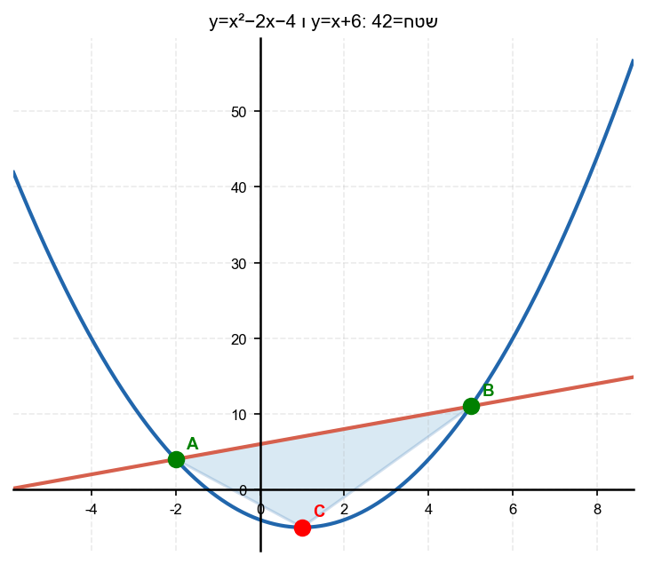

14. נתונה הפרבולה
$y = -x^2 + 3x + 4$.
א. מצא את
$A$
,
$B$
(חיתוכים עם ציר
$x$
) ואת
$C$
(קודקוד).
ב. חשב את שטח המשולש
$ABC$
.
ג. חשב את היקף המשולש
$ABC$
.

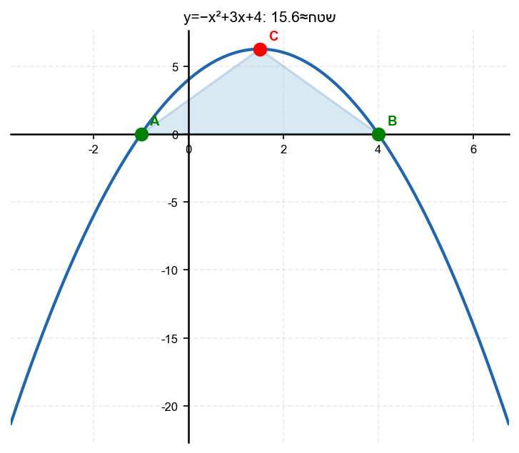

15. נתונה הפרבולה
$y = x^2$
ונתון הישר
$y = x + 6$.
א. מצא את
$A$
ו-
$B$
.
ב. חשב את שטח המשולש כאשר
$D(0,0)$
הוא הקודקוד.

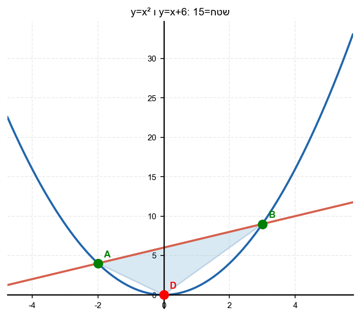

16. נתונה הפרבולה
$y = -x^2 + 8x - 7$.
חותכת את ציר
$x$
ב-
$A$
ו-
$B$
, ואת ציר
$y$
ב-
$C$
.
א. מצא את
$A$
,
$B$
,
$C$
.
ב. חשב את שטח המשולש
$ABC$
.

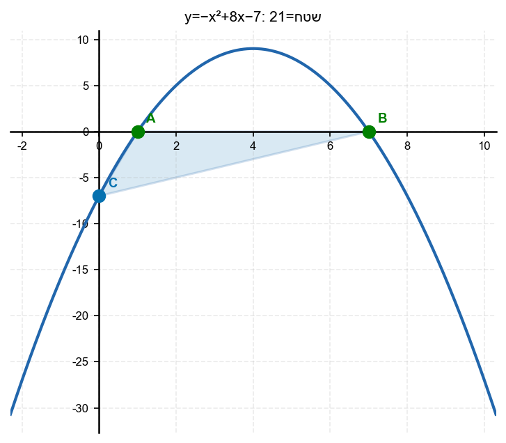

---

## רמה 3: רמת בחינת מה"ט (4 תרגילים)

17. מקור: מה"ט 2023

נתונה הפרבולה
$$y = x^2 - 2x - 4$$
ונתון הישר
$$y = x + 6$$

שתי נקודות החיתוך הן
$A$
ו-
$B$
. קודקוד הפרבולה הוא
$C$
.
נקודה
$D$
היא ההיטל האנכי של
$A$
על ציר
$x$
(
$A$
מוטל אנכית).
נקודה
$E$
היא נקודת האמצע של
$AB$
על ציר
$x$
.

א. מצא את
$A$
,
$B$
,
$C$
,
$D$
,
$E$
.

ב. חשב את שטח המשולש
$ADE$
.

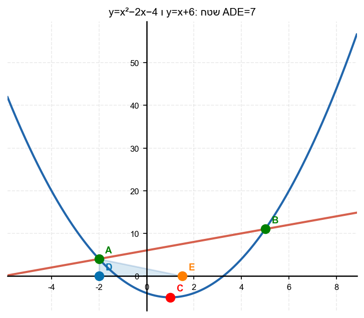

18. מקור: מה"ט 2024

נתונה הפרבולה
$$y = x^2 - 5x - 1$$
ונתון הישר
$$y = -3x + 7$$

שתי נקודות החיתוך הן
$A$
ו-
$B$
, וקודקוד הפרבולה הוא
$C$
.

א. מצא את
$A$
,
$B$
,
$C$
.

ב. מצא את שטח המשולש
$ABC$
.

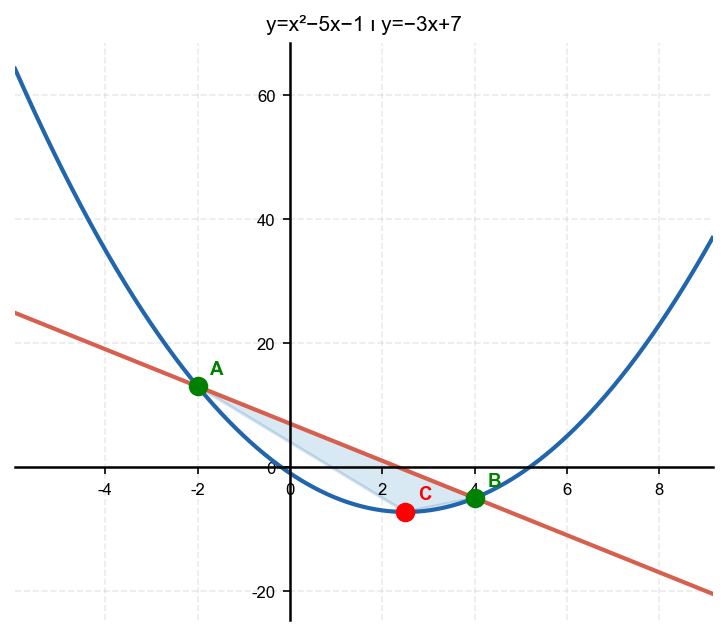

19. מקור: מה"ט 2023

נתונה הפרבולה
$$y = x^2 - 4x + 5$$

נקודה
$A(0,5)$
על הפרבולה. נקודה
$B$
הסימטרית ל-
$A$
.
הקודקוד הוא
$C$
.

א. מצא את
$A$
,
$B$
,
$C$
.

ב. חשב את שטח המשולש
$ABC$
.

ג. חשב את היקף המשולש
$ABC$
.

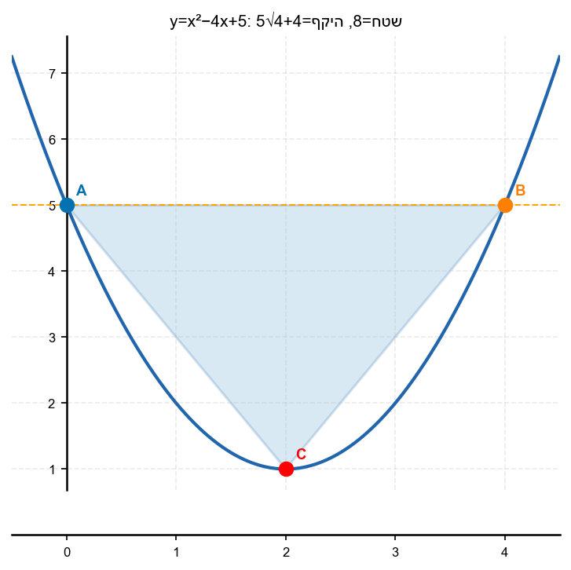

20. מקור: מה"ט 2025

נתונה הפרבולה
$$y = -x^2 + 2x + 8$$

חותכת את ציר
$x$
ב-
$A$
ו-
$D$
ואת ציר
$y$
ב-
$B$
.
קטע
$BC$
ניצב לציר
$x$
, כאשר
$C$
על הפרבולה.

א. מצא את
$A$
,
$B$
,
$C$
,
$D$
.

ב. חשב את שטח הטרפז
$ABCD$
.

ג. חשב את היקף הטרפז
$ABCD$
.

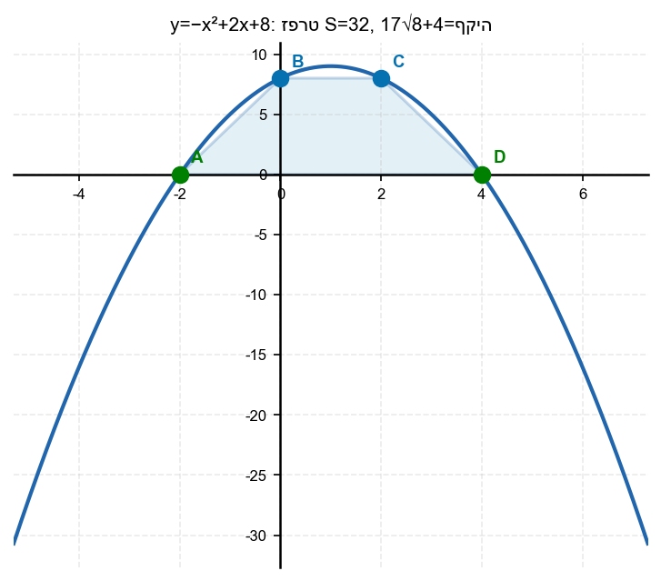

---

תשובות סופיות

1.
א.
$8$
יחידות;
ב.
$16$

2. $24$

3. $15$

4. $24$

5.
א.
$6$
יחידות;
ב.
גובה
$3$
(מרחק מציר
$x$)

6. $16$

7. $24$

8. $35$

9.
א.
$x=\pm 2$
;$A$(-2,0)$,$B$(2,0)$
;$C$(0,-4)$;
ב.
$8$

10.
א.
$-9$
;$C$(1,-9)$;
ב.
$27$

11.
א.
$(x-4)(x+2)=0$
;$A$(-2,0)$,$D$(4,0)$
;$B$(0,8)$
;$C$(2,8)$;
ב.
$32$

12.
א.
$1$
;$C$(2,1)$;
ב.
$8$

13.
א.
(x-5)(x+2)=$0$
;$A$(-2,4)$,$B$(5,11)$;
ב.
$7\sqrt{2}$;
ג.
$42$

14.
א.
(x-4)(x+1)=$0$
;$A$(-1,0)$,$B$(4,0)$
;$C$(1.5, 6.25)$;
ב.
$15.625$;
ג.
$\sqrt{45.3125}$

15.
א.
$(x-3)(x+2)=0$
;$A$(-2,4)$,$B$(3,9)$;
ב.
$15$

16.
א.
$(x-7)(x-1)=0$
;$A$(1,0)$,$B$(7,0)$
;$C$(0,-7)$;
ב.
$21$

17.
א.
$A$(-2,4)$,$B$(5,11)$,$C$(1,-5)$,$D$(-2,0)$,$E$(1.5,0)$;
ב.
$7$

18.
א.
$A$(-2,13)$,$B$(4,-5)$,$C\left$
$(\frac{5}{2},-\frac{29}{4}\right)$;
ב.
$20.25$

19.
א.
A$(0,5)$,$B$(4,5)$,$C$(2,1)$;
ב.
שטח
$=8$;
ג.
$4+4\sqrt{5}$

20.
א.
A$(-2,0)$,$D$(4,0)$,$B$(0,8)$,$C$(2,8)$;
ב.
$32$;
ג.
$8+4\sqrt{17}$

