# יחידה 5.1 – תזכורת: היקף ושטח של מלבן וריבוע ומשמעותם המעשית

---

## נוסחאות בסיס

**מלבן** – אורך
$a$
, רוחב
$b$
:

$$P = 2(a + b) \qquad A = a \times b$$

**ריבוע** – צלע
$a$
:

$$P = 4a \qquad A = a^2$$

**משמעות מעשית:**
- היקף = אורך גדר, מסגרת, שפה – נמדד במטרים (מ')
- שטח = ריצוף, דשא, צביעה – נמדד במטרים רבועים (מ"ר)

---

## רמה 1 – תרגילים בסיסיים (1–8)

1. מלבן שאורכו 8 מ' ורוחבו 5 מ'.

  חשבו את היקפו ואת שטחו.

2. ריבוע שצלעו 7 מ'.

  חשבו את היקפו ואת שטחו.

3. חצר מלבנית שאורכה 12 מ' ורוחבה 9 מ'.

  כמה מטרים של גדר נדרשים לגידורה?

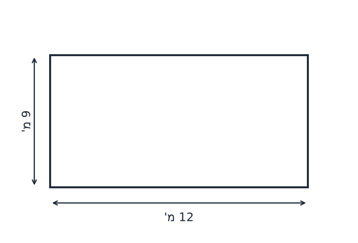

4. חדר מלבני שאורכו 6 מ' ורוחבו 4 מ'.

  כמה מ"ר של ריצוף נדרשים לריצופו?

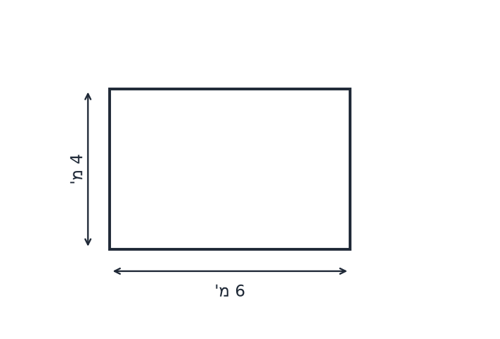

5. מגרש ריבועי שצלעו 10 מ'.

  א. מה היקפו?
  ב. מה שטחו?

6. גן ילדים מלבני בעל היקף 30 מ'. אורכו 9 מ'.

  מצאו את רוחבו ואת שטחו.

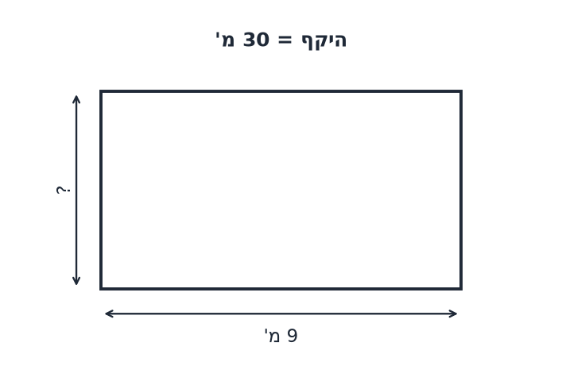

7. שטח מלבן הוא
  $54 \mathrm{m^2}$
  ואורכו 9 מ'.

  מצאו את רוחבו ואת היקפו.

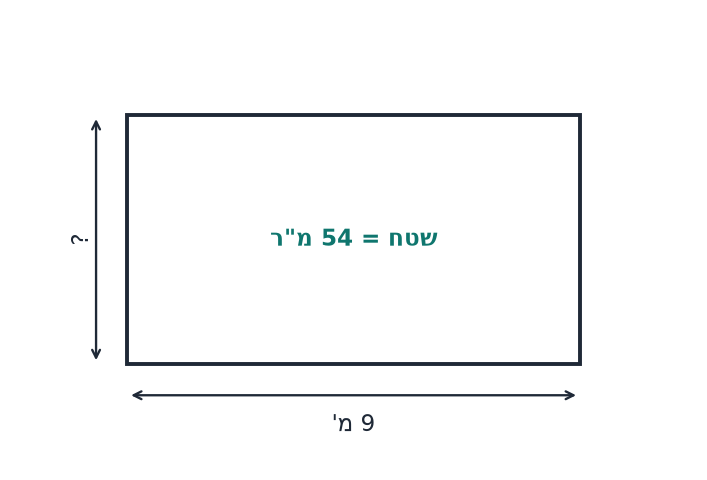

8. ריבוע ששטחו
$49 \mathrm{m^2}$
.

  מצאו את צלעו ואת היקפו.

---

## רמה 2 – תרגילים בינוניים (9–16)

9. גינה מלבנית שאורכה פי שלושה מרוחבה. היקף הגינה הוא 48 מ'.

  מצאו את מידות הגינה ואת שטחה.

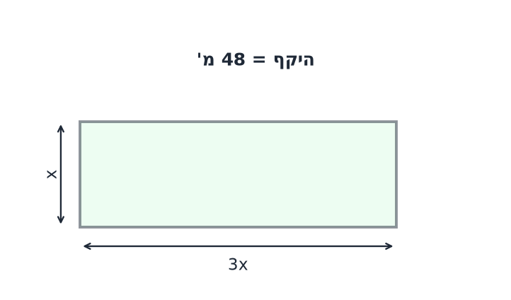

10. בריכה מלבנית שאורכה 15 מ' ורוחבה 8 מ'. סביב הבריכה יש שביל רצוף ברוחב מטר אחד.

  חשבו את שטח השביל בלבד.

11. מגרש ריבועי שהיקפו 52 מ'.

  א. מצאו את צלעו.
  ב. מצאו את שטחו.
  ג. עלות גידור: 85 ₪ למ'. מה עלות גידור כל המגרש?

12. אורך מלבן גדול מרוחבו ב-6 מ'. שטח המלבן הוא
$72 \mathrm{m^2}$
.

  מצאו את מידות המלבן ואת היקפו.

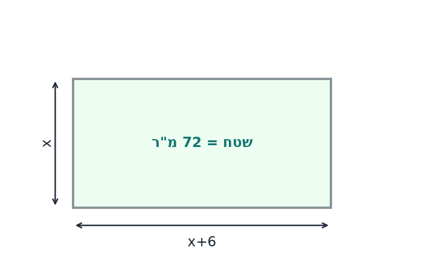

13. גג מלבני שאורכו 14 מ' ורוחבו 10 מ'. עלות ריצוף הגג היא 55 ₪ למ"ר.

  א. מה שטח הגג?
  ב. מה העלות הכוללת לריצוף?

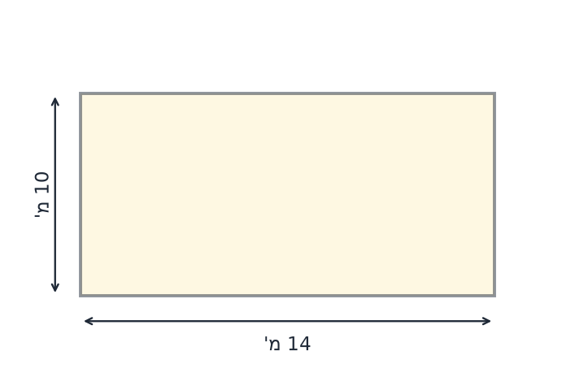

14. חדר ריבועי שצלעו 5 מ'. מחליטים להוסיף על כל צלע עוד 2 מ'.

  א. מה שטח החדר לפני ההרחבה?
  ב. מה שטח החדר אחרי ההרחבה?
  ג. בכמה מ"ר גדל השטח?

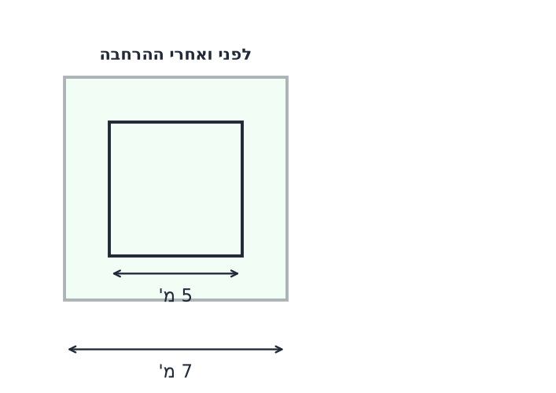

15. מגרש מלבני שאורכו 20 מ' ורוחבו 13 מ'. בעל המגרש רוצה להקיף אותו בגדר, פרט לכניסה שרוחבה 4 מ'.

  מה אורך הגדר הנדרשת?

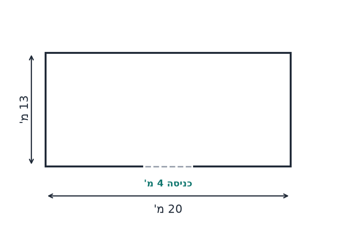

16. פרקט מלבני בעל היקף 24 מ'. אחת מצלעותיו ארוכה פי שניים מהאחרת.

  א. מצאו את מידות הפרקט.
  ב. עלות ריצוף: 120 ₪ למ"ר. כמה ישלמו על ריצוף הפרקט?

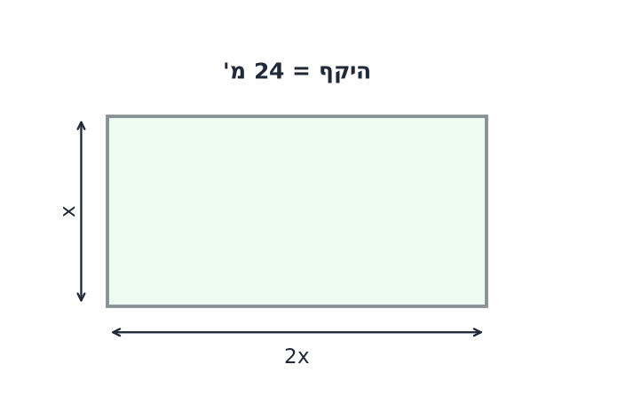

---

## רמה 3 – שאלות ברמת מהט (17–20)

17. למשפחת כהן מגרש מלבני. אורך המגרש גדול מרוחבו ב-4 מ', וההיקף הכולל הוא 40 מ'.

  א. נסמן את הרוחב
  $x$.
  כתבו משוואה על פי נתוני ההיקף ומצאו את מידות המגרש.

  ב. המשפחה בנתה בית מלבני שמרחקו מכל גבול המגרש הוא 3 מ'. חשבו את שטח הבית.

  ג. מחשבים לזרוע דשא בשטח שנותר סביב הבית. עלות הדשא היא 25 ₪ למ"ר. מה העלות הכוללת לזריעת הדשא?

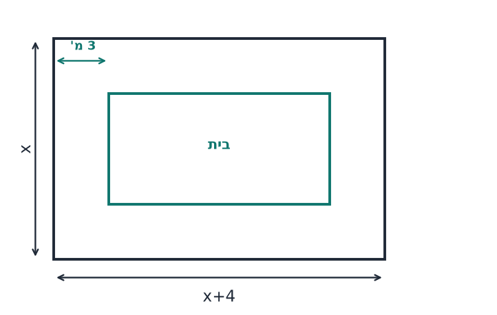

18. בחדר לאמנות – ליאור קיבל בד ציור בגודל 40×80 ס"מ, ומיה קיבלה בד בגודל 50×90 ס"מ.

  א. חשבו את שטח הבד של כל אחד מהם ביחידות
$\text{cm^2}$
.

  ב. כמה אחוזים שטח הבד של מיה משטח הבד של ליאור?

  ג. מסגרת לבד עולה 12 ₪ לכל מטר היקף, ובנוסף תשלום קבוע של 25 ₪ לעבודה. חשבו כמה ישלמו ליאור ומיה ביחד עבור מסגרות לבדים שלהם.

19. אדריכלית תכננה מגרש מלבני. ההיקף המתוכנן הוא 32 מ'. קיבלה אישור להגדיל את הצלע הארוכה ב-50% ואת הצלע הקצרה ב-3 מ'.

  א. נסמן
  $x$
  את הצלע הארוכה לפני השינוי. כתבו ביטוי לשטח המגרש לאחר השינוי.

  ב. שטח המגרש לאחר ההגדלה הוא 132 מ"ר. כתבו משוואה ומצאו את מידות המגרש לפני ושאחרי השינוי.
  (פתרון בניחוש לא יתקבל)

  ג. בכמה אחוזים גדל שטח המגרש?

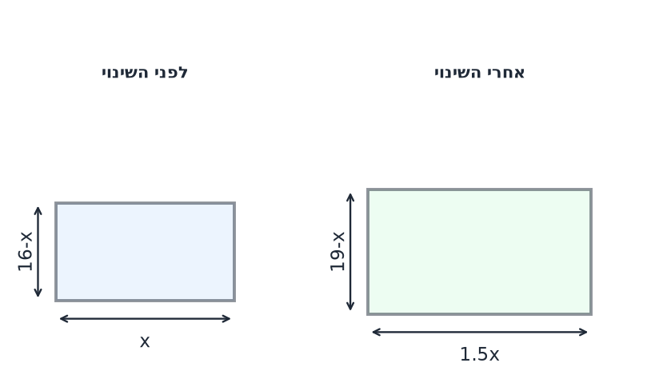

20. חצר מלבנית ABCD. גדר מוקמת לאורך הצלע הארוכה ולאורך שתי הצלעות הקצרות (שלושה צדדים). עלות הגדר היא 220 ₪ למ'. עלות הדשא היא 95 ₪ למ"ר. העלות הכוללת היא 14,490 ₪, מתוכם עבור הגדר 5,940 ₪. הצלע הקצרה קטנה ממחצית הצלע הארוכה.

  א. מצאו את מידות החצר.

  ב. מחשבים לשלם עם מע"מ של 17%. מה תהיה העלות הכוללת לאחר הוספת המע"מ?

  ג. באיזה אחוז הייתה מוזלת העלות הכוללת (לפני מע"מ) אילו עלות הדשא הייתה 75 ₪ למ"ר במקום 95 ₪?

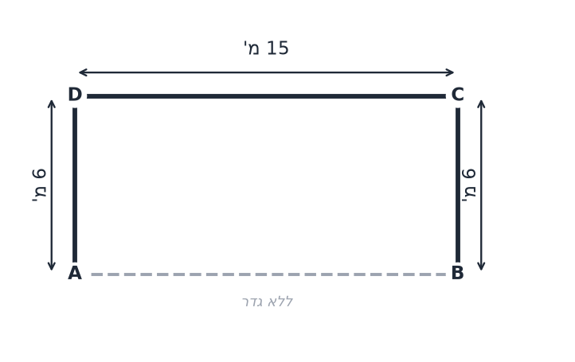

---

תשובות סופיות

1.
היקף = 26 מ'
שטח = 40 מ"ר

2.
היקף = 28 מ'
שטח = 49 מ"ר

3. 42 מ' של גדר

4. 24 מ"ר של ריצוף

5.
א.
היקף = 40 מ'
ב.
שטח = 100 מ"ר

6.
רוחב = 6 מ'
שטח = 54 מ"ר

7.
רוחב = 6 מ'
היקף = 30 מ'

8.
צלע = 7 מ'
היקף = 28 מ'

9.
מידות: 18 מ' על 6 מ'
שטח = 108 מ"ר

10. 50 מ"ר

11.
א.
צלע = 13 מ'
ב.
שטח = 169 מ"ר
ג.
עלות גידור = 4,420 ₪

12.
מידות: 12 מ' ו-6 מ'
היקף = 36 מ'

13.
א.
שטח = 140 מ"ר
ב.
עלות = 7,700 ₪

14.
א.
25 מ"ר
ב.
49 מ"ר
ג.
גדל ב-24 מ"ר

15. 62 מ'

16.
א.
מידות: 8 מ' ו-4 מ'
ב.
עלות = 3,840 ₪

17.
א.
רוחב = 8 מ', אורך = 12 מ'
ב.
12 מ"ר
ג.
2,100 ₪

18.
א.
ליאור: 3,200 סמ"ר, מיה: 4,500 סמ"ר
ב.
כ-140.6%
ג.
ליאור: 53.8 ₪, מיה: 58.6 ₪
סה"כ = 112.4 ₪

19.
א.
$S = 1.5x(19-x)$
ב.
לפני השינוי: 11 מ' ו-5 מ'
לאחר השינוי: 16.5 מ' ו-8 מ'
ג.
גדל בכ-140%

20.
א.
15 מ' ו-6 מ'
ב.
16,953.3 ₪
ג.
מוזלת בכ-12.42%

