# יחידה 5.2 – בעיות שינוי מידות (הגדלת/הקטנת אורך ורוחב במספרים שלמים)

---

## עיקרי היחידה

כאשר משנים מימדי מלבן במספרים שלמים, יש לחשב מידות חדשות ואז להחיל את הנוסחאות:

$$T = 2(a_{\text{new}} + b_{\text{new}}) \qquad A_1 = a_{\text{new}} \times b_{\text{new}}$$

**שינוי בשטח** = שטח חדש − שטח ישן

---

## רמה 1 – תרגילים בסיסיים (1–8)

1. מלבן שאורכו 10 מ' ורוחבו 6 מ'. מגדילים את האורך ב-3 מ' ואת הרוחב ב-2 מ'.

  מצאו את ההיקף ואת השטח של המלבן החדש.

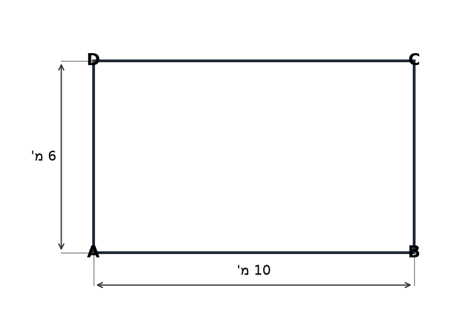

2. ריבוע שצלעו 8 מ'. מגדילים כל צלע ב-4 מ'.

  מצאו את ההיקף ואת השטח של הריבוע החדש.

3. מלבן שאורכו 15 מ' ורוחבו 10 מ'. מקטינים את האורך ב-3 מ' ואת הרוחב ב-2 מ'.

  מצאו את ההיקף ואת השטח של המלבן החדש.

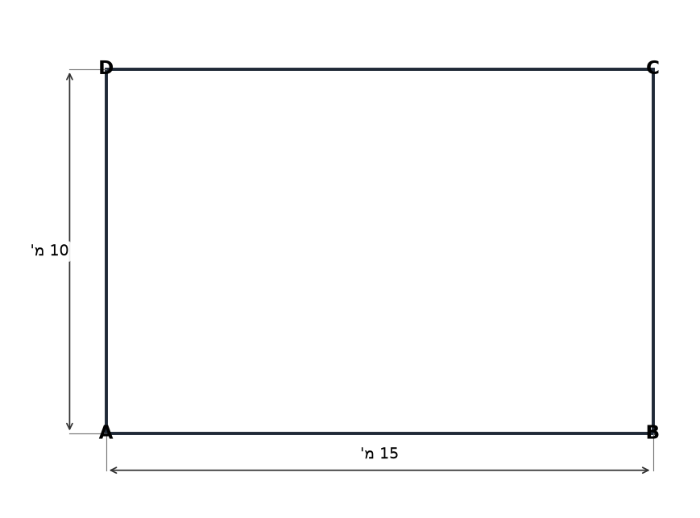

4. ריבוע שצלעו 9 מ'. מקטינים כל צלע ב-3 מ'.

  מצאו את ההיקף ואת השטח של הריבוע החדש.

5. מלבן שאורכו 12 מ' ורוחבו 5 מ'. מגדילים רק את האורך ב-4 מ'.

  מצאו את ההיקף ואת השטח של המלבן החדש.

6. מלבן שאורכו 10 מ' ורוחבו 7 מ'. מגדילים את האורך ב-5 מ' ומקטינים את הרוחב ב-2 מ'.

  מצאו את ההיקף ואת השטח של המלבן החדש.

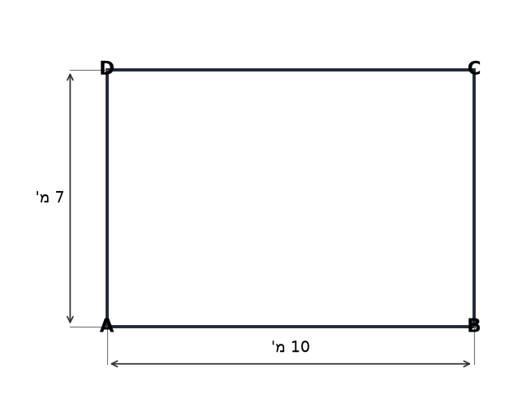

7. מלבן שאורכו 14 מ' ורוחבו 6 מ'. מגדילים כל מימד ב-2 מ'.

  א. מידות המלבן החדש.
  ב. בכמה מ"ר גדל השטח?

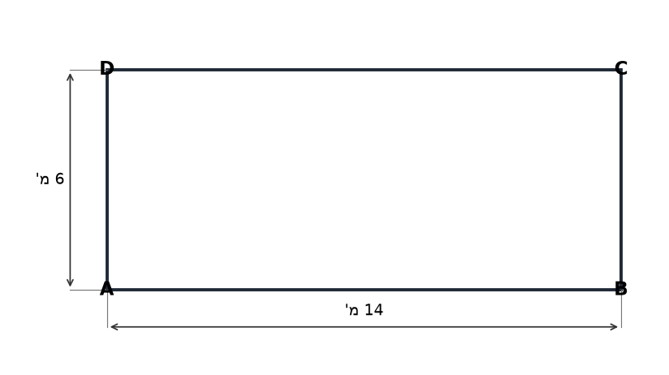

8. ריבוע שצלעו 6 מ'. מגדילים כל צלע ב-3 מ'.

  א. מידות הריבוע החדש.
  ב. בכמה מ"ר גדל השטח?

---

## רמה 2 – תרגילים בינוניים (9–16)

9. מלבן שאורכו 20 מ' ורוחבו 12 מ'. מגדילים את האורך ב-5 מ' ומקטינים את הרוחב ב-3 מ'.

  א. מידות המלבן החדש, היקפו ושטחו.
  ב. האם השטח גדל, קטן, או נשאר זהה? בכמה?

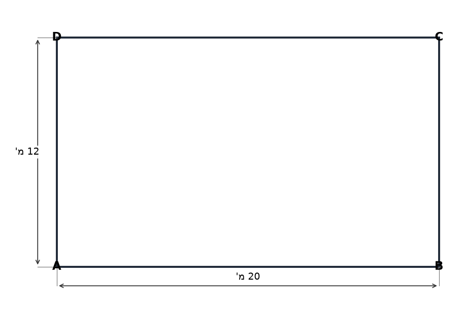

10. מלבן שהפרש בין אורכו לרוחבו הוא 4 מ', והיקפו הוא 28 מ'.

  א. כתבו מערכת משוואות ומצאו את מידות המלבן.
  ב. מגדילים את האורך ב-3 מ'. חשבו את שטח המלבן החדש.

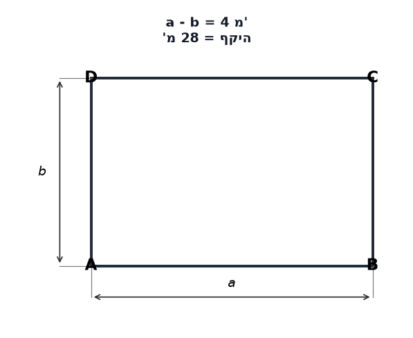

11. חדר מלבני שאורכו 8 מ' ורוחבו 6 מ'. מאריכים את החדר ב-2 מ' (מוסיפים רצועה ברוחב 2 מ' בהמשך לצלע האורך).

  א. מצאו את מידות החדר החדש.
  ב. בכמה מ"ר גדל שטח החדר?

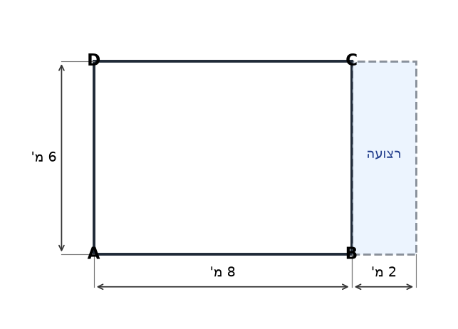

12. מגרש מלבני שאורכו 18 מ' ורוחבו 10 מ'. מגדילים את האורך ב-4 מ' ומקטינים את הרוחב ב-3 מ'.

  א. מידות המגרש החדש, היקפו ושטחו.
  ב. בכמה מ"ר השתנה השטח?

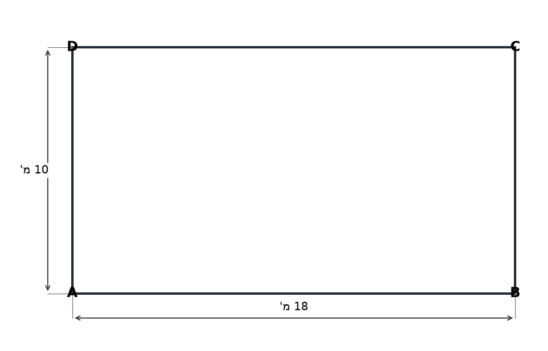

13. ריבוע שצלעו 10 מ'. מוסיפים 3 מ' לכל צלע.

  א. מהו שטח הריבוע לפני ואחרי?
  ב. בכמה אחוזים גדל השטח?

14. מגרש מלבני שהיקפו 44 מ'. אורכו גדול מרוחבו ב-6 מ'.

  א. מצאו את מידות המגרש.
  ב. מגדילים את האורך ב-4 מ' ומקטינים את הרוחב ב-2 מ'. מהו השטח החדש?
  ג. בכמה מ"ר השתנה השטח?

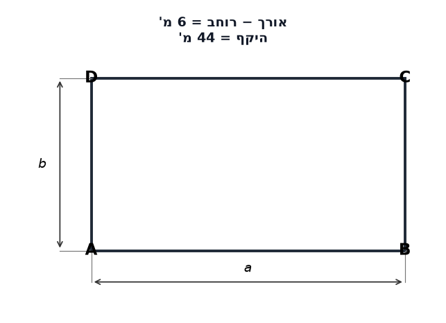

15. ריבוע ששטחו
$64 \mathrm{m^2}$
.
  מוסיפים 3 מ' לכל צלע.

  א. מצאו את צלע הריבוע המקורי.
  ב. מהו השטח החדש?
  ג. בכמה מ"ר גדל השטח?

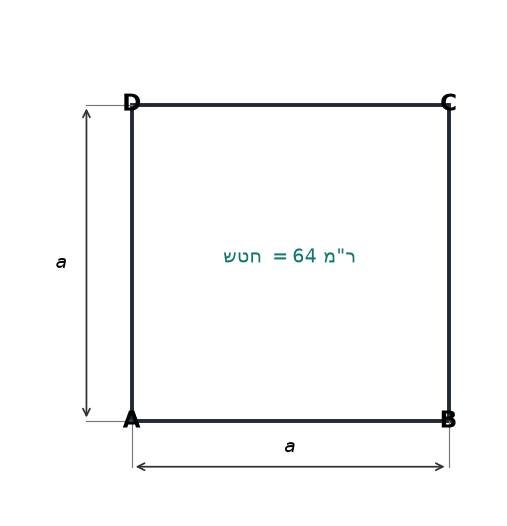

16. מלבן שאורכו פי 3 מרוחבו ושטחו
$75 \mathrm{m^2}$
.

  א. מצאו את מידות המלבן.
  ב. מגדילים כל מימד ב-2 מ'. מהו שטח המלבן החדש?
  ג. בכמה מ"ר גדל השטח?

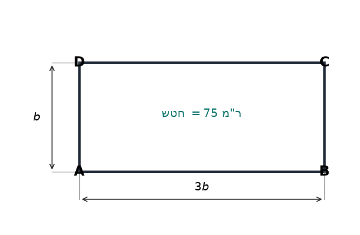

---

## רמה 3 – שאלות ברמת מהט (17–20)

17. מגרש מלבני שהיקפו 88 מ' ושטחו
$480 \mathrm{m^2}$
.

  א. נסמן את אורך המגרש
  $a$
  ואת רוחבו
  $b$.
  כתבו מערכת משוואות ומצאו את מידות המגרש.
  (רמז: השתמשו במשוואה ריבועית – פתרון ניחוש לא יתקבל)

  ב. בונים בית מלבני בתוך המגרש כך שיש שוליים של 3 מ' מכל אחד מארבעת הצדדים. חשבו את שטח הבית.

  ג. שטח הגינה סביב הבית יזרע דשא. עלות הזרעת הדשא היא 25 ₪ למ"ר. מה העלות הכוללת?

18. מגרש מלבני שאורכו גדול מרוחבו ב-6 מ'. מגדילים את האורך ב-4 מ' ומקטינים את הרוחב ב-1 מ'. שטח המגרש החדש הוא
$126 \mathrm{m^2}$
.

  א. נסמן את רוחב המגרש המקורי
  $x$.
  כתבו ביטוי לשטח המגרש לאחר השינוי וכתבו משוואה.

  ב. מצאו את מידות המגרש המקורי.
  (פתרון ניחוש לא יתקבל)

  ג. בכמה אחוזים גדל שטח המגרש?

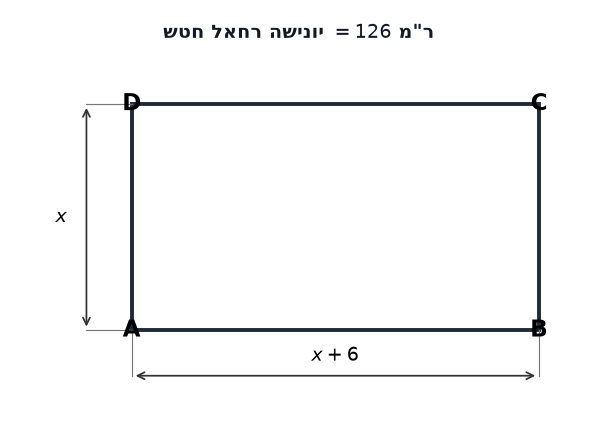

19. גינה מלבנית שרוחבה קטן מאורכה ב-4 מ'. היקף הגינה הוא 32 מ'.

  א. מצאו את מידות הגינה.

  ב. מגדילים את האורך ב-3 מ' ומקטינים את הרוחב ב-2 מ'. בנוסף, מסביב לגינה החדשה נסלל שביל ברוחב 1 מ'. חשבו את שטח השביל בלבד.

  ג. עלות סלילת השביל היא 180 ₪ למ"ר. עלות הדשא בגינה החדשה (לפני השביל) היא 35 ₪ למ"ר. מה העלות הכוללת?

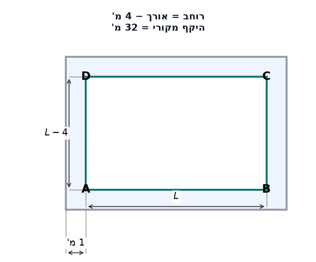

20. אדריכל תכנן מגרש מלבני. ההיקף המקורי הוא 28 מ'. קיבל אישור להגדיל את הצלע הארוכה ב-4 מ' ואת הצלע הקצרה ב-3 מ'.

  א. נסמן
  $x$
  את הצלע הארוכה לפני השינוי. כתבו ביטוי לשטח לאחר השינוי.

  ב. שטח המגרש לאחר ההגדלה הוא
$104 \mathrm{m^2}$
.
  כתבו משוואה ומצאו את מידות המגרש לפני ואחרי השינוי.
  (פתרון ניחוש לא יתקבל)

  ג. בכמה אחוזים גדל שטח המגרש?

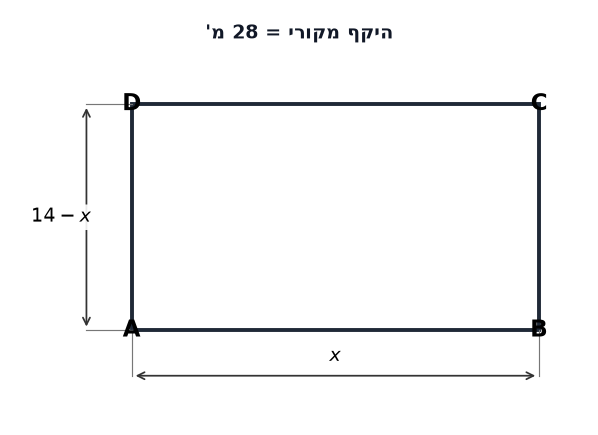

---

תשובות סופיות

**רמה 1:**

1. היקף 42 מ', שטח 104 מ"ר

2. היקף 48 מ', שטח 144 מ"ר

3. היקף 40 מ', שטח 96 מ"ר

4. היקף 24 מ', שטח 36 מ"ר

5. היקף 42 מ', שטח 80 מ"ר

6. היקף 40 מ', שטח 75 מ"ר

7.
א.
מידות חדשות: 16×8
ב.
128 מ"ר, גידול של 44 מ"ר

8.
א.
ריבוע חדש צלע 9
ב.
81 מ"ר, גידול של 45 מ"ר

**רמה 2:**

9.
א. אורך
$25$
מ', רוחב
$9$
מ'; היקף
$68$
מ'; שטח
$225$
מ"ר
ב.
שטח ישן = 240 מ"ר, קטן ב-15 מ"ר

10.
א. אורך
$9$
מ', רוחב
$5$
מ'
ב.
$60$
מ"ר

11.
א.
10×6
ב.
60 מ"ר, גידול של 12 מ"ר

12.
א. אורך
$22$
מ', רוחב
$7$
מ'; היקף
$58$
מ'; שטח
$154$
מ"ר
ב.
שטח ישן = 180 מ"ר, קטן ב-26 מ"ר

13.
א. לפני:
$100$
מ"ר; אחרי:
$169$
מ"ר
ב.
גידול של 69%, כלומר:
$69\%$

14.
א. אורך
$14$
מ', רוחב
$8$
מ'
ב.
$108$
מ"ר
ג.
שטח ישן = 112 מ"ר, קטן ב-4 מ"ר

15.
א.
צלע = 8 מ'
ב.
$121$
מ"ר
ג.
גידול של 57 מ"ר

16.
א. רוחב
$5$
מ', אורך
$15$
מ'
ב.
$119$
מ"ר
ג.
שטח ישן = 75 מ"ר, גידול של 44 מ"ר

**רמה 3:**

17.
א. אורך
$24$
מ', רוחב
$20$
מ'
ב.
$252$
מ"ר
ג.
$5{ }700$
₪

18.
א.
$(x+10)(x-1) = 126$
→
$x^2 + 9x - 136 = 0$
ב.
$x = 8$
רוחב המגרש המקורי
$8$
מ', אורך המגרש המקורי
$14$
מ'
ג. שטח ישן
$112$
מ"ר, שטח חדש
$126$
מ"ר; גידול של
$12.5\%$

19.
א. אורך
$10$
מ', רוחב
$6$
מ'
ב.
$38$
מ"ר
ג.
$8{ }660$
₪

20.
א.
$(x+4)(17-x)$
ב.
$104$
מ"ר
ג.
$45$
מ"ר; גידול:
$\frac{104 - 45}{45} \times 100 \approx 131\%$

