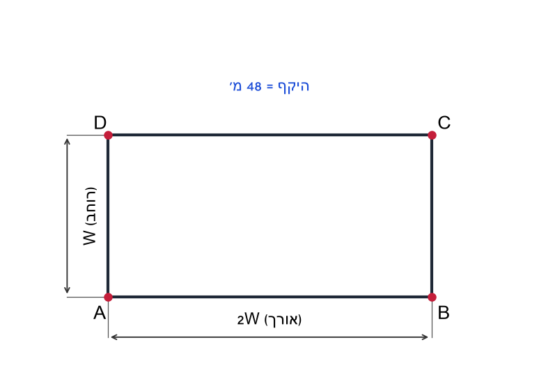
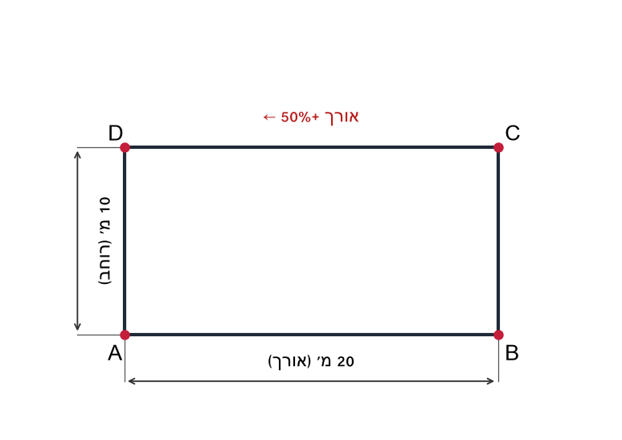
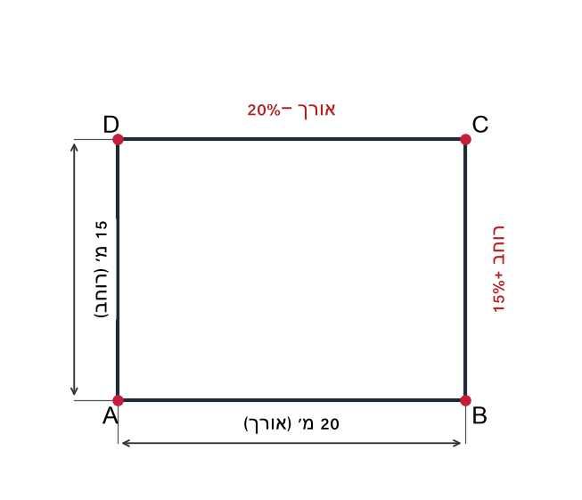
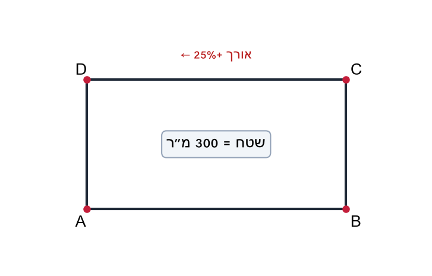
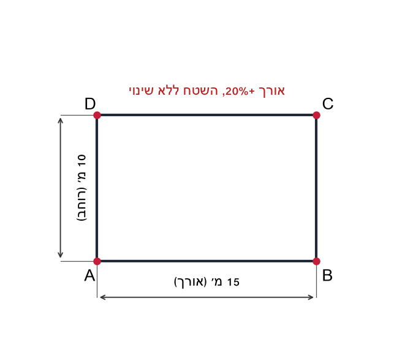
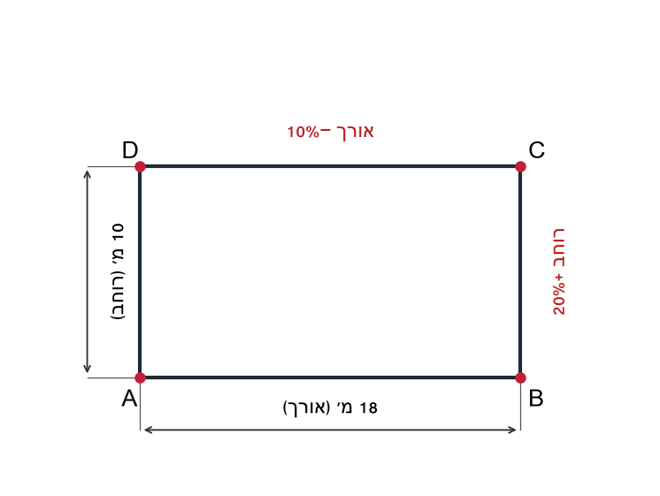
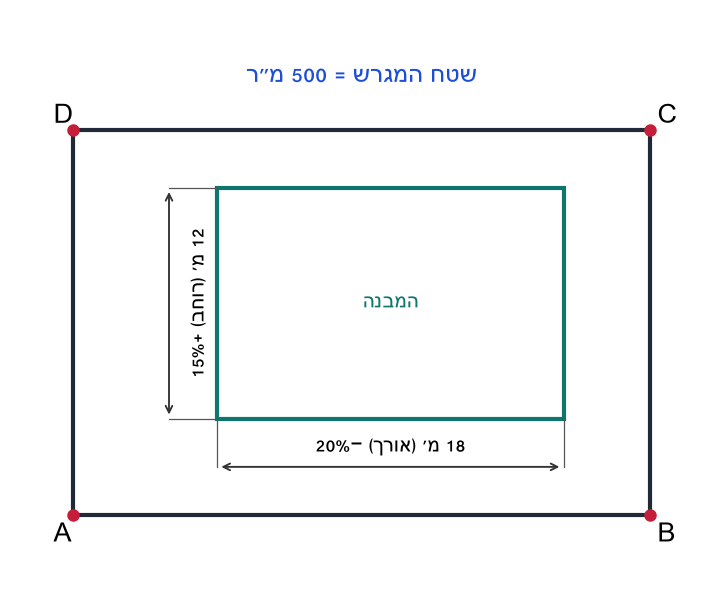
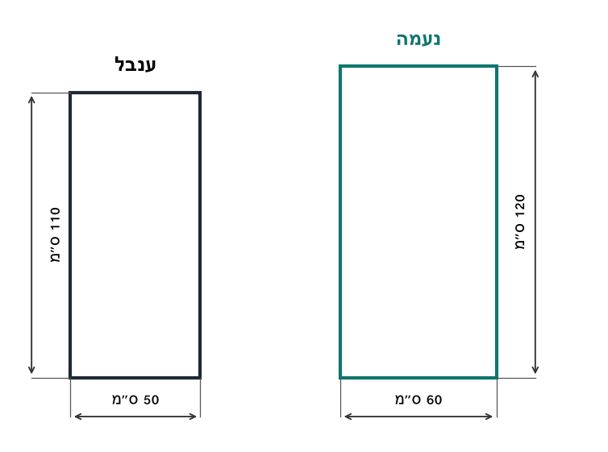
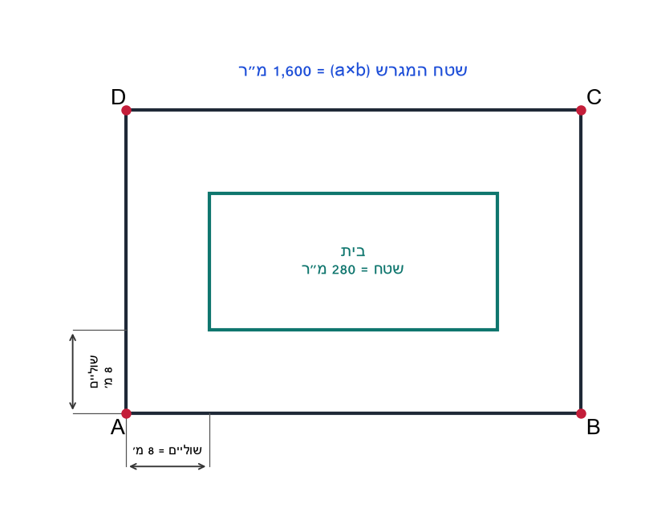

# יחידה 5.3 – בעיות שינוי מידות עם אחוזים

---

## עיקרי היחידה

כאשר אורך מלבן משתנה ב-
$p$
% ורוחבו משתנה ב-
$q$
%, אחוז השינוי בשטח הוא:

$$A_1 = a \cdot \left(1 + \frac{p}{100}\right) \cdot b \cdot \left(1 + \frac{q}{100}\right)$$

$$\Delta A\% = \left(1 + \frac{p}{100}\right)\left(1 + \frac{q}{100}\right) - 1$$

**דוגמה:** אורך +20%, רוחב −10%:
$$1.2 \times 0.9 = 1.08 \quad \Rightarrow \quad \Delta A=8\%$$

---

## רמה 1 – תרגילים בסיסיים (1–8)

1. מלבן שאורכו 10 מ' ורוחבו 8 מ'. מגדילים את האורך ב-20% ואת הרוחב ב-25%.

  מצאו את המידות החדשות ואת השטח החדש.

2. מלבן שאורכו 20 מ' ורוחבו 10 מ'. מגדילים כל מימד ב-10%.

  מצאו את המידות החדשות, את השטח החדש, ובכמה אחוזים גדל השטח.

3. מלבן שאורכו 15 מ' ורוחבו 8 מ'. מגדילים רק את האורך ב-20%.

  מצאו את השטח החדש ואת אחוז הגידול בשטח.

4. ריבוע שצלעו 10 מ'. מגדילים כל צלע ב-10%.

  מצאו את השטח החדש ובכמה אחוזים גדל השטח.

5. מלבן שאורכו 30 מ' ורוחבו 20 מ'. מקטינים את האורך ב-10% ומגדילים את הרוחב ב-20%.

  מצאו את המידות החדשות ואת אחוז השינוי בשטח.

6. מלבן שאורכו 25 מ' ורוחבו 16 מ'. מקטינים את האורך ב-20% ומגדילים את הרוחב ב-25%.

  א. מצאו את המידות החדשות.
  ב. מה קרה לשטח?

7. מלבן שאורכו 30 מ' ורוחבו 10 מ'. מגדילים את האורך ב-20% ומקטינים את הרוחב ב-20%.

  מצאו את המידות החדשות ובכמה אחוזים השתנה השטח.

8. מלבן שאורכו 40 מ'. מקטינים את האורך ב-25% ולא משנים את הרוחב.

  בכמה אחוזים קטן השטח?

---

## רמה 2 – תרגילים בינוניים (9–16)

9. מגרש מלבני שאורכו 15 מ' ורוחבו 10 מ'. מגדילים את האורך ב-20% ואת הרוחב ב-30%.

  א. מידות חדשות, שטח חדש.
  ב. בכמה אחוזים גדל השטח?

10. מלבן שהיקפו 48 מ' ואורכו פי שניים מרוחבו. מגדילים כל מימד ב-25%.

  א. מצאו את מידות המלבן המקורי.
  ב. מידות חדשות ושטח חדש.
  ג. בכמה אחוזים גדל השטח?

11. חצר מלבנית שאורכה 20 מ' ורוחבה 10 מ'. מגדילים את האורך ב-50%.

  א. שטח חדש.
  ב. בכמה אחוזים גדל השטח?
  ג. מה יש לעשות לרוחב כדי שהשטח יגדל ב-50%? (האורך לא משתנה)

12. בנין שאורכו 20 מ' ורוחבו 15 מ'. מקטינים את האורך ב-20% ומגדילים את הרוחב ב-15%.

  א. מידות חדשות ושטח חדש.
  ב. בכמה אחוזים השתנה השטח?

13. שטח מגרש הוא
$300 \mathrm{m^2}$
.
  מגדילים את האורך ב-25% ולא משנים את הרוחב.

  א. מה השטח החדש?
  ב. בכמה מ"ר גדל השטח?

14. האורך של מלבן גדל ב-20%. השטח לא השתנה.

  א. בכמה אחוזים השתנה הרוחב? (הסבירו)
  ב. אם אורך המלבן המקורי הוא 15 מ' ורוחבו 10 מ', מצאו את הרוחב החדש.

15. מגרש מלבני שאורכו פי 3 מרוחבו, והיקפו 40 מ'. מגדילים את האורך ב-20% ואת הרוחב ב-40%.

  א. מצאו את מידות המגרש.
  ב. מידות חדשות, שטח חדש.
  ג. בכמה אחוזים גדל השטח?

16. מלבן שאורכו 18 מ' ורוחבו 10 מ'. מקטינים את האורך ב-10% ומגדילים את הרוחב ב-20%.

  א. מידות חדשות ושטח חדש.
  ב. בכמה אחוזים השתנה השטח?
  ג. כיצד ניתן לחשב את אחוז השינוי בשטח מבלי לחשב את המידות החדשות?

---

## רמה 3 – שאלות ברמת מהט (17–20)

17. אדריכל תכנן מבנה מלבני: אורך 18 מ', רוחב 12 מ'. קיצר את האורך ב-20% והגדיל את הרוחב ב-15%.

  א. מצאו את המידות המעודכנות ואת השטח המעודכן.

  ב. המבנה ממוקם במגרש בשטח 500 מ"ר. כמה אחוזים מהמגרש תופס המבנה (לפי השטח המעודכן)?

  ג. השטח הנותר במגרש מחולק: שני שלישים לחנייה (עלות סלילה: 200 ₪ למ"ר) והשאר לגינה. תקציב כולל לחנייה: 55,000 ₪. כמה כסף ייוותר לגינה?

18. בחוג לציור – ענבל קיבלה בד ציור בגודל 50×110 ס"מ, ונעמה קיבלה בד בגודל 60×120 ס"מ.

  א. חשבו את שטח הבד של כל אחת.

  ב. כמה אחוזים שטח הבד של נעמה משטח הבד של ענבל?

  ג. כמה אחוזים שטח הבד של ענבל משטח הבד של נעמה?

  ד. מסגרת לבד עולה 15 ₪ לכל מטר היקף, ובנוסף תשלום קבוע של 30 ₪ לעבודה. כמה ישלמו ענבל ונעמה ביחד עבור מסגרות?

19. אדריכלית תכננה מגרש מלבני שהיקפו 28 מ'. קיבלה אישור להגדיל את הצלע הארוכה ב-50% ולהגדיל את הצלע הקצרה ב-4 מ'. הצלע הקצרה גדולה מ-5 מ'.

  א. נסמן
  $x$
  את הצלע הארוכה לפני השינוי. כתבו ביטוי לשטח המגרש לאחר השינוי.

  ב. שטח המגרש לאחר ההגדלה הוא 120 מ"ר. כתבו משוואה ומצאו את מידות המגרש לפני ואחרי השינוי.
  (פתרון ניחוש לא יתקבל)

  ג. בכמה אחוזים גדל שטח המגרש?

20. למשפחת אבנר מגרש מלבני ששטחו 1,600 מ"ר. אבנר תכנן לבנות בית מלבני עם שוליים של 8 מ' מכל אחד מארבעת הצדדים. שטח הבית המתוכנן הוא 280 מ"ר.

  א. נסמן
  $a$
את אורך המגרש ו-
$b$
  את רוחבו.
  כתבו מערכת משוואות ומצאו את מידות המגרש.

  ב. עלות זריעת דשא בשטח שמסביב לבית (מחוץ לבית, בתוך המגרש) היא 15 ₪ למ"ר. מה תהיה עלות הדשא הכוללת?

  ג. אם אבנר מגדיל את השוליים מ-8 מ' ל-10 מ' מכל צד, בכמה אחוזים ישתנה שטח הדשא?

---

תשובות סופיות

**רמה 1:**

1. 120 מ"ר

2. $\quad +21\%$

3. $144$
מ"ר; גידול של 20%

4. 121 מ"ר; גידול של 21%

5. $\quad +8\%$

6.
א.
20 מ'
ב.
שטח נשאר 400 מ"ר – ללא שינוי (0%)

7. $\quad -4\%$

8. השטח קטן ב-25% (רק האורך השתנה, ב-25%) **רמה 2:**

9.
א.
$234 מ"ר
ב.
$\quad +56\%$

10.
א.
$16$
מ'
ב.
$200 מ"ר
ג.
$\quad +56.25\%$

11.
א.
$300$
מ"ר
ב.
גידול של 50%
ג.
הרוחב יוגדל ב-50%

12.
א.
$276 מ"ר
ב.
$\quad -8\%$

13.
א.
$375$
מ"ר
ב.
גדל ב-75 מ"ר

14.
א.
$\; -16.\overline{6}\%$
ב.
רוחבחדש
$=$
10 \times \frac{5}{6} \approx
$8.33$
מ'

15.
א.
$15$
מ'
ב.
$126 מ"ר
ג.
$\quad +68\%$

16.
א.

194.4 מ"ר
ב.
גידול של 8%
ג.
\; +8\%$ (ללא צורך לחשב מידות) **רמה 3:**

17.
א.
$13.8$
מ'; שטח חדש:
$14.4 \times 13.8 \approx $

198.
$7$
מ"ר
ב.
$\frac{198.7}{500} \times 100 \approx 39.7\%$
מהמגרש
ג.
$200.9 \times 200 \approx $
$40{ }171$
₪; נותר לגינה:
$55{ }000 - 40{ }171 \approx $
$14{ }829$
₪

18.
א.
$7{ }200$
סמ"ר
ב.
$\frac{7{ }200}{5{ }500} \times 100 \approx 130.9\%$
ג.
$\frac{5{ }500}{7{ }200} \times 100 \approx 76.4\%$
ד.
$162$
₪

19.
א.
$1.5x(18 - x)$
ב.
לפני – 8 מ' × 6 מ'; אחרי – 12 מ' × 10 מ'
ג.
$150\%$

20.
א.
\; a + b = $98.5$
מהמשוואות
$a + b = $98.5$
ו-
$ab = $
$1{ }600$
:$
$a^2 - 98.5a + 1{ }600 = 0$
$57.46...$
$a \approx $77.98$
מ',
$b \approx $20.52$
מ' (ערכים מעוגלים – בדיקה בכיתה עם מחשבון)
ב.
$19{ }800$
₪
ג.
שטח בית עם שוליים 10 מ':$
(a - 20)(b - 20)$
; שינוי ב-% =
$\frac{T - 1{ }320}{1{ }320} \times 100$
(חישוב לפי מידות שנמצאו בסעיף א')

