# יחידה 5.4 – שילוב עלויות: תמחור לפי מטר אורך (היקף) לעומת תמחור לפי מ"ר (שטח) ועמידה בתקציב

---

## עיקרי היחידה

**עלות גדר / מסגרת / שפה** – מחושבת לפי **מטר** (נמדד לאורך ההיקף):

$$T = T \times \text{price/m}$$

**עלות ריצוף / דשא / צביעה** – מחושבת לפי **מ"ר** (שטח):

$$T = A \times \text{price/m^2}$$

**עלות כוללת** = עלות גדר + עלות ריצוף

**מע"מ**: אם מחיר עם מע"מ ידוע → מחיר ללא מע"מ = מחיר עם מע"מ ÷ 1.17

---

## רמה 1 – תרגילים בסיסיים (1–8)

1. חצר מלבנית שאורכה 12 מ' ורוחבה 8 מ'. עלות גדר היא 40 ₪ למ'.

  חשבו את עלות גידור כל החצר.

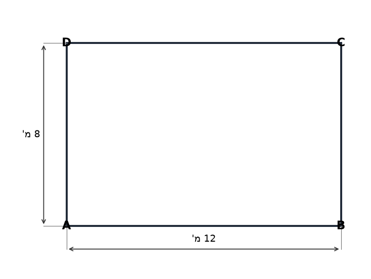

2. חדר מלבני שאורכו 10 מ' ורוחבו 6 מ'. עלות ריצוף היא 65 ₪ למ"ר.

  חשבו את עלות ריצוף הרצפה.

3. מגרש מלבני שאורכו 20 מ' ורוחבו 12 מ'. מגדרים שלושה צדדים בלבד (הצלע הארוכה ושתי הצלעות הקצרות). עלות גדר: 50 ₪ למ'.

  חשבו את עלות הגדר.

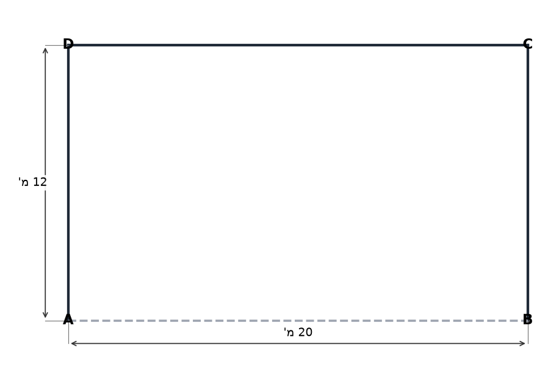

4. גינה מרובעת שצלעה 9 מ'. עלות דשא: 80 ₪ למ"ר.

  חשבו את עלות הדשא.

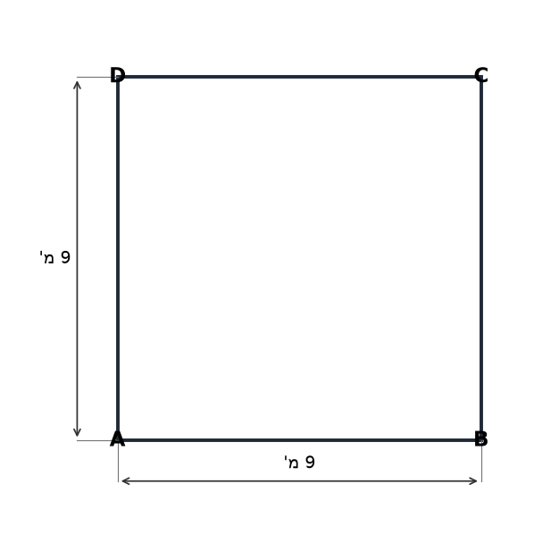

5. מלבן שאורכו 16 מ' ורוחבו 10 מ'. גדר לכל הצדדים (60 ₪ למ') ואריחים לכל הרצפה (45 ₪ למ"ר).

  חשבו את העלות הכוללת.

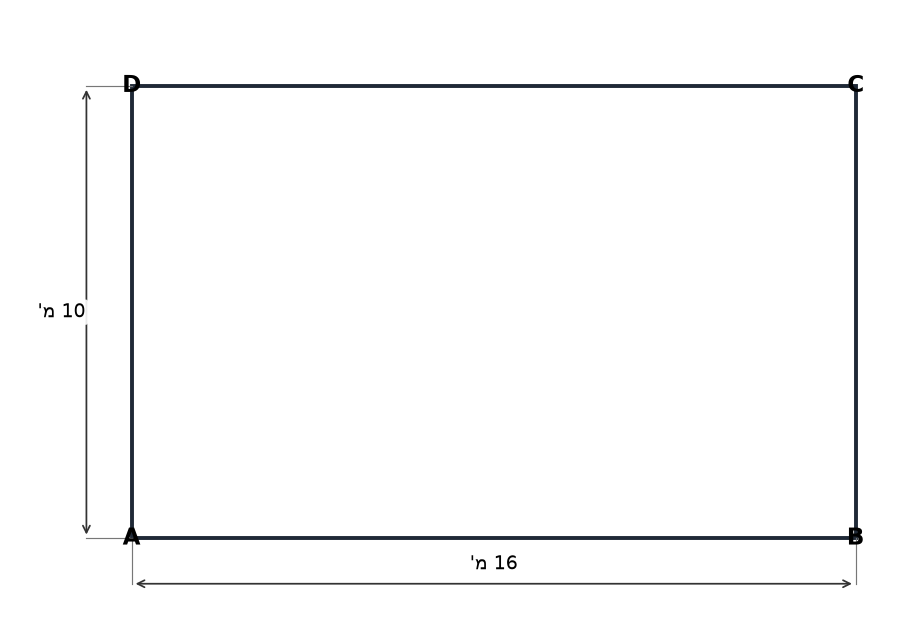

6. ריבוע שצלעו 9 מ'. גדר לכל הצדדים (70 ₪ למ') ודשא (50 ₪ למ"ר).

  חשבו את העלות הכוללת.

7. חצר מלבנית שהיקפה 56 מ', ואורכה פי 3 מרוחבה. עלות גדר: 45 ₪ למ'.

  א. מצאו את מידות החצר.
  ב. חשבו את עלות גידור כל החצר.

8. חצר מלבנית שאורכה 14 מ' ורוחבה 10 מ'. מגדרים שלושה צדדים (הצלע הארוכה ושתי הצלעות הקצרות), ומשאירים את הצד הרביעי פתוח לכניסה. עלות גדר: 35 ₪ למ'.

  חשבו את עלות הגדר.

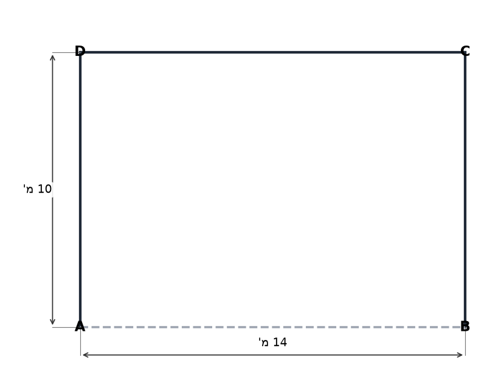

---

## רמה 2 – תרגילים בינוניים (9–16)

9. גג מלבני שהיקפו 46 מ'. עלות ריצוף הגג: 60 ₪ למ"ר; עלות ריצוף כוללת: 7,200 ₪.

  א. מצאו את שטח הגג.
  ב. מצאו את מידות הגג.
  ג. מציעים שתי הצעות לאיטום:
   הצעה א': 40 ₪ למ"ר אחיד.
   הצעה ב': 35 ₪ למ"ר ל-50 מ"ר ראשונים, ו-45 ₪ למ"ר לשאר.
   איזו הצעה זולה יותר? בכמה?

10. חצר מלבנית שאורכה פי 2 מרוחבה. עלות גדר לשלושה צדדים (הצלע הארוכה ושתי הקצרות): 180 ₪ למ'. עלות הגדר: 5,400 ₪. עלות דשא: 90 ₪ למ"ר.

  א. מצאו את אורך הגדר ואת מידות החצר.
  ב. חשבו את עלות הדשא.
  ג. מה העלות הכוללת לגדר ולדשא?

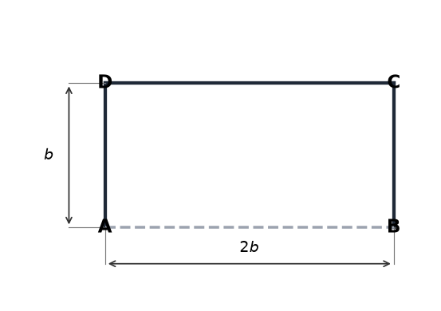

11. מגרש מלבני שאורכו 30 מ' ורוחבו 18 מ'. עלות גדר: 120 ₪ למ'. עלות ריצוף: 85 ₪ למ"ר. תקציב: 80,000 ₪.

  א. חשבו את עלות הגדר ועלות הריצוף בנפרד.
  ב. האם התקציב מספיק? כמה כסף ייוותר (או יחסר)?

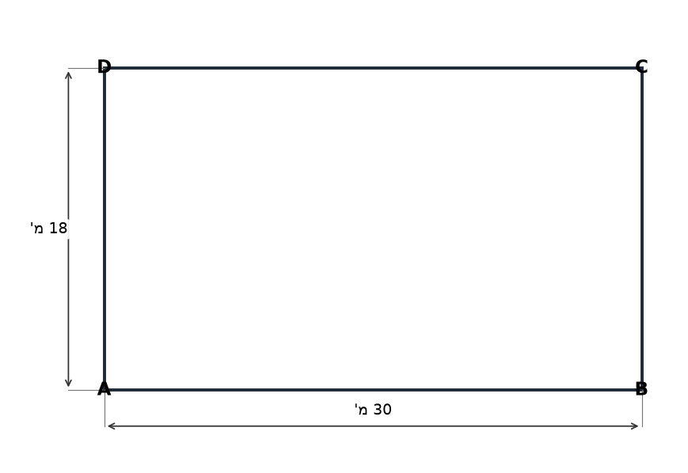

12. חצר מלבנית ABCD. גדר מוקמת לאורך הצלע הארוכה ושתי הצלעות הקצרות. עלות גדר: 250 ₪ למ'. עלות דשא: 110 ₪ למ"ר. עלות כוללת: 17,560 ₪, מתוכם עלות הגדר: 7,000 ₪.
  הצלע הקצרה קטנה ממחצית הצלע הארוכה.

  א. מצאו את מידות החצר.

  ב. חשבו את העלות הכוללת כולל מע"מ של 17%.

  ג. בכמה אחוזים הייתה מוזלת העלות הכוללת (לפני מע"מ) אילו עלות הדשא הייתה 90 ₪ למ"ר?

13. מגרש מלבני שהיקפו 60 מ'. אורכו פי 2 מרוחבו. עלות גדר: 65 ₪ למ'. עלות דשא: 120 ₪ למ"ר. תקציב: 45,000 ₪.

  א. מצאו את מידות המגרש.
  ב. חשבו עלות גדר + דשא.
  ג. האם התקציב מספיק? כמה נותר (או חסר)?

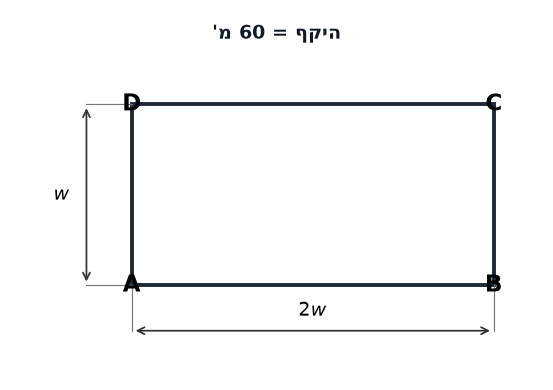

14. חדר מלבני שאורכו 18 מ' ורוחבו 12 מ'. מציעים שתי הצעות לריצוף:
  הצעה א': 50 ₪ למ"ר אחיד.
  הצעה ב': 40 ₪ למ"ר ל-100 מ"ר ראשונים, ו-60 ₪ למ"ר לשאר.

  איזו הצעה זולה יותר? בכמה שקלים?

15. גינה מלבנית שאורכה 20 מ' ורוחבה 14 מ'. מסביב לגינה נסלל שביל ברוחב 1 מ'. עלות הדשא בגינה: 60 ₪ למ"ר. עלות הסלילה בשביל: 150 ₪ למ"ר.

  א. חשבו את שטח הגינה ואת שטח השביל.
  ב. חשבו את עלות הדשא ואת עלות השביל.
  ג. מה העלות הכוללת?

16. חצר ריבועית שצלעה
$s$
מ'. עלות גדר: 90 ₪ למ'. עלות דשא: 60 ₪ למ"ר. העלות הכוללת היא 6,600 ₪.

א. הציגו משוואה לפי הנתונים ומצאו את
$s$
.
  ב. מה שטח החצר?

---

## רמה 3 – שאלות ברמת מהט (17–20)

17. למשפחת ישראלי גג מלבני. היקף הגג הוא 46 מ'. עלות ריצוף הגג היא 60 ₪ למ"ר, והעלות הכוללת לריצוף הייתה 7,200 ₪.

  א. מצאו את שטח הגג.

  ב. מצאו את מימדי הגג.
  (כתבו משוואה ריבועית ופתרו – פתרון ניחוש לא יתקבל)

  ג. מציעים שתי הצעות לאיטום הגג:
  הצעה 1: תשלום אחיד של 40 ₪ למ"ר.
  הצעה 2: 35 ₪ למ"ר ל-50 מ"ר ראשונים, ו-45 ₪ למ"ר לשאר.
  איזו הצעה זולה יותר ובכמה שקלים?

18. חצר מלבנית. גדר מוקמת לאורך הצלע הארוכה ושתי הצלעות הקצרות (שלושה צדדים). עלות הגדר: 180 ₪ למ'. עלות הדשא: 90 ₪ למ"ר. העלות הכוללת: 14,400 ₪, מתוכם עלות הגדר: 5,400 ₪. הצלע הקצרה קטנה ממחצית הצלע הארוכה.

  א. מצאו את מידות החצר.
  (כתבו מערכת משוואות ופתרו – פתרון ניחוש לא יתקבל)

  ב. בעל הבית שקל לשנות עיצוב: לגדר את כל ארבעת הצדדים (במקום שלושה) באותו מחיר למטר. כמה יעלה הגידור הכולל?

  ג. אם עלות הדשא הייתה 70 ₪ למ"ר במקום 90 ₪, בכמה אחוזים הייתה מוזלת העלות הכוללת המקורית (לפני השינוי)?

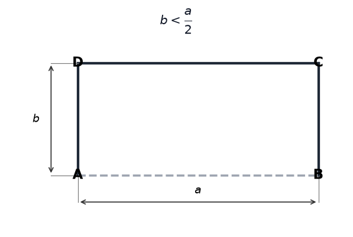

19. אדריכל תכנן מגרש מלבני שהיקפו 52 מ' ושטחו 160 מ"ר. בתוך המגרש תוכנן בית מלבני עם שוליים של 3 מ' מכל אחד מארבעת הצדדים.

  א. מצאו את מידות המגרש.
  (כתבו מערכת משוואות ופתרו – פתרון ניחוש לא יתקבל)

  ב. חשבו את שטח הבית המתוכנן.

  ג. מחשבים לזרוע דשא בשטח שסביב הבית (מחוץ לבית, בתוך המגרש). עלות הדשא: 25 ₪ למ"ר. תקציב לדשא: 6,000 ₪. האם התקציב מספיק? אם כן, כמה ייוותר?

  ד. לאחר הבנייה, מחליטים להוסיף גדר רק לאורך שלושה צדדים של המגרש (הצלע הארוכה ושתי הקצרות). עלות הגדר: 200 ₪ למ'. מה עלות הגדר?

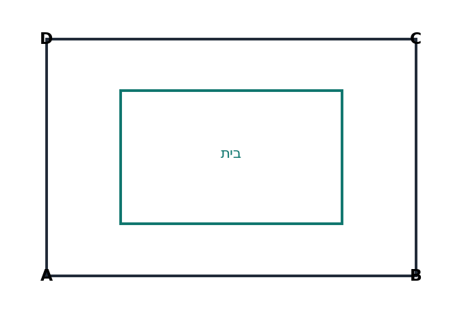

20. אדריכל תכנן מגרש מלבני. ההיקף הוא 40 מ' ואורכו גדול מרוחבו ב-4 מ'. בתוך המגרש יבנה בית עם שוליים של 2 מ' מכל צד.

  א. מצאו את מידות המגרש.

  ב. שטח מסביב לבית (שטח הגינה) יזרע דשא ב-30 ₪ למ"ר, ומסביב לכל המגרש תוקם גדר ב-140 ₪ למ'. מה העלות הכוללת לדשא ולגדר?

  ג. בעל המגרש קיבל הצעה: מחיר הגדר 140 ₪ למ' + מחיר הדשא עולה ב-20% בגלל קושי בעבודה. האם הוא יעמוד בתקציב של 20,000 ₪? חשבו.

  ד. בכמה אחוזים גדל מחיר הדשא בהצעה לעומת המחיר המקורי? מה ההפרש בשקלים בין שתי ההצעות?

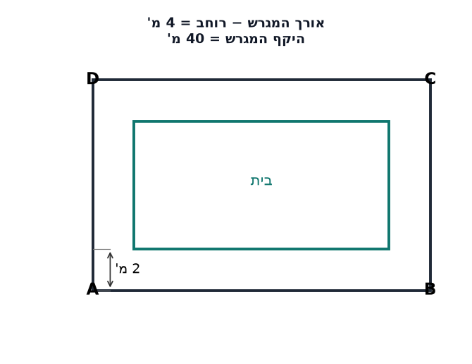

---

תשובות סופיות

**רמה 1:**

1. $1{ }600$
₪

2. $3{ }900$
₪

3. $2{ }200$
₪

4. $6{ }480$
₪

5. $10{ }320$₪

6. $6{ }570$₪

7.
א.
$21$
מ'
ב.
$2{ }520$
₪

8. $
$1{ }190$
₪ **רמה 2:**

9.
א.
$120$
מ"ר
ב.
$8$
מ'
ג.
$4{ }900$
₪; הצעה א' זולה יותר ב-100 ₪

10.
א.
אורך גדר =
$30$
מ';
$a + 2b = $
30
$,$
a = 2b
$→$
4b = 30
$... *($
ניתןלוודא
$:$
a = 2b
$,$
2b + 2b = 30
$→$
b = 7.5
$...$
נכוןלבדוק
$: a=2b, fence=a+2b=2b+2b=4b=30 → b=7.5, a=15)*$
שטח
$=$

112.
$5$
מ"ר; עלות דשא =$
$10{ }125$
₪ *(הערה: אם b צריך להיות שלם, נניח
$10$
:
$a+2b=40$
, לא תואם. ניתן לשנות נתוני השאלה בכיתה)* ג. $
$15{ }525$
₪

11.
א.
$45{ }900$
₪
ב.
$22{ }580$
₪

12.
א.
$6$
✗ מידות החצר: **16 מ' × 6 מ'** ב. $
$20{ }545.2$
₪
ג.
$\frac{1{ }920}{17{ }560} \times 100 \approx 10.9\%$

13.
א.
$20$
מ'
ב.
$27{ }900$₪
ג.
תקציב 45,000 ₪ → מספיק; נותרים:
$17{ }100$
₪

14. $
$10{ }960$
₪ **הצעה א' זולה יותר ב-160 ₪**

15.
א.
$72$
מ"ר
ב.
$10{ }800$
₪
ג.
$27{ }600$
₪

16.
א.
$90 \times 4s + 60 \times s^2 = $
$6{ }600$
→
$60s^2 + 360s - 6{ }600 = 0$
→
$s^2 + 6s - 110 = 0$
$476$
... *(לא מספר שלם; בנוסחה:
$90 \times 4s + 60s^2 = $6600$
עם
$s=8$:$6720 \neq $6600$
; עם
$s=7.5$:$6075 \neq $6600$
; יש לבדוק נתונים)* *גרסה מתוקנת עם
$s = 10$
:$
$9{ }600$
₪ – ניתן לשנות תקציב בכיתה לפי הצורך* **רמה 3:**

17.
א.
$120$
מ"ר
ב.
$0$
→ **15 מ' × 8 מ'** ג. $
$4{ }900$
₪ **הצעה 1 זולה יותר ב-100 ₪**

18.
א.
$5$
✗ מידות החצר: **20 מ' × 5 מ'** ב. $
$9{ }000$
₪
ג.
$\frac{2{ }000}{14{ }400} \times 100 \approx 13.9\%$

19.
א.
$0$
→ **16 מ' × 10 מ'** ב.
$40$
מ"ר
ג.
$3{ }000$
₪
ד.
$7{ }200$
₪

20.
א.
$8$
מ'** ב. $
$7{ }520$
₪
ג.
$7{ }904$
₪; תקציב 20,000 ₪ → **מספיק בשני המקרים** ד.
$384$
₪

