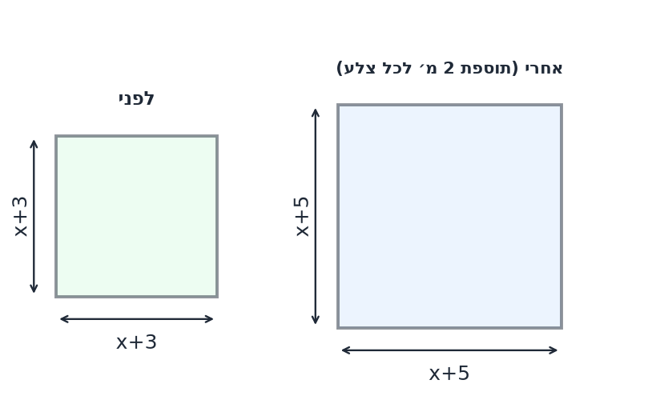

# יחידה 6.2 – הצבת נתונים ופתרון שאלות מילוליות הכוללות בתוכן ביטוי ריבועי מובנה

---

## רמה 1 – תרגילים בסיסיים (1–8)

1. נתון הביטוי
$$f(x) = x^2 - 4x + 3$$
חשבו את
$f(0)$
,
$f(1)$
ו-
$f(5)$
.

2. מספר כדורים שנותר בקופסה לאחר
$x$
ימים נתון על-ידי:
$$n(x) = x^2 - 6x + 10$$
כמה כדורים נותרו אחרי 3 ימים?

3. גובה כדור שנזרק (במטרים) לאחר
$t$
שניות נתון על-ידי:
$$h(t) = -t^2 + 8t + 2$$
מהו גובה הכדור אחרי שניה אחת?

4. שטח אריח ריבועי שצלעו
$x$
ס"מ:
$$A(x) = x^2$$
מה שטח האריח אם
$x = 7$
?

5. נתון:
$$f(x) = 2x^2 - 3x + 1$$
חשבו את
$f(4)$
.

6. כמות מוצרים שיוצרה (באלפי יחידות) בחודש
$x$
נתונה על-ידי:
$$P(x) = x^2 + 2x + 5$$
כמה יחידות יוצרו בחודש השלישי?

7. הכנסה (בשקלים) ממכירת
$x$
יחידות מוצר נתונה על-ידי:
$$H(x) = 50x - x^2$$
מהי ההכנסה ממכירת 10 יחידות?

8. נתון:
$$g(x) = x^2 - 10x + 25$$
א. חשבו
$g(5)$
.
ב. מהו הערך של
$x$
שעבורו
$g(x) = 0$
?

---

## רמה 2 – תרגילים בינוניים (9–16)

9. בריכת השחייה מתמלאת בקצב המבוטא על-ידי:
$$V(t) = 3t^2 + 2t$$
כאשר
$V$
נמדד בליטרים ו-
$t$
בדקות.
א. כמה ליטרים בבריכה אחרי 4 דקות?
ב. מתי יש בבריכה 40 ליטרים? (הציבו ופתרו משוואה)

10. שדה חקלאי מלבני שאורכו גדול ברוחבו ב-4 מ'. שטחו הוא:
$$S = x(x + 4)$$
כאשר
$x$
הוא הרוחב.
א. אם
$x = 8$
, מה שטח השדה?
ב. אם השטח הוא 60 מ"ר, הציבו ופתרו:
$$x(x + 4) = 60$$

11. ליצירת גדר בגן, משתמשים ב-20 מ' חוט. הגן הוא מלבן שרוחבו
$x$
.
  אורכו:
$$l = 10 - x$$
א. בטאו את השטח כפונקציה ריבועית של
$x$
.
ב. אם
$x = 3$
, מה השטח?

12. שני מספרים שסכומם 12. הראשון הוא
$x$
, השני הוא
$12 - x$
.
  מכפלתם:
$$P(x) = x(12 - x) = 12x - x^2$$
א. חשבו את
$P(3)$
ו-
$P(6)$
.
  ב. איזו מכפלה גדולה יותר?

13. עלות ייצור
$x$
מוצרים (בשקלים) נתונה על-ידי:
$$C(x) = x^2 - 8x + 20$$
  א. מה עלות ייצור 5 מוצרים?
  ב. מתי העלות שווה ל-20 ₪? (פתרו:
$$x^2 - 8x = 0$$
)

14. גובה כדור (במטרים) לאחר
$t$
שניות:
$$h(t) = -5t^2 + 20t + 1$$
א. מהו הגובה ב-
$t = 2$
?
  ב. מתי הכדור חוזר לגובה 1 מ'? הציבו ופתרו.

15. ליעל יש
$x$
ספרים, להדר יש
$y$
ספרים. הקשר ביניהם:
$$y = x^2 - 5x + 6$$
א. אם
$x = 4$
, כמה ספרים יש להדר?
ב. מתי יש לשתיהן אותו מספר ספרים? הציבו
$y = x$
:
$$x^2 - 5x + 6 = x$$

16. רווח חברה (באלפי שקלים) בחודש
$t$
:
$$R(t) = -t^2 + 10t - 16$$
א. מה הרווח בחודש
$t = 3$
?
  ב. מתי הרווח שווה ל-0? (בין אלו חודשים החברה מרוויחה?)

---

## רמה 3 – רמת מה"ט (17–20)

17. **שאלה בסגנון מה"ט (2024, שאלה 5):**
ליעל יש
$x$
צמידים, להדר יש
$y$
צמידים. הקשר ביניהם:
$$y = x^2 - 19x + 100$$
  א. כמה צמידים יש לכל אחת מהן, אם יש להן אותו מספר צמידים?
(הציבו
$y = x$
ופתרו את המשוואה הריבועית)
  ב. בהתבסס על סעיף א', עלות כל צמיד היא 250 ₪ אך ערכם ירד ב-10%.
  מה ערך כל הצמידים של ליעל לאחר הירידה?
  ג. לאחר הירידה ב-10%, מחיר הזהב עלה ב-17%. מה ערך הצמידים של ליעל כעת?

18. בבית-ספר מספר הבנות הוא
$x$
ומספר הבנים הוא
$y$
.
  נתון הקשר:
$$y = x^2 - 29x + 225$$
  א. כאשר מספר הבנות שווה למספר הבנים — כמה תלמידים יש בבית-הספר?
  ב. אם שכר לימוד הוא 1,200 ₪ לתלמיד, מה ההכנסה הכוללת?
  ג. ניתנת הנחה של 15% לתלמידים ממשפחות מרובות ילדים (מעל 3 ילדים).
  אם 40% מהתלמידים זכאים להנחה, מה ההכנסה הכוללת?

19. מחיר מנה במסעדה הוא
$x$
שקלים. כמות מנות שנמכרות ביום היא:
$$Q(x) = x^2 - 40x + 500$$
  (כלכלת ביקוש — ככל שהמחיר עולה, הביקוש יורד בצורה ריבועית)
א. אם
$x = 25$
, כמה מנות נמכרות ביום?
  ב. הכנסת המסעדה ביום היא:
$$H(x) = x \cdot Q(x) = x(x^2 - 40x + 500)$$
חשבו את
$H(25)$
.
  ג. מתי כמות המנות שווה ל-125? פתרו:
$$x^2 - 40x + 500 = 125$$

20. **שאלת אתגר:**
  שטח מגרש ריבועי הוא:
$$S = (x + 3)^2$$
כאשר
$x$
הוא אורך הצלע המקורית (בלי התוספת).
  א. פתחו את הביטוי.
ב. אם שטח המגרש הוא 169 מ"ר, מצאו את
$x$
.
  ג. אם נוספו 2 מ' לכל צלע:
$$S_{\text{new}} = (x + 5)^2$$
ב-כמה אחוז גדל השטח? (השתמשו בערך
$x$
שמצאתם)

---

תשובות סופיות

1. $f(0)=3,\quad f(1)=0,\quad f(5)=8$

2. $n(3)=9-18+10=1$

3. $h(1)=-1+8+2=9$

4. $7^{2}=49$
סנטימטרים רבועים.

5. $f(4)=21$

6. $P(3)=20$
כלומר
$20000$
יחידות.

7. $H(10)=400$

8.
א.
$g(5)=25-50+25=0$
ב.
$g(x)=(x-5)^{2}$
לכן
$x=5$
כשורש כפול.

9.
א.
$V(4)=56$
ליטרים.
ב.
$3t^{2}+2t=40 \Longrightarrow t=\dfrac{10}{3}\approx 3{,}33$
דקות.

10.
א.
$8\cdot 12=96$
מטרים רבועים.
ב.
$x^{2}+4x-60=0 \Longrightarrow x=6$

11.
א.
$S(x)=x(10-x)=10x-x^{2}$
ב.
$S(3)=21$
מטרים רבועים.

12.
א.
$P(3)=27,\quad P(6)=36$
ב.
גדולה יותר היא המכפלה ב-
$x=6$

13.
א.
$C(5)=5$
שקלים.
ב.
$x^{2}-8x=0 \Longrightarrow x\in\{0,\;8\}$
פרקטיקה כללית בבעיות מסוג זה:
$x=8$

14.
א.
$h(2)=21$
מטרים.
ב.
מתוך
$-5t^{2}+20t+1=1$
מתקבל
$-5t^{2}+20t=0$
כלומר
$t\in\{0,\;4\}$
שניות (מעשית בדרך כלל מתייחסים ל-
$t=4$
).

15.
א.
מתוך
$x=4$
נקבל
$y=2$
ספרים.
ב.
$x=x^{2}-5x+6 \Longrightarrow x^{2}-6x+6=0$
עם
$x=3\pm\sqrt{3}$
בערך
$\approx 1{,}27$
ו-
$\approx 4{,}73$

16.
א.
$-9+30-16=5$
כלומר
$5000$
שקלים.
ב.
$-t^{2}+10t-16=0$
עם
$t\in\{2,\;8\}$
בין חודש
$2$
לבין חודש
$8$
החברה בתרחיש חיובי.

17.
א.
$x=x^{2}-19x+100 \Longrightarrow x^{2}-20x+100=0 \Longrightarrow x=10$
לכל אחת 10 צמידים.
ב.
עבור
$x=10$
$250\cdot 10\cdot 0{,}90=2250$
שקלים.
ג.
$2250\cdot 1{,}17=2632{,}50$
שקלים.

18.
א.
מתוך
$y=x$
מתקבלת
$x^{2}-30x+225=0 \Longrightarrow (x-15)^{2}=0 \Longrightarrow x=15$
כלומר 15 בנות ו-15 בנים, סך הכול
$30$
תלמידים.
ב.
הכנסה בלי הנחה
$1200\cdot 30=36000$
שקלים.
ג.
ממוצע לתלמיד מתוך ההנחות
$0{,}6\cdot 1200+0{,}4\cdot(0{,}85\cdot 1200)=1128$
כלומר ההכנסה
$1128\cdot 30=33840$
שקלים.

19.
א.
$Q(25)=125$
מנות ביום.
ב.
$H(25)=3125$
שקלים.
ג.
$x^{2}-40x+375=0 \Longrightarrow (x-15)(x-25)=0$
כלומר
$x=15$
או
$x=25$

20.
א.
מתוך פתיחת סוגריים
$(x+3)^{2}=x^{2}+6x+9$
ב.
מתוך שטח המגרש
$(x+3)^{2}=169$
עם הצלע הגיונית בשאלה מתקבלים
$x+3=13 \Longrightarrow x=10$
מטרים.
ג.
מתוך ההצבה
$x=10$
השטח החדש הוא
$225$
מטרים רבועים, ולכן הגדלה יחסית
$\dfrac{225-169}{169}\cdot100\approx33{,}14\%$

