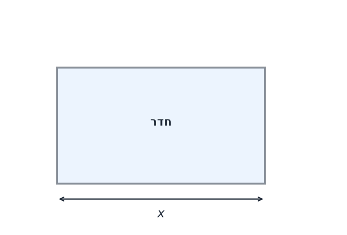
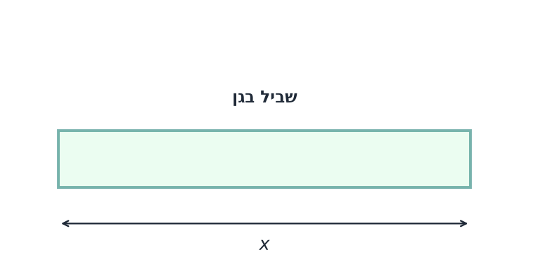
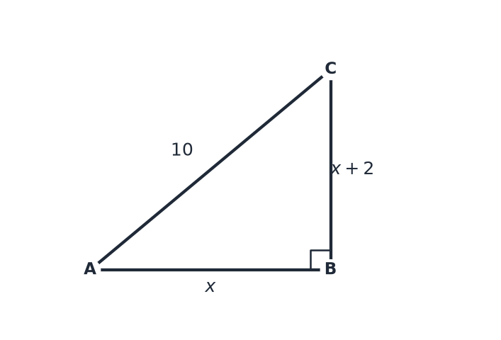

# יחידה 7.2 – פסילת תשובות: מתי פתרון מתמטי נכון נפסל על סמך ההיגיון של הבעיה

---

## רמה 1 – תרגילים בסיסיים (1–8)

1. מצאנו שאורך צלע ריבוע מקיים
$x^2 = 9$
, ולכן
$x = 3$
או
$x = -3$
.
  איזה פתרון תקף? הסבירו.

2. מצאנו שמספר הילדים בגן מקיים
$x + 15 = 15$
, ולכן
$x = 0$
.
  האם זה פתרון תקף? מה פירושו?

3. גיל עמי הוא פתרון של
$x - 8 = -3$
, ולכן
$x = 5$
.
  האם תקין? מה יהיה גיל עמי לפני 10 שנים?

4. מצאנו שמספר האנשים בקבוצה מקיים
$$x^2 - 9x + 20 = 0$$
ולכן
$x = 4$
או
$x = 5$
.
  שניהם מספרים חיוביים שלמים — האם שניהם תקפים בהקשר? הסבירו.

5. מצאנו שאורך בריכת שחייה (במטרים) מקיים
$x(x - 6) = 0$
, ולכן
$x = 0$
או
$x = 6$
.
  איזה פתרון תקף? הסבירו.

6. עלות קנייה היא
$-50$
שקלים.
  האם עלות שלילית הגיונית? מה כנראה קרה בחישוב?

7. מצאנו שמספר המטרים של גדר מקיים
$x^2 - 25 = 0$
, ולכן
$x = 5$
או
$x = -5$
.
  איזה פתרון תקף?

8. כמות ליטרים של מיץ בבקבוק מקיימת
$$x^2 - x - 0.75 = 0$$
ולכן
$x = 1.5$
או
$x = -0.5$
.
האם
$1.5$
ליטרים הגיוני? מה לגבי
$x = -0.5$
?

---

## רמה 2 – תרגילים בינוניים (9–16)

9. שדה מלבני שאורכו גדול מרוחבו ב-4 מ'. שטחו 21 מ"ר.
א. הגדירו
$w$
= רוחב, כתבו ופתרו:
$$w(w + 4) = 21$$
ב. קיבלתם
$w = 3$
ו-
$w = -7$
. איזה פתרון תקף? פסלו את השני עם נימוק.

10. גיל אדם כיום הוא
$x$
. לפני 5 שנים גילו היה
$x - 5$
.
נתון:
$(x - 5) \cdot x = 24$
  א. פתרו את המשוואה.
  ב. קיבלתם שני פתרונות — בדקו איזה הגיוני (גיל חייב להיות לפחות 5).

11. מספר עובדים בחברה מקיים:
$$x^2 - 11x + 28 = 0$$
  א. פתרו.
  ב. שני הפתרונות חיוביים ושלמים — מה המשמעות? האם ייתכנו שניהם?

12. רוחב חדר (במטרים) מקיים:
$$2x^2 - x - 6 = 0$$
  א. פתרו.
ב. קיבלתם
$x = 2$
ו-
$x = -1.5$
. איזה תקף?

13. מחיר מוצר (בשקלים) מקיים:
$$x^2 - 100 = 0$$
  א. פתרו.
ב. האם
$x = -10$
הגיוני לתיאור מחיר?

14. כמות תלמידים בכיתה (חייבת להיות מספר שלם) מקיימת:
$$x^2 - 7x + 12.25 = 0$$
  א. פתרו (ייתכן שתקבלו מספר לא שלם).
  ב. האם הפתרון תקף?

15. אורך שביל בגן (במטרים) מקיים:
$$3x^2 - 12x + 9 = 0$$
  א. פתרו.
  ב. שני הפתרונות חיוביים — האם שניהם הגיוניים לאורך שביל? הסבירו.

16. שטח ריבוע (במ"ר) מקיים:
$$x^2 - 8x + 15 = 0$$
  א. פתרו.
  ב. שני הפתרונות חיוביים — שניהם תקפים לאורך צלע?
  ג. מה שטח כל ריבוע?

---

## רמה 3 – רמת מה"ט (17–20)

17. **שאלת מה"ט עם פסילה מפורשת:**
  גינה מלבנית שהיקפה 26 מ' ושטחה 40 מ"ר.
א. הגדירו
$l$
= אורך,
$w$
= רוחב. כתבו שתי משוואות.
ב. מ-
$l + w = 13$
הסיקו
$l = 13 - w$
והציבו בנוסחת השטח.
  ג. פתרו את המשוואה הריבועית שתקבלו.
  ד. בדקו שניהם — האם שניהם תקפים? (שניהם נותנים מלבן, רק בסדר ממדים שונה)

18. **שאלה עם כמות שלמה:**
לחנות צעצועים נמסרו קופסאות. מספר הצעצועים בכל קופסה הוא
$x$
ומספר הקופסאות הוא
$x - 5$
. סה"כ יש 84 צעצועים.
  א. כתבו משוואה.
  ב. פתרו.
ג. קיבלתם
$x = 12$
ו-
$x = -7$
. פסלו את הפתרון הלא תקף עם נימוק מלא.
  ד. כמה קופסאות יש? כמה צעצועים בכל קופסה?

19. **שאלת גיל עם פסילה:**
  גיל אב הוא פי 4 מגיל בנו. לפני 6 שנים מכפלת גיליהם הייתה 400.
א. סמנו את גיל הבן היום
$x$
ואת גיל האב
$4x$
.
ב. לפני 6 שנים: בן
$x - 6$
, אב
$4x - 6$
.
  כתבו:
$$(x - 6)(4x - 6) = 400$$
  ג. פתחו, פשטו ופתרו.
  ד. קיבלתם שני פתרונות — בדקו כל אחד: האם גיל הבן לפני 6 שנים חיובי?
  ה. רשמו את הגילאים הנוכחיים של האב והבן.

20. **שאלת מה"ט מלאה — שתי רגליים ויתר:**
משולש ישר-זווית שרגליו
$x$
ו-
$x + 2$
ויתרו 10.
  א. כתבו משוואה (משפט פיתגורס).
  ב. פתרו את המשוואה הריבועית.
  ג. פסלו את הפתרון השלילי.
  ד. מצאו את שלוש הצלעות.
ה. בדקו: האם
$a^2 + b^2 = c^2$
?

---

תשובות סופיות

1. $x = 3$
תקף (אורך חיובי);
$x = -3$
נפסל כי אורך לא יכול להיות שלילי

2. $x = 0$
תקין מתמטית אך פירושו "אין ילדים בגן" — תלוי בהקשר

3. $x = 5$
תקין; לפני 10 שנים היה גילו
$-5$
— תוצאה בלתי אפשרית, כי גיל לא יכול להיות שלילי.

4. שניהם תקפים כמספרי אנשים; שניהם חיוביים ושלמים.

5. $x = 6$
תקף;
$x = 0$
נפסל כי בריכה בגודל 0 אינה הגיונית.

6. עלות שלילית לא הגיונית; ככל הנראה נפלה טעות בחישוב.

7. $x = 5$
תקף (אורך חיובי);
$x = -5$
נפסל כי גודל הגדר לא יכול להיות שלילי.

8. $x = 1.5$
ליטרים — הגיוני (כמות חיובית);
$x = -0.5$
נפסל כי כמות נוזל לא יכולה להיות שלילית.

9.
א.
$w = 3$
או
$w = -7$
ב.
$w = 3$
תקף;
$w = -7$
נפסל (רוחב שלילי)

10.
א.
$x = 8$
או
$x = -3$
ב.
$x = 8$
תקף (הגיל לפני 5 שנים הוא
$3$
, חיובי);
$x = -3$
נפסל

11.
א.
$x = 4$
או
$x = 7$
ב.
שניהם חיוביים ושלמים — שניהם ייתכנו (למשל שתי מחלקות שונות)

12.
א.
$x = 2$
או
$x = -1.5$
ב.
$x = 2$
תקף;
$x = -1.5$
נפסל

13.
א.
$x = 10$
או
$x = -10$
ב.
$x = -10$
נפסל (מחיר שלילי); המחיר התקף הוא
$x = 10$
שקלים

14.
א.
$x = 3.5$
(שורש כפול)
ב.
לא תקף — כמות תלמידים חייבת להיות שלמה

15.
א.
$x = 1$
או
$x = 3$
ב.
שניהם הגיוניים — שני אורכים אפשריים

16.
א.
$x = 3$
או
$x = 5$
ב.
שניהם תקפים כאורכי צלע
ג.
$9$
מ"ר ו-
$25$
מ"ר

17.
א.
$l + w = 13$
וגם
$l \cdot w = 40$
ב.
$w(13 - w) = 40$
ג.
$w = 5$
או
$w = 8$
ד.
$(5, 8)$
ו-
$(8, 5)$
— אותו מלבן, שניהם תקפים

18.
א.
$x(x - 5) = 84$
ב.
$x = 12$
או
$x = -7$
ג.
$x = -7$
נפסל — כמות צעצועים לא יכולה להיות שלילית
ד.
7 קופסאות, 12 צעצועים בכל קופסה

19. לאחר פתיחת סוגריים ופישוט המשוואה
$(x - 6)(4x - 6) = 400$
מתקבלים השורשים
$x = 14$
ו-
$x = -6.5$
.
הפתרון
$x = -6.5$
נפסל, כי אז גיל הבן וגיל האב לפני 6 שנים היו שליליים.
גיל הבן היום
$14$
שנים וגיל האב
$56$
שנים.

20.
א.
$x^2 + (x+2)^2 = 100$
ב.
$x = 6$
או
$x = -8$
ג.
$x = -8$
נפסל
ד.
רגליים: 6 ו-8, יתר: 10
ה.
$100$
✓

