# תרגול — מבוא להנדסה

מסמך זה מיועד לתרגול עצמי בנושא מבוא להנדסה במישור: תכונות צורות, שטחים והיקפים, ועבודה עם נקודות במערכת צירים כשהצורות מיושרות לצירים.

הנחיות:

מספר התרגיל מופיע בצד ימין. גוף השאלה בעברית. כל מספרים, מדידות ויחסים מופיעים בבלוקים מתמטיים נפרדים — בלי לערבב ספרות באותה שורה עם טקסט עברי.

מספור: לכל תת־נושא תרגילים מקומיים מאחד עד עשרים. בסוף המסמך מופיעים מפתח תשובות ופתרונות מלאים לתרגילים הקשים בלבד.

ליד חלק מהתרגילים מופיע **איור משלים** בתיקייה `../graphs/intro_geometry` (קבצי PNG). האיורים נוצרים באמצעות הסקריפט `../graphs/generate_intro_geometry.py` — ניתן להריץ אותו מחדש אחרי שינוי נתונים. על גבי האיורים מופיעים מספרים ומלל באנגלית בלבד, כדי לא לערבב כיוון כתיבה עם העברית במסמך.

---

## תת־נושא 6.1 — תכונות צורות הנדסיות

### רמה בסיסית וטכנית

<strong>1.</strong>

במשולש שני זוויות פנימיות נתונות במעלות:

$$
40^\circ,\ 95^\circ
$$

מצאו את הזווית הפנימית השלישית.

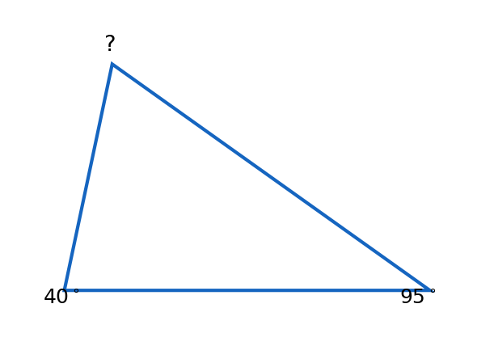

<strong>2.</strong>

כמה צלעות שוות יש בריבוע? ענו במספר בלבד, בשורה נפרדת אחרי המילה «תשובה» בעברית.

<strong>3.</strong>

במרובע פשוט כל ארבע הזוויות ישרות. שתי צלעות סמוכות באורכים שונים.

איזו צורה זו? כתבו את שם הצורה בעברית בלבד, בשורה נפרדת.

<strong>4.</strong>

האם נכון שבמקבילית צלעות נגדיות מקבילות זו לזו? ענו «נכון» או «לא נכון» בשורה נפרדת.

<strong>5.</strong>

נתון מעגל שבו אורך הקוטר הוא

$$
18\text{ cm}
$$

מצאו את אורך הרדיוס באותן יחידות.

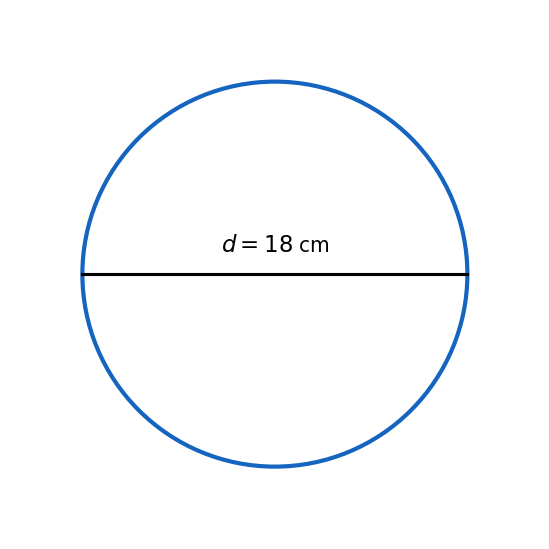

### רמה בינונית

<strong>6.</strong>

במקבילית, זווית פנימית אחת היא

$$
63^\circ
$$

מצאו את שלוש זוויות הפנים האחרות במעלות.

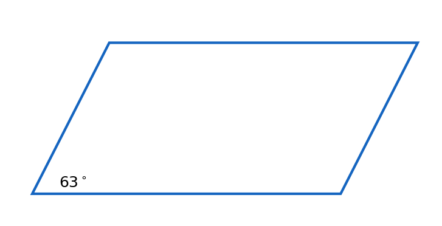

<strong>7.</strong>

האם כל ריבוע הוא גם מלבן? ענו «כן» או «לא» והסבירו במשפט אחד בלי לכתוב ספרות בשורת ההסבר.

<strong>8.</strong>

האם כל מעוין הוא גם מקבילית? ענו «כן» או «לא».

<strong>9.</strong>

בטרפז, כמה זוגות של צלעות מקבילות יש לפי ההגדרה הנלמדת בכיתה (זוג אחד של בסיסים)? ענו במספר בלבד.

<strong>10.</strong>

במשולש ישר־זווית, אחת הזוויות החדות היא

$$
35^\circ
$$

מצאו את הזווית החדה השנייה.

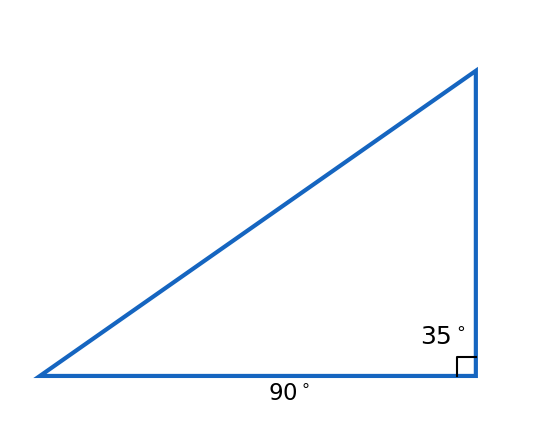

### רמה מתקדמת

<strong>11.</strong>

נתון מרובע פשוט שבו כל ארבע הזוויות שוות זו לזו.

האם בהכרח מדובר במרובע שכל צלעותיו שוות? ענו «כן» או «לא» ונמקו במשפט אחד בלי ספרות.

<strong>12.</strong>

בדלתון, כמה זוגות של צלעות סמוכות שוות יש לפי ההגדרה הטיפוסית? ענו במספר בלבד.

<strong>13.</strong>

נתון מקבילית שאינה מלבן.

האם ייתכן שכל צלעותיה שוות? ענו «כן» או «לא» ונמקו במשפט קצר בלי ספרות.

<strong>14.</strong>

במעוין, האם תמיד נכון שהאלכסונים שווים באורך? ענו «כן» או «לא».

<strong>15.</strong>

נתון משולש שבו שתי זוויות שוות זו לזו, וכל אחת מהן

$$
48^\circ
$$

מצאו את הזווית השלישית.

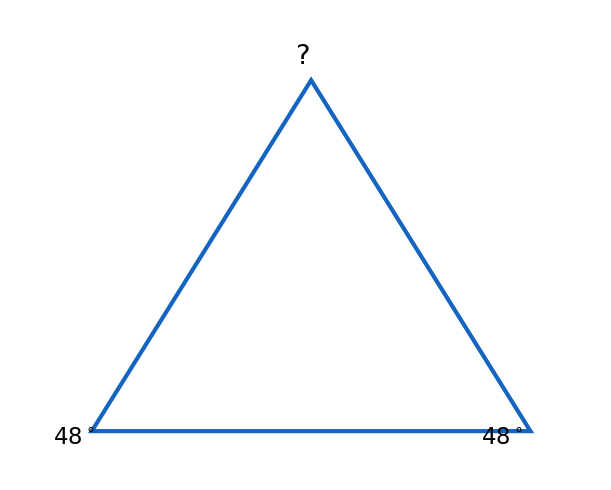

### רמת בחינה ואתגר

<strong>16.</strong>

רשמו את כל האפשרויות הנכונות מהרשימה: ריבוע, מלבן, מעוין, מקבילית — עבור צורה שבה ידוע רק שכל הצלעות שוות ושכל הזוויות ישרות. כל אפשרות בשורה נפרדת בעברית.

<strong>17.</strong>

במרובע פשוט, סכום שתי זוויות סמוכות הוא

$$
220^\circ
$$

האם ייתכן המצב? ענו «כן» או «לא» ונמקו בקצרה בלי ספרות בשורת הנימוק.

<strong>18.</strong>

נתון מעוין שאינו ריבוע.

הוכיחו במילים ובאמצעות תכונות מוכרות של מעוין ושל מלבן מדוע האלכסונים אינם שווים באורך.

<strong>19.</strong>

במקבילית, אלכסון אחד חוצה את המקבילית ויוצר שני משולשים.

הסבירו אילו זוגות זוויות נגדיות במשולשים הללו שוות זו לזו בגלל תכונות המקבילית, בלי לבצע חישובי מספרים.

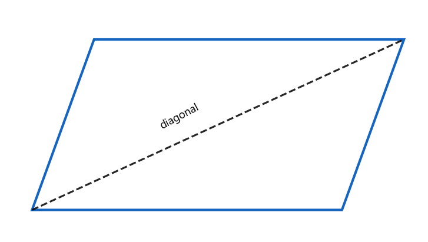

<strong>20.</strong>

נתון מרובע שבו כל הצלעות שוות, אבל הוא אינו ריבוע.

ציינו שם צורה אפשרית אחת מהסוג שנלמד בסילבוס, והסבירו במשפט אחד למה היא עונה על התנאים.

---

## תת־נושא 6.2 — שטחים והיקפים וצורות מורכבות

### רמה בסיסית וטכנית

<strong>1.</strong>

מלבן באורך

$$
9\text{ cm}
$$

וברוחב

$$
4\text{ cm}
$$

חשבו את השטח.

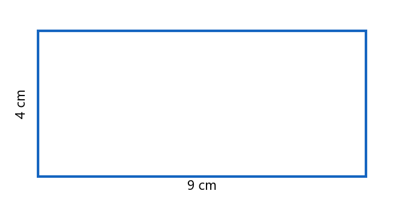

<strong>2.</strong>

ריבוע שבו אורך צלע הוא

$$
11\text{ m}
$$

חשבו את ההיקף.

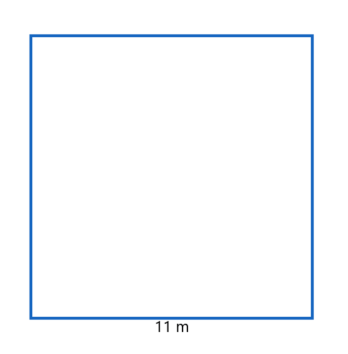

<strong>3.</strong>

משולש עם בסיס

$$
8\text{ cm}
$$

וגובה לבסיס

$$
3\text{ cm}
$$

חשבו את השטח.

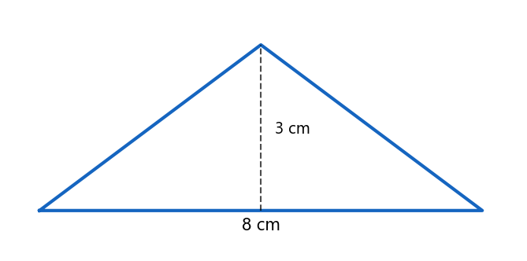

<strong>4.</strong>

מקבילית עם בסיס

$$
12\text{ dm}
$$

וגובה

$$
5\text{ dm}
$$

חשבו את השטח.

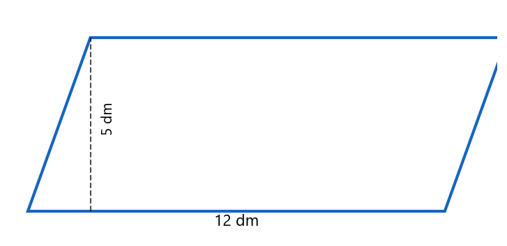

<strong>5.</strong>

מעגל עם רדיוס

$$
7\text{ cm}
$$

כתבו את השטח בעזרת

$$
\pi
$$

בלי להחליף לקירוב עשרוני.

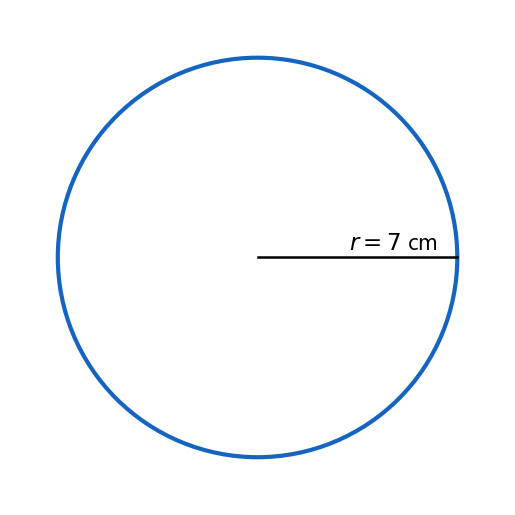

### רמה בינונית

<strong>6.</strong>

טרפז עם בסיסים

$$
6\text{ m},\ 10\text{ m}
$$

וגובה

$$
4\text{ m}
$$

חשבו את השטח.

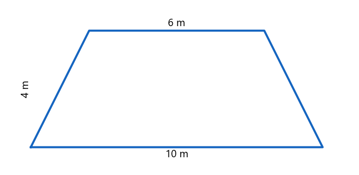

<strong>7.</strong>

מעוין שבו אורכי האלכסונים הם

$$
6\text{ cm},\ 8\text{ cm}
$$

חשבו את השטח.

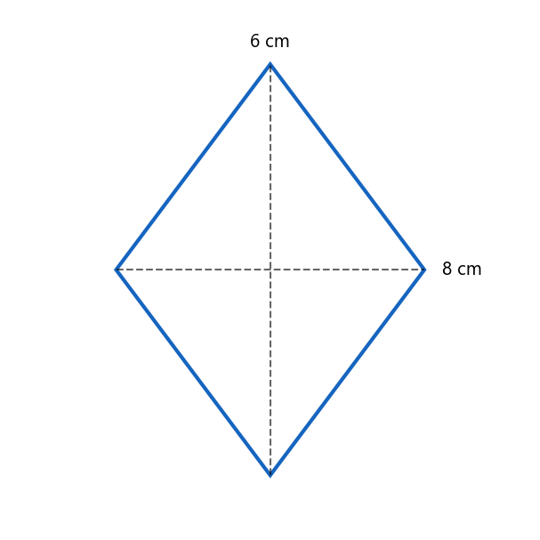

<strong>8.</strong>

מלבן באורך

$$
15\text{ cm}
$$

וברוחב

$$
8\text{ cm}
$$

חשבו את ההיקף.

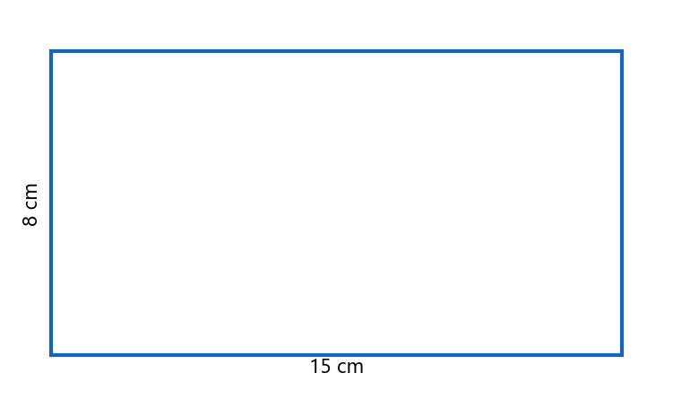

<strong>9.</strong>

ריבוע ששטחו

$$
49\text{ m}^2
$$

מצאו את אורך צלעו.

<strong>10.</strong>

מעגל שהיקפו

$$
10\pi\text{ cm}
$$

מצאו את הרדיוס.

### רמה מתקדמת

<strong>11.</strong>

צורה היא חיבור של שני ריבועים זהים בלי חפיפה. צלע כל ריבוע

$$
3\text{ cm}
$$

הם נוגעים בצלע מלאה של שלושה סנטימטרים.

חשבו את שטח הצורה המאוחדת ואת היקפה החיצוני.

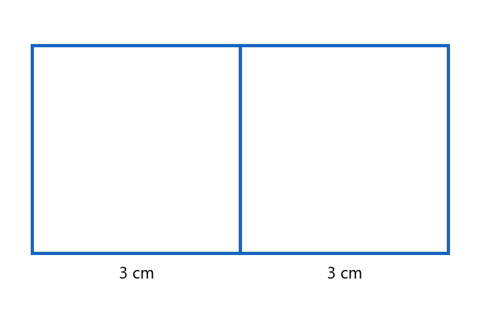

<strong>12.</strong>

מלבן

$$
20\text{ m}
$$

על

$$
9\text{ m}
$$

נחתך לאורך לשני מלבנים שווים על ידי קו מקביל לצלע האורך עשרים מטר.

חשבו את שטח כל אחד משני החלקים.

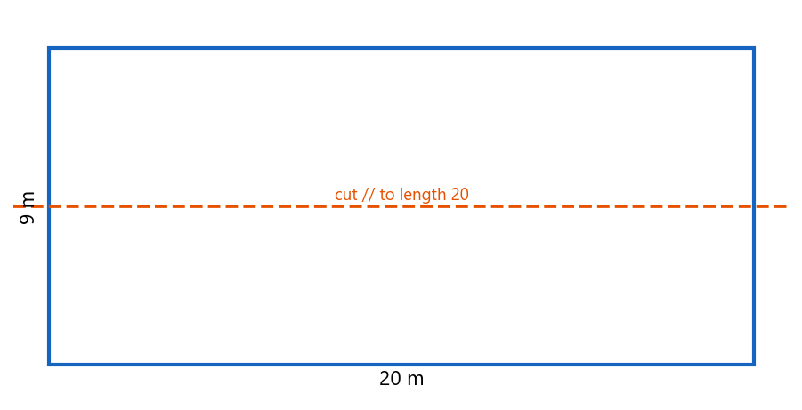

<strong>13.</strong>

משולש ישר־זווית עם ניצבים

$$
5\text{ cm},\ 12\text{ cm}
$$

חשבו את אורך היתר.

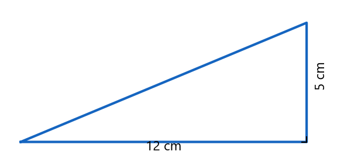

<strong>14.</strong>

מלבן באורך

$$
14\text{ cm}
$$

וברוחב

$$
5\text{ cm}
$$

בתוכו חור ריבועי של צלע

$$
2\text{ cm}
$$

החור פנימי לחלוטין ולא נוגע בגבול החיצוני.

חשבו את שטח האזור שנשאר מחוץ לחור.

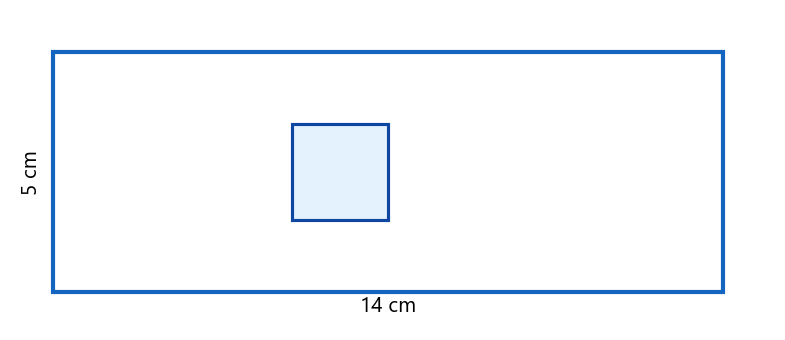

<strong>15.</strong>

מקבילית עם בסיס

$$
10\text{ cm}
$$

ושטח

$$
70\text{ cm}^2
$$

מצאו את הגובה לבסיס הנתון.

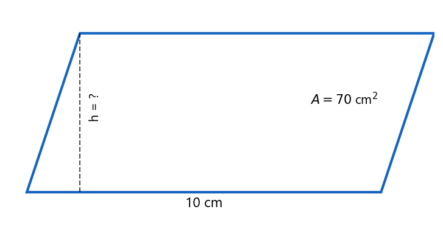

### רמת בחינה ואתגר

<strong>16.</strong>

מדשאה בצורת מלבן

$$
30\text{ m}
$$

על

$$
18\text{ m}
$$

ובמרכזה בריכה עגולה ברדיוס

$$
3\text{ m}
$$

הבריכה לא נוגעת בגדר החיצונית.

חשבו את שטח המדשאה בלבד, והביעו אותו בעזרת

$$
\pi
$$

ביחידות מתאימות.

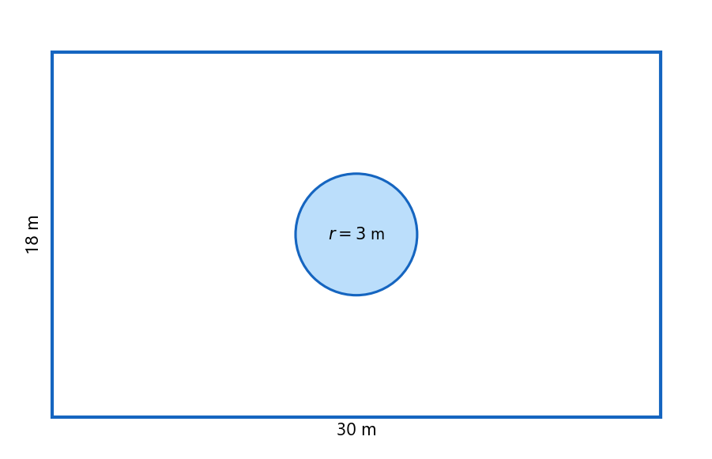

<strong>17.</strong>

צורת אל היא מלבן

$$
12\text{ cm}
$$

על

$$
5\text{ cm}
$$

שממנו הוסר בפינה חיצונית ריבוע של צלע

$$
2\text{ cm}
$$

כך שנוצר «חיתוך פינה» בלי חפיפה נוספת.

חשבו את שטח הצורה ואת היקפה החיצוני.

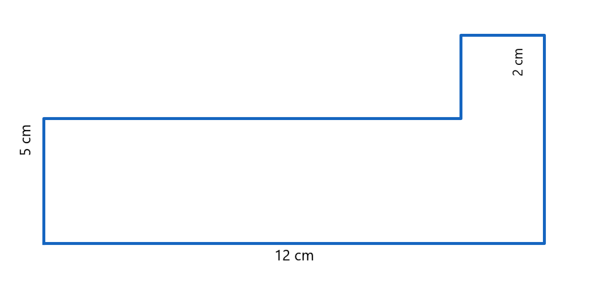

<strong>18.</strong>

ריצוף מורכב: ריבוע גדול של צלע

$$
a
$$

ובפנים «מסגרת» צרה ברוחב אחיד

$$
w
$$

מכל צד, כך שנשאר ריבוע פנימי ריק. הנתון:

$$
a = 10\text{ m},\quad w = 1\text{ m}
$$

חשבו את שטח המסגרת בלבד (האזור בין הריבוע החיצוני לריבוע הפנימי).

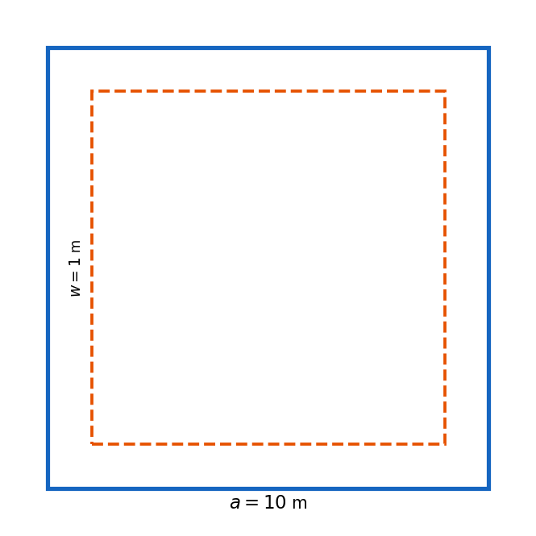

<strong>19.</strong>

מלבן באורך

$$
13\text{ cm}
$$

וברוחב

$$
7\text{ cm}
$$

מחובר לריבוע של צלע

$$
7\text{ cm}
$$

כך שצלע של שבעה סנטימטרים משותפת לשניהם, בלי חפיפה פנימית.

חשבו את שטח הצורה המאוחדת ואת היקפה החיצוני.

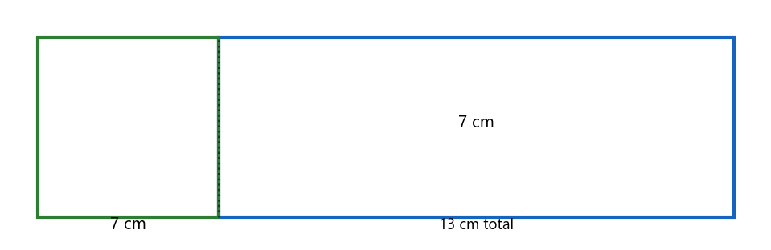

<strong>20.</strong>

משולש שווה־שוקיים שבו הבסיס הוא

$$
10\text{ cm}
$$

והשוקיים

$$
13\text{ cm}
$$

כל אחת.

הגובה לבסיס מחלק את הבסיס לשני קטעים שווים.

חשבו את אורך הגובה לבסיס.

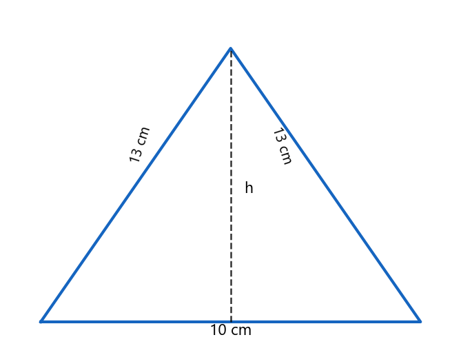

---

## תת־נושא 6.3 — נקודות, קטעים וצורות במערכת צירים

### רמה בסיסית וטכנית

<strong>1.</strong>

נתונה הנקודה

$$
(4,\ -3)
$$

כתבו את ערך הקואורדינטה האופקית בשורה נפרדת אחרי המילה «אופקית» בעברית.

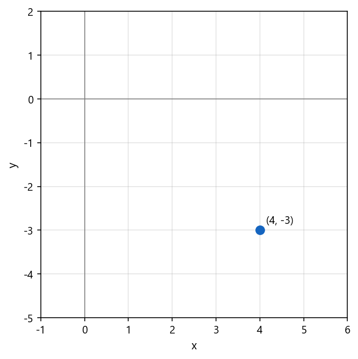

<strong>2.</strong>

המרחק האופקי בין

$$
(-2,\ 5)
$$

ל־

$$
(7,\ 5)
$$

חשבו.

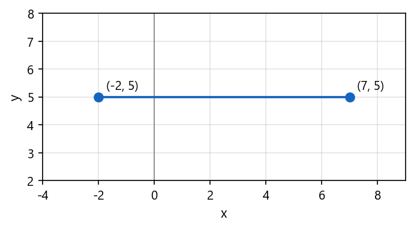

<strong>3.</strong>

המרחק האנכי בין

$$
(1,\ 6)
$$

ל־

$$
(1,\ -2)
$$

חשבו.

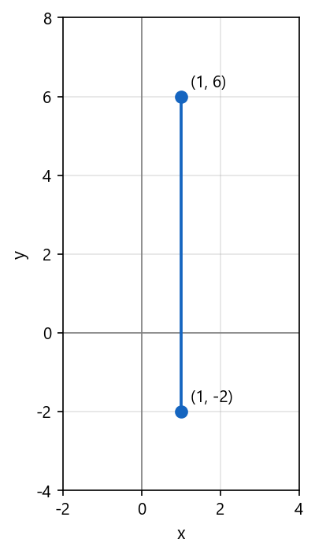

<strong>4.</strong>

מלבן מיושר לצירים עם קודקודות

$$
(0,\ 0),\ (5,\ 0),\ (5,\ 3),\ (0,\ 3)
$$

חשבו את השטח.

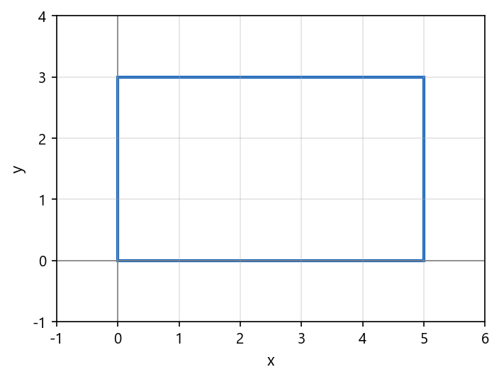

<strong>5.</strong>

נקודה

$$
A = (3,\ 8)
$$

האם היא על ציר האיקס? ענו «כן» או «לא».

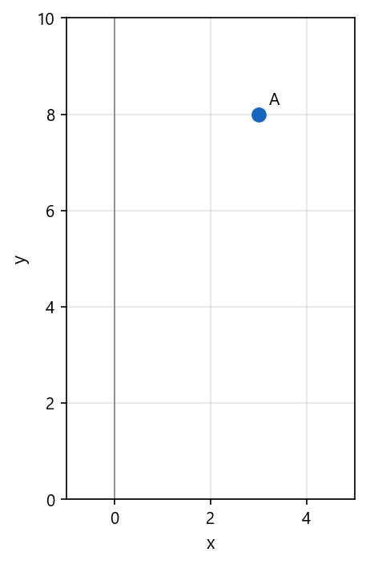

### רמה בינונית

<strong>6.</strong>

מלבן מיושר לצירים עם קודקודות

$$
(2,\ 1),\ (10,\ 1),\ (10,\ 6),\ (2,\ 6)
$$

חשבו את ההיקף.

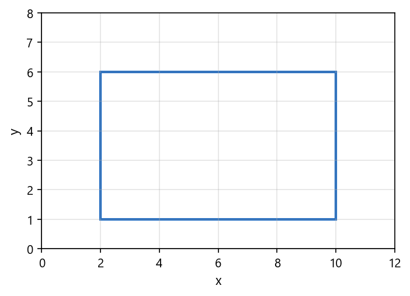

<strong>7.</strong>

נקודות

$$
(4,\ 2),\ (4,\ 9)
$$

מהו אורך הקטע ביניהן?

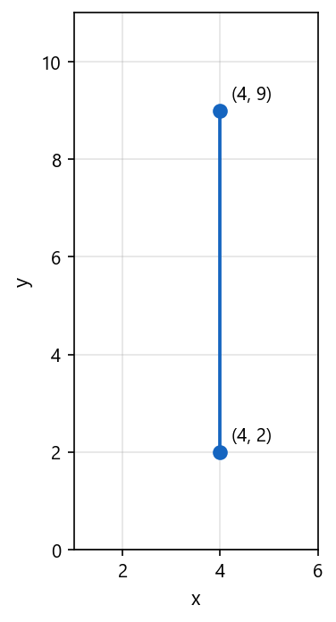

<strong>8.</strong>

ריבוע מיושר לצירים שקודקוד אחד שלו הוא

$$
(1,\ 1)
$$

וקודקוד נגדי הוא

$$
(4,\ 5)
$$

האם זה אפשרי? ענו «כן» או «לא» ונמקו במשפט קצר בלי ספרות.

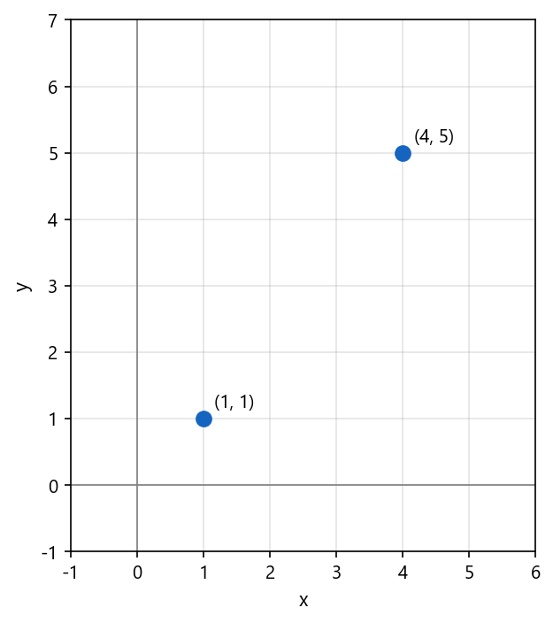

<strong>9.</strong>

מלבן מיושר לצירים עם רוחב

$$
4
$$

וגובה

$$
7
$$

קודקוד אחד הוא

$$
(-1,\ 2)
$$

והוא נקודת השמאלית־תחתונה ביחס לצורה כשמסתכלים על מערכת צירים סטנדרטית.

מצאו את קואורדינטות הקודקוד הנגדי (הימני־עליון).

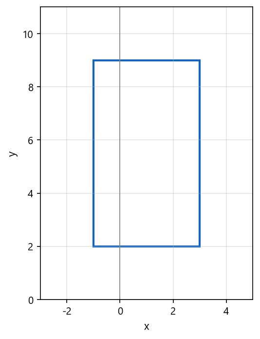

<strong>10.</strong>

נקודות

$$
(0,\ 0),\ (8,\ 0),\ (0,\ 6)
$$

יוצרות משולש ישר־זווית.

חשבו את שטח המשולש.

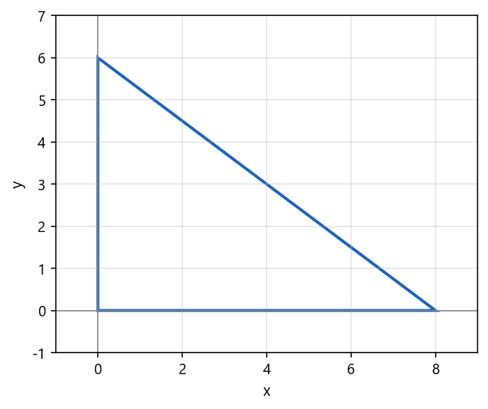

### רמה מתקדמת

<strong>11.</strong>

מקבילית מיושרת לצירים אינה אפשרית כשכל הצלעות אינן אופקיות או אנכיות — אבל **מלבן** כן.

הסבירו במשפט אחד למה במלבן מיושר לצירים הפרשי הקואורדינטות נותנים ישר את אורכי הצלעות.

<strong>12.</strong>

מלבן מיושר לצירים עם שטח

$$
24
$$

והיקף

$$
20
$$

מצאו את הרוחב והגובה אם שניהם שלמים חיוביים.

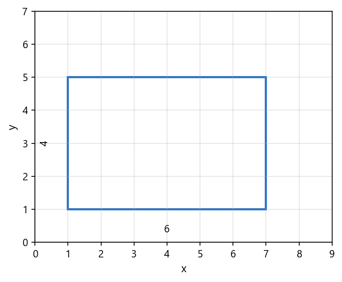

<strong>13.</strong>

נקודה

$$
P
$$

נמצאת במרחק אופקי של חמש יחידות מנקודה

$$
(2,\ 1)
$$

ועל אותו קו אופקי איתה.

כתבו את שתי האפשרויות לקואורדינטות של

$$
P
$$

כזוגות סדורים, כל זוג בשורה נפרדת.

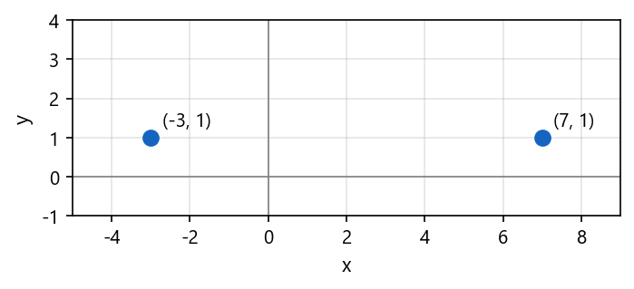

<strong>14.</strong>

מלבן מיושר לצירים שקודקודותיו

$$
(1,\ 2),\ (9,\ 2),\ (9,\ 7),\ (1,\ 7)
$$

חשבו את אורך האלכסון (היתר של משולש ישר־זווית שצלעותיו רוחב וגובה של המלבן).

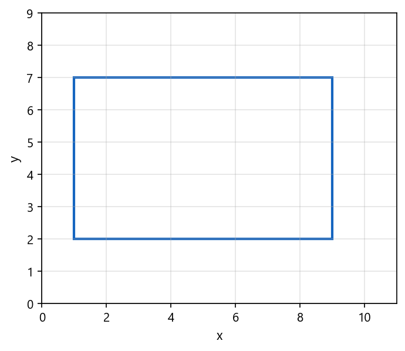

<strong>15.</strong>

משולש עם קודקודות

$$
(0,\ 0),\ (4,\ 0),\ (0,\ 3)
$$

חשבו את אורך ההיקף שלו.

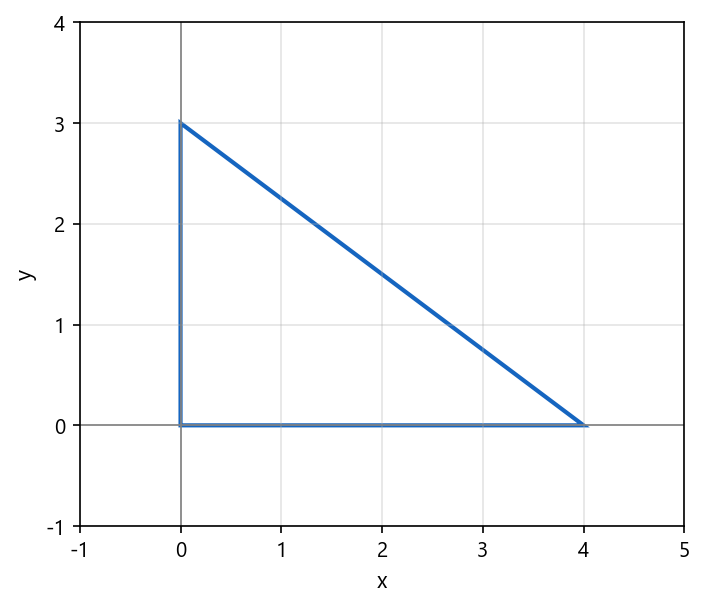

### רמת בחינה ואתגר

<strong>16.</strong>

נתון מלבן מיושר לצירים שאורך האלכסון שלו הוא עשר יחידות, והרוחב הוא שש יחידות.

מצאו את הגובה.

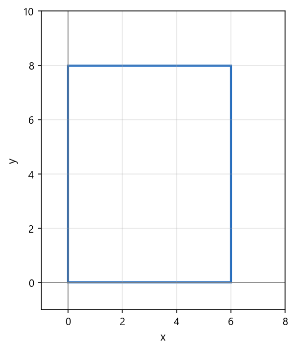

<strong>17.</strong>

נקודה

$$
B
$$

נמצאת במרחק אנכי של ארבע יחידות מנקודה

$$
(5,\ -1)
$$

ועל אותו קו אנכי איתה.

כתבו את שתי האפשרויות לערך הווי של

$$
B
$$

בשורות נפרדות אחרי המילה «אפשרות» בעברית.

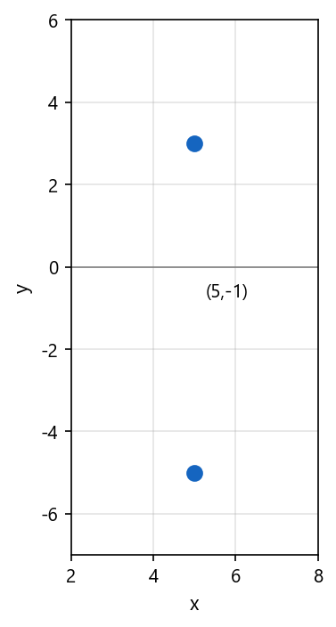

<strong>18.</strong>

ריבוע מיושר לצירים ששטחו

$$
36
$$

קודקוד אחד שלו הוא

$$
(2,\ 3)
$$

מצאו את כל האפשרויות לקואורדינטות של הקודקוד הנגדי.

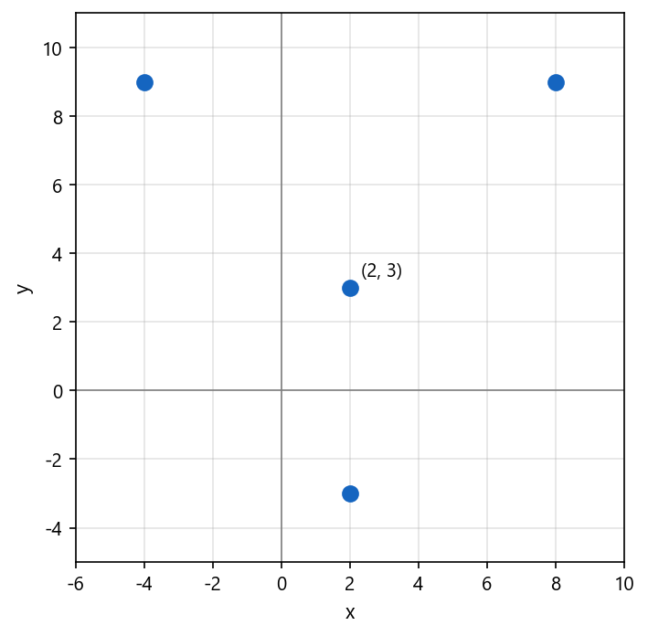

<strong>19.</strong>

מלבן מיושר לצירים עם קודקודות

$$
(a,\ b),\ (a + 6,\ b),\ (a + 6,\ b + 4),\ (a,\ b + 4)
$$

כאשר

$$
a,\ b
$$

מספרים שלמים.

הוכיחו שהשטח אינו תלוי בבחירת

$$
a
$$

ו־

$$
b
$$

על ידי חישוב אלגברי של השטח.

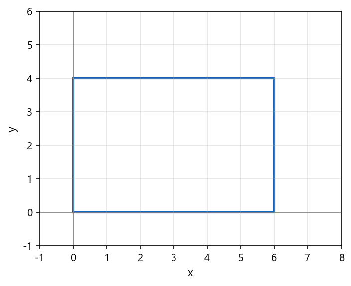

<strong>20.</strong>

נתון מרובע מיושר לצירים עם קודקודות לפי הסדר

$$
(1,\ 1),\ (5,\ 1),\ (5,\ 4),\ (1,\ 4)
$$

נקודה

$$
Q
$$

נמצאת על צלע המלבן בין

$$
(1,\ 1)
$$

ל־

$$
(5,\ 1)
$$

כך שהמרחק מ־

$$
(1,\ 1)
$$

שווה לשני שלישים מאורך הצלע כולה.

מצאו את קואורדינטות

$$
Q
$$

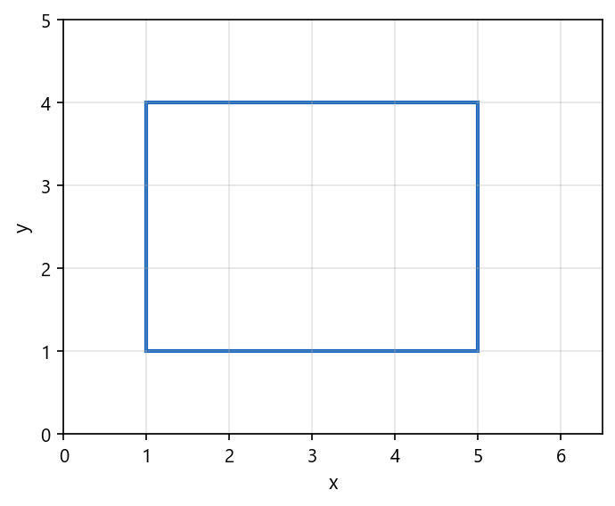

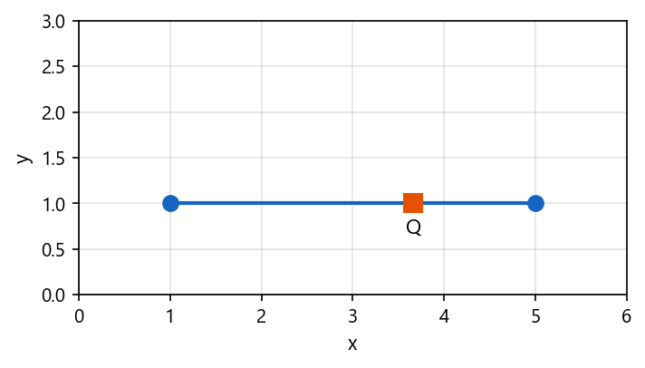

---

## מפתח תשובות סופיות

להלן תשובות קצרות לכל התרגילים לפי תת־נושא ומספר מקומי.

### תת־נושא 6.1

$$
1.\ 45^\circ
$$

$$
2.\ 4
$$

$$
3.\ \text{מלבן}
$$

$$
4.\ \text{נכון}
$$

$$
5.\ 9\text{ cm}
$$

$$
6.\ 63^\circ,\ 117^\circ,\ 117^\circ
$$

$$
7.\ \text{כן}
$$

$$
8.\ \text{כן}
$$

$$
9.\ 1
$$

$$
10.\ 55^\circ
$$

$$
11.\ \text{לא}
$$

$$
12.\ 2
$$

$$
13.\ \text{כן}
$$

$$
14.\ \text{לא}
$$

$$
15.\ 84^\circ
$$

תרגיל שישה־עשר: ריבוע, מלבן, מעוין, מקבילית — כולן נכונות כי ריבוע הוא מקרה מיוחד של כל אחת מהן.

$$
17.\ \text{כן}
$$

$$
18\text{–}20
$$

ראו פתרונות מלאים בסעיף הבא.

### תת־נושא 6.2

$$
1.\ 36\text{ cm}^2
$$

$$
2.\ 44\text{ m}
$$

$$
3.\ 12\text{ cm}^2
$$

$$
4.\ 60\text{ dm}^2
$$

$$
5.\ 49\pi\text{ cm}^2
$$

$$
6.\ 32\text{ m}^2
$$

$$
7.\ 24\text{ cm}^2
$$

$$
8.\ 46\text{ cm}
$$

$$
9.\ 7\text{ m}
$$

$$
10.\ 5\text{ cm}
$$

$$
11.\ 18\text{ cm}^2,\ 18\text{ cm}
$$

$$
12.\ 90\text{ m}^2
$$

$$
13.\ 13\text{ cm}
$$

$$
14.\ 66\text{ cm}^2
$$

$$
15.\ 7\text{ cm}
$$

$$
16.\ (540 - 9\pi)\text{ m}^2
$$

$$
17.\ 56\text{ cm}^2,\ 34\text{ cm}
$$

$$
18.\ 36\text{ m}^2
$$

$$
19.\ 140\text{ cm}^2,\ 54\text{ cm}
$$

$$
20.\ 12\text{ cm}
$$

$$
18\text{–}20
$$

ראו פתרונות מלאים בסעיף הבא.

### תת־נושא 6.3

$$
1.\ 4
$$

$$
2.\ 9
$$

$$
3.\ 8
$$

$$
4.\ 15
$$

$$
5.\ \text{לא}
$$

$$
6.\ 26
$$

$$
7.\ 7
$$

$$
8.\ \text{לא}
$$

$$
9.\ (3,\ 9)
$$

$$
10.\ 24
$$

תרגיל אחד־עשר: במלבן מיושר לצירים כל צלע אופקית נותנת פרש איקס קבוע בזמן שהווי קבוע, וכל צלע אנכית נותנת פרש ווי קבוע בזמן שהאיקס קבוע — לכן אורכי הצלעות הם בדיוק ערכי הפרשים המוחלטים האלה.

$$
12.\ 4\text{ ו־}6 \text{ או } 6\text{ ו־}4
$$

$$
13.\ (7,\ 1),\ (-3,\ 1)
$$

$$
14.\ \sqrt{89}
$$

$$
15.\ 24
$$

$$
16.\ 8
$$

$$
17.\ 3,\ -5
$$

$$
18\text{–}20
$$

ראו פתרונות מלאים בסעיף הבא.

---

## פתרונות מלאים — תרגילים קשים בלבד

להלן פתרונות שלב־אחר־שלב לתרגילים שמונה־עשרה, תשעה־עשרה ועשרים בכל תת־נושא.

### תת־נושא 6.1

**תרגיל 18**

במעוין האלכסונים מאונכים זה לזה. אם האלכסונים היו שווים באורך, מרובע עם אלכסונים מאונכים ושווים הוא תכונה של מלבן — ובמקרה של צלעות שוות זה יוצא ריבוע.

מעוין שאינו ריבוע אינו מלבן, לכן אינו יכול להיות בעל אלכסונים שווים תחת התנאים של מעוין עם זוויות שאינן ישרות. בניסוח אחר: בריבוע בלבד מתקיימת במקביל גם שוויון צלעות וגם שוויון אלכסונים כמו במלבן; במעוין «כללי» האלכסונים שונים באורך.

**תרגיל 19**

האלכסון יוצר שני משולשים חופפים במקבילית כי צלעות נגדיות מקבילות ושוות. זוויות בקודקודים על הבסיס המשותף הן זוויות מתחלפות בין מקבילות, ולכן זוגות זוויות נגדיות במשולשים שווים. בנוסף, זוויות סמוכות לאורך אותו צלע במקבילית משלימות לזווית שטוחה, מה שמסנכרן בין הזוויות בשני המשולשים.

**תרגיל 20**

דוגמה מתאימה היא **מעוין שאינו ריבוע**: כל הצלעות שוות אך הזוויות אינן ישרות, ולכן זה אינו ריבוע.

---

### תת־נושא 6.2

**תרגיל 18**

שטח הריבוע החיצוני:

$$
10^2 = 100
$$

רוחב הפנים אחרי מסגרת משני צדדים:

$$
10 - 2w = 10 - 2 = 8
$$

שטח הריבוע הפנימי:

$$
8^2 = 64
$$

שטח המסגרת:

$$
100 - 64 = 36
$$

**תשובה במילים:**

שטח המסגרת שלושים ושישה מטרים רבועים.

**תרגיל 19**

שטח המלבן:

$$
13 \cdot 7 = 91
$$

שטח הריבוע:

$$
7^2 = 49
$$

אין חפיפת שטח פנימית, לכן שטח האיחוד:

$$
91 + 49 = 140
$$

כאשר המלבן והריבוע חולקים צלע של שבעה, הצורה המאוחדת הופכת למלבן ממדים

$$
20\text{ cm}
$$

על

$$
7\text{ cm}
$$

לפי סידור טבעי לאורך.

היקף:

$$
2(20 + 7) = 54
$$

**תרגיל 20**

הגובה לבסיס יוצר משולש ישר־זווית עם יתר

$$
13\text{ cm}
$$

וניצב אופקי

$$
5\text{ cm}
$$

לפי פיתגורס:

$$
h^2 + 5^2 = 13^2
$$

$$
h^2 = 169 - 25 = 144
$$

$$
h = 12
$$

**תשובה במילים:**

אורך הגובה לבסיס הוא שנים־עשר סנטימטרים.

---

### תת־נושא 6.3

**תרגיל 18**

במעגלים של ריבוע מיושר לצירים, צלע

$$
s
$$

מקיימת

$$
s^2 = 36
$$

לכן

$$
s = 6
$$

מנקודת הבסיס

$$
(2,\ 3)
$$

קודקוד נגדי נמצא בהזזה של שישה יחידות בכיוון אופקי בלבד, או אנכי בלבד, לשני הכיוונים:

$$
(2 + 6,\ 3) = (8,\ 3)
$$

$$
(2 - 6,\ 3) = (-4,\ 3)
$$

$$
(2,\ 3 + 6) = (2,\ 9)
$$

$$
(2,\ 3 - 6) = (2,\ -3)
$$

**תרגיל 19**

רוחב:

$$
(a + 6) - a = 6
$$

גובה:

$$
(b + 4) - b = 4
$$

שטח:

$$
6 \cdot 4 = 24
$$

הביטוי אינו תלוי ב־

$$
a
$$

או ב־

$$
b
$$

כי הם מצטמצמים בפרשי הקואורדינטות.

**תרגיל 20**

אורך הצלע התחתונה בין

$$
(1,\ 1)
$$

ל־

$$
(5,\ 1)
$$

הוא

$$
5 - 1 = 4
$$

שני שלישים מהאורך:

$$
\frac{2}{3} \cdot 4 = \frac{8}{3}
$$

קואורדינטת

$$
x
$$

מנקודת ההתחלה:

$$
1 + \frac{8}{3} = \frac{11}{3}
$$

הקואורדינטה

$$
y
$$

נשארת

$$
1
$$

לכן

$$
Q = \left(\frac{11}{3},\ 1\right)
$$

