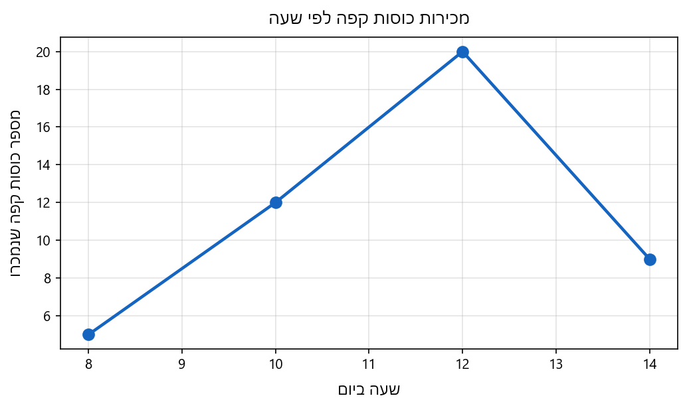
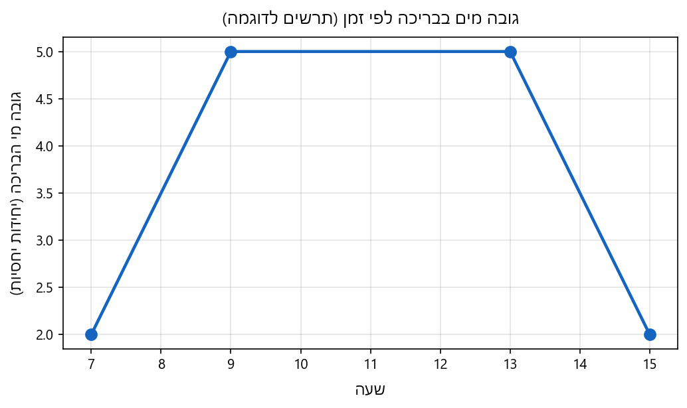
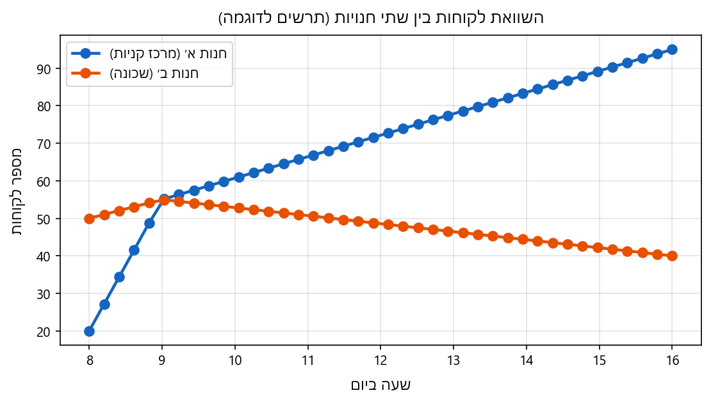

# קריאת גרפים — מערך שיעור למרצה

מסמך זה מלווה את פרק **קריאת גרפים** בקורס המכין: בונים יכולת לקרוא תרשימים שמתארים שינוי לאורך זמן או מצב, ולהסביר את הסיפור במילים — מגמות, נקודות מיוחדות, השוואות וקצב שינוי איכותני.

בתיקייה `../graphs/reading_graphs` מופיעים קבצי **PNG** המלווים את תרגילי הלוח: בכל תרשים מסומנים **כותרות צירים** (אופקי ואנכי) עם משמעות ויחידות.

המלצה כללית למרצה: להתחיל מגרף פשוט על הלוח או מטבלת נתונים, לבקש מהכיתה לנסח במילים מה קורה בכל קטע, ורק אחר כך להכניס מונחים פורמליים. לחזור תמיד על **מה מייצג כל ציר** ועל **יחידות המידה**. לעודד ניסוחים שונים ותיקון הדדי.

---

## תת־נושא 2.1 — קריאה והבנה של מידע מגרפים המתארים סיפור מעשה

### הסבר תמציתי

גרף שמתאר סיפור מעשה מקשר בין שני סוגי מידע: בדרך כלל משתנה אחד תלוי בשני. בציר האופקי נהוג לשים לעיתים קרובות את **הזמן**, את **המצב ההתחלתי** או גודל שמשתנה בצורה שקובעים מראש; בציר האנכי נהוג לשים את **הכמות שנמדדת** — למשל טמפרטורה, מחיר, מרחק או מספר לקוחות.

קריאה נכונה דורשת שלושה דברים:

- **זיהוי משמעות הצירים**: מה נמדד, ובאיזו יחידת מידה.
- **קריאת נקודות וקטעים**: איזה ערך מתאים לכל ערך על הציר השני, והאם הגרף עולה, יורד או נשאר קבוע.
- **תיאור הסיפור**: מתי יש עלייה חדה או מתונה, מתי ירידה, איפה נקודת המקסימום או המינימום, ואם יש שינוי בכיוון המגמה — נקודת שבירה.

כאשר משווים שני גרפים על אותו ציר זמן, חשוב לשאול: מי גבוה יותר בכל רגע נתון, מתי הם נפגשים, ומתי המרחק ביניהם גדול או קטן.

קצב השינוי בין שתי נקודות בזמן אפשר לתאר כ־**שינוי בכמות המנוקבת** חלקי **שינוי בזמן**. ככל שהגרף תלול יותר בכיוון מסוים, כך השינוי בכמות ביחס ליחידת זמן גדול יותר באותו כיוון — בלי חובה להשתמש במילה «שיפוע» אם הכיתה עדיין לא שם.

### אינטואיציה / דוגמה מהחיים

**טמפרטורה בחוץ במשך יום**

דמיינו גרף שבו בציר האופקי מסומנות שעות היום, ובציר האנכי טמפרטורה במעלות. בבוקר הטמפרטורה עולה — השמש מחממת; בצהריים אולי מגיעים לשיא; אחר הצהריים יורדים שוב. הסיפור הוא לא רק «מספרים» אלא תהליך: מתי התחממות הייתה מהירה יחסית, ומתי קרירות איטית.

**מלאי במחסן במהלך שבוע**

בציר האופקי ימים בשבוע, ובציר האנכי כמות פריטים במחסן. כשהגרף יורד — משחררים מלאי ללקוחות; כשעולה — התקבלה אספקה. אם שני קווים מתארים שני מחסנים שונים, אפשר לראות איזה מחסן היה עם יותר מלאי ביום מסוים ומתי שני המלאים היו שווים.

### נוסחאות רלוונטיות

בציר האופקי נהוג לסמן את המשתנה הבסיסי, למשל עם האות

$$
x
$$

ובציר האנכי את הכמות הנמדדת, למשל עם האות

$$
y
$$

בין שתי נקודות עם קואורדינטות

$$
(x_1,\ y_1),\quad (x_2,\ y_2)
$$

**קצב השינוי הממוצע** של הכמות ביחס לבסיס נתון על ידי:

$$
\frac{\Delta y}{\Delta x} = \frac{y_2 - y_1}{x_2 - x_1}
$$

הנוסחה מוגדרת כאשר שני ערכי הבסיס שונים, כלומר מתקיים:

$$
x_2 \neq x_1
$$

הפרש בין שני ערכים רצופים של אותה כמות בטבלה, לפי סדר הזמן:

$$
\Delta y = y_2 - y_1
$$

כאשר השורה הראשונה בזוג נותנת את

$$
y_1
$$

והשנייה את

$$
y_2
$$

אם בטבלה יש זמן וכמות, אפשר לקרוא את הכמות בזמן נתון ישירות מהשורה המתאימה, ובהשוואה בין שורות — לראות האם הכמות גדלה או קטנה.

### תרגול מונחה כיתה

**רמת היכרות — קל**

נתונה הטבלה הבאה: בציר הזמן שעות מהיום, ובציר הכמות — מספר כוסות קפה שנמכרו בבית קפה.

השעות:

$$
8,\ 10,\ 12,\ 14
$$

הכמויות בכוסות:

$$
5,\ 12,\ 20,\ 9
$$

שאלה: באיזו שעה נמכרו הכי הרבה כוסות, ובאיזו תקופה בין שתי שעות רצופות מהטבלה הייתה העלייה הגדולה ביותר במספר הכוסות?

**רמת ביניים**

מדידת גובה מי מים בבריכה במשך זמן מתוארת כך, והגרף ממחיש דוגמה עם יחידות יחסיות. משעה שבע בבוקר ועד שעה תשע הגובה עלה באופן קבוע מערך מסוים לערך גבוה יותר. משעה תשע ועד אחת בצהריים הגובה נשאר קבוע. מאחת עד שלוש ירד הגובה בקצב קבוע חזרה לערך הנמוך שבו היה בשבע בבוקר.

שאלה: תארו במילים את שלושת הקטעים. באיזה קטע גובה המים לא השתנה? האם בסוף התהליך גובה המים זהה לזה שהיה בתחילת היום?

**רמת בחינה / מורכב**

שני גרפים מתארים את מספר הלקוחות בחנות ביום אחד: גרף א׳ לחנות במרכז קניות, גרף ב׳ לחנות בשכונה. בטווח שבין שעה עשר לשעה ארבע אחר הצהריים, גרף א׳ תמיד מעל גרף ב׳. בשעה תשע בבוקר שני הגרפים נפגשים באותו ערך. משעה פתיחה עד שעה תשע, גרף ב׳ מעל גרף א׳.

שאלה: נסחו את הסיפור של היום מנקודת מבט של «איפה היו יותר לקוחות ובמתי המצב התהפך». האם מהנתונים אפשר לדעת כמה לקוחות היו בסך הכול בכל חנות בלי טבלת מספרים מדויקת? הסבירו.

### פתרונות מלאים

**פתרון — תרגיל היכרות**

מהטבלה, הכמות המרבית היא

$$
20
$$

וזה קורה בשעה

$$
12
$$

נבדוק עליות בין שעות רצופות מהרשימה.

מ־שמונה ל־עשר:

$$
12 - 5 = 7
$$

מ־עשר ל־שתיים־עשרה:

$$
20 - 12 = 8
$$

מ־שתיים־עשרה לארבע:

$$
9 - 20 = -11
$$

זו ירידה, לא עלייה.

העלייה הגדולה ביותר בין זוגות השעות הרצופות בטבלה היא

$$
8
$$

ובין השעות עשר לשתיים־עשרה.

**תשובה סופית במילים:**

הכי הרבה כוסות נמכרו בשתיים־עשרה. העלייה הגדולה ביותר בין שתי שעות רצופות מהטבלה הייתה בין עשר לשתיים־עשרה.

**פתרון — תרגיל ביניים**

קטע ראשון: משבע לתשע — גובה המים עולה בקצב קבוע.

קטע שני: מתשע לאחת — גובה המים **קבוע**; אין עלייה ואין ירידה.

קטע שלישי: מאחת לשלוש — גובה המים יורד בקצב קבוע עד לערך ששווה לערך שבו היה בשבע בבוקר.

בקטע השני גובה המים לא השתנה.

אם בסוף חזרנו בדיוק לערך של שבע בבוקר, אז בסוף התהליך גובה המים **זהה** לגובה בתחילת היום לפי התיאור.

**פתרון — תרגיל בחינה**

עד שעה תשע, בחנות בשכונה היו יותר לקוחות מאשר בחנות במרכז הקניות, כי גרף ב׳ מעל גרף א׳. בשעה תשע שתי החנויות היו באותו מספר לקוחות — נקודת מפגש. משעה תשע ועד ארבע אחר הצהריים, במרכז הקניות היו יותר לקוחות, כי גרף א׳ מעל גרף ב׳.

לגבי סך הכול: מהתיאור יודעים רק השוואות ונקודות יחסיות בזמן, בלי ערכים מספריים מדויקים לאורך כל היום. לכן **אי אפשר** מהמידע שניתן כאן לקבוע איזו חנות הכניסה יותר לקוחות בסך הכול ביום — רק מתי כל אחת הייתה גבוהה יותר ומתי היו שוות.

---

## הערות למרצה להמשך שבועות הלימוד

- לתרגל מעבר מטבלה לתיאור מילולי ולהפך, ואז לגרף מצויר על הלוח.
- להדגיש טעויות נפוצות: בלבול בין צירים, התעלמות מיחידות, קריאת «גבוה יותר» כמובן שגוי כשמדובר במשתנה שבו **נמוך** הוא עדיף.
- לשלב לעיתים שאלות «מה לא ידוע מהגרף» כדי לחזק חשיבה ביקורתית.
