# תרגול — קריאת גרפים

מסמך זה מיועד לתרגול עצמי בנושא קריאת גרפים וטבלאות המתארות סיפור מעשה.

ליד רבים מהתרגילים מוצג **גרף** בתיקייה `../graphs/reading_graphs` (קבצי PNG). בכל גרף מסומנים **כותרות הצירים** כנהוג: ציר אופקי וציר אנכי עם משמעות ויחידות.

הנחיות:

מספר התרגיל מופיע בצד ימין. מיד אחריו מופיעה השאלה או הנתונים. כל מספרים ויחסים מופיעים בבלוקים מתמטיים נפרדים. כאשר נדרש ניסוח מילולי, יש להשלים במשפטים מלאים בעברית.

---

## תת־נושא 2.1 — קריאה והבנה של מידע מגרפים המתארים סיפור מעשה

### רמה בסיסית וטכנית

<strong>1.</strong>

נמדדת טמפרטורה בחוץ ביום מסוים. השעות מהתחלת המדידה:

$$
8,\ 11,\ 14
$$

הטמפרטורה במעלות צלסיוס בכל שעה:

$$
19,\ 24,\ 21
$$

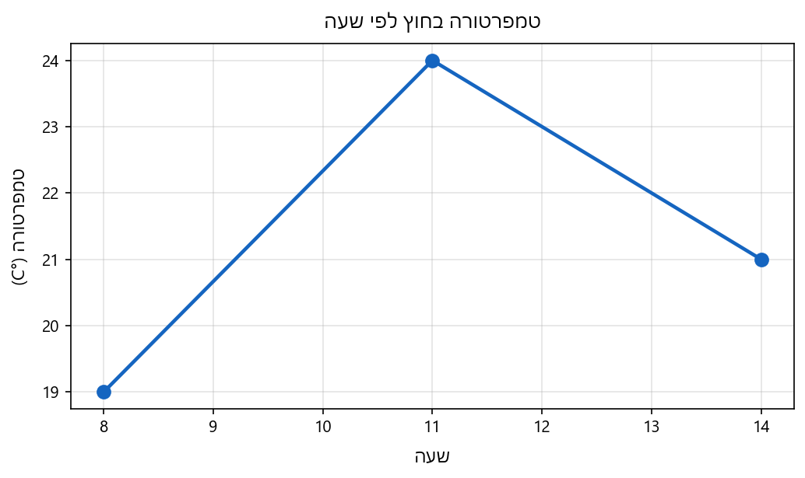

באיזו שעה הייתה הטמפרטורה הגבוהה ביותר? ענו בשעה כמספר בלבד.

<strong>2.</strong>

מספר צעדים שנרשם במכשיר ביום אחד. השעות:

$$
9,\ 12,\ 15
$$

מספר הצעדים באלפים:

$$
3,\ 5,\ 6
$$

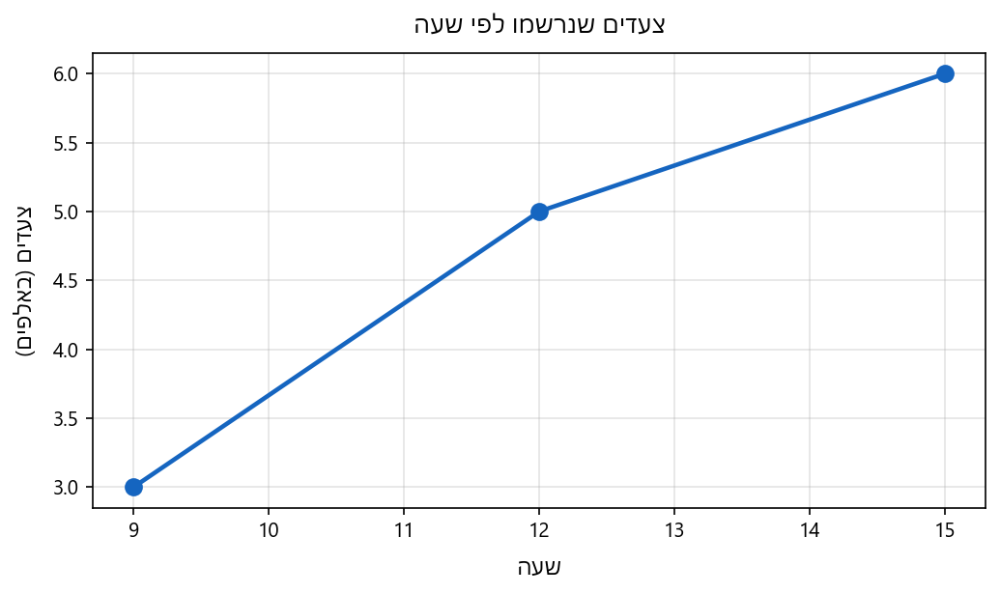

כמה אלפי צעדים נרשמו בשעה חמש־עשרה?

<strong>3.</strong>

מחיר מניה בשקלים בנקודות זמן שונות באותו יום. השעות:

$$
10,\ 11,\ 12
$$

המחירים:

$$
48,\ 47,\ 50
$$

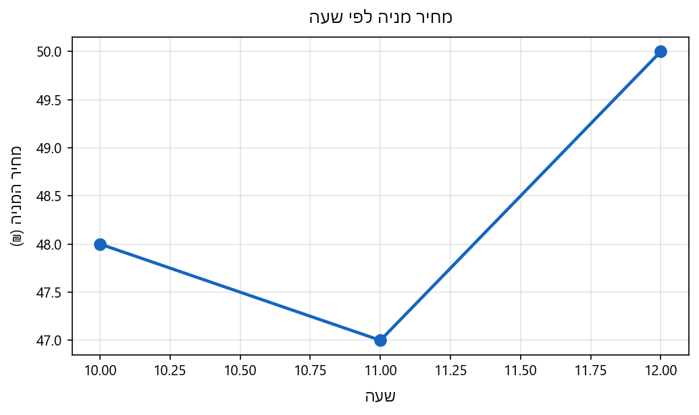

האם בין שעה עשר לשעתיים־עשרה הערך **יורד** כל הזמן? ענו «כן» או «לא» והסבירו במשפט אחד בלי לכתוב ספרות בשורת ההסבר.

<strong>4.</strong>

גובה מי גשם שנאספו ביממה במילימטרים. השעות מהחצות:

$$
6,\ 10
$$

הגבהים במילימטרים:

$$
2,\ 8
$$

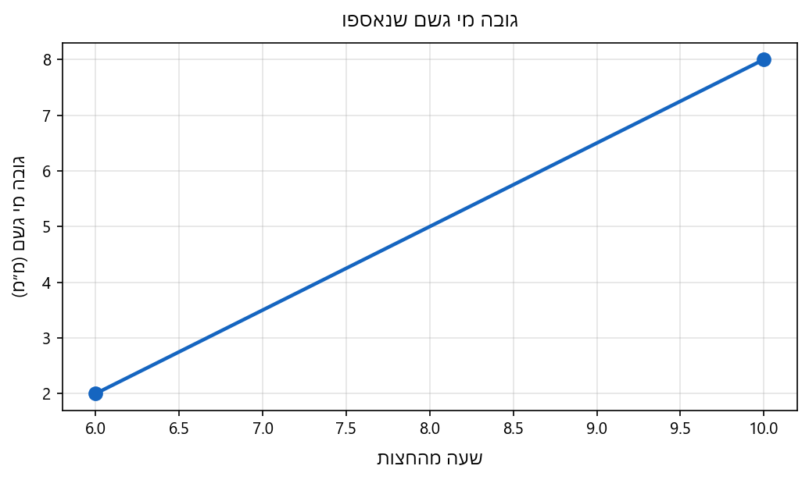

מהו השינוי בגובה המים בין שתי המדידות? השתמשו בהפרש כמספר חיובי אם יש עלייה.

<strong>5.</strong>

שני מכשירים מודדים אותו גודל. בזמן נתון הערך הראשון הוא

$$
120
$$

והשני הוא

$$
95
$$

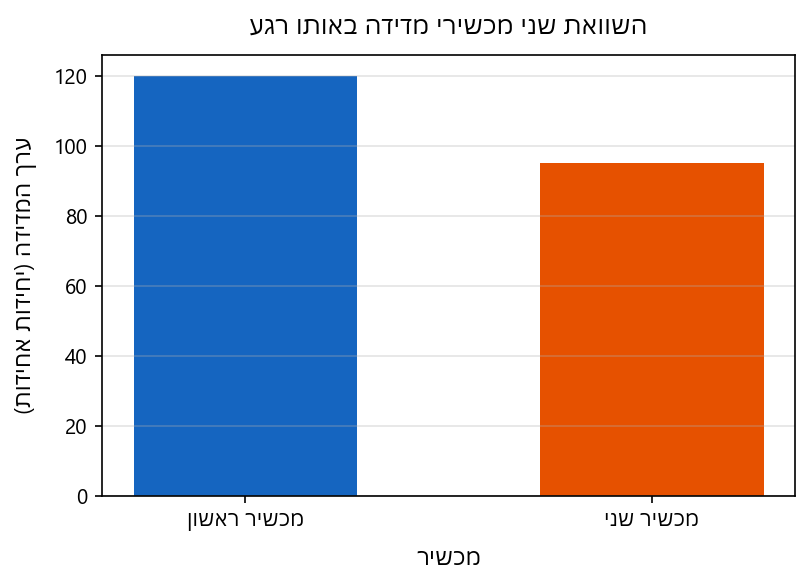

איזה מכשיר מציג ערך **גבוה יותר**? ענו «ראשון» או «שני» בלבד.

### רמה בינונית

<strong>6.</strong>

מלאי מוצר בחנות נספר בימים רצופים. היום במספר סידורי מההתחלה:

$$
1,\ 2,\ 3
$$

המלאי ביחידות:

$$
40,\ 35,\ 28
$$

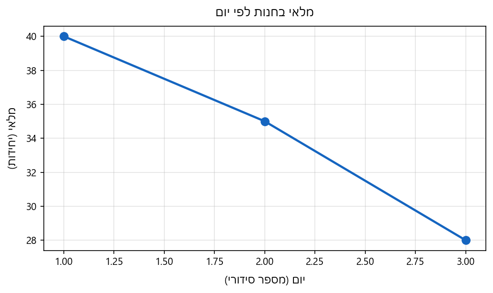

חשבו את קצב השינוי הממוצע של המלאי ביחס ליום בין היום הראשון ליום השלישי. כלומר השתמשו בנוסחה עם

$$
\frac{y_3 - y_1}{x_3 - x_1}
$$

כאשר הימים הם הציר האופקי והמלאי הוא הציר האנכי.

<strong>7.</strong>

מהירות רכבת בקילומטרים לשעה נמדדת בשני רגעים. הזמן בשעות מאותה נקודת ייחוס:

$$
0,\ 2
$$

המהירות:

$$
60,\ 100
$$

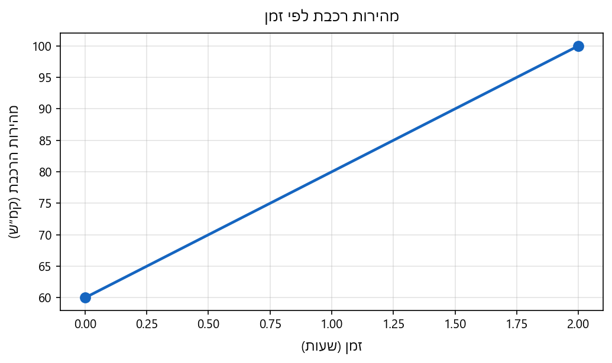

מהו קצב השינוי הממוצע של המהירות ביחס לזמן בין שתי הנקודות?

<strong>8.</strong>

תיאור גרף: משעה אפס עד שעה שלוש הערך עלה; משעה שלוש עד שעה חמש הערך נשאר **קבוע**; משעה חמש עד שבע הערך ירד.

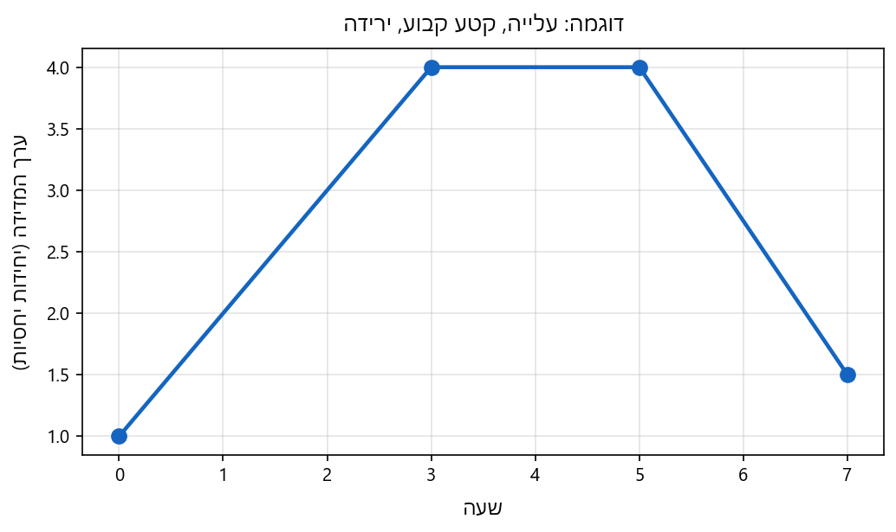

באיזה טווח שעות המגמה היא קבועה? ענו בטווח «מ־… עד …» במילים בלי ספרות.

<strong>9.</strong>

מספר מבקרים במוזיאון בשעות שונות. השעות:

$$
10,\ 12,\ 14,\ 16
$$

המבקרים:

$$
50,\ 90,\ 70,\ 40
$$

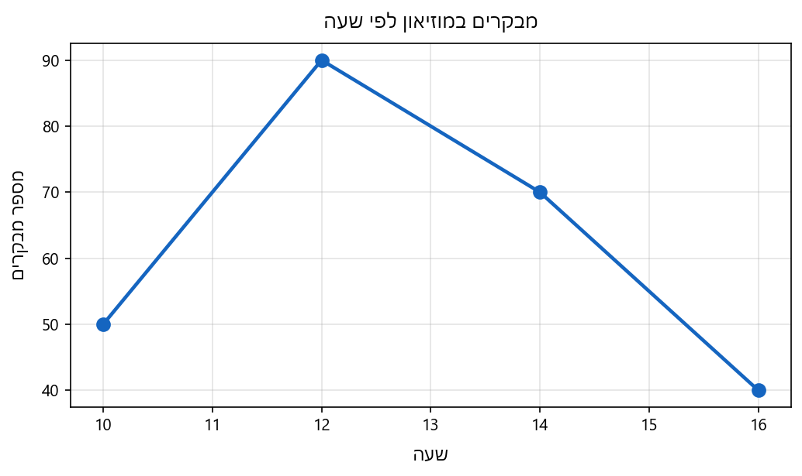

באיזו תקופה בין שתי **שעות רצופות מהרשימה** הייתה **הירידה הגדולה ביותר** במספר המבקרים? ענו בשתי השעות כמספרים בלבד בשתי שורות נפרדות מתמטיות.

<strong>10.</strong>

בשני בתי קפה נספרו אותן שעות. שעות:

$$
8,\ 10
$$

לקוחות בבית קפה א׳:

$$
12,\ 30
$$

לקוחות בבית קפה ב׳:

$$
20,\ 25
$$

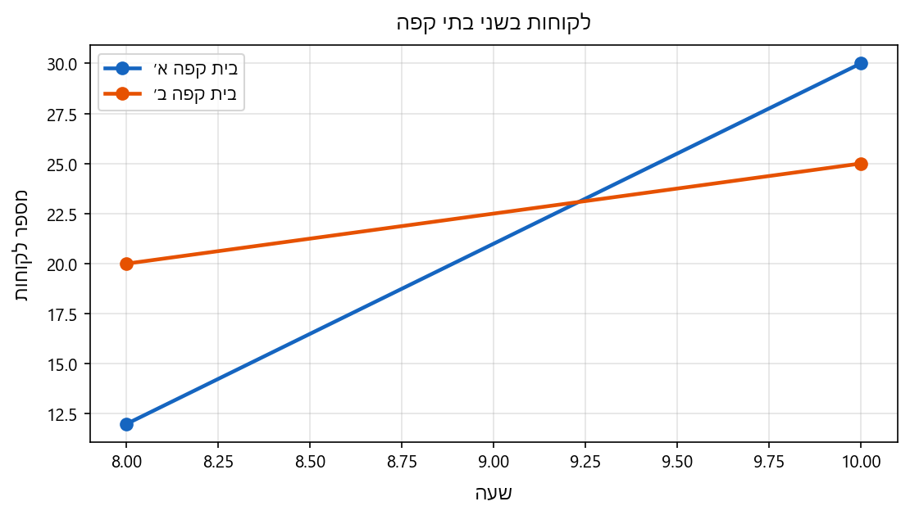

בשעה שמונה, איפה היו יותר לקוחות? ובשעה עשר? ענו בשני משפטים קצרים בלי ספרות.

<strong>11.</strong>

טמפרטורת מנוע במעלות. הזמן בדקות מאותה נקודת התחלה:

$$
0,\ 5,\ 10
$$

הטמפרטורות:

$$
20,\ 50,\ 60
$$

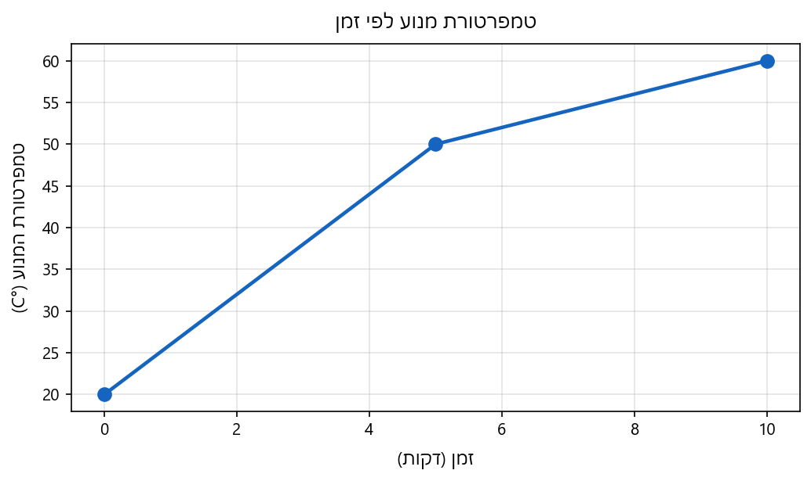

חשבו את קצב השינוי הממוצע של הטמפרטורה ביחס לזמן בין דקה אפס לדקה עשר.

<strong>12.</strong>

מחיר מוצר בשקלים לאורך שבוע. מספר היום:

$$
1,\ 7
$$

המחיר:

$$
80,\ 68
$$

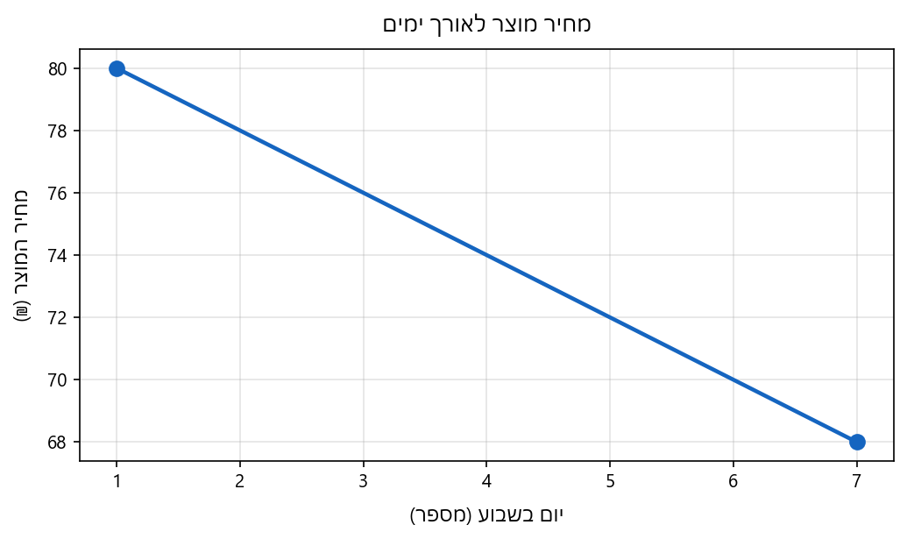

מהו השינוי הכולל במחיר מהיום הראשון ליום השביעי? ענו במספר שלם; אם ירידה, אפשר לכתוב תוצאה שלילית.

### רמה מתקדמת

<strong>13.</strong>

שני גרפים מתארים את אותו גודל לאורך זמן. בין שעה שתיים לשש אחר הצהריים גרף א׳ תמיד **מעל** גרף ב׳. בשעה אחת אחר הצהריים שני הגרפים **נפגשים**.

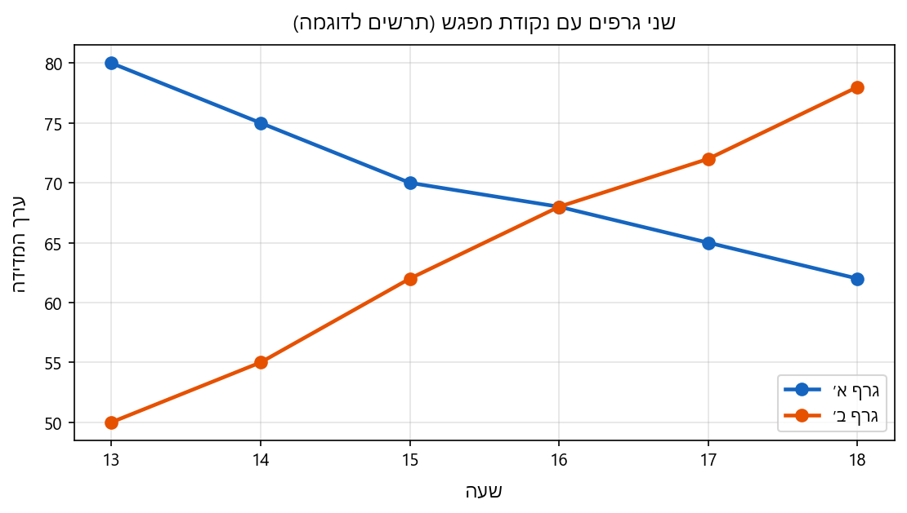

מה המשמעות של נקודת המפגש מבחינת הערכים של שני הגופים? ענו במשפט אחד בלי ספרות.

<strong>14.</strong>

שתי טבלאות מתארות אותו סוג מדידה. בטבלה ראשונה ההפרש בין שתי שורות עוקבות בערך הוא

$$
5
$$

ובטבלה שנייה ההפרש בין שתי שורות עוקבות הוא גם

$$
5
$$

אותה יחידת מידה, אבל בטבלה הראשונה כל יחידה בציר האנכי מייצגת **עשר יחידות אמיתיות**, ובטבלה השנייה כל יחידה מייצגת **יחידה אחת אמיתית**.

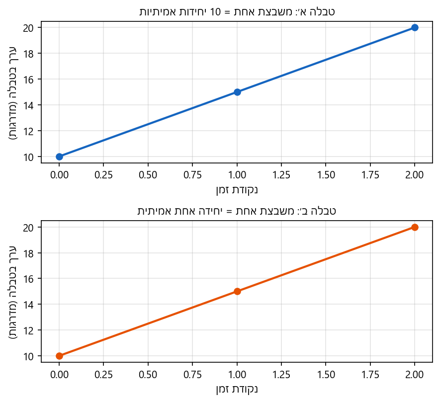

באיזו טבלה השינוי **בפועל** בגודל המדוד גדול יותר בין שתי השורות? ענו «ראשונה» או «שנייה».

<strong>15.</strong>

תיאור בריכה: משעה שש עד שמונה גובה המים עלה; משמונה עד עשר נשאר קבוע בשיא; מעשר עד שנים־עשר ירד חזרה לגובה שהיה בשש.

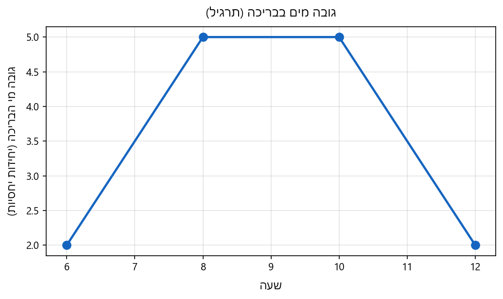

ציינו בכמה מילים: מתי היה גובה המים **מקסימלי** בתוך טווח השעות שתואר?

<strong>16.</strong>

אותה טבלת מרחק בקילומטרים מנקודת התחלה. הזמן בשעות:

$$
1,\ 2,\ 3
$$

המרחקים:

$$
40,\ 100,\ 120
$$

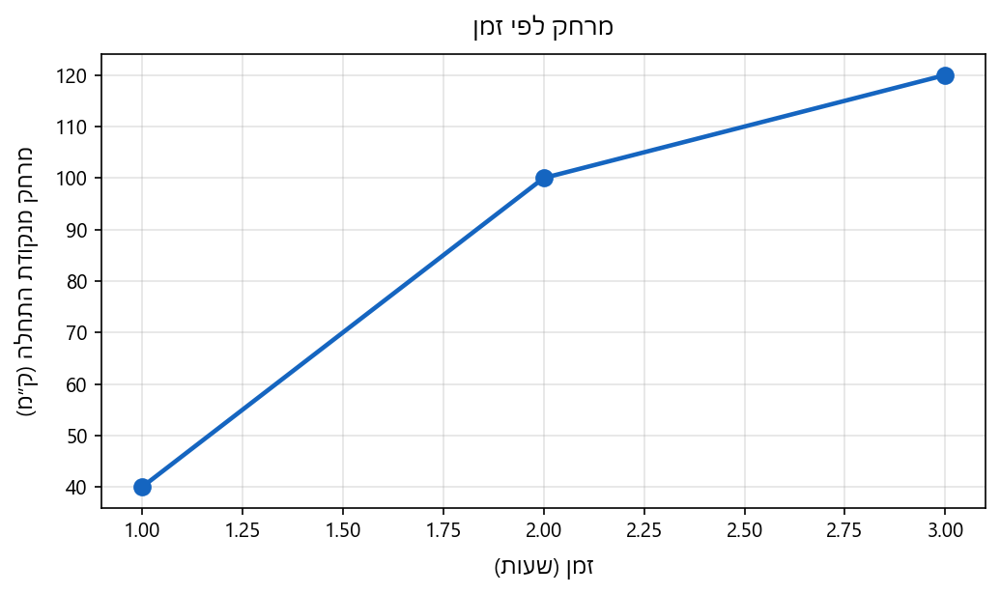

חשבו את קצב השינוי הממוצע של המרחק ביחס לזמן בין שעה אחת לשעה שתיים, ואז בין שעה שתיים לשעה שלוש. איזו תקופה מהירות ממוצעת גבוהה יותר? ענו במשפט אחד בלי ספרות בשורת המשפט; את שני הקצבים רשמו בבלוקים מתמטיים נפרדים.

<strong>17.</strong>

מחיר חשמל לקוט״ש בשקלים לאורך צריכה חודשית. צריכה בקוט״ש:

$$
100,\ 200,\ 300
$$

מחיר לקוט״ש:

$$
0.5,\ 0.6,\ 0.6
$$

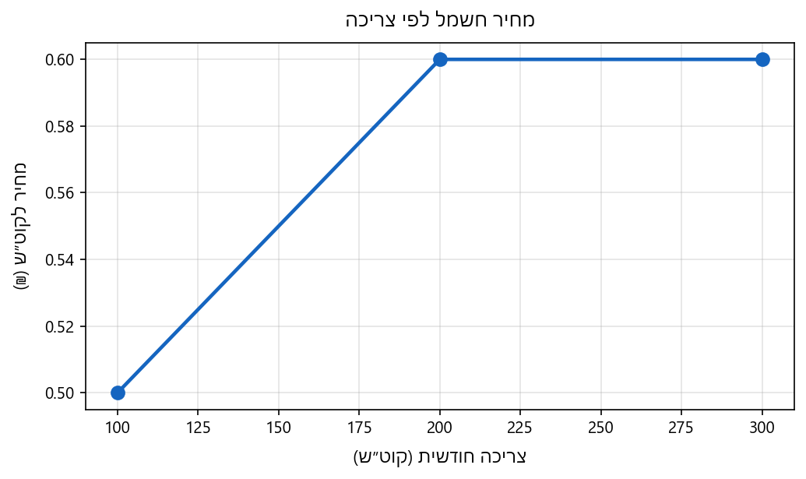

בין צריכה מאה לשתיים מאות, האם המחיר לקוט״ש עלה? ובין שתיים מאות לשלוש מאות? ענו בשני משפטים קצרים בלי ספרות.

### רמת בחינה ואתגר חשיבתי

<strong>18.</strong>

באותו יום נספרו נוסעים בשני קווי אוטובוס. משעה שש בבוקר עד שעה תשע, גרף נוסעים של קו א׳ תמיד **מעל** גרף קו ב׳. בשעה תשע שני הגרפים נפגשים. משעה תשע עד שש אחר הצהריים גרף קו ב׳ תמיד **מעל** גרף קו א׳.

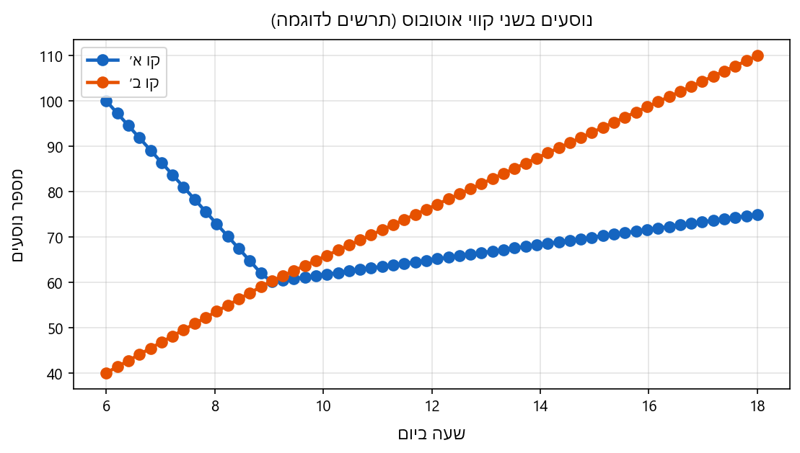

סעיפים:

א. תארו במילים מי היה עם יותר נוסעים בכל אחד משלושת המקטעים בזמן.

ב. האם מהתיאור אפשר לקבוע איזה קו הוביל **יותר נוסעים בסך הכול** באותו יום? הסבירו.

<strong>19.</strong>

מיכל מים מתמלא ומתרוקן. משעה אפס עד שעה שתיים הגובה עלה בקצב קבוע. משעה שתיים עד ארבע הגובה ירד בקצב קבוע עד חצי מהגובה שהיה בשעה שתיים. משעה ארבע עד שש הגובה עלה שוב בקצב קבוע עד הגובה המקסימלי שהיה בשעה שתיים.

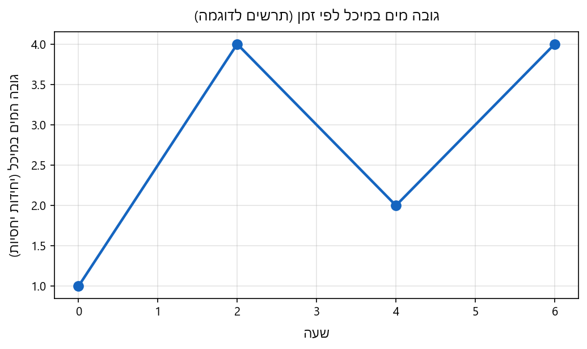

שאלות:

א. באיזו שעה בסוף מקטע זמן הגובה היה הנמוך ביותר מתוך שלוש נקודות הסוף של המקטעים?

ב. האם בשעה שש הגובה שווה לגובה שהיה בתחילת היום בשעה אפס? הסבירו בלי לדעת מספרים מדויקים.

<strong>20.</strong>

דופק בדקות מנוחה נמדד לאורך אימון. הדקות מאפס:

$$
0,\ 5,\ 15,\ 25
$$

הדופק בפעימות לדקה:

$$
70,\ 130,\ 130,\ 90
$$

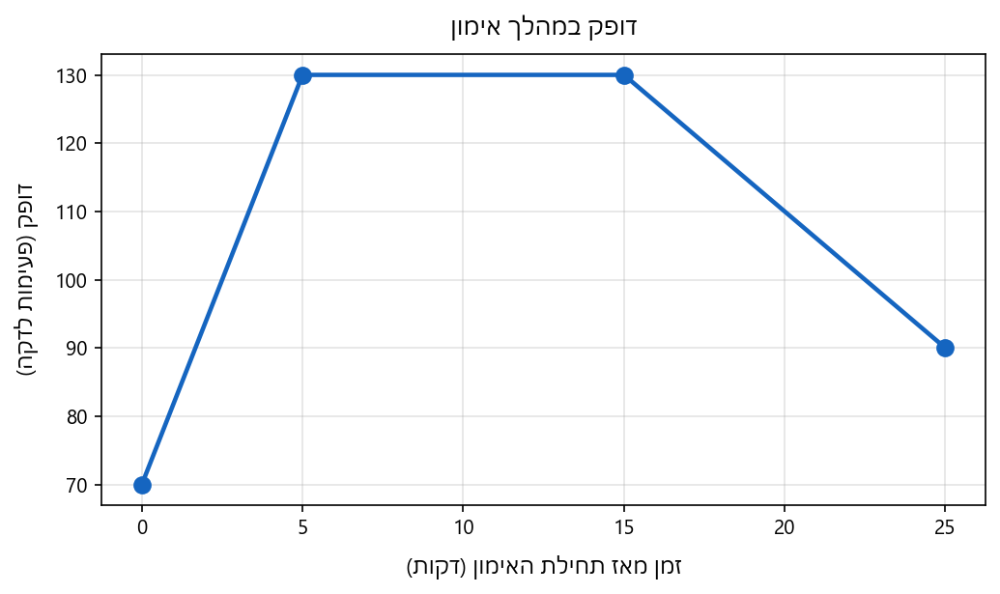

א. חשבו את קצב השינוי הממוצע של הדופק ביחס לזמן בין דקה אפס לדקה חמש.

ב. חשבו את קצב השינוי הממוצע בין דקה חמש לדקה חמש־עשרה.

ג. הסבירו במשפט אחד מה הסיפור של האימון לפי המספרים, כולל תקופת קיבוע אם יש.

---

## מפתח תשובות

<strong>תשובה לתרגיל אחד.</strong>

$$
11
$$

<strong>תשובה לתרגיל שתיים.</strong>

$$
6
$$

<strong>תשובה לתרגיל שלוש.</strong>

לא. בין עשר לאחת־עשרה יש ירידה, ואז עלייה.

<strong>תשובה לתרגיל ארבע.</strong>

$$
6
$$

<strong>תשובה לתרגיל חמש.</strong>

ראשון

<strong>תשובה לתרגיל שש.</strong>

$$
-6
$$

<strong>תשובה לתרגיל שבע.</strong>

$$
20
$$

<strong>תשובה לתרגיל שמונה.</strong>

מ־שלוש עד חמש

<strong>תשובה לתרגיל תשע.</strong>

$$
14
$$

$$
16
$$

<strong>תשובה לתרגיל עשר.</strong>

בשעה שמונה היו יותר לקוחות בבית הקפה השני. בשעה עשר היו יותר בבית הקפה הראשון.

<strong>תשובה לתרגיל אחת־עשרה.</strong>

$$
4
$$

<strong>תשובה לתרגיל שתיים־עשרה.</strong>

$$
-12
$$

<strong>תשובה לתרגיל שלוש־עשרה.</strong>

באותה שעה שני הגופים היו באותו ערך של המדידה.

<strong>תשובה לתרגיל ארבע־עשרה.</strong>

ראשונה

<strong>תשובה לתרגיל חמש־עשרה.</strong>

בין שמונה לעשר

<strong>תשובה לתרגיל שש־עשרה.</strong>

$$
60
$$

$$
20
$$

בין שעה אחת לשעה שתיים המהירות הממוצעת גבוהה יותר.

<strong>תשובה לתרגיל שבע־עשרה.</strong>

בין מאה לשתיים מאות המחיר עלה. בין שתיים מאות לשלוש מאות המחיר לא השתנה.

---

<strong>תשובות לתרגילים שמונה־עשרה עד עשרים.</strong>

התשובות המלאות והמפורטות לסעיפים מופיעות בחלק **פתרונות מלאים** שלהלן. כאן רק התמצית המספרית או המילולית הקצרה לבדיקה עצמית.

**תרגיל שמונה־עשרה — תמצית**

א. בשלושת המקטעים לפי הסדר: יותר נוסעים בקו א׳; שווים בשעת המפגש; יותר נוסעים בקו ב׳.

ב. לא ניתן לקבוע סך כולל מהשוואות יחסיות בלבד.

**תרגיל תשע־עשרה — תמצית**

א. בסוף המקטע השני.

ב. לא בהכרח; אין מידע על הגובה בשעה אפס ביחס לשיא.

**תרגיל עשרים — תמצית**

א.

$$
12
$$

ב.

$$
0
$$

ג. עלייה חדה, קיבוע בדופק גבוה, ואז ירידה.

---

## פתרונות מלאים — תרגילים שמונה־עשרה, תשע־עשרה ועשרים

### תרגיל שמונה־עשרה

**סעיף א**

בין שש לתשע בבוקר גרף קו א׳ גבוה יותר, לכן בכל רגע בטווח הזה היו **יותר נוסעים בקו א׳** מאשר בקו ב׳.

בשעה תשע הגרפים נפגשים, לכן **מספר הנוסעים שווה** בין שני הקווים באותה שעה.

בין תשע בבוקר לשש אחר הצהריים גרף קו ב׳ גבוה יותר, לכן **יותר נוסעים בקו ב׳** מאשר בקו א׳ בכל רגע בטווח הזה.

**סעיף ב**

התיאור נותן רק **מי גבוה יותר** בכל טווח זמן, בלי ערכים מספריים מלאים ובלי אינטגרל של הנוסעים לאורך היום. גם אם ידוע שקו א׳ היה מעל חלק מהיום וקו ב׳ מעל חלק אחר, **אי אפשר** מהמידע הזה לחשב בוודאות מי הוביל יותר נוסעים **בסך הכול** — צריך לדעת כמה נוסעים בכל רגע או שטח מתחת לגרף, וזה לא ניתן.

---

### תרגיל תשע־עשרה

**סעיף א**

בסוף המקטע הראשון הגובה הגיע לשיא זמני לפני הירידה. בסוף המקטע השני הגובה ירד ל־**חצי** מהשיא הזה — זה הנקודה **הנמוכה ביותר** מבין שלוש נקודות הסוף של המקטעים, כי במקטע השלישי הגובה עולה שוב.

לכן השעה המבוקשת היא **סוף המקטע השני**, כלומר **שעה ארבע**.

**סעיף ב**

ידוע שהגובה בשעה שש שווה לשיא שהיה **בשעה שתיים**. לא נאמר מה היה הגובה **בשעה אפס** ביחס לשיא בשעה שתיים. אם בשעה אפס הגובה היה נמוך משיא שעה שתיים, אז בשעה שש הוא **לא** שווה לגובה בתחילה. אם בטעות הגובה בתחילה היה בדיוק כמו השיא — אז כן. בלי נתון על שעה אפס **לא ניתן להסיק** שוויון לגובה בתחילת היום.

---

### תרגיל עשרים

**סעיף א**

נשתמש בנקודות

$$
(0,\ 70),\quad (5,\ 130)
$$

קצב שינוי ממוצע:

$$
\frac{130 - 70}{5 - 0} = \frac{60}{5} = 12
$$

**סעיף ב**

נקודות

$$
(5,\ 130),\quad (15,\ 130)
$$

$$
\frac{130 - 130}{15 - 5} = \frac{0}{10} = 0
$$

**סעיף ג**

בין דקה אפס לחמש הדופק עלה בחדות. בין חמש לחמש־עשרה הדופק **נשאר קבוע** בערך גבוה — שלב קיבוע או עבודה יציבה. בין חמש־עשרה לעשרים וחמש הדופק ירד — התאוששות או סיום מאמץ.
